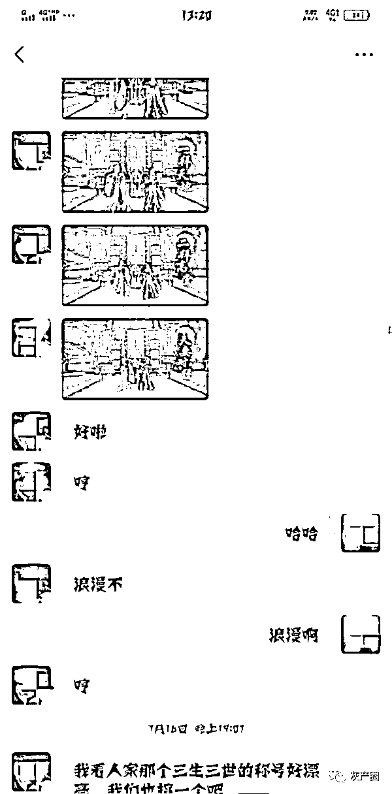
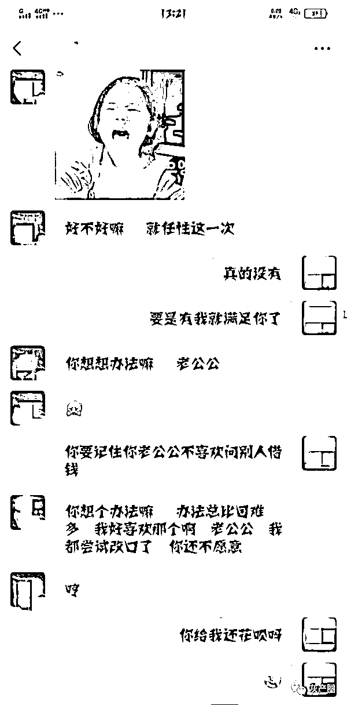

# 小伙和“女网友”在游戏里举行了婚礼，花了近 18 万，其实和他“结婚”的是 22 名汉子

> 原文：[`mp.weixin.qq.com/s?__biz=MzIyMDYwMTk0Mw==&mid=2247523283&idx=4&sn=be36822e8743c324797ad214031d5678&chksm=97cb50eba0bcd9fd22a5dcab869c47abd767c354db1178f3c8e2bbaad8552054999170af3249&scene=27#wechat_redirect`](http://mp.weixin.qq.com/s?__biz=MzIyMDYwMTk0Mw==&mid=2247523283&idx=4&sn=be36822e8743c324797ad214031d5678&chksm=97cb50eba0bcd9fd22a5dcab869c47abd767c354db1178f3c8e2bbaad8552054999170af3249&scene=27#wechat_redirect)

“我对小乔是真心的，为什么结果会是这样？”深夜，32 岁的单身青年庞昊（化名），回想起自己刚结束的短暂“网恋”，依旧辗转反侧，难以释怀。

江阴检察院就案件提起公诉

网络姻缘手难牵

事情还要从 2019 年 11 月说起。一天下班后，庞昊手机上的一款交友软件上弹出一个好友请求，头像显示是一名女性，长相清秀，楚楚可人。

“你好，我叫小乔，可以添加微信吗？”加好友以后，小乔坦露自己在感情上被人伤害过，想通过网络找一个对她真心的朋友。一来二去，二人互加微信，开始火热地聊了起来。

“你平常有什么爱好，喜欢玩什么游戏？”有一次聊天时候，小乔说自己最近在玩一款游戏“乔缘”，为了增加彼此的共同话题，庞昊应邀加入了游戏。

“你先把等级升到 80 级，然后我们就‘结婚’。”根据游戏设定，玩家等级只有达到 80 级才就可以“结婚”，于是庞昊疯狂刷级，只为与心中的小乔“结婚”。“人家结婚都有‘戒指’‘房子’‘坐骑’，你到底爱不爱我！”一开始“结婚”是最简单的，但是小乔向庞昊撒娇，表示自己也想要像其他玩家一样有一个盛大的“婚礼”仪式。

庞昊第一时间犹豫了，可是对方抛出诸如“世界再大都没有你的怀抱大”、“只要是你，我什么都愿意”等情话，让他很是招架不住。为了证明对小乔的真心，也为了进一步发展线下恋爱关系，庞昊开始充值，购买了“结婚戒指”“房子”“家具”等游戏道具，一个礼拜就花了 3 万余元。

眼见游戏里已顺利“结婚”，小乔却不依不饶，以不停升级游戏 VIP 等级、继续赠送游戏戒指、战力要达到全区第一等理由要求庞昊不断充值，就这样，庞昊又陆续充值了 14 余万元。

当庞昊提出线下见面时，屏幕上回复都是“家中有客人不方便见面”“自己在老家，疫情出不来”……猛然清醒的庞昊察觉到自己可能被骗了，2020 年 9 月 8 日，选择了报警。

受害人的聊天记录

一个分工明确的“戏精”团伙

虽然早就意识到小乔可能目的不单纯，但是警方告诉庞昊的真相还是让他为之一震：原来小乔并不是一名简单的“陪玩”，背后是一个成员多达 22 名男性，依靠伪装女性身份实施诈骗、分工明确的犯罪团伙。

据了解，该团伙主犯是 1989 年出生的蔡乾，原本经营一家美发店，由于业绩不好，2018 年 11 月，蔡乾应聘了一个游戏推广公司的业务员，主要负责游戏推广。“我们每个业务员都有自己的游戏链接，只需要在网上添加好友推荐游戏，让对方通过我们发送的链接下载。”蔡乾说，因为玩家是通过各个业务员的链接进的游戏，所以玩家在游戏中充值的金额游戏公司都会提成给推广公司，公司也会按照 8%-12%的比例提成给各个业务员。

2019 年 8 月，公司解散后，蔡乾就离开了，10 月，他自己注册成立了游戏推广公司，招聘了多名年龄段在 23 岁至 30 岁之间的男性业务员。“公司第一个推广的游戏是‘乔缘’，总提成是玩家充值金额的 78%-80%。”据蔡乾交代，公司内部是在总提成的基础上，再按照业务员、经理、分区经理等各自职务阶梯型结算分红。

其实，说是游戏推广，实质上蔡乾采用的方法是让员工冒充女性以谈恋爱为诱饵骗男玩家充值。他先培训了一批老员工，然后采用“以老带新”方式继续诈骗。

受害人的聊天记录

60 人被骗 126 万还有他们的“感情”

新员工首先会在老员工的指导下下载一些社交软件、注册女性账号，并找漂亮女性的照片发在软件动态里，以此来吸引男客户。当加完好友后，业务员会主动引导对方一起玩游戏，并发送属于自己的推广链接，如果对方下载的话，充值的金额就自动算到该名业务员业绩下面了。

等对方下载好之后，进一步要求对方赶紧升到 80 级，然后双方就可以在游戏里“结婚”，一般考虑到拉近两人距离，提升好感，男玩家都会努力升级争取“结婚”。

“在游戏里结婚是需要充钱的，一般也是在这个时候我们会安排业务员开始引导对方充值。”这个时候男玩家为了继续在现实里发展男女朋友关系，都会同意充钱“结婚”，结完婚之后，该团伙会以“提升战斗力，保护自己”等借口激起男玩家的保护欲，从而实现更多的诈骗金额。

当然，有时候男性玩家会要求发语音，该团伙也有一套应对方案。公司有一名女性郭怡（化名），一方面负责招聘新员工，更重要的则是在男玩家要求发语音的时候，团伙其他成员会通过郭怡回复语音，有时候面对对方不肯充钱，也会让郭怡发送假装生气的语音骗其赶紧充钱，让对方相信确实是他们聊的“女朋友”在生气。

如果对方要求见面，蔡乾会教业务员扯开话题或者回复一个表情，不要拒绝也不要同意，继续骗客户充值，让他们觉得还是有希望见面的，等客户充值的足够多了，还要求见面，就可以直接拒绝拉黑了。

截至案发，以蔡乾为首的该诈骗团伙共诈骗了 60 名被害人，诈骗金额高达 126 万余元。

2021 年 9 月 18 日，经江阴市检察院提起公诉，法院一审以诈骗罪判处蔡乾（化名）等 21 名被告人十一年六个月至拘役四个月不等的徒刑，各并处罚金人民币十万元至二千元不等。目前，该案判决已生效。

来源：扬子晚报，紫牛新闻，利箭在行动

← 向右滑动与灰产圈互动交流 →

