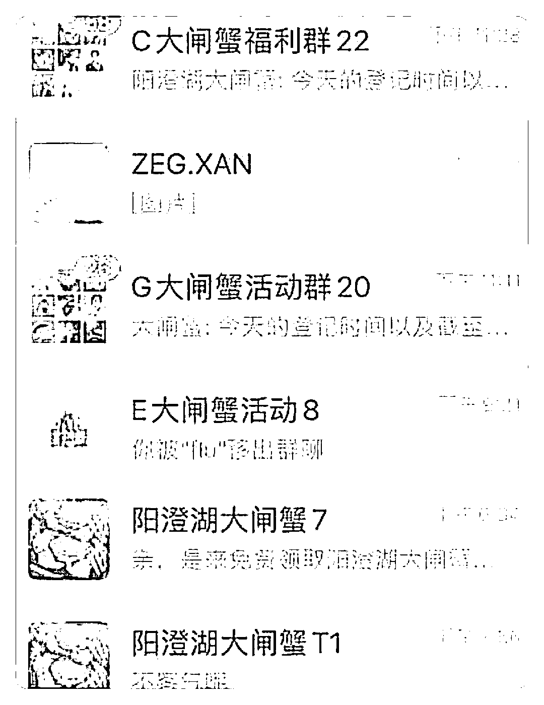
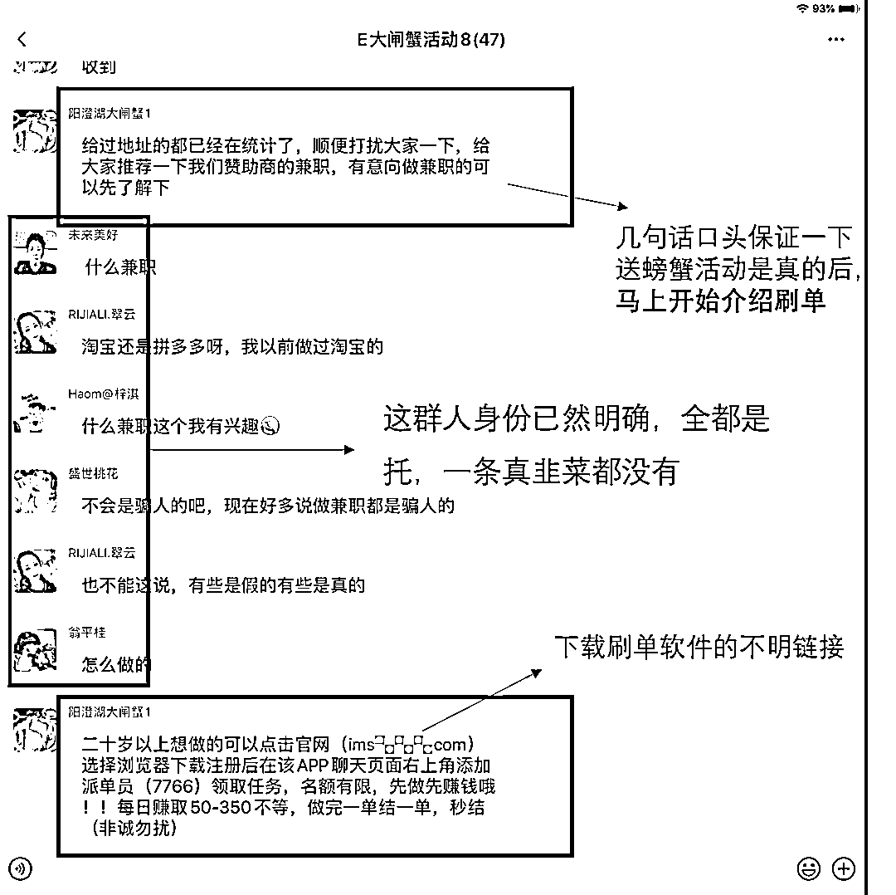
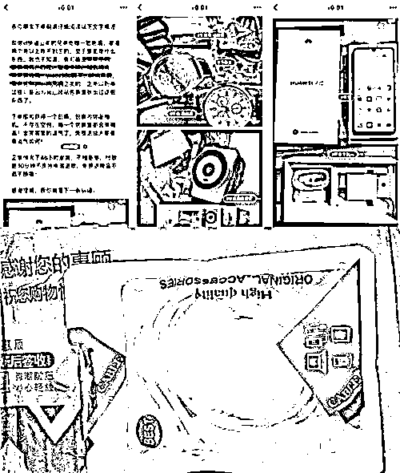
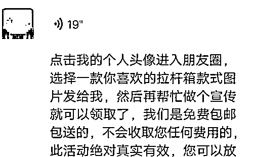
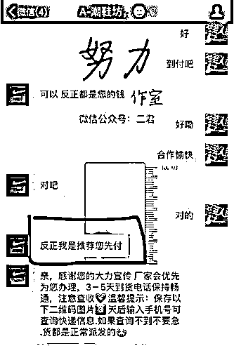
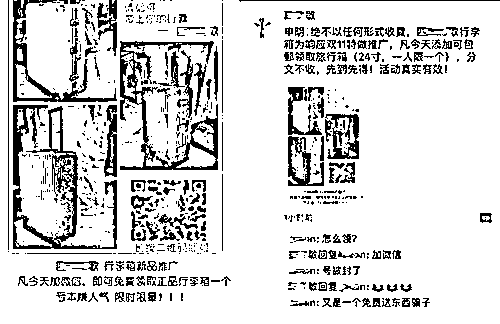
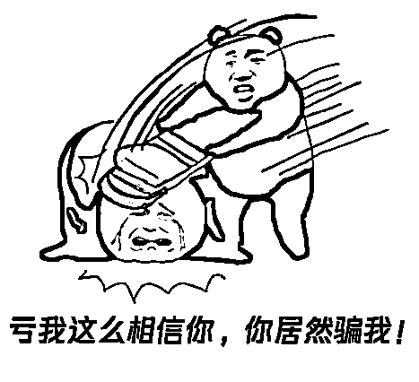
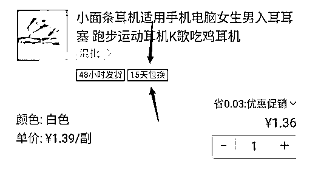
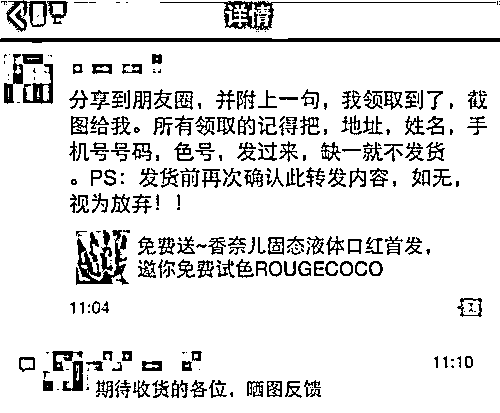
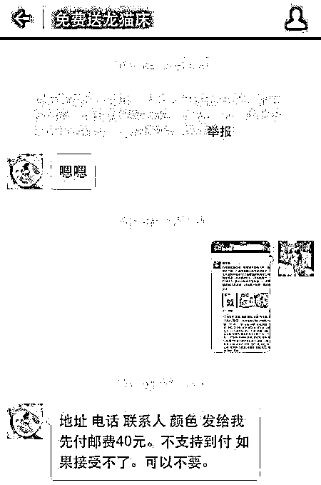

# 便宜没好货，“免费”是灾祸！

> 原文：[`mp.weixin.qq.com/s?__biz=MzIyMDYwMTk0Mw==&mid=2247523283&idx=6&sn=65e1921da58cd6520c50d6e1b7038ec8&chksm=97cb50eba0bcd9fd3ad58537b0fdac09a54c7883ba5204bf29626e7561f297dcbdda32051901&scene=27#wechat_redirect`](http://mp.weixin.qq.com/s?__biz=MzIyMDYwMTk0Mw==&mid=2247523283&idx=6&sn=65e1921da58cd6520c50d6e1b7038ec8&chksm=97cb50eba0bcd9fd3ad58537b0fdac09a54c7883ba5204bf29626e7561f297dcbdda32051901&scene=27#wechat_redirect)

**社交平台朋友圈，免费活动何其多？**

免费送手机，免费送口红，免费送黄金...你也在朋友圈转发这种“免费送”活动吗？先别急！在动手点转发之前，请先做一个填空题：**占小便宜吃 ____，天上不会掉 ____。**

一些看着诱人的小便宜

却是实打实的诈骗制造机

这些“扫一扫，免费送”的“福利”广告中

大多就是不法分子放出的诱饵

**不光要你自己进群还要求你转发**

你以为的占便宜其实是吃大亏

**1、免费送榴莲、大闸蟹，扫码进群？**

****

**不管“福利”内容有多扯**

**总有人相信朋友圈的朋友**

**骗子正是利这些心理**

**才来攻占你的朋友圈**

**你的大意转发其实已经是上当**

**被骗走比金钱还宝贵的信任和靠谱**

****PS****

**骗子大概率并不会验证你是否转发了朋友圈，真正的目的是接下来的一步——诱你进群。**

****

**一旦了解了群里的发言人是“托”的身份**

**你就能明白他们每一句话的用意**

**一开始的自问自答是暖场和释疑**

**以便群主尽快进入诈骗主题——兼职刷单**

**然后托们开始尽职示范**

**自说自演、自疑自夸**

**从你被诱惑开始刷第一单起**

**你就已经陷入了骗局**

****2、免费的产品，飞来的“横财”？****

**小王在某二手交易平台上**

**看到有人售卖某品牌耳机**

**标价是 0.01 元**

**卖家声称这是某品牌“原装正品”**

**小王决定立马拍下**

****

**下单时，小王发现邮费需要 20 元**

**但在免费耳机的诱惑下**

**他没管那么多直接付款了**

**三天后，小王收到了“免费送”的耳机**

**结果却是无法使用的**仿品耳机****

****（买了个寂寞）****

**小王顿时领悟过来**

**这是给人骗了“邮费”**

*****这回不要邮费！给你一折买大牌资格！*****

*****你要不要？！*****

**小陈在社交平台上**

**看到一则免费领取行李箱的广告**

**客服声称只要转发宣传就可以免费获得**

****

**小陈转发后**

**客服告知小陈获得免费资格**

**并让他提供收货人信息**

**没过一会又发来快递单号**

****

**随后，客服告诉小陈转发广告** 

**一折购买原价 499 名牌运动鞋**

**小陈看对方发来的链接很多人的好评**

**觉得划算就支付 49.9 元**

**收到鞋子发现是做工粗糙的假冒伪劣产品**

**同时答应免费送的行李箱也没有收到**

**又被套路了**

****3、“免费送”生意链，一步步把你骗****

**“我已经领了，是真的哦” **

**“点赞就能领，亲们赶紧哦”...**

**在一些社交平台上中**

**你肯定经常看到这样的“免费送”转发**

****

**但你想过没有**

**巨大诱惑背后隐藏的**

**其实是一个完整系统的“生意链”**

****

****货物选择：小而轻，成本低****

**1000 元的品牌耳机、500 元的复古女表...你以为这些朋友圈“免费送”的商品，都如标题宣传中所言货真价实？它们一般都是从电商平台批发来的，成本通常就几块钱。不法分子将廉价品包装成“名牌”“网红”，动辄标价就成百上千，目的就是让人心甘情愿掏邮费。甚至网络上可以找到专门为“免费送”、“刷单”服务的代发网站，2-3 元的价格即可包含商品+快递费，不法分子只需在网站上轻轻一点，即可获得不菲的收入。**

****

****营销渠道：社交媒体转发求赞****

**“免费送”活动通常活跃于各大社交网络平台，聊天或者刷动态总会看到一些人“求点赞，求转发，可得某某产品”。“免费送”的宣传页面上既有对产品本身的溢美，也设置了倒计时、假阅读量及点赞量、滚动的领取名单。骗子利用的就是人们“贪小便宜”的心理。看到“免费”两字，以及很容易满足的条件（转发分享、集赞），许多人就心神荡漾，放松了警惕。**

****

****快递送达：邮费到付、付钱才让拆快递****

**当受骗人集赞完成、转发到群聊后，满心欢喜地找到商家“兑奖”时，商家才会告诉受骗人需要缴纳数十元的邮费，此时，受骗人往往不甘心白费了一番功夫辛苦集赞就直接付了快递费坐等收货。**

****

****4、失财失信，欲哭无泪****

**在不法分子的重重套路下**

**受骗者无意间遭受这样的损失**

**在转发集赞的过程中，成为帮助骗子宣传的“工具人”！非自愿让热心的亲朋好友上当，成为骗子的帮凶！**

**姓名、电话、身份证号、家庭住址等个人隐私信息，被如实发送给不法分子。不法分子向外出售收集到的个人信息，导致无数的受骗者被频繁骚扰。**

**除了骗取个人信息之外** 

**一些“免费送”的群开始出现骗术升级**

**潜伏在群里的骗子们**

**发出诱导投资、赌博、刷单的信息**

**受害者损失更为惨重** 

****

****反诈君想说**** 

**谨慎转发**

**各类集赞、换领广告**

**不要让你的一次轻信**

**给了骗子伤害身边亲朋的机会**

**你贪小便宜人家贪你的更多**

**来源：洛阳市反诈骗中心、南通反诈、阻击诈骗** 

****

**← 向右滑动与灰产圈互动交流 →**

****