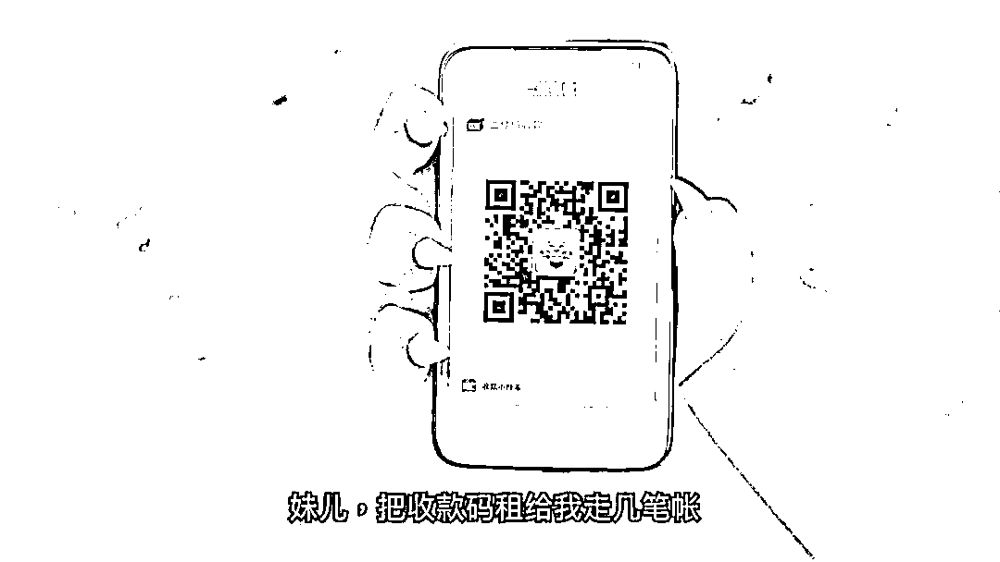
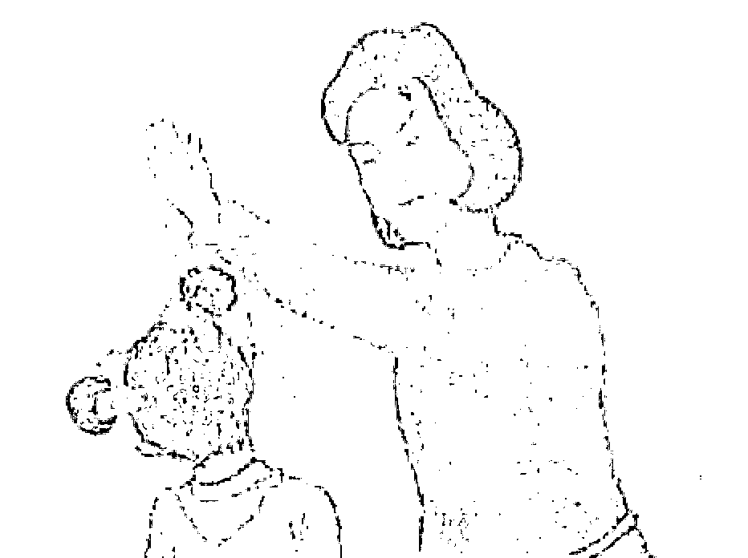
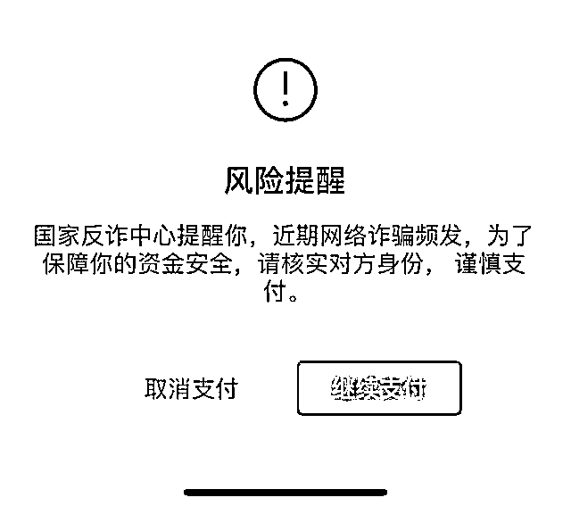

# “借我收款码？”“刑啊！”

> 原文：[`mp.weixin.qq.com/s?__biz=MzIyMDYwMTk0Mw==&mid=2247523343&idx=1&sn=039a783b325c9a6e1bb8ea195cf16c3b&chksm=97cb5737a0bcde2130f21fb4409ca9dd0563e666957b07fc2daa0a904f42103a5b7ac8fa7851&scene=27#wechat_redirect`](http://mp.weixin.qq.com/s?__biz=MzIyMDYwMTk0Mw==&mid=2247523343&idx=1&sn=039a783b325c9a6e1bb8ea195cf16c3b&chksm=97cb5737a0bcde2130f21fb4409ca9dd0563e666957b07fc2daa0a904f42103a5b7ac8fa7851&scene=27#wechat_redirect)

"在？收款码借我下，到账返你 3%。”

**当你收到这样的询问时，请打起十二分精神。**

今天，一部朋友圈限定的大片上映了，里面就有这样的剧情。

这部片子电影院也看不到。仅供亲友转发。

片名浓浓港风，一看你就知道是什么类型：

**《*反诈风云之谁是卧底*》**

<mpvideosnap class="js_uneditable custom_select_card channels_iframe" data-pluginname="videosnap" data-id="export/UzFfAgtgekIEAQAAAAAAEKcHGpnFJQAAAAstQy6ubaLX4KHWvLEZgBPE94McHAFEFdf9zNPgMIvLD80m0NltlI_kKiCF2gyj" data-url="https://findermp.video.qq.com/251/20304/stodownload?encfilekey=rjD5jyTuFrIpZ2ibE8T7Ym3K77SEULgkiaW8MibUZ8kHibB23OEYG6tiaSYkIdnyUfArNzDYPTGTSMiaM32nnofqBh6KW5AwIEdYiaLNpngwBPyq4k&amp;adaptivelytrans=0&amp;bizid=1023&amp;dotrans=0&amp;hy=SZ&amp;idx=1&amp;m=&amp;scene=0&amp;token=AxricY7RBHdWOxpKVibfVTetQLYtn56MefbBfLQX2LKibKHPyBd9qAV5P75CGKGQLDAVRgoEI8cG3g" data-headimgurl="http://wx.qlogo.cn/finderhead/naPHoFY2n5RbMAtGqzo9ckMfibVp0q0ibxrXTlibsWcADSLwpyqibytoNw/0" data-username="v2_060000231003b20faec8c4e28810cbd1cc04ee30b07781d4bd3e0aff07d40a3378c3c524ff8b@finder" data-nickname="国家反诈中心" data-desc="原来卧底是他？你能看出来吗？国家反诈中心联合@财付通 推出反诈动画大片" data-nonceid="2994393851991792577" data-type="video"></mpvideosnap>

导演&制片人：国家反诈中心、腾讯财付通。

它在公安部和中国人民银行指导下发布，主题——反诈；

片长：3 分钟；

老少咸宜。

最特别的是，片里没有一个人，全由动物组成。要的就是这个反差——小动物能有什么坏心思呢？

“朋友”，有什么坏心思呢？

3 分钟的片子，只为告诉我们一个道理：

***“不能任他骗，收好收款码/银行卡/身份证应万变”。***

各类反诈宣传，你可能已经看过不少。

“不要接来历不明的电话”、“不要给不明账户打钱”……

但不要借收款码，你可能是第一次听。这是一种新型的骗术。

现实中，也许你曾被求助：

“老婆生病，借我收款码转手术费，之后给你手续费”；

“你帮我用卡转一下钱，我分你 2%的提成”；

出门找个兼职，这天就收到“收款码租借 30 元/天”的招聘广告。

但，天上真的会掉馅饼吗？好朋友，怎么会拿你的收款码做坏事。

这部动画，目光聚焦到反诈的第一线：反洗钱。

是的，将手伸向我们的收款码、银行卡和身份证的“朋友”——很可能就是洗钱犯罪团伙中的一员。

洗钱，洗什么和怎么洗

色情、赌博……各种诈骗黑产平台，涉案金额往往数以亿计。

而“洗钱”，是把赃款洗白的必经之路。

什么是洗钱？打个比方：

我有个朋友，偷拿老妈的零钱（不法收入），买了东西。

当爸妈灵魂发问，“哪来的钱”？

他撒谎说是比赛奖品，或者说同学给的。

有充分的证据，就能蒙混过关。

（警告：好孩子不要学）。

当然，再大胆一点，还可以把偷来的钱，直接让你代收。

这样，你就成了他的“银行卡”或“收款码”，而他爸妈追问时，就会碰到一堵人肉防火墙（再次“好孩子不要学”警告）。

不过，和被爸妈揭穿后面临的男女混合双打比起来，参与洗钱的后果还要严重得多。

借码，后果可能比借钱更严重

一旦你乖乖交出银行卡或收款码，就可能变成骗取他人资金的一环。

甚至，你的收款码还可能被“码商”反复倒卖，持续性地为黑产提供资金掩护。

也别抱侥幸心理：

“我只是借出了收款码/银行卡/身份证，没什么大不了吧？”

根据我国《刑法》第一百九十一条——

为洗钱行为“提供资金账户”，提供账户的人会被立案追诉。

最高刑罚，是“处五年以上十年以下有期徒刑，并处洗钱数额百分之五以上百分之二十以下罚金”。

更不用提，还可能导致账户被封禁、不能正常交易……

 小心，保护好自己的收款码

所以，多小心也不过分。

发现可疑行为，你可以在国家反诈中心 APP 上，立刻上传可疑信息。

今年，在各地各部门的协同下，我国累计打掉涉“两卡（银行卡、电话卡）”违法犯罪团伙 2.7 万个，查处违法犯罪嫌疑人 45 万名。

我们也为可疑支付设置了弹窗警告。 

（微信支付联合国家反诈中心推出的风险提醒）

所以，再次提醒：

***“不能任他骗，收好收款码、银行卡、身份证应万变”*****。**

当有人找你借这三样东西时，怎么谨慎都不为过。

来源： 腾讯

← 向右滑动与灰产圈互动交流 →

