# 和你有关！个人信息保护法今起施行，这六大亮点 hin 管用！

> 原文：[`mp.weixin.qq.com/s?__biz=MzIyMDYwMTk0Mw==&mid=2247523343&idx=3&sn=e3ee13671b9b313cce4009f47f0a7fad&chksm=97cb5737a0bcde21f633256b667b98de3bf8bbcd13b6335ef3099faee86e7421b5db04d18fa8&scene=27#wechat_redirect`](http://mp.weixin.qq.com/s?__biz=MzIyMDYwMTk0Mw==&mid=2247523343&idx=3&sn=e3ee13671b9b313cce4009f47f0a7fad&chksm=97cb5737a0bcde21f633256b667b98de3bf8bbcd13b6335ef3099faee86e7421b5db04d18fa8&scene=27#wechat_redirect)

万物互联时代

我们享受到了生活上的极大便利

但与此同时

有些人在网络上近乎“裸奔”

没有隐私可言

大家是否经历过

跟朋友出游，一起找酒店

搜出来的价格完全不一样

刚跟朋友提到要买红色长裙

打开购物 APP 就出现在了你的首页

……

快戳下面的情景小短剧

剧情真实到包你直呼：

莫不是在我身边装了摄像头？！

[`mp.weixin.qq.com/mp/readtemplate?t=pages/video_player_tmpl&action=mpvideo&auto=0&vid=wxv_2106563919862464518`](https://mp.weixin.qq.com/mp/readtemplate?t=pages/video_player_tmpl&action=mpvideo&auto=0&vid=wxv_2106563919862464518)

那么

对于莫名“被杀熟”“被监听”……

大家究竟有哪些遭遇和看法呢

石家庄市民街头热议，金句频出

戳下方看视频↓↓↓

[`mp.weixin.qq.com/mp/readtemplate?t=pages/video_player_tmpl&action=mpvideo&auto=0&vid=wxv_2106565003486068742`](https://mp.weixin.qq.com/mp/readtemplate?t=pages/video_player_tmpl&action=mpvideo&auto=0&vid=wxv_2106565003486068742)

有人就要问了

我们的个人信息被泄露

就只能独自“emo”嘛

难道就没人管管这事吗？

别急，在千呼万唤中

公众翘首以盼多年的

**《中华人民共和国个人信息保护法》**

终于落地

该法于今日起正式施行

先夸一波个人信息保护法

作为我国首部

专门针对个人信息保护的法律

改变了之前法条分散、标准不同的尴尬局面

更加系统、全面地实现了

对公民个人信息的法律保护

如果遭遇个人信息被侵犯

你就可以拿起法律武器 

勇敢地保护自己权益

**重点来了**

个人信息保护法里都涉及到了哪些内容呢

小编已经给大家找出来了

“坠”值得关注的六大亮点

1.禁止“大数据杀熟”

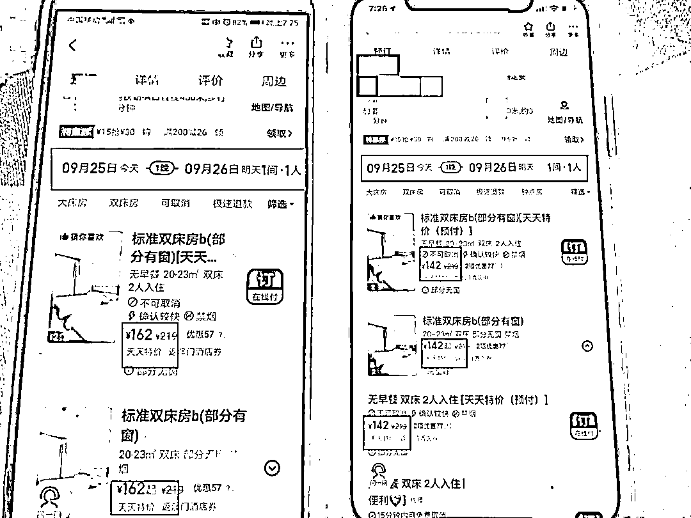

同一时间用某 APP 预定某酒店的同房型时，不同手机端显示的价格不同，这就是典型的大数据杀熟。 

平台通过对消费者个人信息的过度采集和随意使用，利用算法在多样化的消费群体中攫取最大利益。针对该现象，个人信息保护法作出回应：

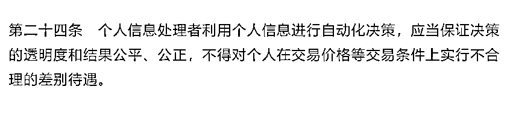

2.APP 不得强制推送个性化广告

搜索过一个商品，接着就会收到很多类似广告的推送……近些年来，一些平台利用大数据进行用户画像推送个性化广告，困扰公众日常生活。

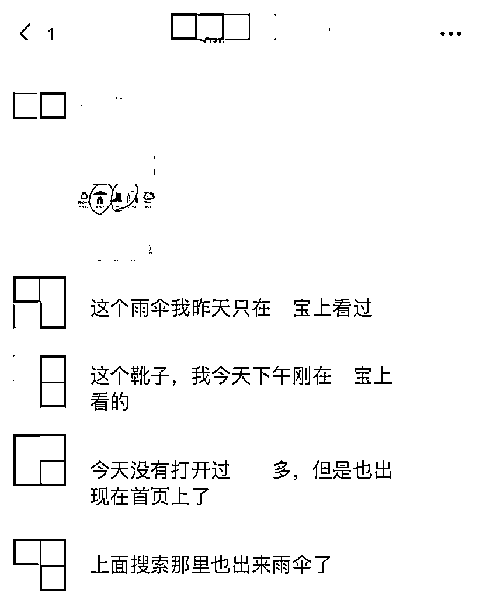

个人信息保护法对此作出明确规定：**个性化信息推送，应提供便捷的拒绝方式**

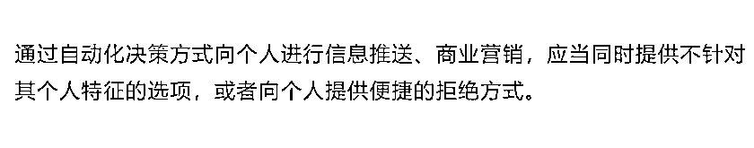

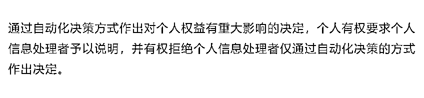

3.不得滥用人脸识别

人脸识别技术近些年来在人们生活和工作中大放异彩，与此同时，也存在着商家滥用人脸识别技术侵犯我们合法权益的风险。

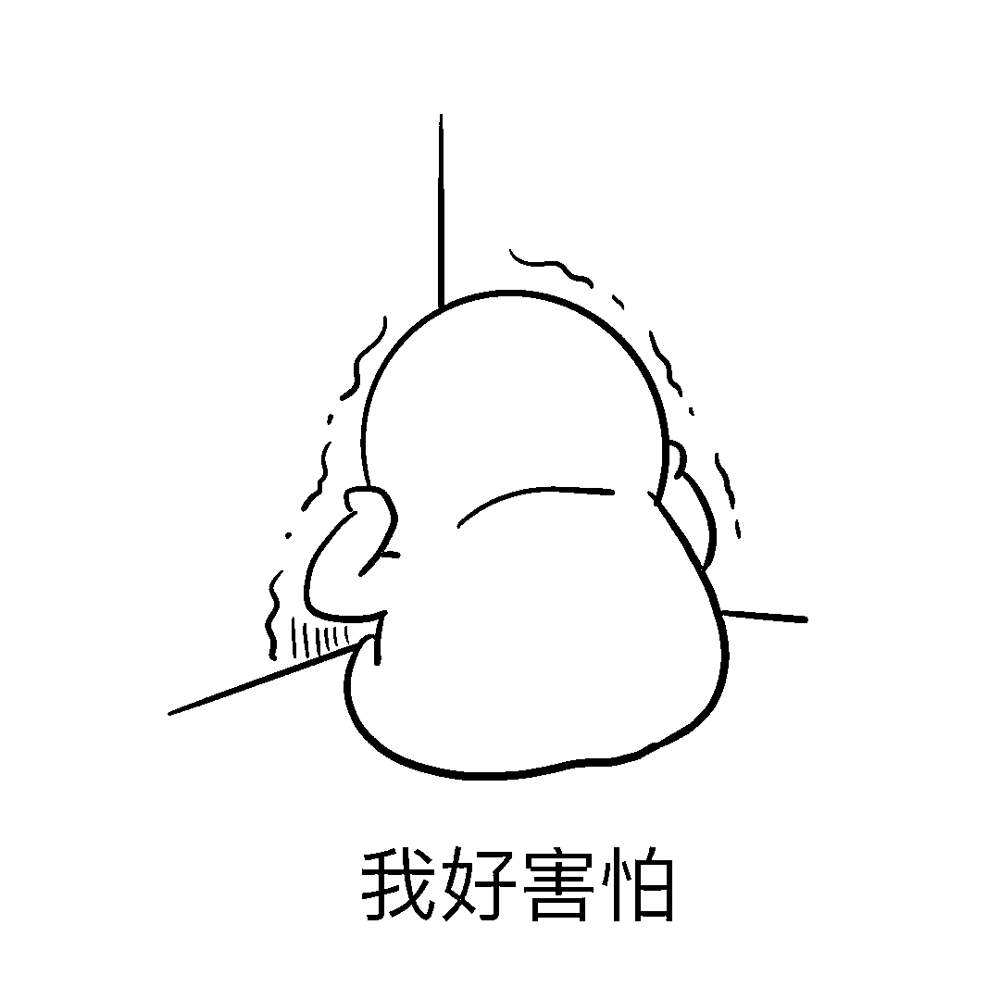

个人信息保护法明确指出：

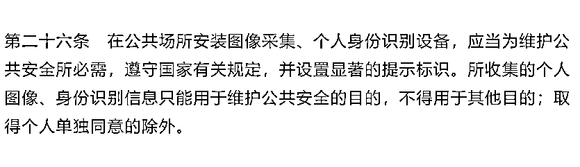

4.禁止因用户不同意提供个人信息就拒绝服务 

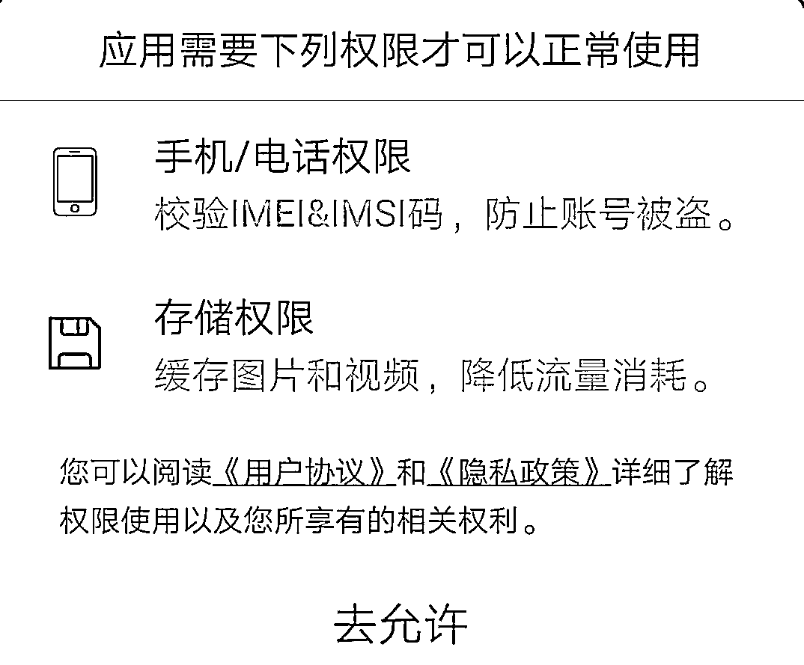

通常当我们注册登录某个平台时，都需要同意隐私政策，如果拒绝的话，将无法继续使用这个平台。这些隐私政策里，基本都包含了授权其个人敏感信息。

个人信息保护法规定：

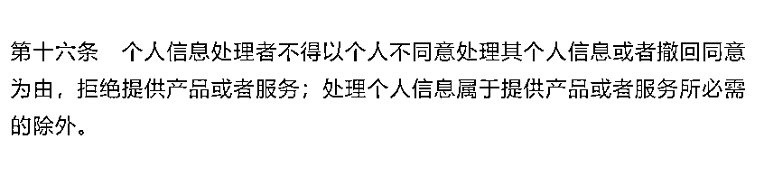

5.专节规制处理敏感个人信息

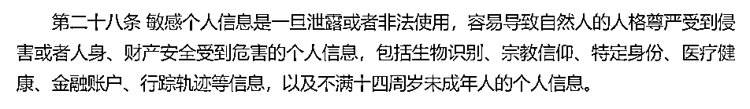

个人信息保护法规定： 

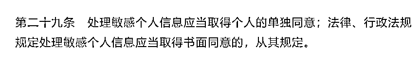

6.买卖个人信息——违法

接到骚扰电话，已是寻常事，卖房、装修、培训班……电话那端的人十分清楚你的私密信息，因为在某些平台上，你的个人信息被明码标价、敞开供应……

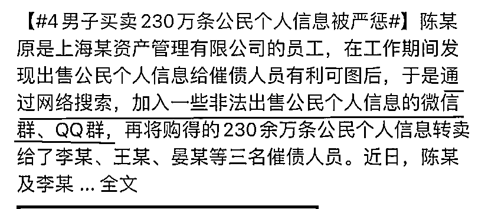

个人信息保护法规定：

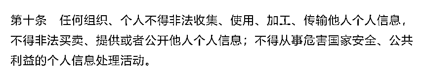

除了上述重点外

个人信息保护法

还在很多方面做出了规定

总的来说

**“告知-同意”**原则

是贯穿全文的基础规制

是个人信息处理者处理用户信息的前提

河北经贸大学法学院副院长、教授**李大庆**

为我们讲述了该法出台的重要意义

精彩发言，不容错过~↓

[`mp.weixin.qq.com/mp/readtemplate?t=pages/video_player_tmpl&action=mpvideo&auto=0&vid=wxv_2106566907867856900`](https://mp.weixin.qq.com/mp/readtemplate?t=pages/video_player_tmpl&action=mpvideo&auto=0&vid=wxv_2106566907867856900)

该法的出台对你我来说

的确是一个好消息

互联网企业的野蛮生长

会受到限制

由用户隐私来驱动的盈利模式

将成为过去

我们的个人信息也将获得前所未有的保护

说到这里

小编已狠狠滴期盼新法落实啦！

  来源：河北法制报，巴蜀反诈

← 向右滑动与灰产圈互动交流 →

