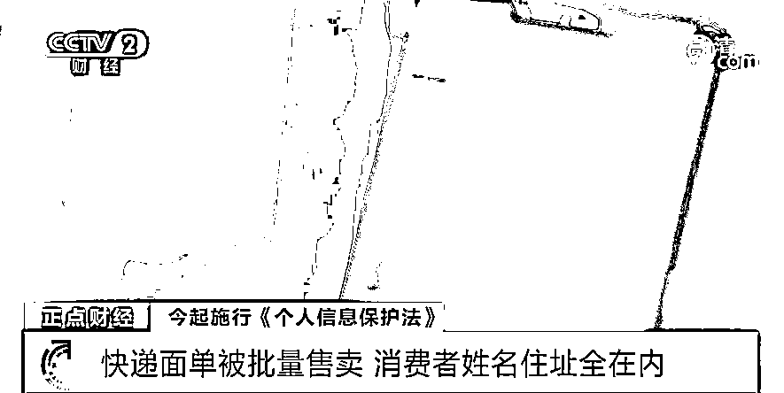
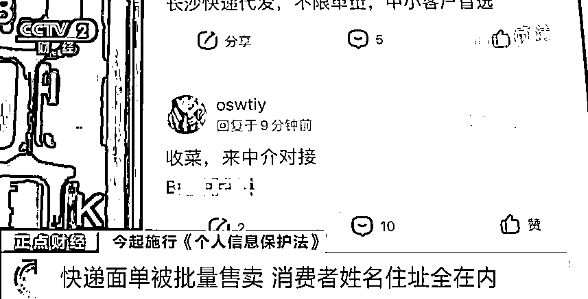
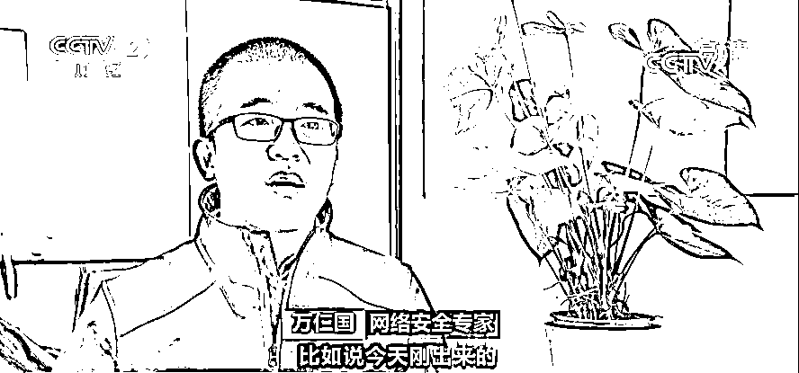
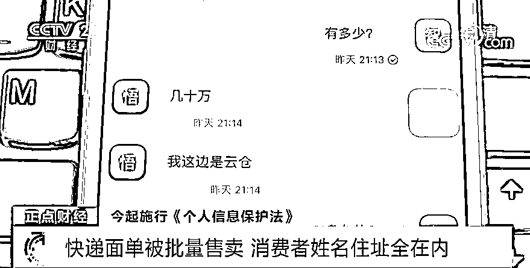
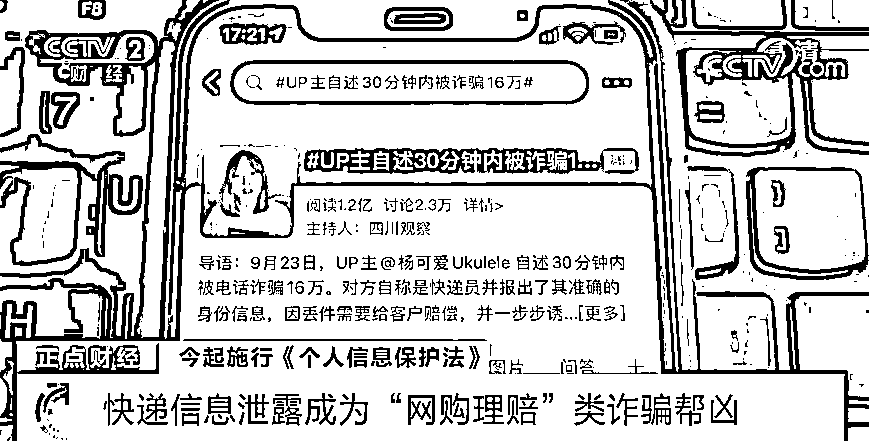
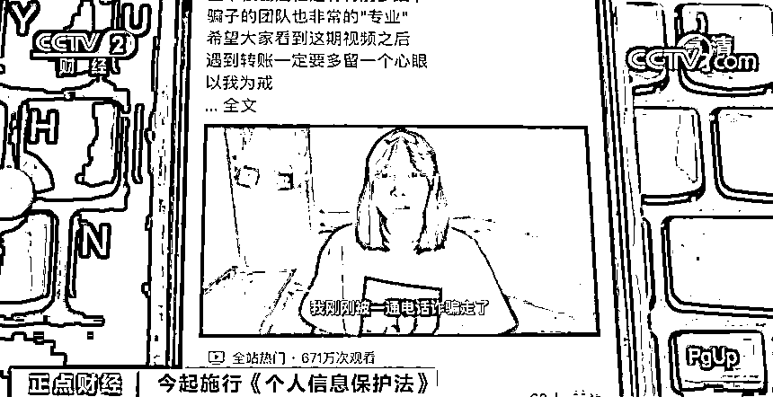
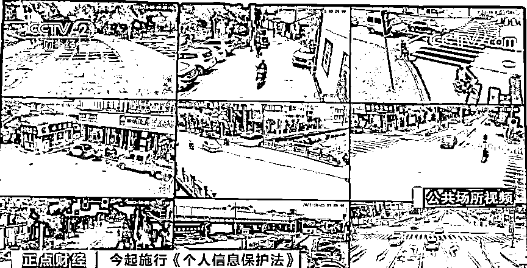
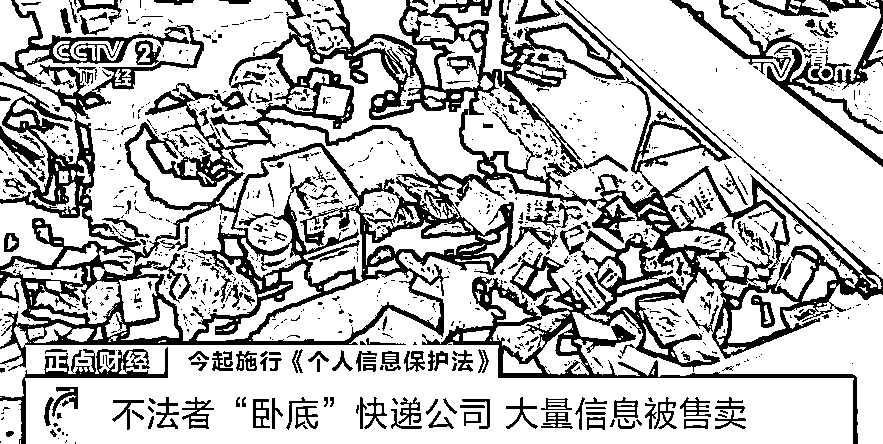
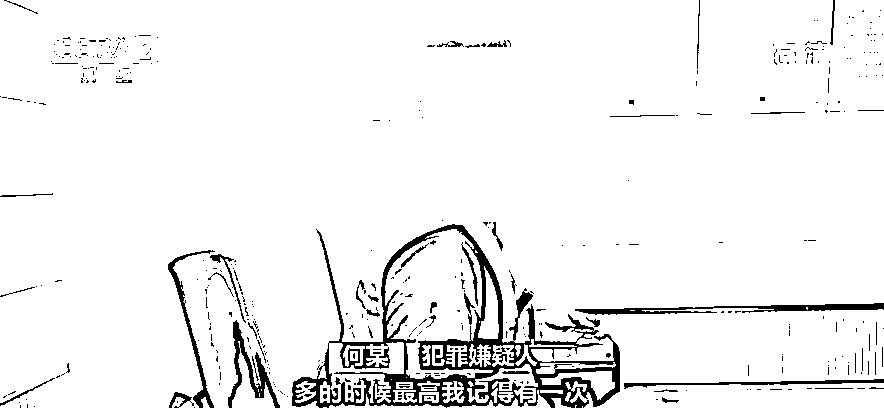
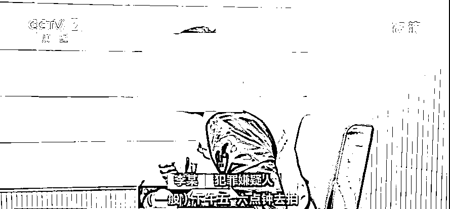

# 黑产曝光！你扔掉的快递面单，被明码标价售卖！犯罪团伙“卧底”快递公司，有人一天“赚”超 300 元...

> 原文：[`mp.weixin.qq.com/s?__biz=MzIyMDYwMTk0Mw==&mid=2247523343&idx=5&sn=4c92af445fe13856265e60ba41675b98&chksm=97cb5737a0bcde2180a9c8e3f32f4d7c05475dcde263bce968cbd7b488fe356e52cec33fc0ae&scene=27#wechat_redirect`](http://mp.weixin.qq.com/s?__biz=MzIyMDYwMTk0Mw==&mid=2247523343&idx=5&sn=4c92af445fe13856265e60ba41675b98&chksm=97cb5737a0bcde2180a9c8e3f32f4d7c05475dcde263bce968cbd7b488fe356e52cec33fc0ae&scene=27#wechat_redirect)

从今天起，《中华人民共和国个人信息保护法》正式施行，个人信息保护法明确：不得过度收集个人信息、滥用人脸识别技术、大数据杀熟等。对于提供重要互联网平台服务、用户数量巨大、业务类型复杂的个人信息处理者，个人信息保护法特别规定了其需要履行的义务，如建立健全个人信息保护合规制度体系，定期发布个人信息保护社会责任报告，接受社会监督等。  

[`mp.weixin.qq.com/mp/readtemplate?t=pages/video_player_tmpl&action=mpvideo&auto=0&vid=wxv_2116515056040345601`](https://mp.weixin.qq.com/mp/readtemplate?t=pages/video_player_tmpl&action=mpvideo&auto=0&vid=wxv_2116515056040345601)

△央视财经《正点财经》栏目视频

快递面单被批量售卖 消费者姓名住址全在内

[`mp.weixin.qq.com/mp/readtemplate?t=pages/video_player_tmpl&action=mpvideo&auto=0&vid=wxv_2116515683994763267`](https://mp.weixin.qq.com/mp/readtemplate?t=pages/video_player_tmpl&action=mpvideo&auto=0&vid=wxv_2116515683994763267)

△央视财经《正点财经》栏目视频

一年一度的“双十一”快到了，对于许多网购族来说，又到了迎接快递潮的时候。不过，随着快递量的增加，个人信息安全也可能面临泄露的风险。在快递包裹上，都会贴有一张“快递面单”，主要用来记录发件人、收件人以及货物种类等相关信息，**其中还包含收件人的姓名、电话、家庭住址等隐私信息**。最近，记者调查就发现，目前这些快递面单在网上被明码标价批量售卖，情况十分猖獗。 

 记者试着在百度贴吧输入“快递”“面单”等关键词之后，出现很多相关的分类群组，而为了逃避打击，不法分子都会使用一些暗语来代替，快递信息通常被称为“料”“菜”等简称。

在“快递吧”一个网名 os 开头的人打出了“收菜，来中介对接”的广告，并留下一个联系方式；另外还有人打出“工作室对接，出历史，可测试”的广告。据记者了解，**快递面单被收购者分为“实时”和“历史”两种，而实时面单也是最抢手的所谓货源**。 

**网络安全专家 万仁国：**实时面单，就是这个面单是新鲜出炉的，比如今天刚出来的，这种面单时效性强；这些面单一旦被卖了，并且被联系过、处理过之后，那么它就叫历史面单。

记者通过一款即时通讯软件联系了多位买家，其中一个叫“橘子”的人给记者报价，**实时面单超过 1000 张每张价格 3.5 元，精品面单每张 4 元；而历史面单只收车载、童装童鞋、化妆品类的，每张 1.5 元**。

记者又联系了一个卖家，这个叫“悟空”的人声称，自己手里有几十万历史快递面单，货源是一家物流“云仓”；为了证明自己的实力，他还给记者发了一份文档，**里面按照化妆品、母婴、服装等进行分门别类**，其中包括上百位消费者的姓名、所购商品、家庭住址和电话号码等隐私信息，甚至还有商品的价格。

快递信息泄露成为“网购理赔”类诈骗帮凶

[`mp.weixin.qq.com/mp/readtemplate?t=pages/video_player_tmpl&action=mpvideo&auto=0&vid=wxv_2116516252121628675`](https://mp.weixin.qq.com/mp/readtemplate?t=pages/video_player_tmpl&action=mpvideo&auto=0&vid=wxv_2116516252121628675)

△央视财经《正点财经》栏目视频

据记者调查，诈骗分子在获取个人快递信息后，通常会冒充“电商客服”或“快递员”，使用的诈骗手法包括“发送退货链接，骗取银行账号信息”“快递遗失，商家理赔”等几类。其中**“网购理赔类”**是目前比较高发的诈骗类型。

9 月 23 日，**“UP 主自述 30 分钟内被诈骗 16 万”**的话题成为热搜。据受害者讲述，她当天接到了一个自称申通快递员的电话，对方表示因为快件丢失需要进行理赔。 

 在冒充快递员的骗子一步步诱导下，**受害者 30 分钟内陆续被骗了 16 万元**。记者了解到，一张快递单背后其实可以延伸出很多个人信息，一个人的姓名、电话号码，而通过电话号码还可以找到微信、支付宝等账号，另外还有家庭或工作地址、消费习惯、经济能力等信息。

不法者“卧底”快递公司 大量信息被售卖

[`mp.weixin.qq.com/mp/readtemplate?t=pages/video_player_tmpl&action=mpvideo&auto=0&vid=wxv_2116516717454491662`](https://mp.weixin.qq.com/mp/readtemplate?t=pages/video_player_tmpl&action=mpvideo&auto=0&vid=wxv_2116516717454491662)

△央视财经《正点财经》栏目视频

快递面单上的个人信息是怎样被窃取和贩卖的呢？浙江宁波警方近日就侦破一个非法获取、倒卖快递面单信息的犯罪团伙，抓获犯罪嫌疑人 9 名，查获快递面单照片 2 万余张。 

今年 9 月初，浙江省宁波市北仑区一家进口外贸公司报警称，公司陆续收到消费者的投诉电话，称大量个人信息泄露，已经有客户被诈骗。接到报警后，宁波警方立即展开侦查，通过实地走访，民警很快获取了一些线索。

据警方了解，这个犯罪团伙为了获取快递包含的个人信息进行非法牟利，竟然通过临时应聘的方式进入快递公司，然后，他们再利用整理快递包裹之机，偷拍快递面单照片，汇总整理后在网上倒卖。

**犯罪嫌疑人 何某：**多的时候，最高有一次差不多每张照片 8 角，上家说他那边的成交金额是每张照片 1.2 元左右。

**犯罪嫌疑人 李某：**一般下午五六点钟去拍，拍一个多小时，**7 角一张，当天大概能赢利三四百元**。　

 在掌握大量线索后，宁波警方开展了抓捕行动，先后共抓获犯罪嫌疑人 9 名，查获快递面单照片 2 万余张。

来源：央视财经

← 向右滑动与灰产圈互动交流 →

