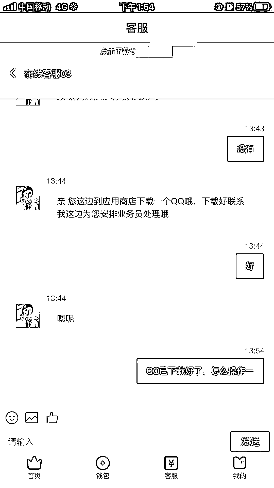
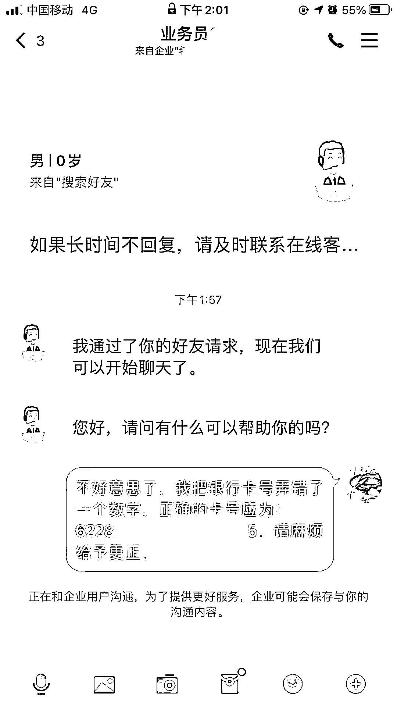
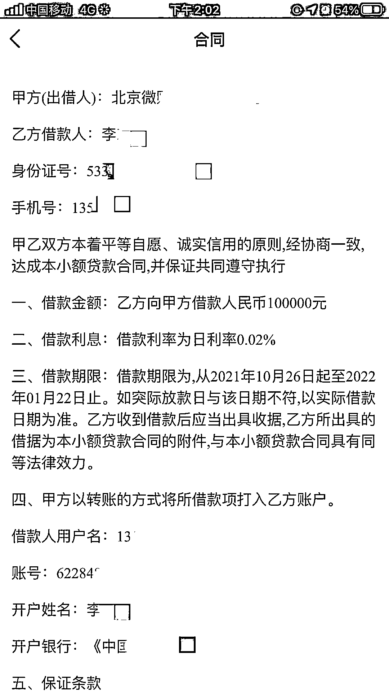

# “要么汇款 3 万，要么起诉你！”当骗子拿起法律的武器保护自己……

> 原文：[`mp.weixin.qq.com/s?__biz=MzIyMDYwMTk0Mw==&mid=2247523343&idx=6&sn=5b474b18e10e9e683b43dfa2fd035ad3&chksm=97cb5737a0bcde21e4a768b8edea66858dee7c57475a0ba74dea6350d18e5ccf21853f886354&scene=27#wechat_redirect`](http://mp.weixin.qq.com/s?__biz=MzIyMDYwMTk0Mw==&mid=2247523343&idx=6&sn=5b474b18e10e9e683b43dfa2fd035ad3&chksm=97cb5737a0bcde21e4a768b8edea66858dee7c57475a0ba74dea6350d18e5ccf21853f886354&scene=27#wechat_redirect)

10 月 26 日下午，昌宁县卡斯镇居民李先生急匆匆地跑进派出所，对值班民警说道：“警察同志，请帮我看看！我在手机上申请了 10 万元小额贷款，现在对方告诉我说贷款已经办理下来了，且‘合同’已拟定完毕等待放款，但因为我在填银行卡号的时候填错了一个数字，办理好的贷款被冻结了，现在需要我转 30000 元钱到对方指定的账户进行解冻，才可以将贷款的钱打到我的账户上，如果我不付款的话他们就要到法院起诉我。平时我在昌宁警方上也看过诈骗的相关信息。我拿不准我这个是不是属于诈骗，来请你们看看！”

值班民警通过查看李先生与对方的聊天记录及了解事件经过后，初步判断李先生遭遇的是以小额贷款为诱饵的电信网络诈骗。

民警针对不法分子的诈骗手法和防骗技巧对李先生进行了详细的讲解，使李先生认清了不法分子的诈骗行为。最终，成功阻止了一起网络电信诈骗案件的发生。

**警方提示**

骗子手段不断翻新，诈骗陷阱仍需提防。凡是接到陌生人电话、收到短信及上网交易要求转账、汇款时，请您做到“不听、不看、不信、不转账、不汇款”，如有疑问请立即拨打 110 或到当地公安机关咨询、举报或者报警，以防上当受骗，手机上及时安装“国家反诈中心 APP”哟！

**电信诈骗科普知识****电信诈骗九大套路：**

**套路一：冒充购物网站。**

骗子建立“假的购物网站”或“淘宝店铺”，一旦你下单，便称系统故障，需要重新激活。随后通过 QQ 发送虚假激活网址，盗取账号密码。让你登录“银行”钓鱼网站，或者假称返利，让你扫一下二维码，结果银行信息就被盗走了。

**套路二：假称退还****养老金****、****抚恤金****。**

一般会告知“您还有最后一笔钱没有领取，请您去某银行的自助设备上进行操作领取”。这通常会针对不太熟悉电子设备的老年人，请小伙伴们一定提醒自己爸妈，如果碰到这样的陌生电话，一定不能听他的去银行。

**套路三：冒充熟人。**

骗子会盗取 QQ，跟你说“我生病了，先借我些钱”的字眼，诱使熟人汇款。或者冒充老师给家长发成绩单链接，你一点进去，手机银行的钱就被盗走了。

**套路四：冒充公司。**

假称公司有高额贷款业务，如果打电话去咨询，再一步步要求你缴纳保证金、定金、预付利息、中介费等各种费用，诱使你将钱汇至指定账户。

**套路五：虚构中奖。**

诈骗分子随机向手机用户或在互联网上发送中奖信息。一旦用户拨打“兑奖热线”，诈骗分子即以需先交“个人所得税”、“公证费”、“转账手续费”等种种借口让用户汇款来骗取钱财。

**套路六：冒充征婚交友。**

骗子利用网络等媒体发布自身有着好条件的“假信息”，让急于恋爱的朋友上钩，之后以甜言蜜语迷惑你，伺机骗财。

**套路七：冒充公检法。**

这样的诈骗金额庞大，占比达 23%，骗子常用“涉嫌洗钱”“医保、社保异常”“解除分期付款”的手法恐吓你，冒充公检法诈骗的噱头变化多端。

**套路八：假称“****改签****退票”。**

引导民众进入钓鱼网站掉入汇款陷阱，这是一种主要的网络诈骗方式，占到网络诈骗的 44%。

**套路九：短信链接有病毒。**

一旦点开病毒在用户不知情的情况下，通过自动拨打电话等方式，导致用户资费损失。据悉 2016 年第二季度感染病毒的用户数量达 1.06 亿，其中 82.78%的病毒目的在于消耗你的手机费用。

**电信诈骗应该如何防范：**

在公安机关打击电信诈骗的同时，社会公众也应提高防范意识，做到“**三不一要**”。

**“一不”：不轻信，不要轻信来历不明的电话和信息**，不管诈骗分子使用什么甜言蜜语、花言巧语，都不要轻易相信。要及时挂掉电话，不回复短信，不给诈骗分子进一步布设圈套的机会。

**“二不”：不透露，就是要筑牢自己的心理防线**，不要因贪小利而受不法分子或违法短信的诱惑。无论什么情况，都不向对方透露自己及家人的身份、存款、银行卡等信息，如有疑问，可拨打 110 求助，或向亲戚、朋友、同事等核实情况。

**“三不”：不转账，要了解银行卡常识**，保证自己银行卡内资金安全，决不向陌生人汇款、转账。一些公司财务人员和经常有资金往来的人群等，在汇款、转账前，要再三核实对方的账户，不要让诈骗分子得逞。

**“一要”：要及时报案。**万一上当受骗或听到亲戚朋友被骗，要立即向公安机关报案，可直接拨打 110，并提供骗子的账号、联系电话等详细情节，以便公安机关开展侦查破案，挽回损失。

来源：保山警方，利箭在行动

← 向右滑动与灰产圈互动交流 →

