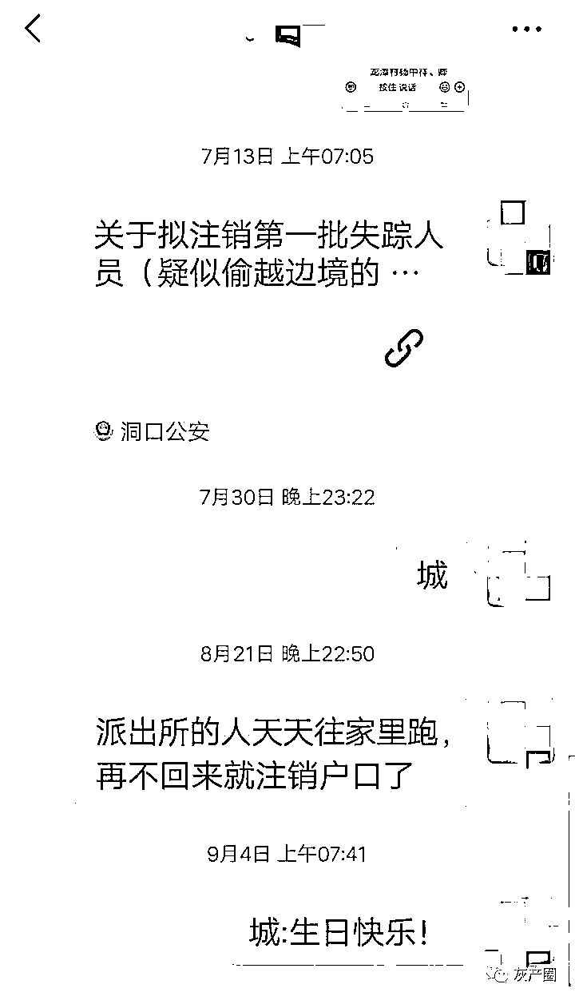

# 湖南“缅北诈骗窝点人员之家”：失联者在境外生死未卜，被“示众”

> 原文：[`mp.weixin.qq.com/s?__biz=MzIyMDYwMTk0Mw==&mid=2247523416&idx=1&sn=80af7e6c64dc58e22a5144283f54a8c6&chksm=97cb5760a0bcde7634c8ac4107f69534bd4ed2f97eccae0a46b0fb73b7dc4869293d4aee514a&scene=27#wechat_redirect`](http://mp.weixin.qq.com/s?__biz=MzIyMDYwMTk0Mw==&mid=2247523416&idx=1&sn=80af7e6c64dc58e22a5144283f54a8c6&chksm=97cb5760a0bcde7634c8ac4107f69534bd4ed2f97eccae0a46b0fb73b7dc4869293d4aee514a&scene=27#wechat_redirect)

郑青云幸亏及时回来了，不然老家的房屋也会被涂上“缅北诈骗窝点人员之家”10 个大字。

 湖南洞口缅北诈骗嫌疑人“劝返”工作已过去五个月，仍有几十人“失联”。这些人大多是 95 后、00 后，他们老家的房子则未能幸免，被红漆喷写上“缅北诈骗窝点人员之家”。

洞口县黄桥镇一户人家被喷字“缅北诈骗窝点人员之家”。摄影 陈龙

当地涂字“示众”行为，不久前曾引发舆论争议，法律学者均认为，“劝返”不应殃及家属。近日，记者深入洞口县多个乡镇，发现涂字行为仍在持续，不少家庭被涂字“示众”后抬不起头，甚至面临房屋被拆的威胁。

 洞口公安的行动，是今年全国公安系统打击东南亚网络诈骗和“大劝返”工作的一个小样本。

 今年 4 月起，公安系统开始针对缅北地区电信诈骗窝点 10 多万人员的集中打击。5 月 31 日，邵阳市洞口县公安局启动“敦促缅北地区非法出入境人员投案自首”的工作，或称“劝返”。

截至 8 月 20 日，洞口 200 多人中，已有 100 多人返回国内，但仍有 45 人“拒不回国”。此后，洞口公安多次延长期限，发布“公开警示”“注销户籍”通告，并深入村民家中走访恳谈。

 越到最后一批人，难度越大。目前失联的一批人员，在境外“生死未卜”，他们的父母家属也无能为力。

 “缅北电信诈骗犯之家”很多只是普通农户家庭，曾饱受“留守儿童”之困。大部分父母对孩子出境毫无所知，从洞口流向缅北的不少人，早年都属于“留守儿童”，从小就失去对父母的亲近感，他们早早辍学去外地打工，几乎复制了父母的命运，逐步走向了被骗往境外从事诈骗的道路。

 被劝返人员老家遭涂字“示众”
公安系统对东南亚电信诈骗的打击工作，几乎都定位于“缅北”。而实际上，许多出境务工的年轻人并不在缅甸或缅北。

 在 8 月发布的 45 人名单中，郑青云的照片看起来略有不同。由于公安采用的是办理身份证时的证件照，名单中的许多人看起来都还是中小学生的模样，实际上他们大多 20 多岁。唯有郑青云的照片，成熟一些。

 不仅成熟，郑青云看起来朴实、慈眉善目。事实证明，这个印象没错。

 郑青云已经三十七八岁。2004 年，她打工时认识了现在的丈夫，从湖北襄阳嫁到了洞口县竹市镇万里村。17 年来，她生了一女两儿，大女儿已经高二，两个儿子都在上小学。丈夫则常年在广州打工。

 在婆婆眼里，郑青云是天下“最好的儿媳”。她很少说话，任劳任怨，除了养育三个孩子，还要照顾两个老人，以及丈夫的盲人弟弟。2019 年，公公患肺癌，到长沙治病，随后去世；2020 年，婆婆患胰腺炎住院数月，也是郑青云照顾。家里因此欠下了 20 万债务，经济陷入困境。

 今年夏天，已经 17 年没出门打工的郑青云，也去了广东。不知被什么朋友介绍，她去了东南亚，没过两个月，就接到竹市镇派出所的劝返通知。9 月 22 日，郑青云回到了万里村。这一趟没挣到钱。直到现在，三个孩子的学费都还没交。

 记者找到郑青云家时，她已回襄阳探亲。“她爹妈高血压，话都不会说，也有负担，可怜。是该回去看看。”婆婆说。

 洞口县有 20 个乡镇。洞口公安公布的最后一批 45 人名单，人员分布在 10 个乡镇。其中黄桥镇有 23 人，分布于 8 个村，占了全县一半以上，堪称此次劝返工作的“重灾区”。

 仅在黄桥镇车塘村一村之内，就有 5 户人家房子被喷上了“缅北诈骗窝点人员之家”字样。

张海林、王凤华家的这 10 个字，喷在外边围墙上。她家的三层楼房，从外观上看还在建设中，红砖裸露，二楼三楼外沿还支着一些木棒。实际上，房子已建了 8 年。

 今年清明节后，儿子张雄又要出去打工。王凤华劝他“过完端午节再走”。张雄说，“不出去挣钱，吃什么？”此后，王凤华多次打微信电话，问他在哪里，只回答“在外面，在深圳”，再多说几句，他就敷衍过去。

 她一直以为儿子在深圳，直到 8 月，黄桥镇派出所来询问，夫妻俩才知道儿子出了国。

 最初一次，他们还打通了电话。后来，王凤华的微信被拉黑，就再也联系不上。派出所说，缅北疫情严重，还正在打仗，反复说“叫你儿子回来”，否则就会把他的户籍注销。王凤华很无奈，“你公安都抓不回来，我怎么能让他回来？”

 9 月 26 日上午 11 点多，黄桥镇副镇长、派出所民警带着几个工人，借助塑料模板，在围墙上喷上了“缅北诈骗窝点人员之家”。其间，她正好从外边买东西回来。这一过程被监控记录下来。随后，民警又去隔壁一家喷字。

 警方警告“限期不回，就拆房子”,由于已经过了 9 月 20 日的最后期限，民警和副镇长的态度都很严厉。“叫我别开门，不要出去”，张海林的妻子说，喷字时，民警警告道，“10 月 20 日没回来，就把你们房子拆了。”

 至今想起这几句话，王凤华夫妇都感到痛心和一丝害怕。这栋未建成的房子，是他们十几年的心血。十几年来，夫妇俩一直在外打工。早年，他们在工地凭着一天十几元的微薄收入，供两个儿子上学、生活，蚂蚁搬家一样，8 年了，才把房子建到一半。

“打工赚点钱，给两个儿子盖个房子，没房子娶不到老婆的嘛。”王凤华笑着说，“就是没钱，这个房子一直没搞好”。现在，房子只有一楼可以住，但也只是简单粉刷、贴了半墙瓷砖。没有吊顶，头顶还能看见预制板。

 张雄生于 2001 年，今年 20 岁。从小，他和哥哥跟着奶奶、外婆住在土坯房里。王凤华说，以前过年，他们不买吃的，不买衣服，留下钱存起来交学费，但依然没能阻止孩子辍学。兄弟俩初中只读了一年就出去打工了。

 因为代际感情缺失，现在，他们一年里很少给父母打电话。王凤华甚至不知道两个儿子的电话号码。

 “欲高门第多为善，求好子孙饱读书”。张海林请镇上的文化人，给一楼的每个房间都写了对联。“敬圣尊贤乡党仰，亲邻睦友世人夸”，“据德依仁天地久，安贫乐道子孙昌”。这是张海林的美好愿望，可惜，两个儿子都没什么作为，“没有挣过钱回来”。

 民警所说的“拆房子”，依据的是县公安局对限期未回国人员的惩戒措施之一：没收用赃款购买的商品房，拆除用赃款在宅基地上建设的自建房屋。但这栋房子是张海林、王凤华夫妇攒钱修建的，并不是用儿子的“赃款”所建。

 “拆房”的威胁，虽尚未实施，但这些家庭仍不免担心。
为了推进“劝返”工作，洞口公安多次发布通告，“最后回国时间”从 6 月 30 日一再延长至 7 月 20 日、8 月 20 日、9 月 20 日。目前，最后一批人员处于失联状态，对当地公安形成巨大挑战。

 7 月、8 月，黄桥镇许多地方都张贴了敦促非法出境人员投案自首、第一批拟注销户籍的通告，以及贴有 45 个人员照片的公开警示名单。王凤华也不想去别人那里打听消息，“自己孩子不听话，我哪里好意思去跟人家说这些？”

洞口县关于滞缅人员劝返、注销户籍的通告。摄影 陈龙

 也不是所有派出所都这种态度。竹市镇派出所联系上郑青云后，到万里村安慰她的婆婆，“老人家放心，你儿媳妇没什么事，我就是问一下情况，（提醒）回来的时候要做核酸检测。”婆婆说，村干部也知道“媳妇到我们这里，确实可怜”“都是好心”。

被“示众”家庭在当地抬不起头
黄桥镇尧王村，也有三个至今失联的人员。7 月 12 日，洞口公安公布了“拟注销第一批失踪人员（疑似偷越边境的缅北窝点人员）户籍”名单，10 人均为黄桥镇人，尧王村的王锦城排在第一。

邵阳洞口县黄桥镇车塘村，劝返人员名单贴在路边。摄影 陈龙
该名单称，7 月 20 日前回国的视为自首，否则，不仅要“视情依法提请宣告失踪、死亡直至注销户籍”，还要在村一级增加针对直系亲属的惩罚措施：暂停养老、医保待遇；取消集体经济收益分配资格；不再新增人口分田。

 程丽说，当时他们夫妇俩在浙江，家乡派出所打电话时，他们立刻提供了儿子的联系方式。根据微信聊天记录，程丽最后一次和儿子联系是在 4 月 23 日，王锦城让妈妈接收两个购物验证码，此后，程丽发过去的信息再无回应。

 7 月 8 日，黄桥镇公布第一批拟销户名单时，称这批人属于“已联系上拒绝回国、至今联系不上、自称被人身控制、已联系上无法提供队号”等情况。王锦城属于第一种。

 程丽说，5 月时，派出所联系上了他，“他说在广东。我说，不管在那边做生意还是打工，无论做什么，都要回来。我让他回来澄清有没有这回事。他说，没事的，过段时间再说。意思是不回来。”程丽不确定儿子是不是在缅北，也不知道他在做什么。

 8 月，洞口公安加大施压力度，截至 9 月已召开三次“反电诈”工作约谈会，县政府、公安局约谈了多个乡镇。随后，黄桥镇民警、辅警分批入村入户召开恳谈会，“走访缅北人员家属”。

黄桥镇民辅警入户走访缅北人员家属。来源：洞口公安微信公号。

 村民张亮告诉记者，警方有工作任务，压力也很大，于是向家属施压，“让我们发动亲戚、朋友、同学去联系，劝他回来。但他的电话、微信都被冻结了，公安也知道我们联系不上。”张亮说，民辅警每次来，都坐一会儿，“拍张照片就走了”。

 一位村民说，刚喷上“缅北诈骗窝点人员之家”字样时，村里乡亲“个个都来看”。“这么新的房子，喷上那些字，难看死了。”有段时间，民警和村干部“一天来好多次，烦死了”，后来，80 多岁的奶奶看到外人来访，就关门赶人。 

由于浙江的工厂经常限电，没法正常工作，最近程丽回到黄桥镇尧王村家里。看到墙上的字，她不高兴。程丽说，王锦城确实曾在 2019 年去过泰国打工，后来回来了，这次是否去了缅北、从事了诈骗，也还“只是嫌疑”。

 “如果确定我儿子干了诈骗，犯了罪，让他自己承担，依法判。我们也不袒护，反正（他是）成年人了。”程丽说，别说还没确定犯罪，就是犯了罪，“我们家人也不至于说该受辱”。

 现在，程丽一出门就觉得“低人一等”，“我们一家在村里抬不起头”。她用扫帚、干树枝遮挡了一部分。好在村民都比较善良，没人议论此事。

 但派出所还提醒程丽，如果王锦城限期不回国，小儿子将来考高中、大学也要受影响。王锦城的弟弟正在上初中，进门客厅的一面墙上贴了 20 张他的奖状。程丽不知道，派出所的话是不是真的。

 无论是注销户口、“拆房子”，还是“上学受影响”，当地民警的这些说法，依据的都是洞口县 5 月 31 日发布的《关于敦促缅北地区非法出入境人员投案自首的通告》。

 这并非洞口公安独创。今年 4 月起，公安系统开始针对缅北地区电信诈骗窝点 10 多万人员的集中打击，加上东南亚新冠疫情高发，大量人员偷渡回国，给国内疫情防控带来严重隐患，全国多个省市启动“大劝返”工作，并公布相应惩戒措施，这成为此后各地制定此类工作解决方案的一份样板，也是洞口公安系列通报的蓝本。
从“留守儿童”到诈骗嫌疑人。

 洞口公安的工作仍然是富有成效的。除了郑青云，车塘村一位年轻人，在父母打去 8 万元“赎身费”后，已经回到国内，正在边境隔离。

 竹市镇早禾村的钟衡，近日也从老挝回到洞口。但凡警方迅速联系上的人员，房屋都没有被喷字。

 “你是偷渡缅甸……回国后要拿当日报纸放在胸前和派出所人员合影。如果你不回国，取消你的户口，还要按国法处理……后果不堪设想。”8 月 15 日，派出所找来家里后，钟立峰给儿子发的微信消息里，有许多错别字。钟衡回复，“我不在缅甸呀。我在想办法回来，回来要两万多。”

 小小的洞口县，既是境外网络诈骗嫌疑人员的输出地，也是农村“空心化”的受害地。 

过去几十年，湖南农村借助“遍地是钱”的广东，用打工所得，纷纷在老家盖起了各种风格的洋楼、小别墅。而这些漂亮的村子，平时却是仅剩老幼的“空心村”。许多房子门前，长着一人高的荒草。“过年才回来一次”。还有许多房子烂尾多年。尧王村一位村民说，村里一家人三十多年没回来过，这次也被喷了字。

 “打工潮”和致富的背后是“空心村”和“留守儿童”。许多被骗出国从事诈骗工作的年轻人，都是从这一背景中走出的。

 相对而言，钟立峰是失败的。1995 年，钟衡出生后，钟立峰在家里待了半年，随后就和妻子去广东、上海、福建打零工，两个儿子都由奶奶带。钟衡 12 岁时，钟立峰回家，发现孩子对自己很陌生，“管不住了，说啥他都不理你”。

 钟立峰开始在村里养猪，没想到连连亏钱。“猪贩子太奸猾，他们的秤，一头猪就少了 20 多斤。”2011 年，妻子怒而离家出走，回到娘家，再也没回来。

 母亲出走后，原本成绩中等的钟衡“心乱了”。刚上高中时，老师喜欢钟衡，让他当班干部，但钟衡不想读书。“天天老师打电话，我就去学校”。老师为他保留学籍，让他考了中专，他读了一段时间就跑了。

 此后，钟衡一直在广东、长沙打工，“出去干啥我不知道。东跑西跑，后来在长沙做金融，拉人炒股。有点钱就住酒店、吃喝花了。”但钟立峰不知道，为什么儿子会跑去老挝，“幸亏不是去的缅甸，不然回来给你抓住。”

 联系上钟衡的不是他的父亲，而是钟衡的一位当村干部的初中同学。钟立峰反复表达一个意思，“他哪里会听我话？父亲说什么，没他同学说话管用。”他没有儿子的电话号码，“他经常换电话。平时发微信，理都不理你”。

 小儿子也早已辍学，在广东打工。因为钟衡的教训，钟立峰对小儿子管得很严，“也恨死我了”。2019 年 6 月，非洲猪瘟肆虐，两个月内，他的 30 多头猪纷纷死掉，只能埋入土坑。“城里的养猪大户先感染了，政府不管，他们就把猪肉拉到乡下来卖，结果都感染了。”这次，钟立峰又亏了十几万。

 妻离子散，快 60 岁的钟立峰后来再没出去打工，在家照顾母亲，每天做两顿饭。好在 90 岁的母亲身体还算硬朗。两个孩子很少打电话回来，有几次过年，家里就只有母子俩。他现在知道，孩子就是在他外出打工的十几年里，和他产生了隔阂。

 王凤华家的情况也类似。“大儿子一年都不打电话。别人养儿子幸福，我养儿子辛苦”。王凤华对人讲话时，习惯咧嘴“嘿嘿”笑。但记者问到“想不想儿子”时，王凤华突然眼睛一红，涌出泪水，扭头不停抹眼泪，“哪个人不想自己的儿子？”

 “缺少亲情”。程丽说，儿子王锦城有事不愿跟父母说。她原本对儿子抱有希望，觉得他口才好，可以干销售。但他主心不定，沉不下来，“小钱看不上，大钱又挣不来，花钱总是大手大脚。”

 9 月 4 日，程丽明知没有回音，还是给儿子发去了一条微信祝福，“城：生日快乐！” 

儿子已经失联数月，程丽（化名）最后一条微信祝他“生日快乐”。
（为保护当事人隐私，文中人物均为化名）

来源：观象台，利箭在行动

← 向右滑动与灰产圈互动交流 →

