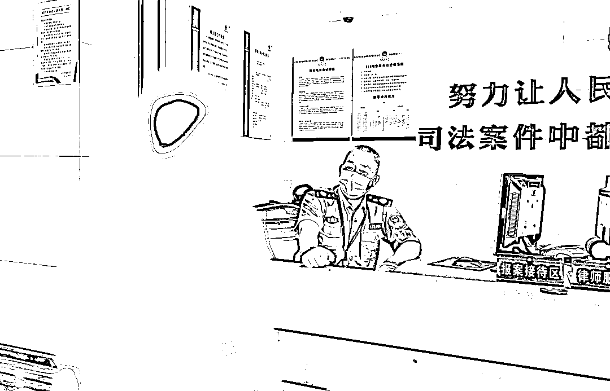
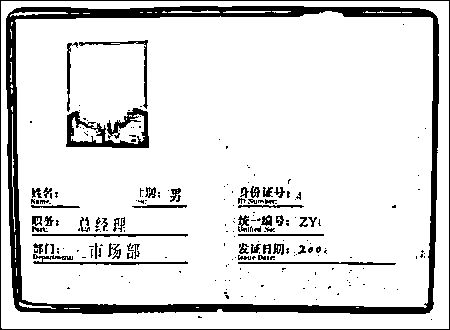
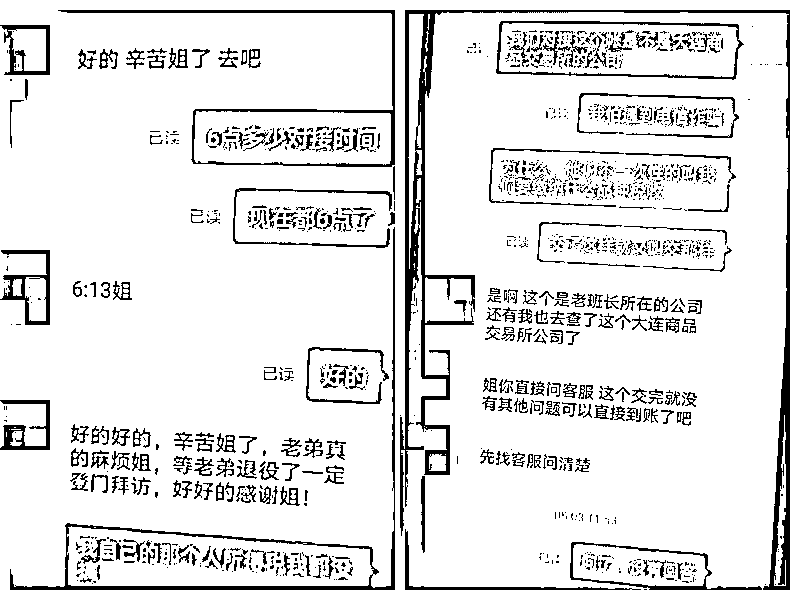
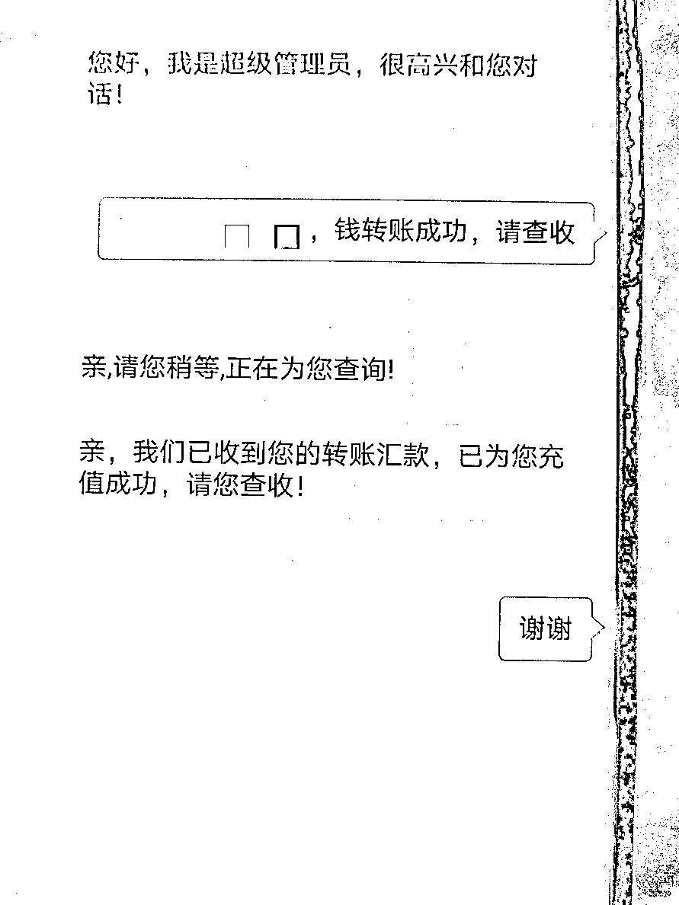

# 7 天骗了 38 万元！19 岁小伙在电诈窝点经历堪比电影情节……

> 原文：[`mp.weixin.qq.com/s?__biz=MzIyMDYwMTk0Mw==&mid=2247523416&idx=2&sn=0f8bef67280a61d3e31326130daa563e&chksm=97cb5760a0bcde764db3559db70c308a9cf08700163228af7657fcf97952953fa96c29cf4da8&scene=27#wechat_redirect`](http://mp.weixin.qq.com/s?__biz=MzIyMDYwMTk0Mw==&mid=2247523416&idx=2&sn=0f8bef67280a61d3e31326130daa563e&chksm=97cb5760a0bcde764db3559db70c308a9cf08700163228af7657fcf97952953fa96c29cf4da8&scene=27#wechat_redirect)

贵州小伙许超（化名）在网上找了一份“高薪”工作，匆忙赶赴云南，不料却被拉入一个境外电信诈骗团伙，成为了他们的帮凶。

幸亏他迷途知返，逃离诈骗组织。

之后他跋山涉水，一路担惊受怕开始逃亡之路，历经坎坷，直到找到警方坦白一切，他才感到了前所未有的安全感......

这样电视剧里才有的情节，竟然在现实中发生了！

**以为找到了好工作，结果却被骗到了缅甸**

今年 19 岁的许超高中没毕业就辍学从贵州来到了宁波打工。初入社会的他，既没经验又没学历，工作并不好找。

无意间，他在网上看到了一则招聘广告，“客服员，月薪 1-2 万，初中学历，地点云南”。

高薪诱惑之下，小许通过网络与招工方取得了联系。

得到对方回应后，小许迅速赶赴云南。在机场，小许见到了招工方的联系人，对方把他带到了一个旅馆暂住了下来。

等了好几天，他终于见到了一个自称是他“上级”的人，对方派了一辆小面包车接上小许，说是带他去公司入职。

“车走的大多都是山路，十分颠簸！当时感觉到有些不对，但是想想这份工作还不错，作为一个还没入职的新人我就不敢多嘴了。”

下车翻越一段荒坡后，他们到达了目的地，通过这位“上级”之口，小许才知道自己非法穿越边境线来到了缅甸。

之后，他被带到一个公司，没收了手机，开始接受公司的“魔鬼培训”。

这时候的小许才彻底明白自己即将成为了犯罪团伙的帮凶，而且处境十分危险！

**伪装身份操作“杀猪盘”，7 天骗了 38 万元**

“他们没收了我自己的手机，给了我一台公司的工作机。工作内容就是在各类社交软件中，把自己伪装成一个‘高富帅’、成功人士等，上网寻找 30-50 岁之间的女性聊天，以男女朋友、姐弟关系为突破口，把她们骗到虚假 APP 上投资理财。”

“整个公司都是此起彼伏的电话声音与键盘敲击声，如果没有完成任务，就会遭到殴打！”

小许向警方描述，在公司期间，他以成功人士的身份，在网上认识了一名余姚的张女士。

“公司有专门的一套‘话术’，我们按照上面的套路跟‘客户’聊天。”大概用了两三天时间，小许就与对方聊成了姐弟关系。

因为是初级员工的关系，负责把关系建立和稳定后，他就需要把“客户”移交给了自己的“上级”。

随后，小许的“上级”继续跟进。

(犯罪团伙使用的虚假身份信息)

（聊天记录）

（转账记录）

几天后，小许从“上级”和同事的聊天中得知了张女士被骗 38 万的情况。

“在这里的每天都是煎熬，不仅内疚而且一直心惊胆战，他们每天都会给我们布置‘任务’，还会查看聊天记录，完不成‘任务’就要被打，我被他们打过四五次”。

于是，小许一面配合着公司的安排，一面计划着出逃。

**出逃之路，困难重重**

在公司“老老实实”待了一段时间，小许终于让“上级”放松了警惕。

一次同事外出聚会，小许终于找到了机会，他借着上厕所的功夫，逃了出来。

逃出来后，他第一时间买了一个手机，一边联系家人，一边翻山越岭寻找回国的办法。 

“回国的路异常艰辛，因为要躲避诈骗团伙的眼线，不敢乘坐交通工具，只能靠步行。逃亡的那几天，几乎不敢睡，睡着了也会做恶梦吓醒。”

找工作被骗、逃离、躲藏、隔离、自首，近四个月的噩梦终于结束了。看到祖国的警察叔叔，小许紧绷的神经终于放松了下来，“回国真好，见到警察真好！”

一番询问调查后，云南警方发现小许参与诈骗的其中一个受害人信息与我市警方正在调查的一个诈骗案件信息十分吻合，随后通过公安部联系到我市公安局刑侦大队反欺诈中心，根据案件来源，反诈中心民警和低塘派出所民警一起去到云南将小许带到了余姚。

在低塘派出所，小许将自己的经历和盘托出，对于自己的无知行为，他感到后悔不已。

据民警介绍，虽然小许并未直接去实施诈骗，而且有投案自首行为，但是根据情节也将受到法律的惩罚。

来源：我在柬埔寨

← 向右滑动与灰产圈互动交流 →

