# 为什么所有的 app 都想给我借钱？？？

> 原文：[`mp.weixin.qq.com/s?__biz=MzIyMDYwMTk0Mw==&mid=2247523416&idx=5&sn=5e63bf23b0753c478ddc8a30c02a13fe&chksm=97cb5760a0bcde7624d6ef89e3a4ce7cc3b2724881f8ccbd7672f5fe4e825670efe95d9f30d2&scene=27#wechat_redirect`](http://mp.weixin.qq.com/s?__biz=MzIyMDYwMTk0Mw==&mid=2247523416&idx=5&sn=5e63bf23b0753c478ddc8a30c02a13fe&chksm=97cb5760a0bcde7624d6ef89e3a4ce7cc3b2724881f8ccbd7672f5fe4e825670efe95d9f30d2&scene=27#wechat_redirect)

被双 11 尾款掏空了钱包的我，猛然发现，很多 app 都贴心地想要借钱给我。

打开搜狗输入法，有搜狗借钱：

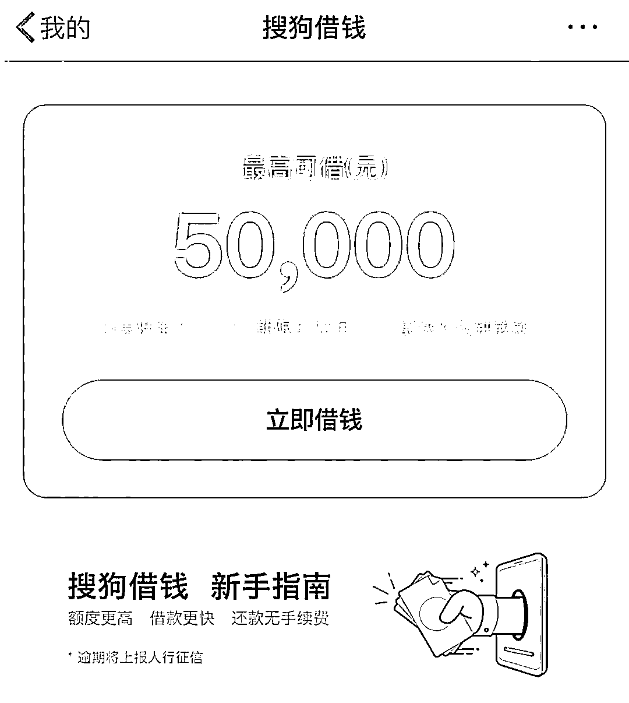

看新闻也可以借钱，今日头条有放心借：

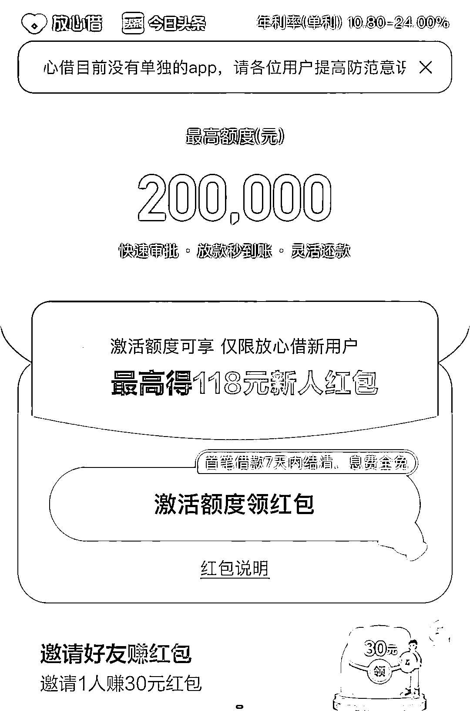

最离谱的是，居然连 WPS 都能借钱。

**感觉它仿佛在对我说：“写稿累了吧，阅读量也上不去，10 万拿去别上班了！”**

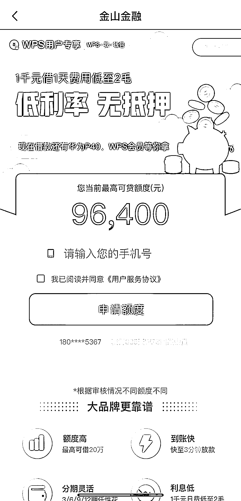

工作累了想吃饭，饿了么送来了 10 万伙食费：

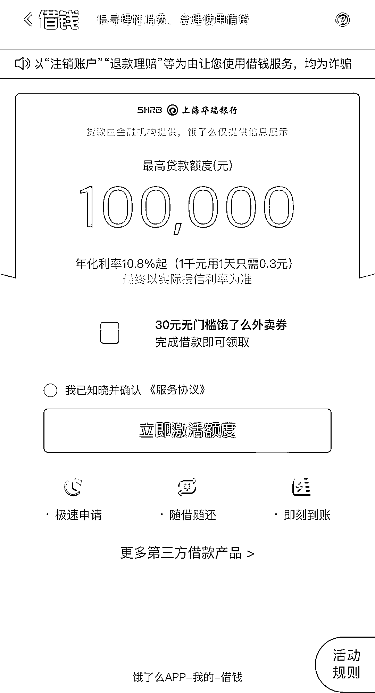

修图不如整容，美图秀秀也能借钱花：

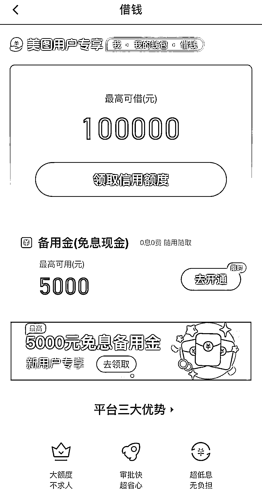

购物钱不够了，唯品会有唯品花：

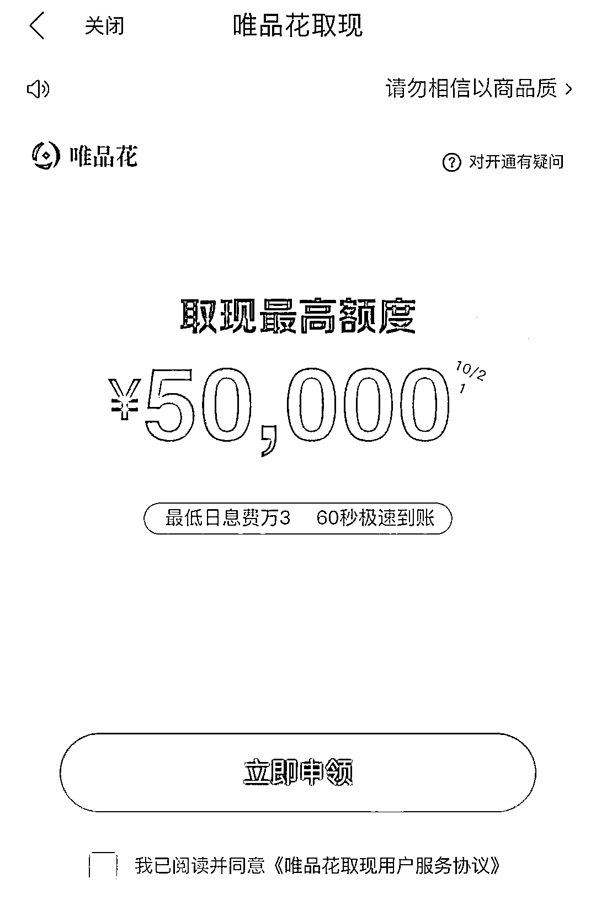

看个综艺也能借钱，芒果 TV 有芒哩好贷，领取额度就能获得芒果 TV 会员：

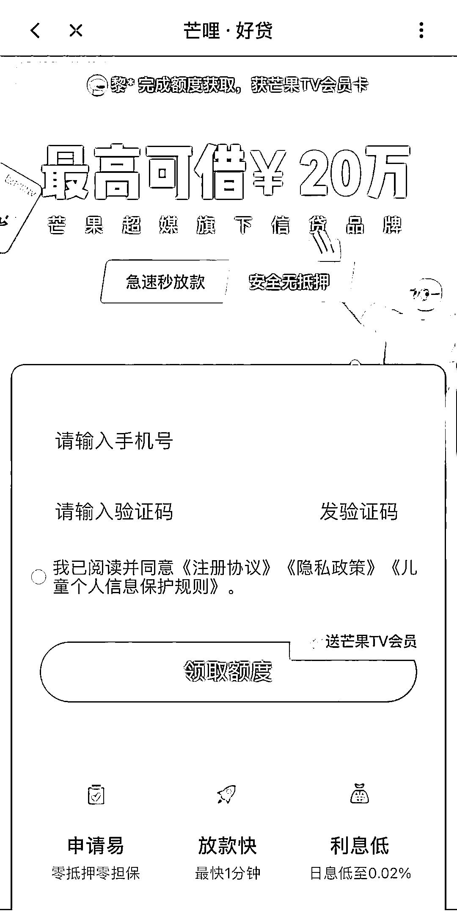

**爱奇艺是最绝的，一个页面包含了 5 个借贷广告，还都不是同一家。** 

1 号是爱奇艺自己的小芽贷，2 到 5 号分别是翼支付借贷平台、众安小贷、（第二个）翼支付借贷平台和京东金融。

好家伙，借起钱来连同行忌讳都顾不上了，一股脑地全排在一起上广告。

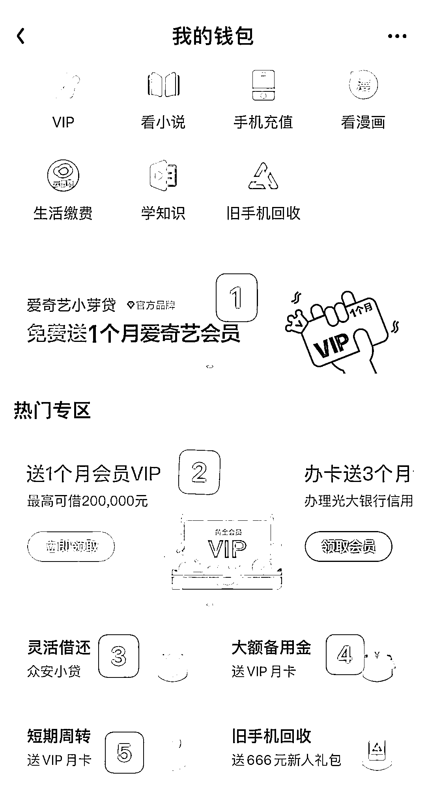

顺丰 app 不仅能发快递，还能直接在 app 投资理财，这是要帮我实现财富自由啊！

好家伙，我直接就是一个好家伙。

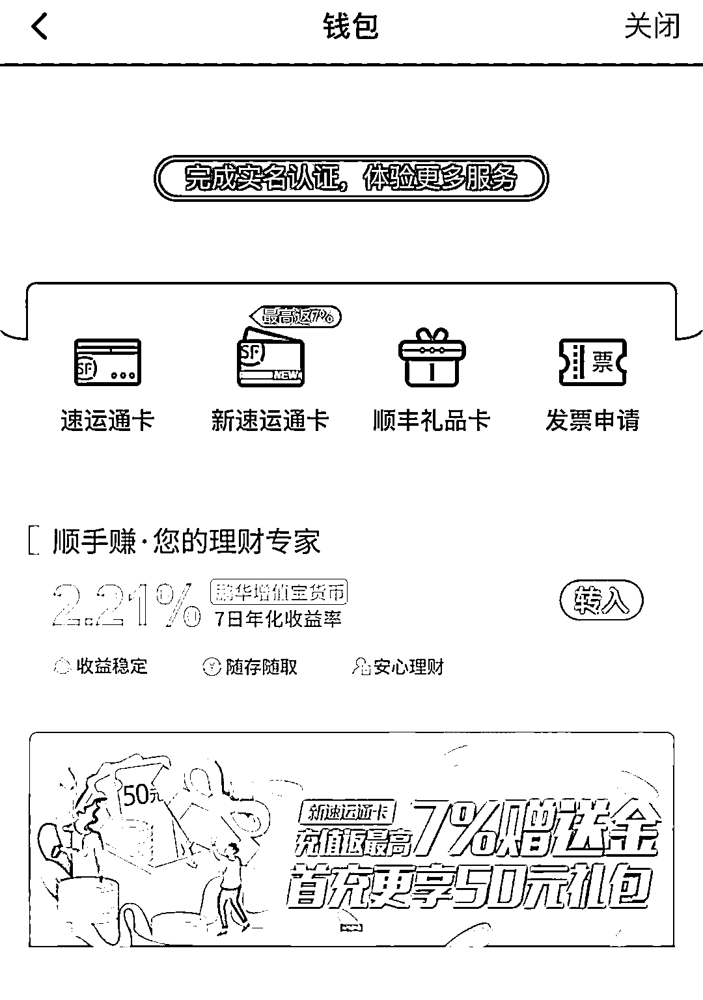

还有早就被人吐槽过的滴滴金融业务，app 每天推送的内容只有两种： 

**1、快来当司机；**

**2、快来借钱。**

这是既授人以鱼还授人以渔啊……

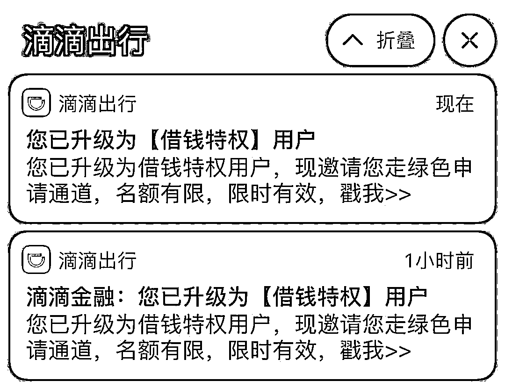

从办公到娱乐，从出行到饮食，每一个类型的 app 都在操心我的钞票，真的是费心了。

秒速到账、0 门槛、马上用钱、超低利息，天花乱坠的广告词让很多本来没有借贷需求的人都深受诱惑。 

但是世界上哪有天上掉馅饼的事情呢？

**第一坑：超高年化率**

在宣传语中，每个网贷产品都声称自己的利息全网最低。

但是在还贷的时候你就会发现，**极少数平台才能做到和自己所说的一样**。 

在黑猫投诉平台上，有用户投诉说某平台的年化率高达 45.79%……

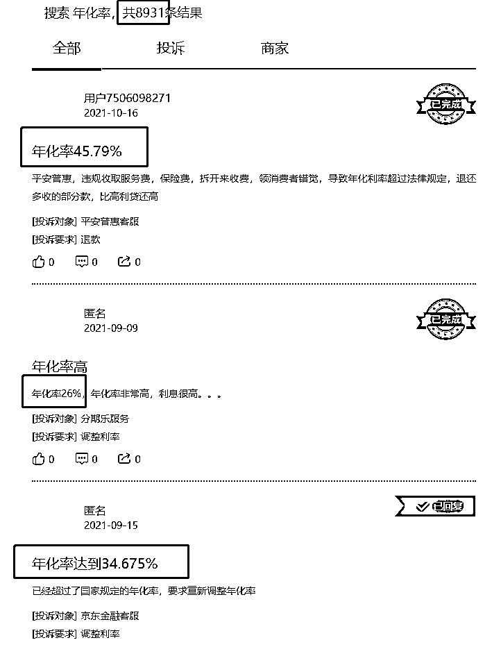

**第二坑：个人隐私泄露**

app 借钱有多快？ 

搜狗借钱宣传“最快 30 分钟放款”；

美图秀秀声称“最快 5 分钟到账”；

芒果 TV 的芒哩·好贷称，“最快 1 分钟放款”。

之所以能这么快把钱借给用户，那是因为**app 们对借款人的个人信息了如指掌。**

上文举例的一些借贷产品还都是被严格管控的大平台、大公司。 

还有一些小的借贷公司，**可能根本也没想把钱借给你，而是一步步地套取了你的个人隐私。**

有业内人士曾经透露说，一些中小借贷平台上为了追求利益，会把个人信息“打包”卖给第三方。

只要用户在一家借贷平台上申请过借款，**其他借贷平台的骚扰电话就会“蜂拥而至”。**

**第三坑：诈骗的温床**

一些审核不规范的借贷平台，已经成为了诈骗犯的“帮凶”。

还记得上半年很火的，新媒体小编被骗的案子吗？

这个受害者同行，就是被骗子一步步引导到借贷平台，然后**亲手把钱打进了骗子的账户**的。

案情回顾请点击链接：[侮辱性极强！编发无数电信诈骗新闻后，小编我竟被骗 5 万……](https://mp.weixin.qq.com/s?__biz=MjM5ODA4OTIyMA==&mid=2651785059&idx=1&sn=8f2f369a3a957e13a1d5c5d06fd1f73e&chksm=bd2ba0088a5c291ebee906b3b55c0c0bf81ad54b0e084c2f0a5a4b0800275fb59ced3b9b4bd8&scene=21#wechat_redirect)

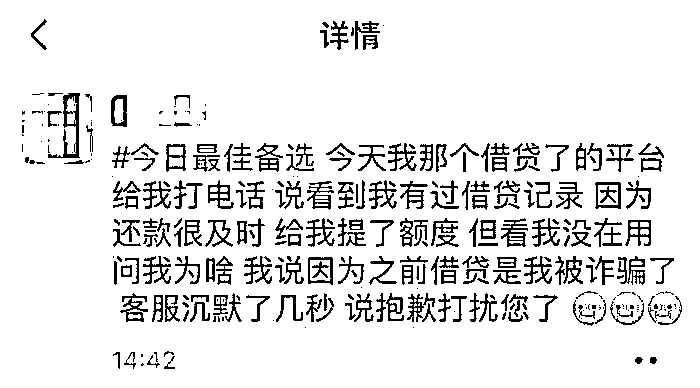

有些朋友觉得：只要我没钱，骗子就骗不到我的头上。 

不存在的！

**骗子会一步步诱导你借钱打给他！** 

更有甚者，是根本不存在的借贷平台。假冒的微粒贷 app，不仅借不到钱，还会让你血本无归。

比如说这位陈女士，下载了一款名叫“微粒贷”的 app，通过“客服人员”的一步步引导，准备去银行给对方汇去 3 万块钱。

好在陈女士想起了反诈防骗的宣传，跑到派出所去询问警察，才避免了一场惨剧的发生。

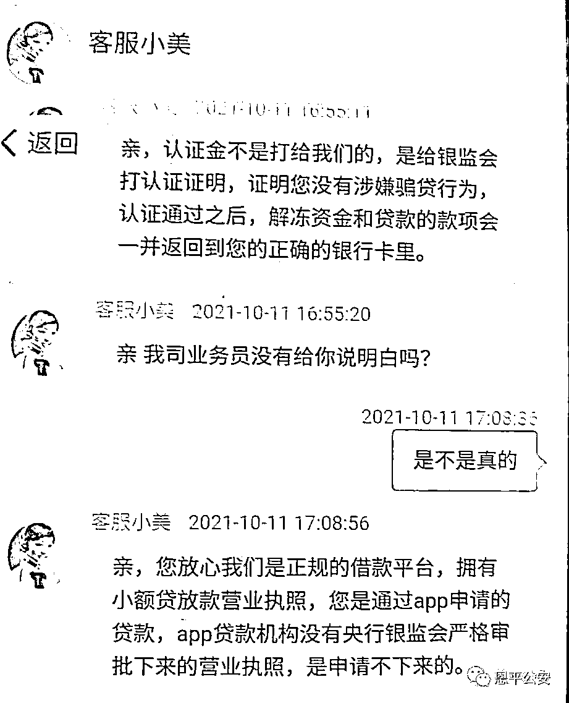

类似的案子还真不少：

> 9 月 21 日，云浮市一男子浏览网页时点击广告下载了“微粒贷”App，按照“客服”指引多次转账，共被诈骗 46 万余元；
> 
> 8 月 18 日，梅州市温某在“微粒贷”App 上贷款，对方以输错银行卡卡号为由让温某缴纳保证金，温某共被骗 5000 元；
> 
> 8 月 14 日，梅州市罗某通过“微粒贷”App 申请贷款，后被客服以需先缴交保证金等理由要求转账，导致罗某被骗 1 万元。

公安部门一再强调，**微粒贷没有官方 app。**

千万别上当！

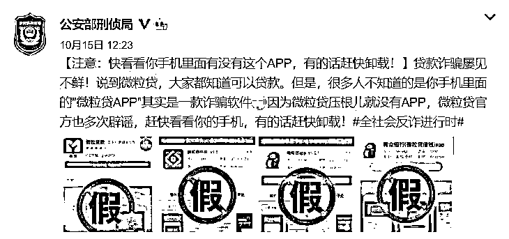

最后，我还想跟大家唠唠借钱这件事。

前段时间，中银消费金融推出《当代青年消费报告》，其中有一组数据显示：

**全国有 1.75 亿 90 后，其中只有 13.4%的年轻人没有负债，而 86.6%的 90 后都接触过信贷产品。**

这个数字是非常惊人的。 

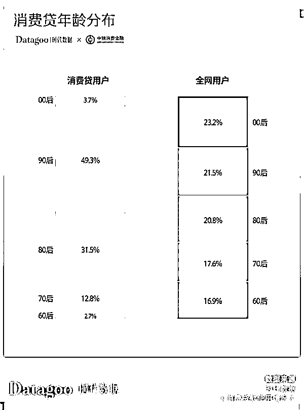

《鱿鱼游戏》大家都看了吧。

456 个负债累累的底层人被聚在一起，通过激烈地厮杀角逐出最终获得巨额奖金的人选。

**有很多网友表示，之所以这么有共鸣，就是因为在这个剧中看到了自己的影子——**

**那个欠了债的人。**

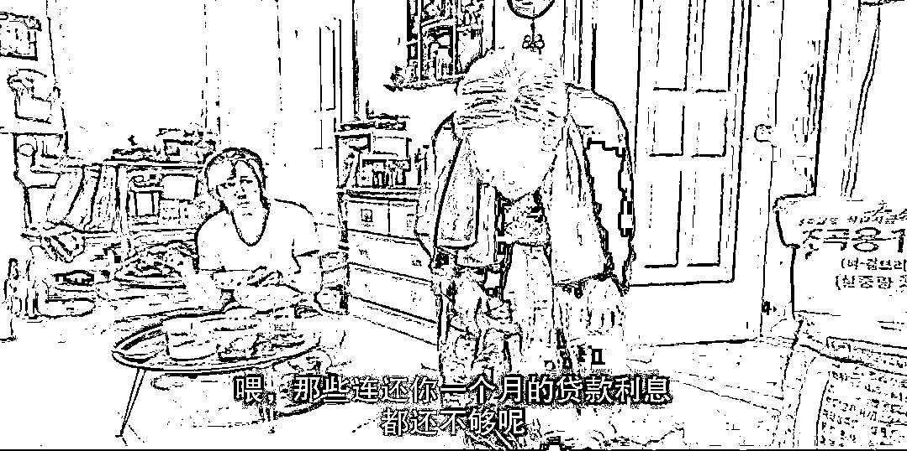

科技确实发达了，之前要拿着房产证作抵押才能去银行贷到款，现在只要有点“信用值”，就能搞到一笔小额贷款了。

**但是，用明天的钱买今天的快乐，这样的快乐又能持续多久呢？** 

****

****提示**：理性消费，避免透支，如果确实因为工作生活周转需要贷款，请通过正规平台借贷。**

← 向右滑动与灰产圈互动交流 →

