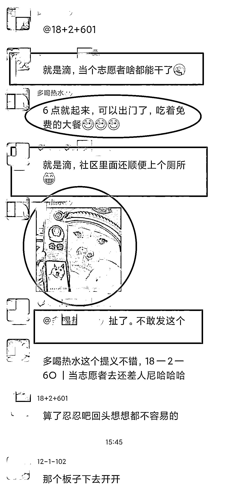

# 网友在微信群发"狗狗表情照"被指辱警：寻衅滋事拘 9 天

> 原文：[`mp.weixin.qq.com/s?__biz=MzIyMDYwMTk0Mw==&mid=2247523416&idx=6&sn=23488db1c27f3fe5520618ae8da6db85&chksm=97cb5760a0bcde76d286b9e6352372067811a37a1b7d2ae00898dd739083f6787282940cf0eb&scene=27#wechat_redirect`](http://mp.weixin.qq.com/s?__biz=MzIyMDYwMTk0Mw==&mid=2247523416&idx=6&sn=23488db1c27f3fe5520618ae8da6db85&chksm=97cb5760a0bcde76d286b9e6352372067811a37a1b7d2ae00898dd739083f6787282940cf0eb&scene=27#wechat_redirect)

**疫情就是命令，防控就是责任。**

新一轮疫情防控阻击战打响后，青铜峡公安民警、辅警舍小家、为大家，不惧危险，不舍昼夜，坚守在疫情防控第一线，努力为人民群众生命安全和身体健康。

筑起一道安全屏障然而，却有个别人因对疫情防控不满，甚至公然侮辱警察。对此类违法行为，青铜峡公安始终坚持“零容忍”，坚决依法快速惩处，捍卫民警执法权威和法律尊严。

[`mp.weixin.qq.com/mp/readtemplate?t=pages/video_player_tmpl&action=mpvideo&auto=0&vid=wxv_2117704990185095169`](https://mp.weixin.qq.com/mp/readtemplate?t=pages/video_player_tmpl&action=mpvideo&auto=0&vid=wxv_2117704990185095169)

2021 年 10 月 30 日 18 时许，城关派出所民警接到群众举报，有人在微信群里面发送侮辱人民警察的信息。获此信息后，城关派出所迅速组织警力进行调查。经查：违法嫌疑人李某因对小区疫情管控不满，在 330 余人的微信群里配发了一张侮辱人民警察的照片，公然对警察的形象进行侮辱。民警依法将李某传唤至派出所，经讯问，其对在微信群里侮辱人民警察的违法事实供认不讳。

李某的行为已构成寻衅滋事，根据《中华人民共和国治安管理处罚法》规定，青铜峡市公安局依法对李某予以行政拘留九日的处罚。

来源：观察者网

← 向右滑动与灰产圈互动交流 →

