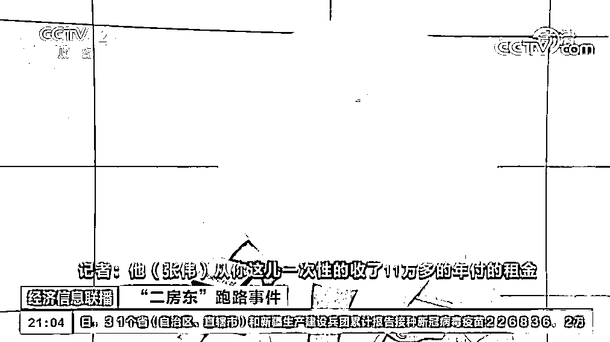
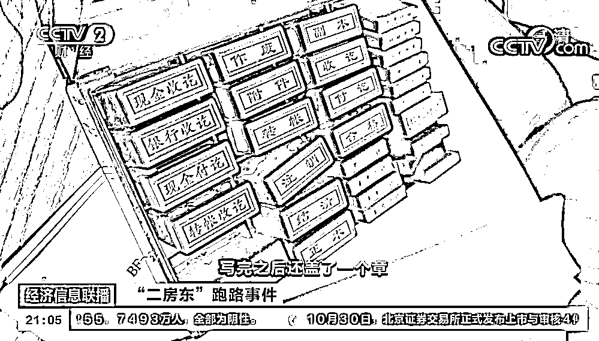
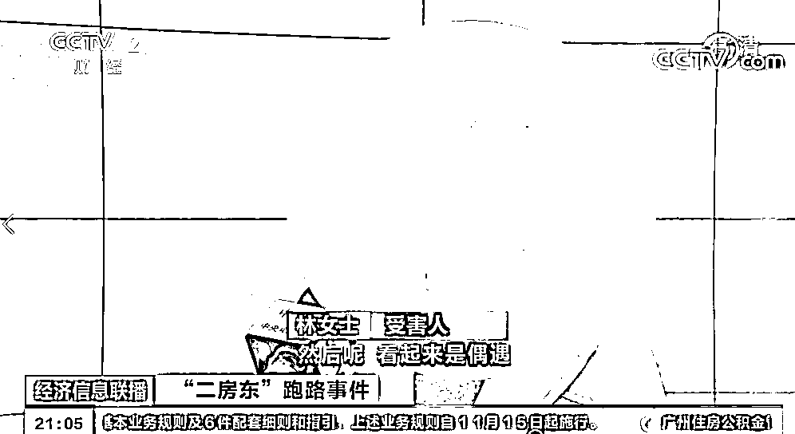
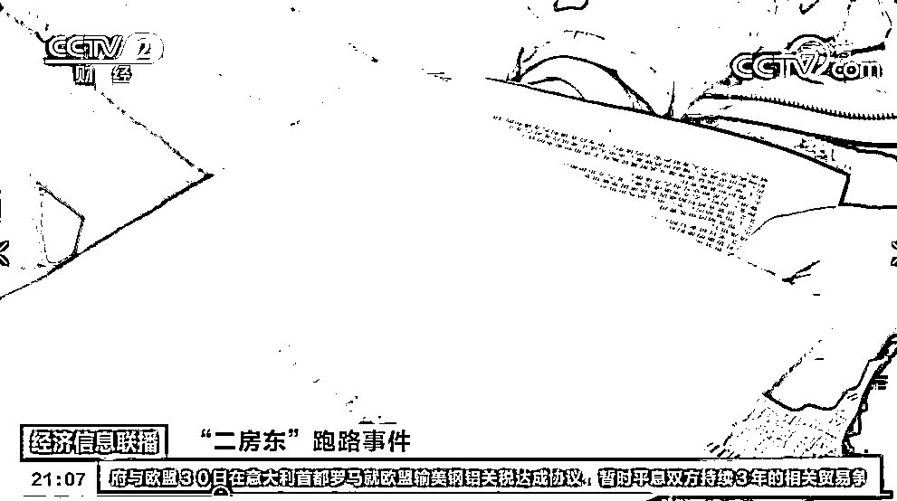
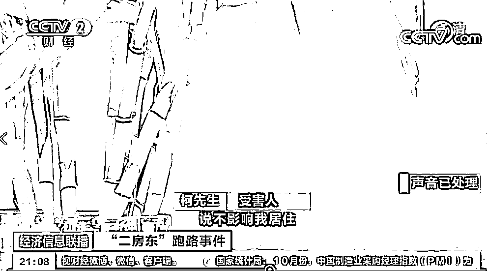
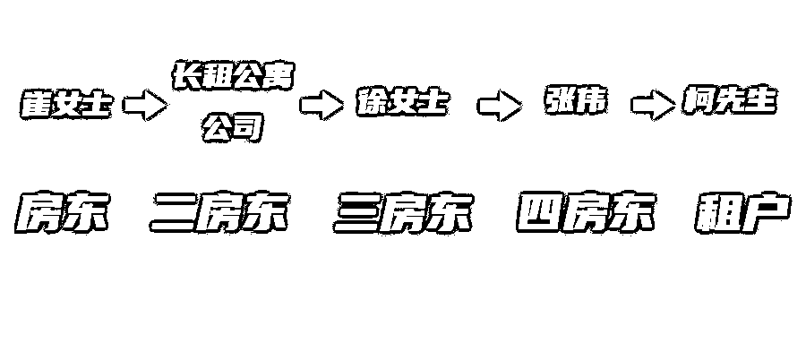

# 这房子，到底是谁的？

> 原文：[`mp.weixin.qq.com/s?__biz=MzIyMDYwMTk0Mw==&mid=2247523416&idx=7&sn=f49f7f3765adb15566a1447e3d2a60b6&chksm=97cb5760a0bcde7676ac55a55f37bbe8c930cb2e4efa5ee754a2621ce565f3401a7c01ce68fe&scene=27#wechat_redirect`](http://mp.weixin.qq.com/s?__biz=MzIyMDYwMTk0Mw==&mid=2247523416&idx=7&sn=f49f7f3765adb15566a1447e3d2a60b6&chksm=97cb5760a0bcde7676ac55a55f37bbe8c930cb2e4efa5ee754a2621ce565f3401a7c01ce68fe&scene=27#wechat_redirect)

## 

近几年

长租公寓跑路

租客租金被卷走的事件频繁发生

最近在北京

一个名叫张伟的假房东

以令人眼花缭乱的骗术

让 100 多名受害者上当受骗

目前

警方已经受理了部分受害者的报案

落入骗局租客入住 5 天即被清退

[`mp.weixin.qq.com/mp/readtemplate?t=pages/video_player_tmpl&action=mpvideo&auto=0&vid=wxv_2116776695130095617`](https://mp.weixin.qq.com/mp/readtemplate?t=pages/video_player_tmpl&action=mpvideo&auto=0&vid=wxv_2116776695130095617)

不久前，林女士以每月 9100 元的价格，一次性付给“房东”张伟全年租金。

签约后，张伟告诉林女士，上一位租客不准备退租了，要给林女士换一套房。

因为已经签了约交了钱，林女士只能答应张伟。

****

然而在新房子里只住了一个星期，中介公司员工突然上门。**原来，这套房子根本不是张伟的，是从中介公司租来的，**而他只付给原房东三个月的租金。

因为连合同都没签署，林女士只能从房子里搬出来重新找房。

套路满满假房东刻意布局引租客上当

签约过程中发生的一个小插曲，让林女士觉得张伟套路满满。

林女士：我们在楼下的一个咖啡厅签约，他手上拿了好几套已经签完的合同。就觉得他手上有很多房源，他当场给我们写了一个收据，还盖了一个章。

签约的时候，聊着聊着来了一个大姐，她对张伟说，哟你怎么在这儿。然后就对着我们说，这个房东真的太好了，他简直是“中国好房东”。

林女士说，她签合同那套房子里的租客，同样被张伟骗了。

目前，那套房子涉及的中介公司表示将承担上一位租客的全部损失。但林女士住了 5 天的这套房子压根就没签约，连维权该找谁都不知道。

**冒充房东的身份**

**把一套房子租给很多个人**

从租客手中收取一年租金后又利用时间差

假装给租户重新租一套房子

最终把损失嫁祸给其他房东

在该案件中

骗局还绝不仅止于此

四房东卷款跑路

三房东连夜上门清退租客

[`mp.weixin.qq.com/mp/readtemplate?t=pages/video_player_tmpl&action=mpvideo&auto=0&vid=wxv_2116777300770816004`](https://mp.weixin.qq.com/mp/readtemplate?t=pages/video_player_tmpl&action=mpvideo&auto=0&vid=wxv_2116777300770816004)

10 月 20 日以来，居住在北京望京某小区的柯先生不断受到一群人的上门骚扰。带头的女士姓徐，自称是这套房子真正的租客。

柯先生说，他是 2019 年 11 月以 5300 元的月租金从张伟那里租下这套房子的，根本就不认识徐女士。

经了解，**原来徐女士三年前就把房租给了张伟****，**但是这段时间，张伟并未按时给徐女士租金，徐女士说，张伟已经欠了他 10 多万元。

徐女士的出现，让柯先生回忆起去年几次奇怪的经历：去年 4 月份，一位自称是房东的崔女士和一名长租公寓管家上门找过一次柯先生。

后来，柯先生从小区物业那得知，**真正的房东其实就是崔女士。**得知实情后，柯先生又去找了张伟。

**柯先生：****张伟说这是他们之间的房屋产权纠纷，不影响我居住。因为我已经交了一年的房租，也不想给自己找更多麻烦，就继续住了下来。**

乱了？

一图帮您梳理一下

在柯先生和张伟签订租房合同之后

**真实的房东崔女士**

**二房东长租公寓公司**

**以及经营民宿的三房东徐女士**

**接连出现**

这个时候柯先生才发现

张伟根本就不是这套房子的房东

而是层层转租之后的四房东

沿着这样一条层层嵌套

环环相扣的转租链条

像柯先生这样的受害人

一共有 5 位

**低租金、打时间差、房租年付**

这些在过往的长租公寓

“跑路事件”中上演的伎俩

被张伟再次利用

而对于很多租房人来说

一个精心编织的骗局就像一个漩涡

从他们看房签约之初就把他们卷了进去

律师解读

[`mp.weixin.qq.com/mp/readtemplate?t=pages/video_player_tmpl&action=mpvideo&auto=0&vid=wxv_2116848585332883459`](https://mp.weixin.qq.com/mp/readtemplate?t=pages/video_player_tmpl&action=mpvideo&auto=0&vid=wxv_2116848585332883459)

央视网记者：房东与二房东之间的关系是否受法律约束？ 

赵琮律师：根据法律规定，如果在房东与二房东之间的租赁合同中明确约定，允许二房东将房屋转租给第三人，或者房东知道二房东将房屋转租而没有明确表示反对的，那么二房东与租客之间的转租合同就是有效的合同，房东的权利就会受到二房东与租客之间转租合同的限制，不能收回房屋。反之，如果二房东未经允许私自将房屋转租，那转租合同就不能限制房东的权利，房东有权收回房屋。

央视网记者：如果遇到二房东跑路，房东和租客该如何维权？

赵琮律师：房东在强制收房时往往会受到租客的抵抗，容易引发社会事件。对此，双方可试着坐下来友好协商、统一战线，共同追究二房东的违法违约责任。毕竟房东与租客都属于受害者，不建议双方站在对立面上进一步激化矛盾。双方可通过各退一步的方式重签合同，房东可适当降低租金，将双方的损失降至最低。

如果诉诸法律的话，从房东的角度出发，可通过报案追究二房东的刑事责任，通过主张合同违约追究二房东的民事责任，通过主张返还原物请求权、支付房屋占有费用、支付财产损坏赔偿金来追究租客的相关民事责任。

从租客的角度出发，也可通过报案追究二房东的刑事责任，通过主张合同违约追究二房东的民事责任，来要求退还已支付的租金。

央视网记者：中介强硬驱赶租客是否涉嫌侵权？

赵琮律师：如果二房东未经允许私自将房屋转租，那么租客与二房东之间签订的租房协议就对房东没有效力。此时，中介作为房东的委托管理人，就有权代替房东收回房子。

但如果中介在收回房子的过程中损毁了租客的财产，或者对租客造成人身伤害，就应该承担相应的侵权责任。

来源：央视网综合《经济信息联播》栏目、央视网快看、中国青年网微信

← 向右滑动与灰产圈互动交流 →

