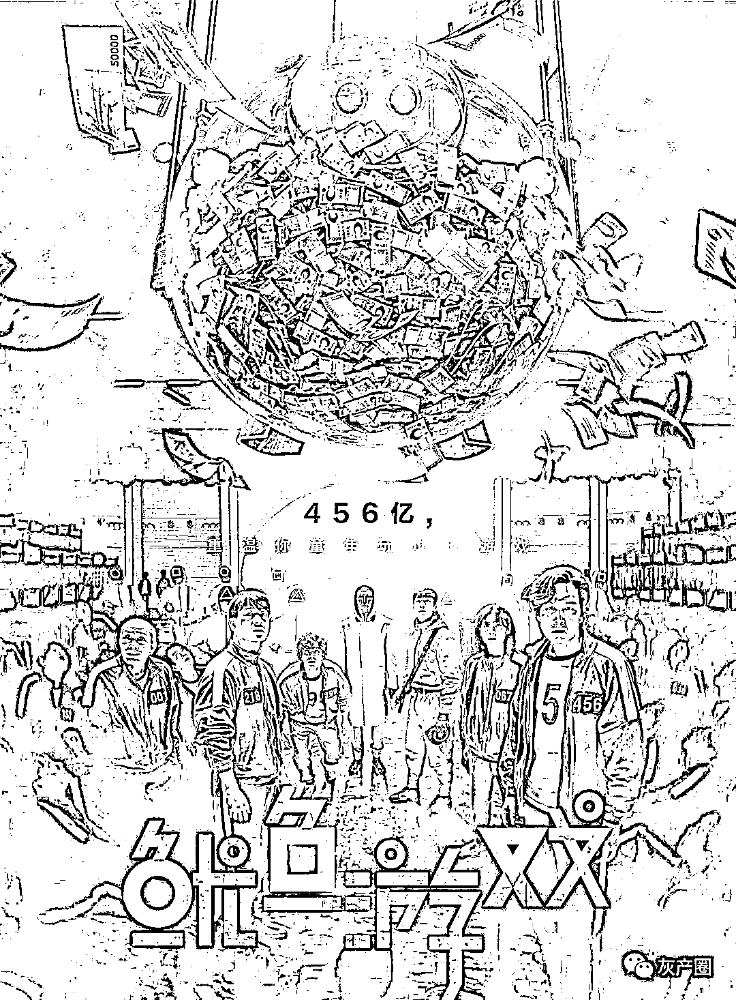
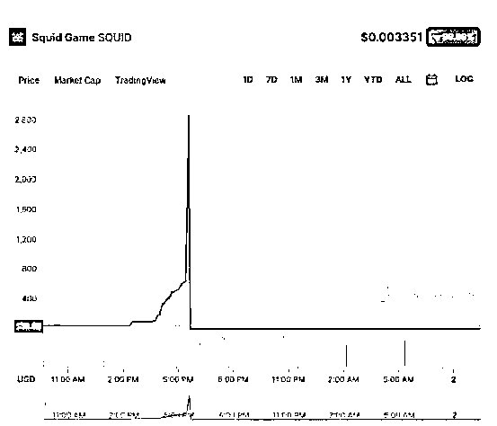
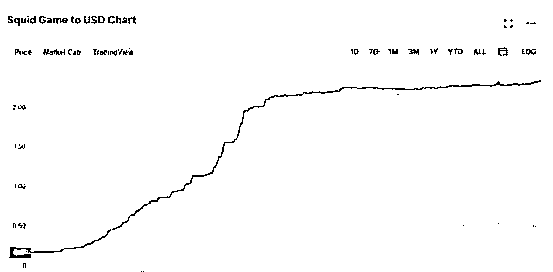
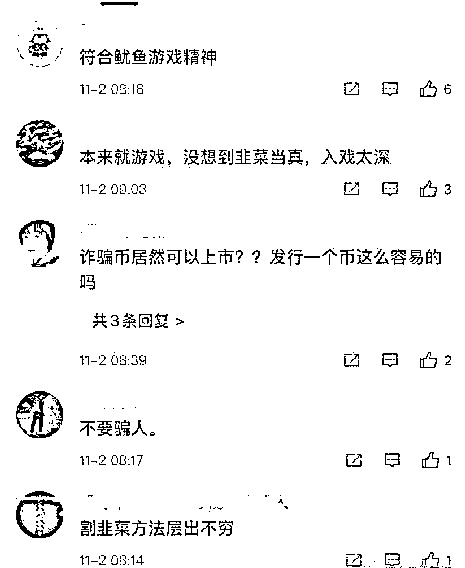
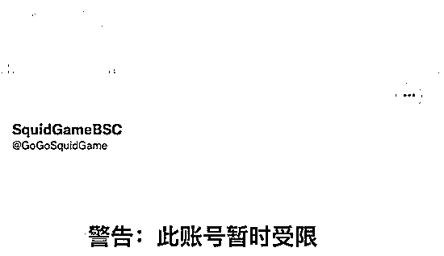

# 鱿鱼游戏催生的“鱿鱼币”到底是个啥？5 分钟直接跌没！

> 原文：[`mp.weixin.qq.com/s?__biz=MzIyMDYwMTk0Mw==&mid=2247523513&idx=4&sn=a65c66a62b8457ecac04c94e382d6af7&chksm=97cb5781a0bcde97e90eabd7334bb4024bdad0255b10bacff95f57843acdd4159717a51e64e0&scene=27#wechat_redirect`](http://mp.weixin.qq.com/s?__biz=MzIyMDYwMTk0Mw==&mid=2247523513&idx=4&sn=a65c66a62b8457ecac04c94e382d6af7&chksm=97cb5781a0bcde97e90eabd7334bb4024bdad0255b10bacff95f57843acdd4159717a51e64e0&scene=27#wechat_redirect)

奈飞（Netflix）出品的网剧《鱿鱼游戏》催生的名为“SQUID（鱿鱼币）”的恶搞加密货币（meme coins）于美东时间 11 月 1 日闪崩。

根据虚拟货币追踪网站 CoinMarketCap 数据显示，“鱿鱼币”5 分钟内从每个币 2861 美元跌到了 0.0007 美元，跌幅为 99.999976%。

而根据区块链跟踪分析平台 BscScan 数据，闪崩发生后仍有约 4 万人持有该虚拟币。 

SQUID 的白皮书称，SQUID 于 10 月 20 日开始预售，并且“1 秒内售罄”。

这款“鱿鱼币”于 10 月 29 日正式发行，发行价是每个币 1 美分，并于发行后 24 小时暴涨近 2400%，达到 2.22 美元，市值超过 1.74 亿美元。

“鱿鱼币”到底是个啥？

这款虚拟货币是一款与奈飞爆火全球的网剧《鱿鱼游戏》同名的游戏平台的独家代币。据悉，该平台模仿了剧中的六轮比赛，最终赢家获得的奖金将以这款刚刚发布的“鱿鱼币”的形式发放，比赛将在 11 月启动。

并且，尽管剧中大奖的上限为 3850 万美元，但这个虚拟游戏将不限制最终奖金的上限，也不限制参与者的数量。

规则是游戏玩家必须用“鱿鱼币”先支付一个预设价格才能参与每场游戏，有些回合还需要用户购买定制的非功能性工具，并在《鱿鱼游戏》项目的网站上出售。

每个回合的入会费由开发者（10%）和奖励池（90%）平分。另外，这个游戏还提供弹球池——与电视剧里的热门游戏相似——持有者可以通过押注来赚取 SQUID 代币。

闪崩早有预兆？

根据英国 BBC 报道，早在此币刚发行时，CoinMarketCap 就曾发出警告称，收到多个用户报告无法在 Pancakeswap 虚拟币交易所出售这种代币。

对于此次闪崩的背后原因以及此款币的开发者身份信息仍都不明确。目前，这款币的网站已经下线，与其关联的社交媒体账号也都已经暂停更新，其推特账号也已经拒绝接受直接站内信（DM）。

根据 CoinMarketCap 编辑 Yousra Anwar 称，恶搞加密货币的开发者一般都不会公布自己的身份。因此，一旦投资者察觉到资金动向异样，这些开发者可以逃过各个国家的监管和审查。

“鱿鱼币”的暴涨和闪崩显示了加密货币市场的不稳定和监管漏洞。目前，虚拟货币投资者认为这可能是一个被 Pancakeswap 内容总监 Molly Jane Zuckerman 称为“拉地毯”（rug pull）的骗局。

“拉地毯”骗局主要是指加密货币开发商毫无征兆地放弃一个项目，卷走投资者的资金，这是该领域一个典型的退出骗局。

V 博网友评论戏称，“符合鱿鱼游戏精神”、“割韭菜方法层出不穷”、“诈骗币居然可以上市？”等。

截至发稿，记者登录 Squid Game 的官网，显示页面已无法打开。该项目的多个社交媒体平台显示账号受限警告。

其开发者在电报群中表示将放弃该项目：“近期遭到黑客恶意攻击、试图接管官方推特和智能合约。我们努力保护它、但价格依旧不正常。Squid Game Dev 将不会继续经营该项目，我们对骗子感到沮丧且备感压力，将取消 Squid Game 的所有限制和交易规范， Squid Game 将进入社群自治的阶段。”

创始人卷款而逃

据媒体报道，该项目的发行方目前已经卷款跑路，投资者损失至少达 210 万美元。分析显示，项目的创始人使用 TornadoCash 协议隐藏交易细节，从而转移资金，并兑现了等值的币安币（BNB）。该地址目前已经被注记为“涉及骗局”。

在社交媒体上，有网友惊呼：“又见证了个跑路故事”，也有网友感慨“未来加密货币多半都会这样”“这个币本身就是场鱿鱼游戏”。

虚拟货币炒作存风险

虚拟货币，顾名思义就是指非真实的货币。今年 5 月以来，国内对于虚拟货币的监管政策持续收紧，对于虚拟货币交易的打击力度也在不断加大。

9 月 24 日，央行、银保监会、网信办、外汇局、最高人民法院和最高人民检察院等十部委发布的《关于进一步防范和处置虚拟货币交易炒作风险的通知》明确，具有非货币当局发行、使用加密技术、分布式账户或类似技术、以数字化形式存在等特点的虚拟货币，如比特币、以太币等所谓“稳定币”，均不具有与法定货币等同的法律地位，不能作为货币在市场上流通。

业内人士分析，炒作虚拟货币存在诸多风险，虚拟货币容易受到“马斯克式”的炒作，投资者在短时间内被“割韭菜”，从而蒙受巨大经济和财产损失等。

招联金融首席研究员董希淼强调，公众应充分认识比特币等虚拟货币的本质和风险，经受住诱惑，保护好钱包，不参与任何形式的交易、炒作活动。

来源：人生只需七次倍投

← 向右滑动与灰产圈互动交流 →

