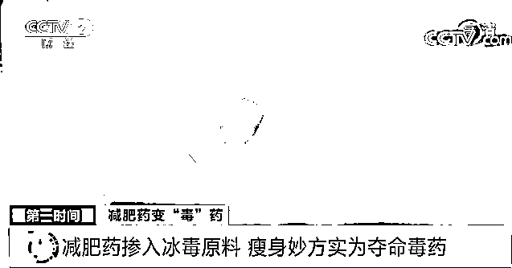

# 细思极恐！有减肥药掺冰毒原料？成本几十，卖上千！警方紧急提醒→

> 原文：[`mp.weixin.qq.com/s?__biz=MzIyMDYwMTk0Mw==&mid=2247523513&idx=5&sn=ee0aae51c61486601bea4933bfce147d&chksm=97cb5781a0bcde9796fa7fcee4f21dcb67f8a39d43a080057adf5ca9f10e1228ce83a92f37e7&scene=27#wechat_redirect`](http://mp.weixin.qq.com/s?__biz=MzIyMDYwMTk0Mw==&mid=2247523513&idx=5&sn=ee0aae51c61486601bea4933bfce147d&chksm=97cb5781a0bcde9796fa7fcee4f21dcb67f8a39d43a080057adf5ca9f10e1228ce83a92f37e7&scene=27#wechat_redirect)

眼下，市场上各种各样的减肥产品吸引着许多爱美人士，其中不乏有一些声称不用节食不用运动就能有效排油减肥的减肥药。这些减肥药真的靠谱吗？近日，黑龙江鸡西警方披露了一起减肥药掺入毒品的案件。

**减肥药掺入冰毒原料 瘦身妙方实为夺命毒药**

[`mp.weixin.qq.com/mp/readtemplate?t=pages/video_player_tmpl&action=mpvideo&auto=0&vid=wxv_2119401936763289604`](https://mp.weixin.qq.com/mp/readtemplate?t=pages/video_player_tmpl&action=mpvideo&auto=0&vid=wxv_2119401936763289604)

△央视财经《第一时间》栏目视频

今年 7 月，黑龙江省鸡西市鸡东县居民陶女士在网上买到了辽宁沈阳市一家公司生产的减肥药。

商家称，这款减肥药不含任何对身体有害的成分，而且瘦身效果非常明显。

**黑龙江省鸡西市鸡东县居民 陶女士：**我服用减肥药几天后，出现了头晕、恶心、睡不着觉等症状，家里人说是不是减肥药有问题，带我到医院检查，大夫就问是不是吸食过毒品。 

听到这样的提示陶女士马上来到鸡西市鸡东县公安局禁毒大队报了案，**民警立即对陶女士进行了尿检，结果成阳性。**

民警随后将陶女士提供的减肥药样品送到了中国医科大学司法鉴定中心进行成分检测。

黑龙江省鸡西市鸡东县公安局禁毒大队副大队长 潘凤君：经过鉴定这些减肥药中含有伪麻黄碱成分，伪麻黄碱是受有关部门管制的药品，也是制作冰毒的原材料之一。

****

**声称瘦身效果明显的减肥药怎么会加入管制品？又有什么效果？**

****黑龙江省鸡西市鸡东县公安局禁毒大队副大队长 潘凤君：伪麻黄素的药理作用，可以兴奋人体神经中枢，促进代谢，达到短期消瘦的效果，长期大量服用会造成人头晕、恶心、睡不着觉等症状，对身体伤害极大。****

******非法制售减肥药牟取暴利 犯罪团伙被警方捣毁******

 ****[`mp.weixin.qq.com/mp/readtemplate?t=pages/video_player_tmpl&action=mpvideo&auto=0&vid=wxv_2119401443966124034`](https://mp.weixin.qq.com/mp/readtemplate?t=pages/video_player_tmpl&action=mpvideo&auto=0&vid=wxv_2119401443966124034)

△央视财经《第一时间》栏目视频****

****警方调查发现，伪麻黄碱这种毒品易合成、成本低廉、加工成减肥药利润惊人，辽宁省沈阳市的黄某杰等人，便从境外将药品走私运至境内，用简陋的设备统一分装后，发货给全国的代理商和购买者，以此牟取暴利。****

********

********黑龙江省鸡西市鸡东县公安局禁毒大队副大队长 潘凤君：我们还发现铁力市的许某、刘某为减肥药的代理商之一，他们在沈阳市通过快递邮寄的方式将减肥药发货给减肥药购买者，广州市的黄某也是这些减肥药的代理商。这些减肥药成本也就几十元，到代理商手里四五百元，但是卖给消费者能达到千元以上。********

****************

********在掌握了这个犯罪团伙大量的证据后，9 月 15 日，专案组制定了详细的抓捕方案，决定在沈阳、广州和铁力三地同时行动，统一抓捕。********

**************犯罪嫌疑人 许某：为了挣点钱把自己害了，这个药比较好卖，我也不知道这药里含有什么违禁品，现在想想非常后悔。**************

**********目前，犯罪嫌疑人黄某杰等人因涉嫌非法买卖制毒物品罪被公安机关采取刑事强制措施，目前此案正在进一步审理当中。**********

********************

******************黑龙江省鸡西市鸡东县公安局禁毒大队副大队长 潘凤君：我们在选择减肥产品时一定要识别它的药物成分，另外要到正规药店去购买。千万不要购买没有任何批准文号的药品或者是保健品。******************

**********来源：央视财经（ID：cctvyscj）**********

********************

**********← 向右滑动与灰产圈互动交流 →**********

********************