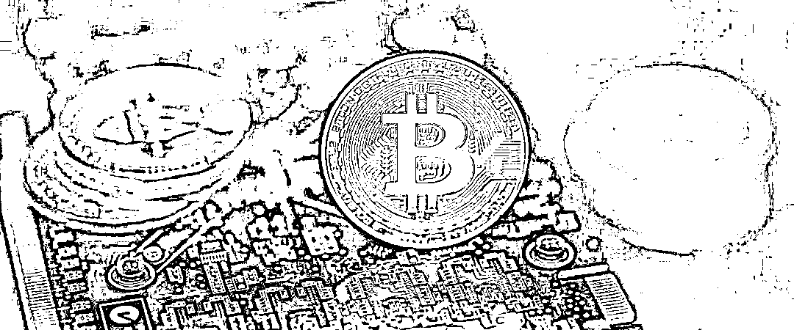
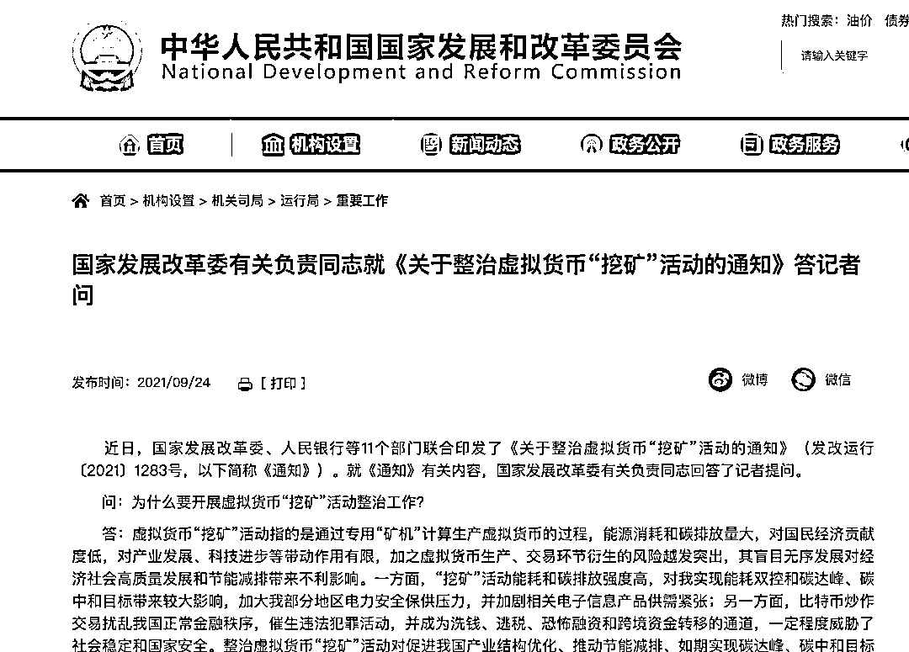
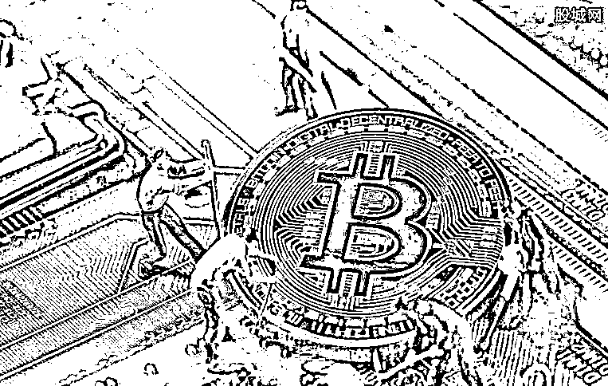
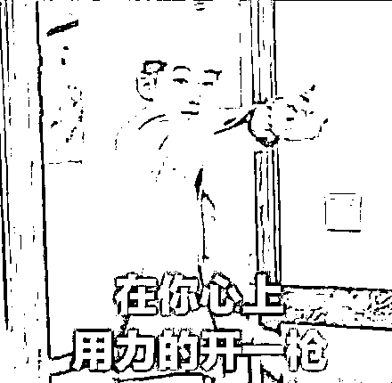
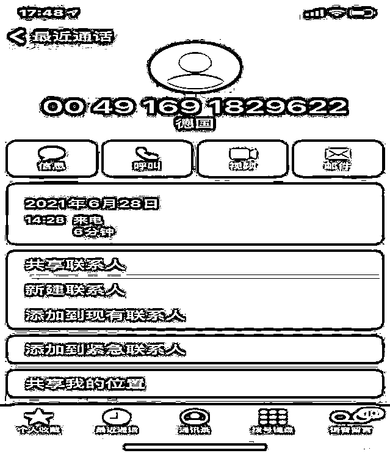
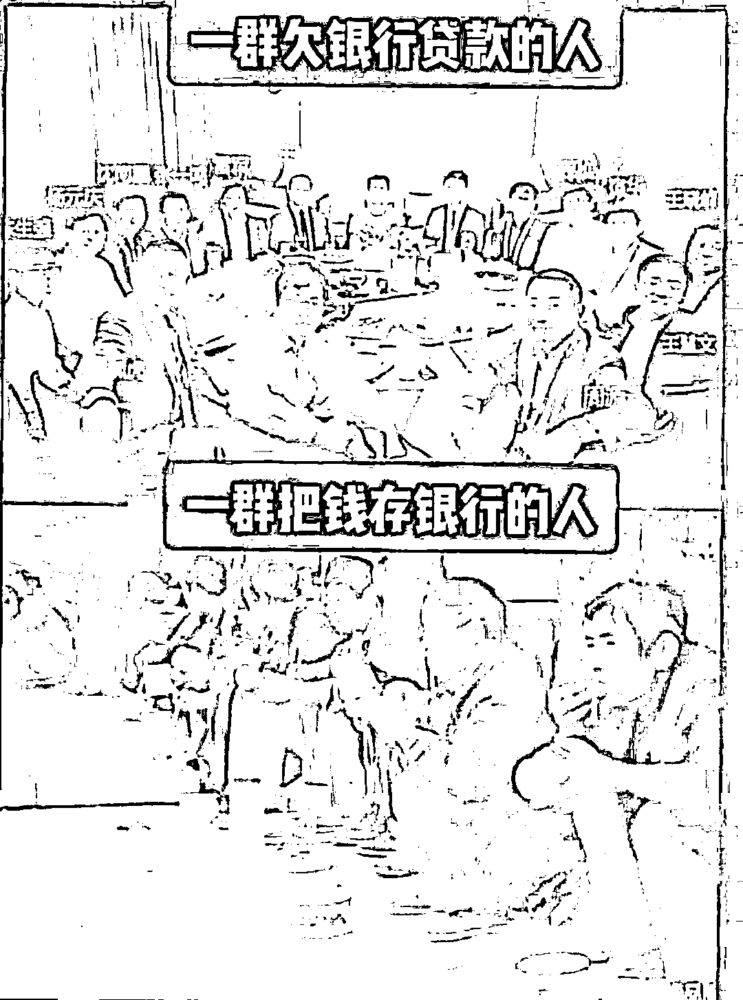
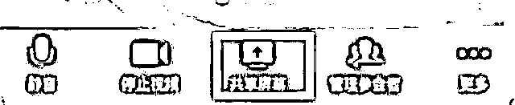
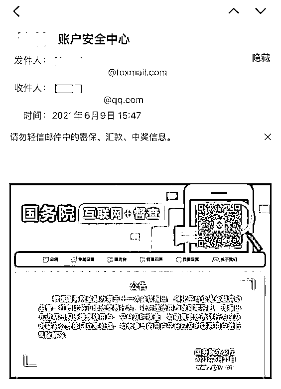

# 炒币挥金如土，生活缝缝补补

> 原文：[`mp.weixin.qq.com/s?__biz=MzIyMDYwMTk0Mw==&mid=2247523513&idx=6&sn=b24feb70a2fe5ac1df1f485089f7a9fb&chksm=97cb5781a0bcde9787accfb851b802c8c9696c52a7d95de7371128a726ff66b089ba57c2226d&scene=27#wechat_redirect`](http://mp.weixin.qq.com/s?__biz=MzIyMDYwMTk0Mw==&mid=2247523513&idx=6&sn=b24feb70a2fe5ac1df1f485089f7a9fb&chksm=97cb5781a0bcde9787accfb851b802c8c9696c52a7d95de7371128a726ff66b089ba57c2226d&scene=27#wechat_redirect)

今天，想跟大家聊聊**虚拟货币以及新型虚拟货币骗局**。

“币圈暴富神话”一直都在。

天使和魔鬼，也只有一线之隔。

但伴随着少数暴富者而来的，多是暴跌者的哀嚎和哭声。 

**最近，一场针对虚拟货币的大整顿终于来了！**

9 月 24 日，国家发展改革委、人民银行等 11 部门联合印发通知。

明确强调虚拟货币相关业务活动属于非法金融活动，要求**加强虚拟货币“挖矿”活动上下游全产业链监管，严禁新增虚拟货币“挖矿”项目，加快存量项目有序退出**。

值得注意的是，发布主体是国家发改委和中国人民银行，重要性可见一斑。

总的来说，通知内容有以下几个重点： 

**1、虚拟货币不被承认，一律封杀。**

虚拟不是法定货币，不被国家承认，不具有法定货币的任何功能，甚至可以说虚拟货币就是空气。

**2、兑换，交易，虚拟币，非法！！**

任何利用虚拟货币交易，兑换的都是非法的，不受法律保护！

发行虚拟币、非法发售代币票券等等活动，全都属于犯罪！

**3、任何金融机构、支付机构不得开展与虚拟货币相关的业务。**

所有机构不得为客户提供虚拟货币登记、交易、清算、结算等服务；接受虚拟货币或将虚拟货币作为支付结算工具；开展虚拟货币与人民币及外币的兑换服务。

也就是说封杀了一切可能，包括银行，支付渠道。 

**4、提供线索，直接举报**

鼓励所有人，只要有线索，就直接举报。 

这相当于完全命中了蛇的七寸，铲除了虚拟货币赖以存在的土壤。

炒作和投资虚拟货币在中国本来就是非法行为，如今，支付和流通渠道彻底被封杀，即使在底下的灰色边缘地带，也失去了意义。 

**因为你拥有虚拟货币，也无法提现，无法兑换，无法流通。**

为什么国家对虚拟货币打击得这么狠呢？ 

**因为他该啊。** 

大多数虚拟货币都是**国际洗钱****通道**，并可能**衍生偷漏税、行贿受贿**等违法犯罪行为。

虚拟货币日益火爆，吸引大量资金参与炒作，不仅给参与者带来巨大风险，事实上也成为港沪深资本市场的竞争者。

而电信网络诈骗分子，也向炙手可热的虚拟货币下手了。

走的是“****冒充客服+公检法”****的诈骗套路。

他们是怎么操作的呢？

**首先，骗子会假冒币所客服，获取信任。**

骗子会使用境外电话，冒充虚拟货币交易所客服或安全部门人员，毫不含糊地说出你的真实姓名、币所交易账号等，并向你核实具体的虚币货币交易记录，甚至具体到交易时间、金额（精确到虚拟货币金额的后两位）。

核实确定你的交易记录之后，骗子还故作轻松，开始操作**第二步——编造洗钱罪责。**

骗子树立币所的客服人设之后，靠什么正当理由获取被害人财物呢？

以往的冒充网购客服，骗子可以谎称商品有质量问题，以退款为由骗取被害人支付账户信息。

骗子常常谎称你确认的一笔虚拟货币交易与洗黑钱相关，郑重警告可能涉嫌洗钱犯罪，制造恐惧氛围。 

气氛到位后，骗子一面安慰你，一面让你赶紧**下载视频会议软件**，打开屏幕共享功能。

也就是对你的手机屏幕**实施远程控制**。

（看，是不是那熟悉的套路味。）

至于下载的理由，各种各样，有需要向警方提交本人对洗钱不知情的录音录像，也有美其名曰“协助操作”。

无论什么理由，其目的都是为了远程控制你的一举一动，趁机窃取个人账户信息。

至此，**万事俱备，只欠转账了。**

为了骗取大家的虚拟货币或盗币，骗子开始**最后一步——发伪造邮件**。

**第一种，有“强横派”，以公权力相威胁。**

骗子会向被害人发送一封伪造的交易所官方“核销黑币”邮件，要求将虚拟货币转至指定地址进行“核销验证”，否则公检法将冻结你的银行账户。

第二种，为了自圆其说，**不法分子会发送提前准备好的政府公告邮件**，邮件中有仿冒交易所的钓鱼网站链接或二维码，诱导你点击后填写虚拟币账户信息、密码或手机验证码，直接盗走你账户中的虚拟货币。

看到了吧。骗子的手法并不高明，无非是“**冒充客服+公检法”诈骗**的混合币圈版。

然而，即使是“久经考验”的币圈，仍然有不少人中招。

大家一定要记住，哪怕比特币涉嫌洗黑钱，警察也不会线上办案。

总结一下。 

**首先，虚拟货币本身就是一个骗局。**

币圈的“财富过山车”游戏也许不会终结，但是韭菜的血本会被耗尽。

**其次，买虚拟货币、“挖矿”的行为，犯法。**

**最后，持币者还可能被骗、被盗。**

所以粉丝们！**珍爱生命，远离虚拟货币！**

来源：微信珊瑚安全

← 向右滑动与灰产圈互动交流 →

