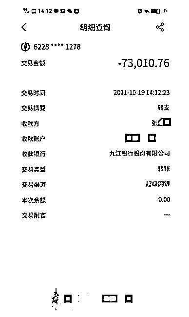
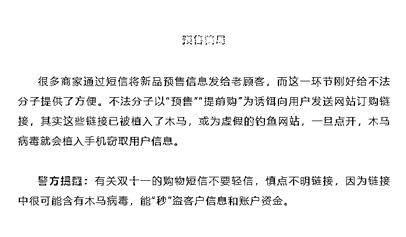

# @“尾款人”！已有人被骗……

> 原文：[`mp.weixin.qq.com/s?__biz=MzIyMDYwMTk0Mw==&mid=2247523513&idx=7&sn=098923bf98444a7f6d0d7c17861f2d7f&chksm=97cb5781a0bcde9716ef86d9227520f09e77694e71ddcc5f47d5ed10a318c1070f495997b8be&scene=27#wechat_redirect`](http://mp.weixin.qq.com/s?__biz=MzIyMDYwMTk0Mw==&mid=2247523513&idx=7&sn=098923bf98444a7f6d0d7c17861f2d7f&chksm=97cb5781a0bcde9716ef86d9227520f09e77694e71ddcc5f47d5ed10a318c1070f495997b8be&scene=27#wechat_redirect)

# 今年的“双十一”购物节第一拨预售在 10 月 21 日就开始了，**不少店铺要求消费者需提早支付定金，再“支付尾款”，这些参与“****预售活动”的消费者被称为“尾款人”。**

[`mp.weixin.qq.com/mp/readtemplate?t=pages/video_player_tmpl&action=mpvideo&auto=0&vid=wxv_2119394536954068999`](https://mp.weixin.qq.com/mp/readtemplate?t=pages/video_player_tmpl&action=mpvideo&auto=0&vid=wxv_2119394536954068999)

△央视财经《第一时间》栏目视频

今年“双十一”购物节第一拨预售尾款期到，不少人在 11 月 1 日凌晨熬夜付了尾款。 

“尾款日”一过，“为什么付尾款总在半夜”的话题就冲上微博热搜，网友纷纷留言追问，**为什么要半夜付尾款？**

有网友推测，凌晨付尾款是为了避开网络的高峰期，这样系统可能不会崩溃。也有人认为，这是商家提前发货，打的时间差，这样尾款刚付过，第二天就可能收到货，可以减少退货。**法律人士提醒消费者要谨防规则陷阱。**

律师表示，“定金”是一种带有预定性质的合同，如果买方违约不会退还，而卖方违约则需 2 倍退还。如果有消费者在支付定金后后悔了，也可以先付清尾款，再通过“七天无理由退货”进行全额退款。**遇到商品价格“明降暗涨”的欺诈行为，需以商品 3 倍价格赔偿，消费者要保存好证据投诉处理。  **

在此

要提醒忙于买买买的你

“双十一”冲业绩的不仅有商家

还有骗子

“假客服”“中奖免单”

等诈骗也开始有了上升的趋势

各位“尾款人”

在购物的同时一定要提高警惕

谨防被骗

**受害人转账截图：**

警方提醒：双十一期间大家网购商品多，网购信息流向各个渠道，接到自称客服人员来电时不要轻信对方，可联系官方平台客服进行核实确认。凡是有客服人员以认证身份、核实资金等各种理由要求转账的，都是诈骗。正规商家退款按照原支付渠道退回并不需要向对方转账，不要轻易点击或扫描对方发来的链接、二维码。

除了“假客服”诈骗外

“双十一”期间

以下骗局也需要警惕

来源：央视财经（ID：cctvyscj）、法制日报

← 向右滑动与灰产圈互动交流 →

