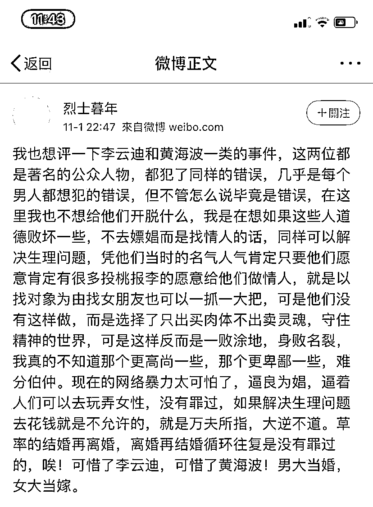
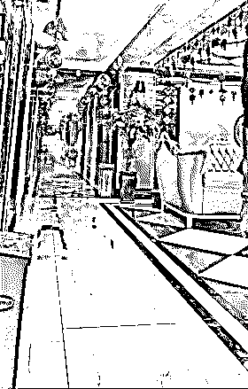
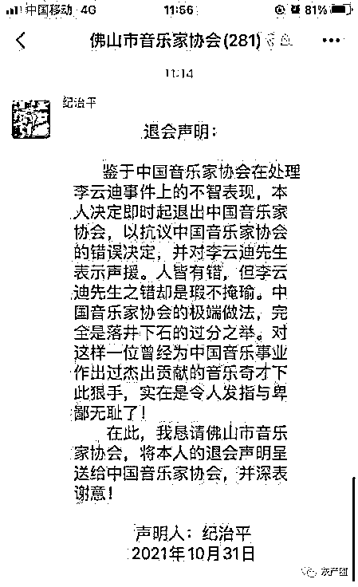
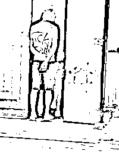
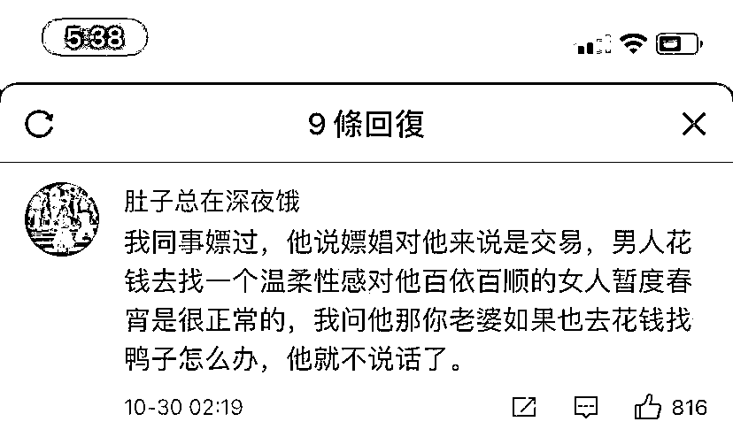
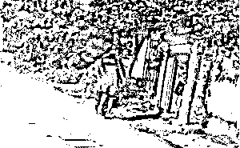
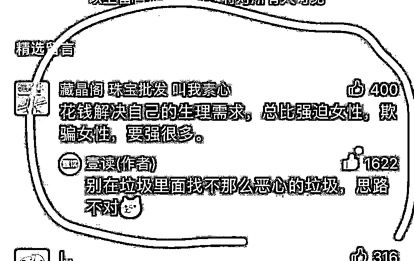
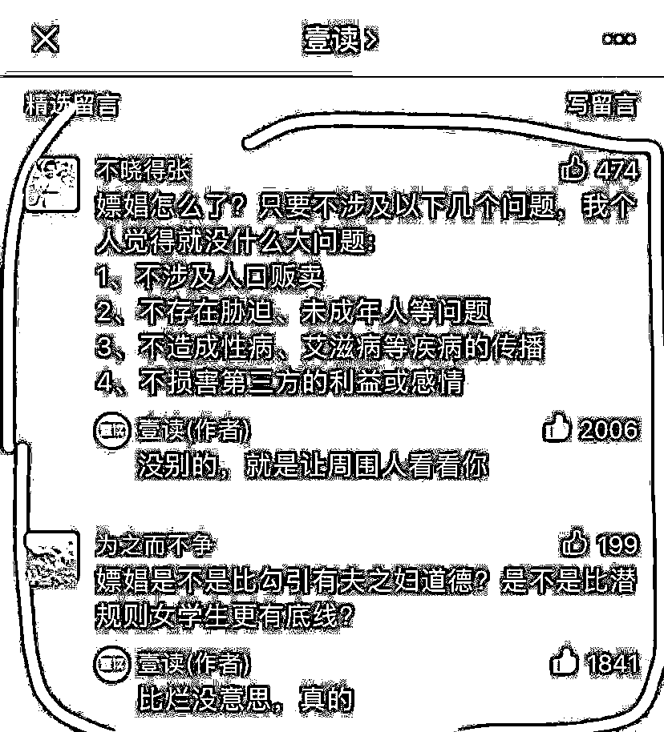
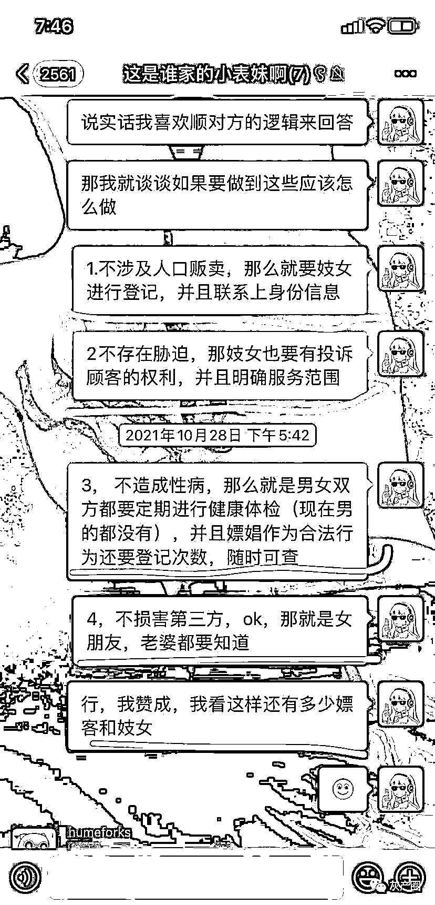
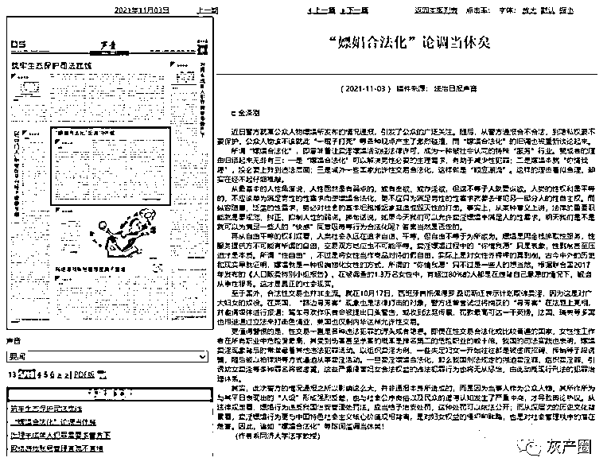

# 李云迪事件后，嫖娼合法化又被提出来了，法制日报刊文：不行！

> 原文：[`mp.weixin.qq.com/s?__biz=MzIyMDYwMTk0Mw==&mid=2247523583&idx=2&sn=a389694716fbd5ae8c447a6da64de08e&chksm=97cb57c7a0bcded12b783cb74134bc2f97b8ff218584dad46e30ac7d7143fd65794ec1a8a4ea&scene=27#wechat_redirect`](http://mp.weixin.qq.com/s?__biz=MzIyMDYwMTk0Mw==&mid=2247523583&idx=2&sn=a389694716fbd5ae8c447a6da64de08e&chksm=97cb57c7a0bcded12b783cb74134bc2f97b8ff218584dad46e30ac7d7143fd65794ec1a8a4ea&scene=27#wechat_redirect)

近日警方就某公众人物嫖娼所发布的情况通报，引发了公众的广泛关注。

随后“嫖娼合法化”的旧调也被重新谈论起来。 

# 

# 

法治日报对此社会现象刊文表示：

从最基本的人性角度说，人性固然是有弱点的，

或有贪欲、或存淫欲，但这不等于人就要纵欲。

人类的性权利是平等的，

不应该单为满足男性的性需求而使嫖娼合法化，

更不应只为满足男性的性需求就要去侵犯另一部分人的性自主权。

* * *

**灵蛇女媚 cc :**天哪，已经到《法治日报》专门来批判这件事，可见乱搞舆论的人已经很多了。这些人就是看不清楚一个事实，中国将是未来世界上最强大文明的国家。这个强大文明标准，一定会包括母亲，姐妹，任何一个女人能够有尊严的在阳光下生活，一个都不会少。

**明天午餐吃什么:**大家都当人不香吗，为什么非要有些人想做禽兽，还压抑天性，你的天性就是通过物化别人来证明吗？真的是山羊放着绵羊屁，骚气又洋气

**科技二毛:**合法化？大清已经亡了一百多年了，醒醒吧

来源：微博那些事儿

← 向右滑动与灰产圈互动交流 →

