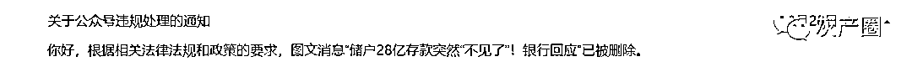
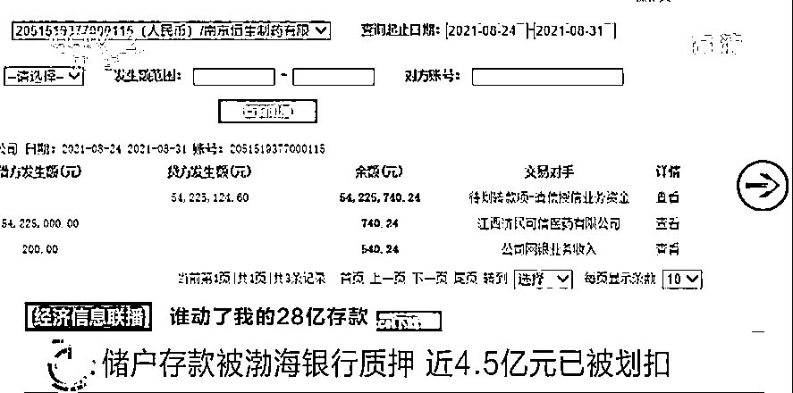
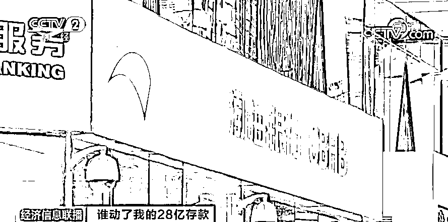

# 独家！储户 28 亿存款被莫名挪用？后续来了！渤海银行首次回应：储户对此其实知情...

> 原文：[`mp.weixin.qq.com/s?__biz=MzIyMDYwMTk0Mw==&mid=2247523583&idx=3&sn=9a8cf1757cf348d17baf0987ed08d6ad&chksm=97cb57c7a0bcded16d13afd2ede8c679a7c1345f6b92b7716d720cb17a3327a4120ec18d5b82&scene=27#wechat_redirect`](http://mp.weixin.qq.com/s?__biz=MzIyMDYwMTk0Mw==&mid=2247523583&idx=3&sn=9a8cf1757cf348d17baf0987ed08d6ad&chksm=97cb57c7a0bcded16d13afd2ede8c679a7c1345f6b92b7716d720cb17a3327a4120ec18d5b82&scene=27#wechat_redirect)

近日，一起“28 亿存款被莫名质押”的事件，引发关注。（新闻链接：[**28 亿元存款莫名被质押？！“六问渤海银行”，谁动了储户的存款？**](http://mp.weixin.qq.com/s?__biz=MjM5NzQ5MTkyMA==&mid=2657343733&idx=1&sn=b7a8c3042faab4ff8154d0f14553188a&chksm=bd4e5d4a8a39d45c96610504c6e9eb6eee2bf851b0a280fe32d6153b2cac8344d3e3a8a301a2&scene=21#wechat_redirect)）事件当中，一家名为济民可信集团的医药公司声称，自己在渤海银行存入的 28 亿定期存款，在不知情的情况下被银行方面用作质押，给第三方公司贷了款。

灰产圈此前发布文章已经被和谐：

目前这一事件，有何进展？双方有何最新回应↓

储户存款被渤海银行质押

近 4.5 亿元已被划扣

[`mp.weixin.qq.com/mp/readtemplate?t=pages/video_player_tmpl&action=mpvideo&auto=0&vid=wxv_2120949396753154054`](https://mp.weixin.qq.com/mp/readtemplate?t=pages/video_player_tmpl&action=mpvideo&auto=0&vid=wxv_2120949396753154054)

△央视财经《经济信息联播》11 月 3 日栏目视频

济民可信集团在得知自己 28 亿存款被质押后，曾与渤海银行南京分行的相关人员有过见面沟通，但银行人员给出的“继续质押”解决方案让他们难以接受。**随后，被质押存款中，还因第三方公司贷款到期未还而被划扣走了近 4.5 亿元。**

**江西济民可信集团总部办公室工作人员 周明：**这个事情我们在报案之后，没有再跟渤海银行沟通，渤海银行方面也没有找过我们。

 济民可信方面表示，现在公司非常担心其余被质押存款的安全，业务也受到一定影响。 

**江西济民可信集团总部办公室工作人员 周明：****11 月下旬，在 20 日到 27 日之间，我们大概有三笔，总共是 8 亿元的存款会到期。**我们也比较担心，到期之后这三笔存款取不出来。贷款的那家公司不能如期还上的话，我们就担心这笔钱又可能会被强行划扣。在无锡我们正在新建一个项目，这笔钱到期之后我们要支付工程建设的一些费用。本身在 9 月 29 日这个项目就是要正式开工建设的，现在正式开工已经在往后推迟了，跟资金有很大的关系。

渤海银行独家回应

28 亿存款被质押

存款企业对此知情

**就在今天，渤海银行向央视财经记者作出了独家回应。**根据了解到的信息，在一年左右的时间里，济民可信系还收取了来源于华业石化系的三倍于渤海银行存款利息的额外收益。渤海银行掌握的其他信息也显示出：**济民可信对此事是知情的，****并非其对外声称的单纯的存款客户。**

**渤海银行南京分行综合与人力部副总经理赵远芳回应
全文如下↓↓↓**

[`mp.weixin.qq.com/mp/readtemplate?t=pages/video_player_tmpl&action=mpvideo&auto=0&vid=wxv_2121200025157304321`](https://mp.weixin.qq.com/mp/readtemplate?t=pages/video_player_tmpl&action=mpvideo&auto=0&vid=wxv_2121200025157304321)

最近一段时间，我们南京分行下辖营业部与江西济民可信医药产业投资有限公司及其下属企业质押授信业务事件引发社会各界高度关切。但为避免干扰有关机关调查，我们之前保持静默，因此，这是我们第一次就这件事接受媒体采访，做出公开说明：  

根据我们了解到的信息，在一年左右的时间里，济民可信系还收取了来源于华业石化系的三倍于我行存款利息的额外收益。我们掌握的其他信息也显示出：济民可信对此事是知情的，并非其对外声称的单纯的存款客户。

这件事暴露出我们南京分行下辖营业部在人员管理、操作环节方面存在薄弱环节。我们将对此一查到底，也在此向广大公众郑重承诺：如有证据显示我行人员存在任何违法犯罪行为，我们绝不隐瞒、不掩盖任何线索，不偏袒、不包庇任何人。

同时，我们想指出：这件事涉及的企业及个人众多，当事各方单方面提供的信息、证据都不能客观真实地还原事件全貌。

当前，公安机关已受理报案并开展调查取证工作。我们正在密切配合公安机关加快侦破，因此将继续克制公开发声，以免影响警方正常调查工作的开展。

我们也真诚呼吁：给予公安司法机关一个清朗、公正的调查办案环境，和我们一起耐心等待警方对此事更为详细的调查结果，确保公正公平，共同建设法治中国。

对于此事件中涉及的质押资金，我们将严格按照司法机关的调查结论及最终结果，依法处理。需要我们承担的责任我们绝不推诿、不逃避、不转移任何法律责任。

请大家相信：我们一定会确保客户的正当、合法权益得到充分保障，也希望有关各方遵守相关法规，共同维护金融秩序的安全与稳定。

来源：央视财经（ID：cctvyscj）

← 向右滑动与灰产圈互动交流 →

