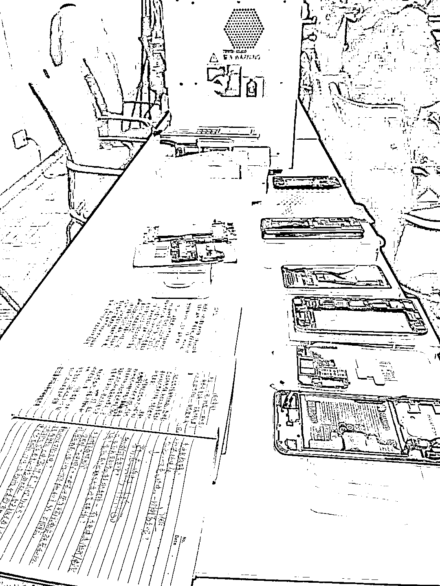
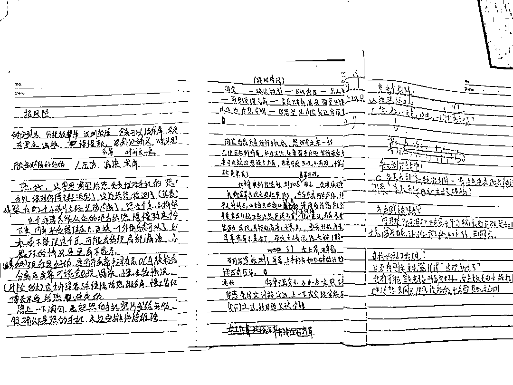
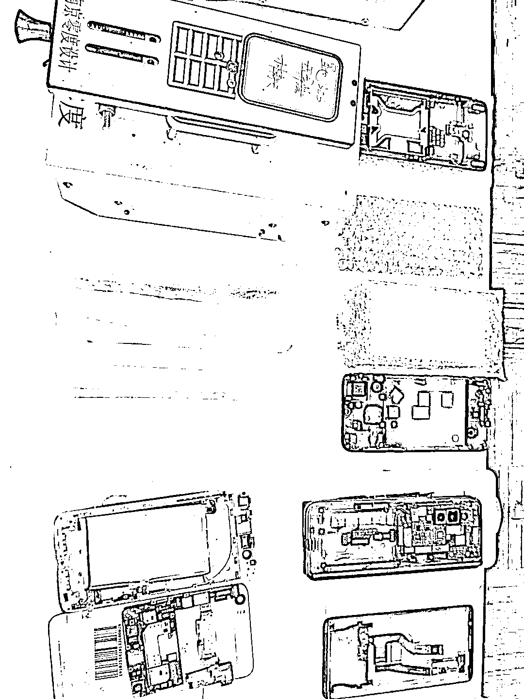
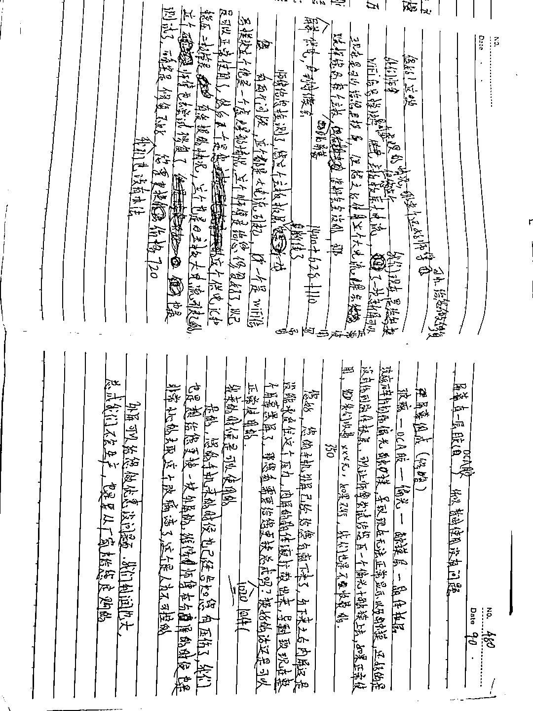

# 假网页引流，虚构故障，说好 200 元却要了 3200 元：起底手机维修诈骗套路

> 原文：[`mp.weixin.qq.com/s?__biz=MzIyMDYwMTk0Mw==&mid=2247523583&idx=4&sn=190a8c07bf09e3bbe4dc971d13c8b0a7&chksm=97cb57c7a0bcded1468de05225e07e4197eab751caa61bb309851b8675e6a0d0b3e6721392a3&scene=27#wechat_redirect`](http://mp.weixin.qq.com/s?__biz=MzIyMDYwMTk0Mw==&mid=2247523583&idx=4&sn=190a8c07bf09e3bbe4dc971d13c8b0a7&chksm=97cb57c7a0bcded1468de05225e07e4197eab751caa61bb309851b8675e6a0d0b3e6721392a3&scene=27#wechat_redirect)

现代信息社会，手机已成为人们不可或缺的工作、生活用品。当手机遭遇故障无法正常使用时，往往让人心神不宁。

**而不法分子正是利用人们急于维修手机的心态，线上精心制作以假乱真的网页“引流”；线下设计话术，虚构或夸大手机故障，甚至以次充好偷换零件，目的只有一个——骗取高额的维修费用。**从开始表示两三百元维修费即可，到最终两三千元的实际付出，消费者就是在不法分子的“连环套”中，陷入被骗深渊。 

上海警方日前成功打掉一个线上客服低价揽客、线下门店虚假维修的诈骗团伙，在全国多地抓获以吴某为首的 20 名犯罪嫌疑人，**涉案资金超过 3000 万元。**翻看警方相关资料，并与办案民警、被害人交流后，不得不“感叹”犯罪嫌疑人为了诈骗真是动足了歪脑筋。

上海警方缴获的犯罪团伙的话术本和手机。受访者供图

200 涨到 3200

高价换屏却维修“无痕”

今年年初，家住上海长宁区的倪先生不慎将某国产知名品牌手机摔落在地，手机屏幕摔出了几条裂痕，虽然手机仍能正常使用，但倪先生觉得它并不美观。于是，他通过网络搜索该手机的品牌维修商，浏览了“品牌维修商”网页后，他拨打了排名靠前的“客服电话”。 

“当时客服人员详细地询问了我手机的型号、购买时间、故障问题等，**然后表示仅需 200 元就可以维修。**但客服也告知，手机在屏幕拆机时会存在风险，因此要看到实物后才能最终确认。”倪先生告诉新华每日电讯记者，“当时我觉得他们说的也有道理，也就没有多想，预约了时间，前往客服指定的位于中山公园附近某写字楼内的实体门店。”**由于对方还通过手机给倪先生发了“预约码”，让他觉得应该是“正规店”。** 

倪先生说，门店店面不大，也没什么顾客，店铺分为外间的接待柜台和里间的维修操作间。门店一位工程师在收取预约码、听取故障描述后，将手机拿进操作间进行“拆机检修”。数分钟后，工程师告知倪先生，开屏检修后发现，手机不仅外屏碎裂，内屏也已经损坏，无法正常使用，只能更换屏幕。 

**眼见原本还能使用的手机，彻底变成了黑屏，**加之各种信息都还没来得及备份也没有准备备用手机，**倪先生只能无奈同意更换所谓的“原装屏”，价格为 3200 元。**约十分钟后，工程师从操作维修间出来，表示手机已“修好”，倪先生测试发现也能正常开机使用。 

涉案的话术本。受访者供图

不到 2 个月时间，倪先生手机再度出现故障。倪先生有感于上次维修费“贵到离谱”，没有再上网找客服了，而是直接前往该品牌手机的官方维修点。在维修过程中，**工作人员告诉倪先生手机的内屏并没有修理或者更换的痕迹，也没有明显故障。**“我听了当时脑袋就‘嗡’地一下，意识到之前肯定是被骗了，于是马上向长宁公安分局新泾派出所报案。”倪先生说。 

低价引流以次充好

诈骗团伙“线上线下”合作紧密

上海长宁警方接到报案后，根据倪先生提供的线索，经过数据分析和综合研判，锁定了一家位于福建、名为**“量子穿梭传媒有限公司”**的企业。经过警方排查，**发现这家“传媒公司”竟然在全国 6 个城市开有 20 家手机维修实体门店或加盟店，同时在各大电商平台上设立了 15 家网店。** 

“经过我们的调查发现，虽然这些店铺在网络搜索中都**声称是‘品牌官方维修点’，但却经常发生消费纠纷。**”新泾派出所执法办案队副队长高飞告诉记者，“一方面是‘挂羊头卖狗肉’假冒官方维修点，另一方面还消费纠纷不断，种种迹象表明，这是一家**‘线上李鬼、线下狠贵’**涉嫌欺诈的店铺。” 

在侦查过程中，警方联系上另一名被害人高女士。她在 4 月份通过网络找到该公司名下位于上海黄浦区的一家手机维修店铺，花费 4000 元“更换”了手机主板。事后，由于费用远超之前网络客服的报价，高女士还向市场监管部门进行了投诉。而经过检查，高女士手机的主板实际上并未更换。 

经过深入调查，警方发现这是一个通过网络发布广告招揽客户，以低价诱骗客户上门或者寄件维修，进而骗取高额维修费用的新型诈骗团伙。9 月中旬，上海长宁警方在当地公安机关的协助下，在广东、湖南、山东、安徽等地同步集中收网，成功抓获团伙主要犯罪嫌疑人吴某等人。 

上海警方缴获的犯罪团伙的手机。受访者供图

到案后，犯罪嫌疑人如实交代了犯罪手法和作案过程。42 岁的福建人吴某，其在福建开设了“量子穿梭传媒有限公司”，主要分为“线上客服”和“线下维修”两个部分。 

**“线上客服”安排专人在各类搜索网站进行维护操作，**确保消费者在搜索相关手机维修关键词时，优先看到该团伙所开店铺和联系方式，**并误导消费者以为其搜索到的是品牌官方维修点。**

客户来电或在线联系后，客服会根据事先设计好的一整套话术，**针对手机故障情况给出低于市场价的报价，吸引客户前往实体店铺维修；如果所在城市没有实体店铺，则会推荐网店引导客户邮寄手机进行维修。** 

“最关键的是，客服在沟通中会提示拆机维修风险，即可能会造成内屏等其他部件损坏，为后续实体店实施诈骗行为进行铺垫。”长宁公安分局刑侦支队副支队长钱俊表示。 

“线下维修”由该团伙在各地招募开设的实体手机维修店铺进行，一般配备 1 名店长和 3 名工程师。“客户到店后，**工程师首先会设法让客户认可‘风险协议’，**然后以检测维修为借口，**将手机拿到里面的维修间操作，使其脱离客户视线。****之后采取虚构、编造、夸大手机故障并制造黑屏、无法开机等假象，最终迫使客户同意支付高额维修费用。**”高飞介绍说，“实际上，所谓的‘原厂配件’都是假冒或者二手配件，有的甚至根本没有更换。**而如果客户拒绝维修，工程师也会暗中将手机原装配件拆下替换，将原装配件倒卖获利。**” 

一般情况下，手机经过维修都能正常使用，大部分客户虽然觉得费用昂贵但也没有办法。而针对少部分投诉、质疑的客户，团伙会安排客服专门协商，以减免、退回部分维修费用等方式应对化解。“**前端客服‘引流’，后端客服‘灭火’，这也造成了很多消费者把这一欺诈行为误认为是维修纠纷而已，**一定程度上也给警方的侦破造成了难度。”钱俊说。 

小维修做成“大买卖” 

维修服务还需多重视

钱俊在接受记者采访时认为，本案中犯罪嫌疑人实施诈骗有两个关键步骤，一是线上招揽客户，二是线下实施诈骗。 

“从我们的调查中发现，线上客服除了低价招揽客户、提示维修风险外，**还会在沟通过程中尽量收集客户个人信息，分析脾气性格，研判是否了解手机专业知识，**这样既能选择高端手机，提升获利空间，又能帮助线下工程师实施诈骗提高成功率。”钱俊说，“尤其在维修阶段，团伙成员还专门精心编制了一整套话术来培训员工。” 

涉案的话术本。受访者供图

另一方面，**犯罪团伙将线下门店都开设在直辖市或省会城市的中心城区商务楼里，**给消费者“高大上”的感觉，误以为是正规的品牌维修点。此外，**不法分子开设的店铺均没有明显的店招和广告牌，**客户必须凭借预约码在指定时间上门。 

钱俊介绍说，“这样做的目的，就是避免接待自行上门、未经事先沟通掌握信息的客户；同时也确保在某个时间段内只接待一位客户。消费者以为自己是享受了‘VIP 服务’，殊不知这是犯罪团伙为了避免客户间相互沟通，造成‘穿帮’的风险。” 

上海太平洋数码城某官方授权的手机维修点工作人员孙浩说，消费者需要维修手机时，应当通过手机品牌的官方渠道了解维修方式和官方授权维修点，**要尽量前往授权实体店铺维修。** 

“最重要的一点是，维修过程中，**尽量避免手机脱离视线。**”孙浩说，**“如果实在要选择寄修模式，要提前备份保存个人数据，取出手机卡和存储卡，并将手机恢复出厂设置，避免个人隐私信息泄露。”** 

“现在很多手机、电脑等价格昂贵，换配件、维修的费用相当高，这让不法分子看到了非法牟利的空间，警方也将不断加大对维修类服务诈骗行为的打击。此外，警方还提示大家，无论选择何种维修方式，一是要选择正规渠道，二是在维修服务完成后，**务必保留相关维修和交易凭证，**便于事后追查。”高飞说。

首发：《新华每日电讯》11 月 4 日 12 版 

← 向右滑动与灰产圈互动交流 →

