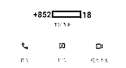
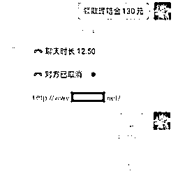
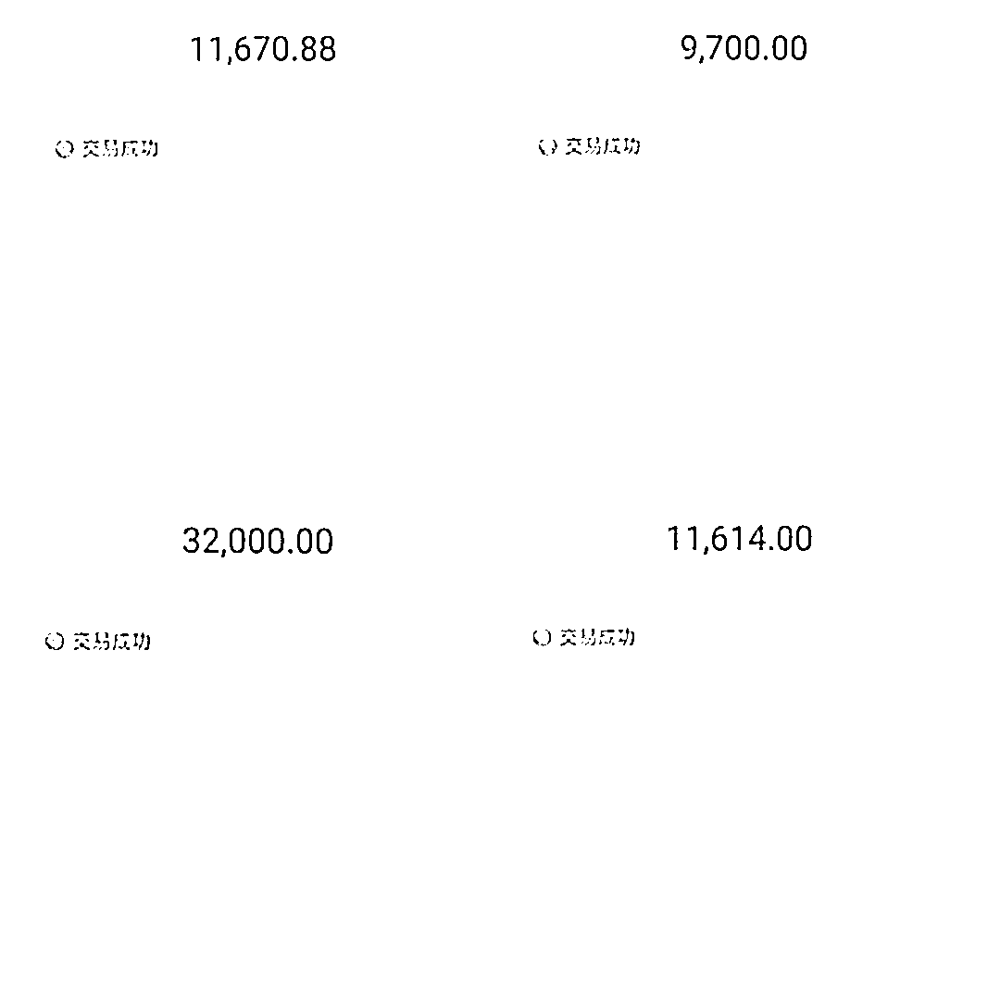
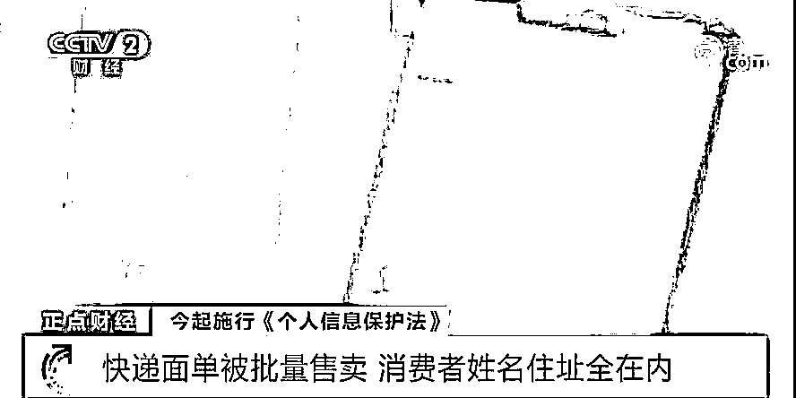
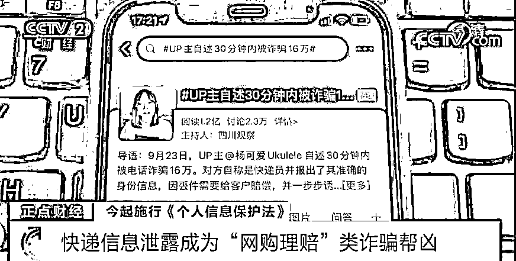
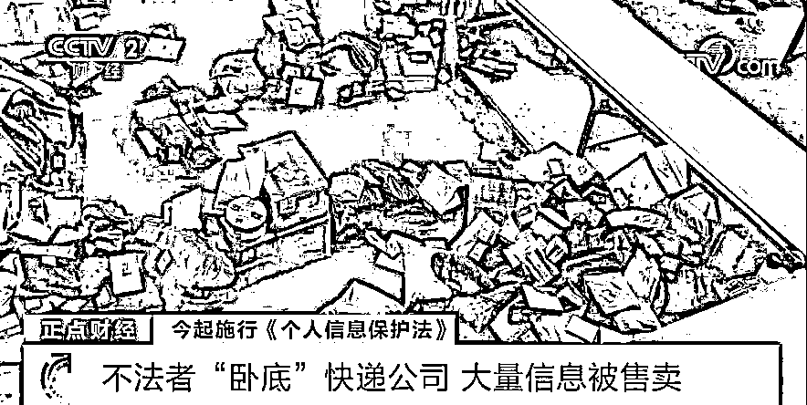

# 小姐姐一口一个“先生”，小伙差点把持不住……

> 原文：[`mp.weixin.qq.com/s?__biz=MzIyMDYwMTk0Mw==&mid=2247523583&idx=6&sn=74c23d37cfcd7cf263e4ec41e3436894&chksm=97cb57c7a0bcded1d79ab1f18292836d529c0658ba7a15bac162d919335029a3ab0319809b88&scene=27#wechat_redirect`](http://mp.weixin.qq.com/s?__biz=MzIyMDYwMTk0Mw==&mid=2247523583&idx=6&sn=74c23d37cfcd7cf263e4ec41e3436894&chksm=97cb57c7a0bcded1d79ab1f18292836d529c0658ba7a15bac162d919335029a3ab0319809b88&scene=27#wechat_redirect)

**“先生，你要我的”** 

**“先生，我给你赔，好不好”**

近日，塘厦某电器公司

上班的阿强（化名）接到

一个**自称是网购平台客服**的电话

对方一口一个甜甜地叫他

那叫一个亲切啊

但阿强和她说了一句话后

甜甜的小姐姐却不见了…

●曝光通话记录，速戳↓↓

[`v.qq.com/iframe/preview.html?width=500&height=375&auto=0&vid=wxv_2118308259714367491`](https://v.qq.com/iframe/preview.html?width=500&height=375&auto=0&vid=wxv_2118308259714367491)

“双十一”付完尾款后

坐等快递的街坊们

很可能会接到“客服”的电话

一不小心，结局就不一样了

带特殊符号的来电，6 万没了

最近，在清湖头社区高裕北路某小店工作的阿苹（化名）在抖音上买了一条裤子，10 月 30 日中午，她就接到一个**带“+”符号**，**自称是支付宝客服的电话**，称她的快递丢失了，平台要赔偿 130 元给她。

这位“客服”将阿苹购买的商品、订单号以及收获地址都说得明明白白，阿苹不由得相信对方就是平台客服。

“客服”让阿苹下载“开会宝”APP，阿苹见不需要填银行卡密码，就放松了警惕，按对方要求下载，并添加了企业微信方便联系。在对方的指示下，阿苹点开了**APP 内的“屏幕共享”功能**。

随后，客服发出支付宝二维码要求扫码，阿苹看到自己的支付宝里有**500 元“备用金”**，就联系对方帮其关闭该功能。对方称，阿苹转账 11670.88 元到账号上，就能关闭，连同那 130 元赔付也会打回她账上。

阿苹照做后，对方却又称她**操作失误**，再不关闭的话会**影响个人征信**。听到这，阿苹已经慌了，跟着对方的指引，**转账了 6.4 万余元**……

备用金实际上是

支付宝推出的一款提供**小额借贷**的产品

这 500 元相当于

用户自己申请的一笔**贷款**

需要**及时归还**

批量售卖，快递单成帮凶

一年一度的“双十一”快到了，对于许多网购族来说，又到了迎接快递潮的时候。不过，随着快递量的增加，个人信息安全也可能面临泄露的风险。在快递包裹上，都会贴有一张**“快递面单”**，主要用来记录发件人、收件人以及货物种类等相关信息，其中还包含**收件人的姓名、电话、家庭住址**等隐私信息。最近，央视记者调查就发现，目前这些**快递面单在网上被明码标价批量售卖**，情况十分猖獗。

据记者调查，诈骗分子在获取个人快递信息后，通常会冒充“电商客服”或“快递员”，使用的诈骗手法包括“发送退货链接，骗取银行账号信息”“快递遗失，商家理赔”等几类。**其中“网购理赔类”是目前比较高发的诈骗类型。**

快递面单上的个人信息是怎样被窃取和贩卖的呢？浙江宁波警方近日就侦破一个非法获取、倒卖快递面单信息的犯罪团伙，抓获犯罪嫌疑人 9 名，查获快递面单照片 2 万余张。

据警方了解，这个犯罪团伙为了获取快递包含的个人信息进行非法牟利，竟然**通过临时应聘的方式进入快递公司**，然后，他们再利用整理快递包裹之机，**偷拍快递面单照片，汇总整理后在网上倒卖**。

***News***

**冒充客服退款诈骗套路**

第一步

骗子通过多种途径获得受害人的电话和购物信息（如快递信息泄露等），随后致电或短信给受害人，详细说出受害人的个人信息等内容，取得受害人信任。

第二步

谎称受害人购买的货物有问题需要申请退款，并让受害人添加“官方客服”微信。

第三步

用退款失误等借口，诱使受害人提供验证码转账。

**警方提醒**

如接到了类似快递、网购客服主动给你要求退款退货的电话，要通过与官方客服联系核准，不要按陌生人的指引在网上进行有关钱财的操作，更不能将自己的身份证、银行卡账号、密码和手机验证码等信息告诉别人，谨防上当受骗。

**来源：塘厦公安，阻击诈骗**

****

**← 向右滑动与灰产圈互动交流 →**

****