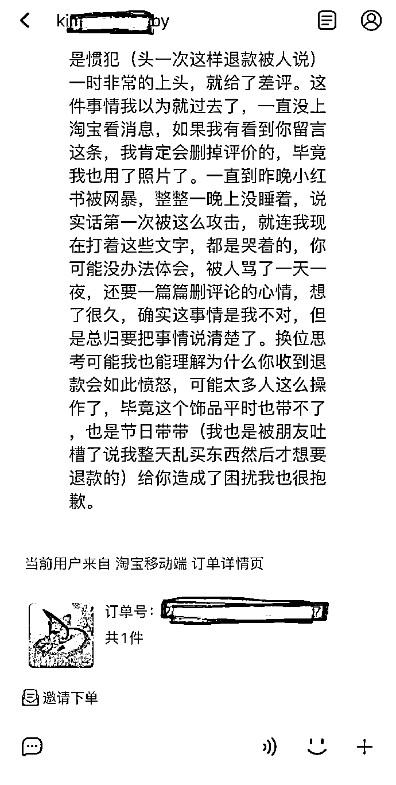

# 小红书网红白嫖帽子被揭穿，竟怒写差评！道歉后又拉黑店主…

> 原文：[`mp.weixin.qq.com/s?__biz=MzIyMDYwMTk0Mw==&mid=2247523645&idx=2&sn=683be2622dfd0cdf991b9cc2ff215c82&chksm=97cb5605a0bcdf133a23fc8cf61817eeb5cbc4671e1ac771df6f40b326614d13d249de8eb73c&scene=27#wechat_redirect`](http://mp.weixin.qq.com/s?__biz=MzIyMDYwMTk0Mw==&mid=2247523645&idx=2&sn=683be2622dfd0cdf991b9cc2ff215c82&chksm=97cb5605a0bcdf133a23fc8cf61817eeb5cbc4671e1ac771df6f40b326614d13d249de8eb73c&scene=27#wechat_redirect)

最近刷到一位店主**吐槽顾客白嫖帽子**的事情，不禁看呆了，竟然还有这种操作？？
用了再退货，被拒就差评，这种人也真的是做得出哦。

**小红书用户白嫖帽子？**

整件事情不复杂，气愤的店主写了一篇条理清晰的长文，揭露这名顾客的奇葩操作。
简单来说就是利用退货规则，用了之后申请退货说没用过，被拒就差评商家态度恶心想吐。空口无凭，店主附图来证明自己的判断：物流详情显示：帽子是 27 号晚上到快递柜的，顾客 29 号凌晨签收。当晚该顾客戴着去欢乐谷，还在小红书上晒图了。结果 30 号中午申请退货退款，店主当然拒绝了。紧接着该顾客差评：“买来觉得太大了，**没有带过**，质量也很差，差评是给店家的回复态度，好🤢🤮”帽子没戴过？店主气不过，有理有据地回复她。店主将此事发到微博上后，好多网友疯狂吐槽这种行为可耻。这顶帽子 94 块加运费 8 块，102 块至于吗这么坍台……
还有不少网友深有共鸣，碰到这种利用规则钻漏洞的，真的太令人头痛了。
网友情不自禁观光了这名顾客的小红书，没办法，大家都很好奇到底做出这种事的人，到底是什么样的（戴帽子的图已经删除了）观光完竟无语凝噎，人家小红书里左手巴黎世家右手 mini kelly 还白嫖一顶 100 块的帽子……这是一种什么样的精神我不懂了……有懂的朋友聊几句吗……？由于网友观光和吐槽过于热情，店主把微博转给仅自己可见。11 月 5 日中午，店主发了这件事的后续，原来那名小红书顾客来找她澄清了。顾客说她买东西比较盲目，没仔细看规则是不能退货。然后她退货是因为朋友吐槽说不好看，整个过程就带了五分钟不到，所以她评价里写自己没带过。？？？？这个逻辑有点离谱了。她还发来了近期购物的截图，证明自己不是白嫖惯犯。有一说一，这份澄清从措辞语气上来看，还是比较真诚的，但无语的是，店主回复她时，消息发送不过去了，被对方拉黑了一刚。。？？？？最后那个拉黑挺拉胯的，这就是所谓的澄清道歉？发完就给人拉黑的那种？？店主还是太善良了，看这位顾客那会差评的口吻，就很令人反感，真觉得自己做错了，怎么会拉黑店主？而且她发的近期订单截图，也让人抑制不住好奇心。本以为事情到此告一段落，没想到还有后续。澄清微博发出还不到 2 小时，店主说应对方要求，删除澄清微博。“……”这位顾客真的事情好多啊，不是拉黑店主了吗？怎么还能发消息啊，哦是不是先解除了黑名单，告诉店主要删微博，然后再拉黑？累不累了我的天……

**利用规则退货的人还不少**

这位顾客是不是故意的，说不清，但类似这种用过之后再退货的事情，不是个例了。
记得今年 5 月底还上过热搜。
这位徐女士在一家网店里消费 1 万 7 千多买了衣服。收货后发现有瑕疵/不合身，申请退货，被店家以衣服有污渍影响二次销售拒绝了。当时事件的店家还提到，这位徐女士 2020 年在他们家店，**买了 18 万左右的商品，结果退货金额有 17 万多**，退货率高达 95%。？？？？？？看了开头为消费者鸣不平，看到这里，商家为什么不直接拉黑她？买 18w 退 17w，又想盗版又想白嫖…？
7 天无理由退货，也确实被一些人乱用了。碰到这种顾客，店家真的太难了...故意买了又退货钻空子的人，做人做得，也太坍台了吧...望某些人知悉：七天无理由退货（有的店是签收 48 小时内退货），是保障消费者的合理权益，并不是让你们把店铺当做免费道具间的。
来源：上海全知道，吃瓜不吐葡萄皮

← 向右滑动与灰产圈互动交流 →

