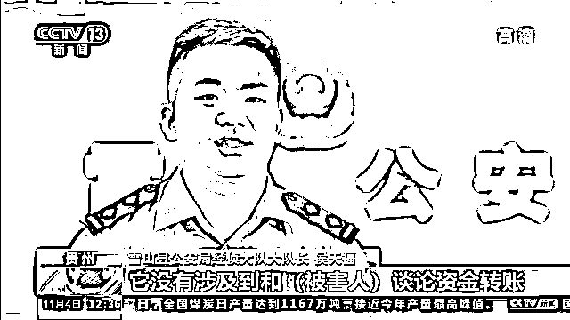
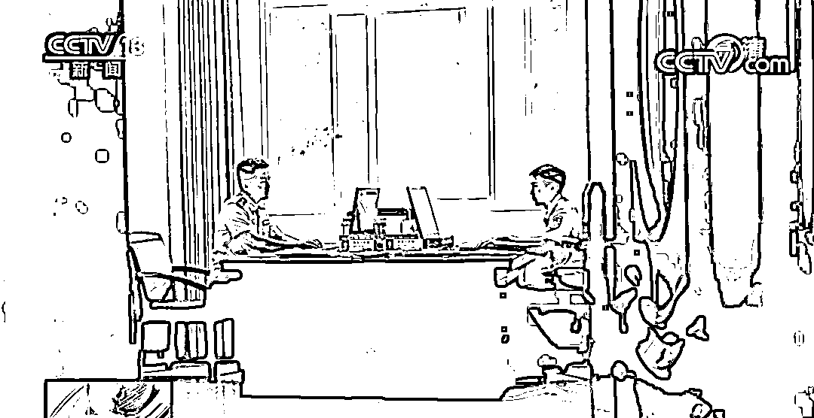
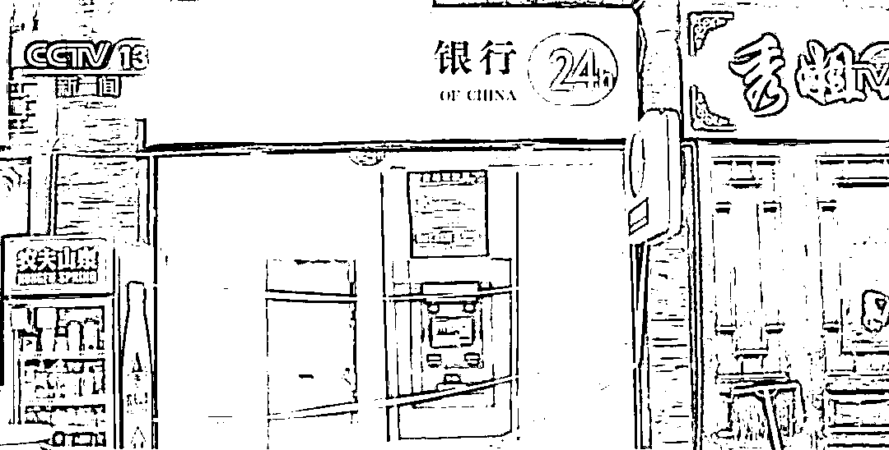
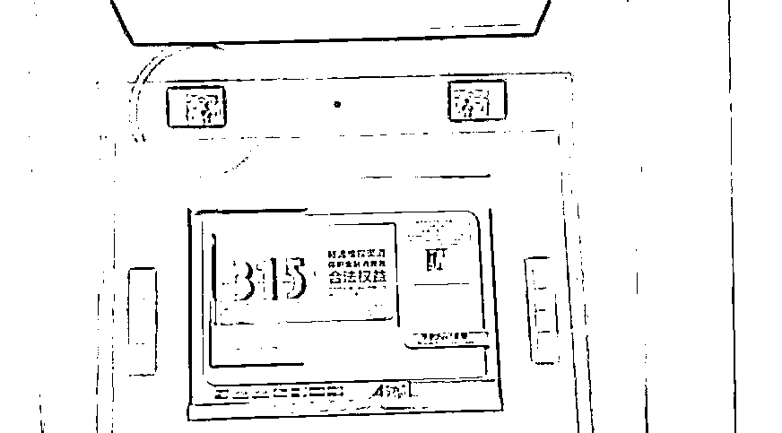
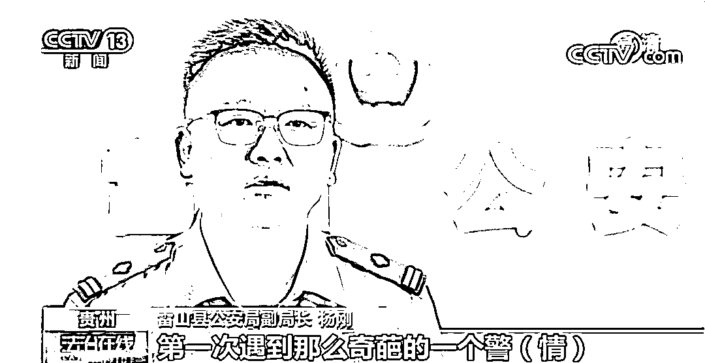
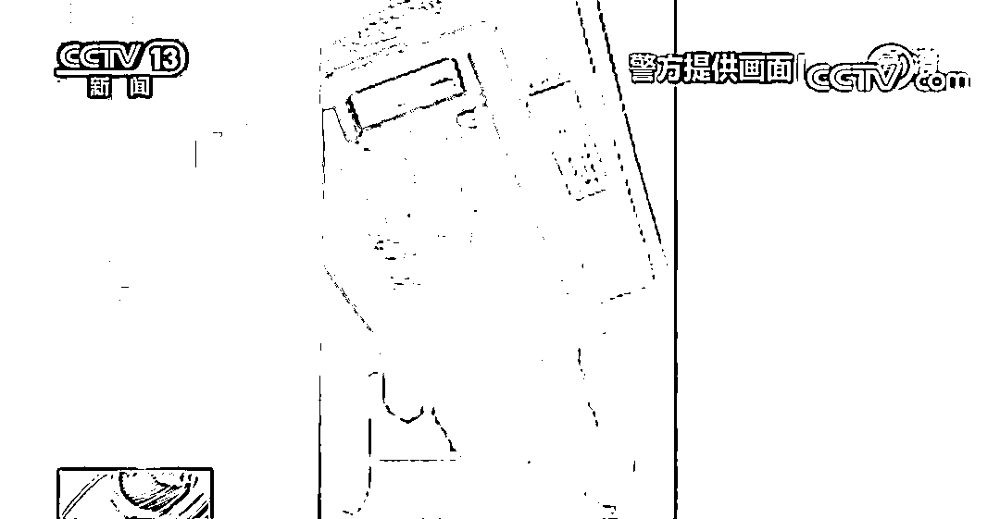
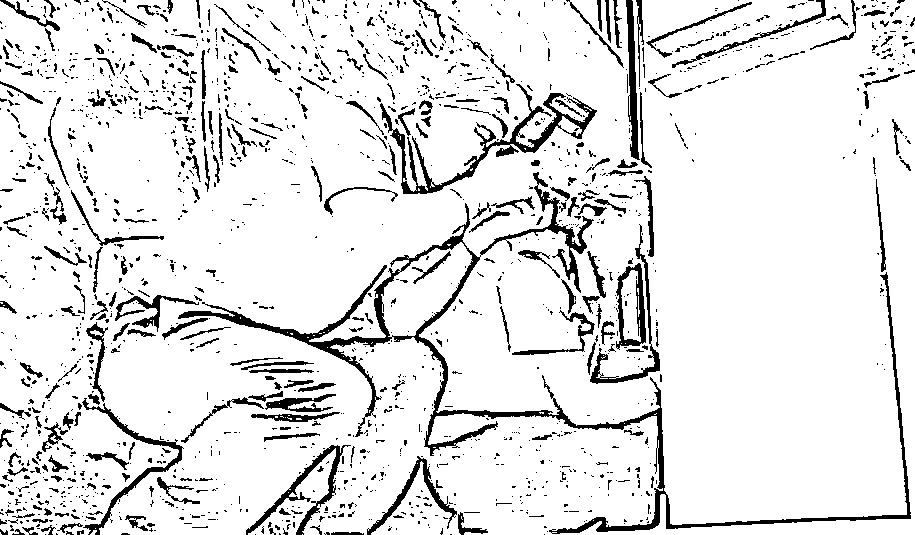
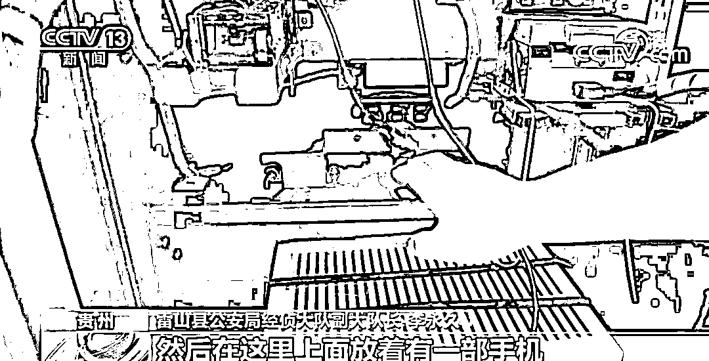

# 假银行、假 ATM 机！民警：工作 16 年第一次见这种奇葩警情……

> 原文：[`mp.weixin.qq.com/s?__biz=MzIyMDYwMTk0Mw==&mid=2247523645&idx=5&sn=18a5ecdcd7ed1d0685fd7777d445dfe9&chksm=97cb5605a0bcdf13c8e0fb56d5ecddf358fdc5a8077ea738f2e1767af102eb9daae3de99eb96&scene=27#wechat_redirect`](http://mp.weixin.qq.com/s?__biz=MzIyMDYwMTk0Mw==&mid=2247523645&idx=5&sn=18a5ecdcd7ed1d0685fd7777d445dfe9&chksm=97cb5605a0bcdf13c8e0fb56d5ecddf358fdc5a8077ea738f2e1767af102eb9daae3de99eb96&scene=27#wechat_redirect)

近日，

贵州张先生的一张银行卡

**被莫名其妙地转走近六千元，**

经警方调查，

**问题竟出在一台自助取款机上，**

作案手段更是令从业 16 年的民警

直呼闻所未闻。

银行卡离奇被盗刷

警方排除电信诈骗可能

起初，民警将其判定为电信诈骗。当张先生提供一些近期联系的电话号码及聊天记录后，调查结果显示和案件没有太大联系。

**民警 侯天福：**确实有几个陌生的号码跟被害人通话，有国内的也有境外的。但经核实，国内号码是一般的广告推销，**没有涉及和被害人谈论资金转账，没有让被害人点击过陌生的网站链接，没有发生业务、资金的往来。**

于是，民警转换思路，既然张先生的银行卡并没有丢失，**那么有哪些人能接触到这张银行卡，他们是否和案件有关？**

然而民警走访张先生的亲友，他身边的人没有接触到这张银行卡。此外，侦查员联系银行，**通过调取张先生的银行插卡信息、取款信息和银行卡使用记录，发现在被盗刷时间点，张先生并没有使用银行卡的记录。**

就在案件毫无进展时，张先生回想起的一个细节引起了民警的注意。

报案人回忆取款经过

自助取款机显端倪

半个月前，张先生曾因自助取款机的原因没有取出钱。据张先生回忆，**当时未取款成功的自助银行门面很小，两边挨着商铺，里面只有一台自助取款机。**

无论是装潢，还是自助取款机样式，张先生都没发觉有任何不妥。于是他将银行卡插入了卡槽，**“输入密码后，弹出对话，本机暂停服务。”**看到机器无法使用，张先生就把银行卡退了出来。过了几天，张先生发现，卡里竟少了近六千元钱。

民警赶往张先生使用的自助取款机处进行核实。调查发现：

*   普通的 ATM 机只有位于机器上方中间位置的一个摄像头，**而这台 ATM 机的上方左侧位置竟然还隐秘设有一个针孔摄像头；**

*   普通的 ATM 机页面有七到八个选项供给客户服务，**而这台 ATM 机只有一个选项，是非金融的功能。**

增多的摄像头，减少的服务选项，民警根据两处异常情况判断，这很可能是一台伪造出来的银行自助取款机。**于是，警方紧急联系门面显示的所属银行，工作人员表示，并没有在这里安装过自助取款机。**

犯罪嫌疑人租下门面

利用假 ATM 机套取银行卡信息

民警走访调查了解到，几位年轻人跟房东租下该门面，随后将自助取款机装了上去。警方由此基本确定，这是一个伪装的自助取款机，可能被用来读取和复制被害人银行卡信息。

ATM 机竟然是假的，这让民警杨刚直呼闻所未闻。**“工作十六年，我第一次遇到那么奇葩的警情。每次接警，遇到诈骗的挺多，但弄一个假的 ATM 机还是第一次遇上。”**

原来，2019 年 4 月，该门面房东徐先生接到一个陌生男子的电话，称想要租下店面，并约定租金为每月 5500 元。**房东表示并没有和租客直接见面，每个月的租金是租客通过银行转账支付。**经侦查，民警很快锁定男子关某。

**民警 侯天福：**租客是在雷山辖区的一个银行里，**通过柜台存现的方式直接转租金给房东。**我们通过调取银行录像，发现一中年男子有到柜台存款的情况，就把他列为犯罪嫌疑人之一。

之后，民警通过提取自助取款机总开关上的生物痕迹、分析犯罪嫌疑人的社会关系，确定了另外两名犯罪嫌疑人。

犯罪嫌疑人远程操控假 ATM 机

带复制卡前往外省、境外取款

警方陆续将潜逃的三名犯罪嫌疑人抓获归案，据三人供述，他们在网上购买设备，先后去多个地方进行踩点，最终选定雷山县这处人流量较大的街边。

**在人们看来，这只是银行新增的一处网点，但只要按照机器的系统提示插卡并输入密码，卡中的钱就成了犯罪嫌疑人的囊中之物。**如果有被害人上钩，他们就会带着复制的银行卡前往外省、甚至境外降级取款，获得非法利益。

民警通过对自助取款机进行拆解，**发现机器上有一台路由器和一部手机。**犯罪嫌疑人正是利用路由器和手机来截取被害人的银行卡、密码等信息。

民警提示

虽然案件中的仿冒取款机和正规取款机十分相似，但如果多加小心也会降低中招风险。在涉及金钱方面的操作时，人们要注意过程中有无异于往常的情况，如有疑问要及时报警处理。

来源：央视新闻，红网

← 向右滑动与灰产圈互动交流 →

