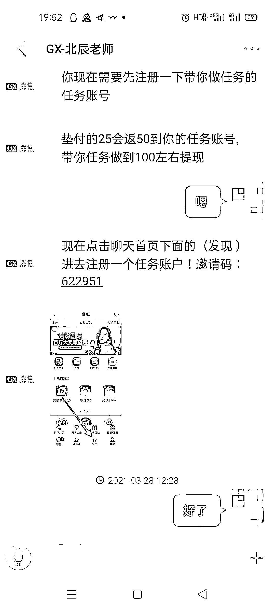
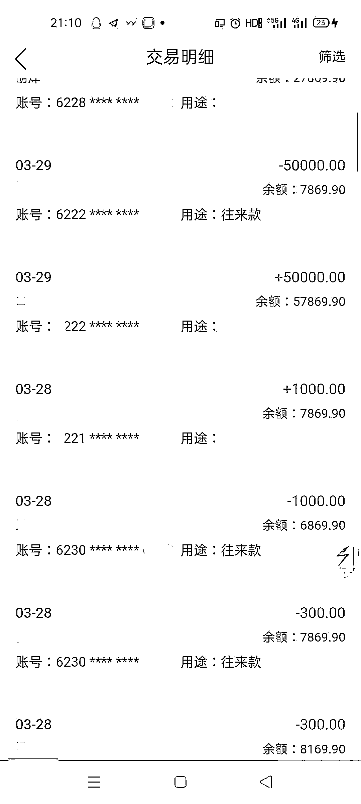
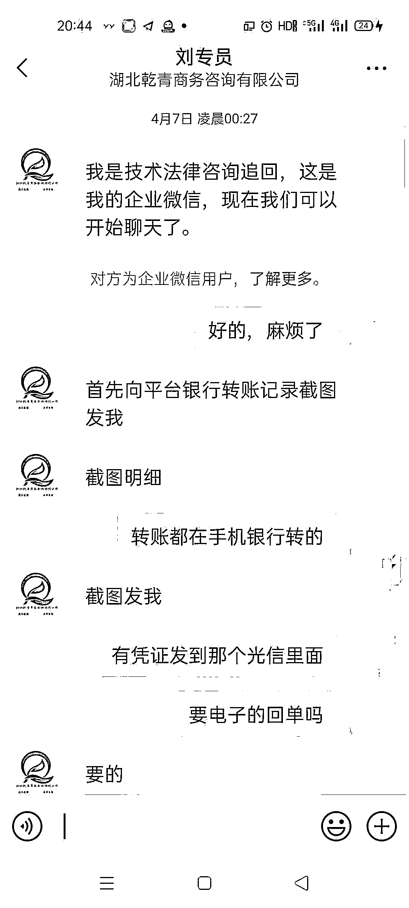
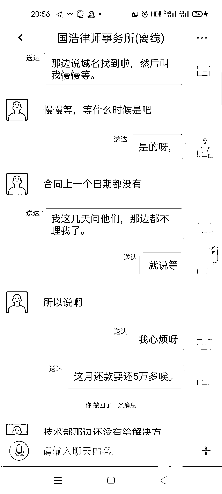

# 一高校老师刷单被骗 46 万，两次“神操作”后又被骗 7 万…

> 原文：[`mp.weixin.qq.com/s?__biz=MzIyMDYwMTk0Mw==&mid=2247523645&idx=6&sn=ed9d27d10ea101b19c788b5b83931a57&chksm=97cb5605a0bcdf1388531e8663a8bb8d9e5a8ee2b564ad39629bad87e0e8d8f88d1b633bef1f&scene=27#wechat_redirect`](http://mp.weixin.qq.com/s?__biz=MzIyMDYwMTk0Mw==&mid=2247523645&idx=6&sn=ed9d27d10ea101b19c788b5b83931a57&chksm=97cb5605a0bcdf1388531e8663a8bb8d9e5a8ee2b564ad39629bad87e0e8d8f88d1b633bef1f&scene=27#wechat_redirect)

你接受过反诈宣传吗？

接受过，我还听得很认真。

那你怎么被骗子套路了？

你觉得他们是骗子，我不觉得啊！

**这是 4 月 19 日台州市某高校老师王女士报完警后发生的一段对话。**

3 月底，王女士通过微信群下载了一个名为“光信”的 app。刚注册完，一名叫“北辰老师”的客服就联系上了王女士。对方指导王女士如何刷数据赚佣金，称垫付多少钱就可以获得多少佣金，佣金超过 100 就可提现。

王女士跟着客服小试几把，短短几分钟就赚了 1400 元。这让王女士很是高兴。在客服一步步指导下，尝到甜头的王女士继续充值操作，3 万、5 万、6 万投进去，46 万多元的本金翻了近乎一倍。直到王女士想提现却被要求再充值 30 万时，她这才意识到不对劲。

**尽管前阵子接受过反诈宣传，但王女士根本不相信自己会被骗，她脑回路清奇地开始一顿反向操作**：先是上网找了一家商务咨询有限公司求助，付了 2980 元服务费后没下文；再上网求助“国浩律师事务所”，按对方要求操作下来，损失 51164 元；又找了一家 IT 技术工作室求助，结果再次损失 16500 元。

**这一波操作下来，加上前面被骗的 46 万，总共 53 万多元没了**。在家人的陪同帮助下，王女士来当地派出所报了警，这才有了开头的一幕。

面对王女士的“迷之自信”，办案民警、反诈宣传专员轮番上阵做思想工作。民警指出刷单诈骗的诸多漏洞和大量类似案件，并告诉她后面网上求助的“商务咨询公司”、“某律师事务所”“IT 技术室”都是诈骗公司，王女士终于幡然醒悟，抱着家人失声痛哭。

来源：舟山网警巡查执法，天天防诈骗

← 向右滑动与灰产圈互动交流 →

