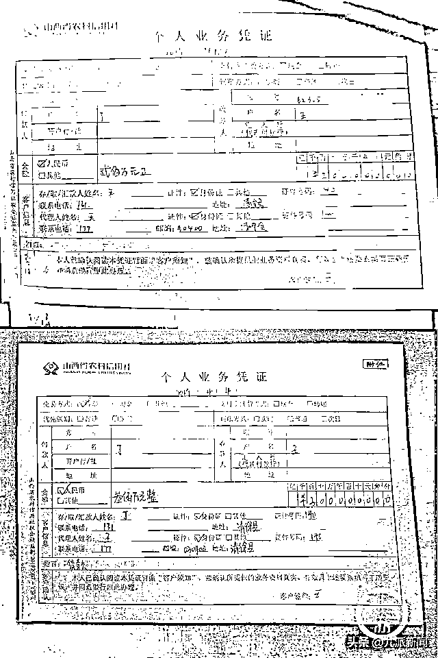
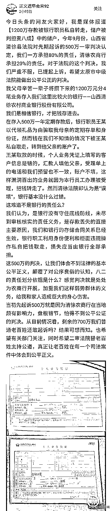
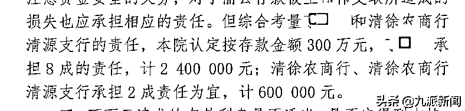
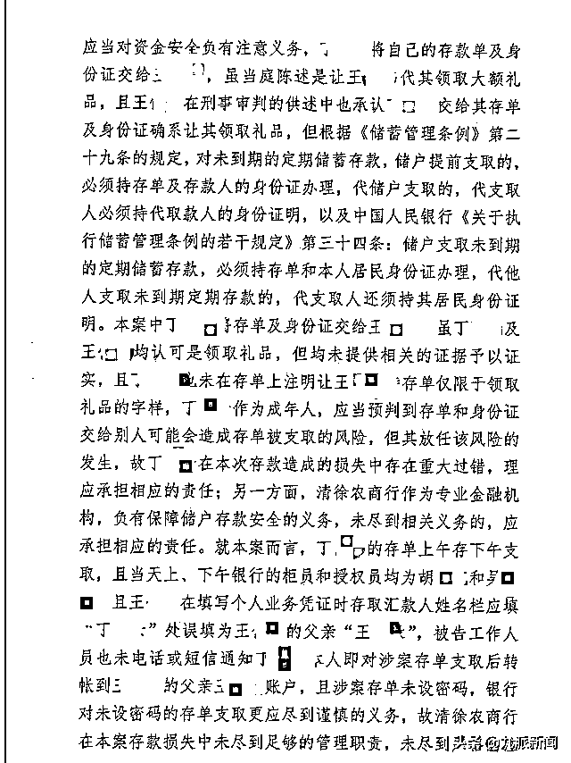
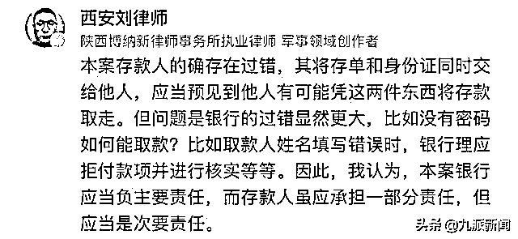
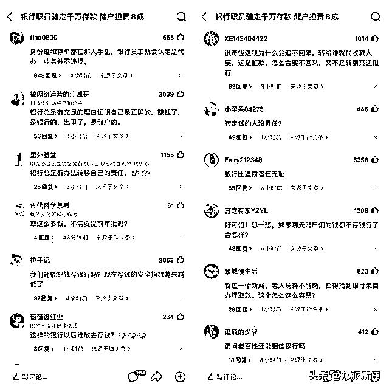

# 1200 万存款被银行职员转走：储户被判担责八成，已上诉

> 原文：[`mp.weixin.qq.com/s?__biz=MzIyMDYwMTk0Mw==&mid=2247523645&idx=7&sn=1aa052686d074373cd607ca1d8a6b914&chksm=97cb5605a0bcdf13a3c358e48b6317beb7b7e562e7c7e0918f720c1bda17eb1b573056c85ab8&scene=27#wechat_redirect`](http://mp.weixin.qq.com/s?__biz=MzIyMDYwMTk0Mw==&mid=2247523645&idx=7&sn=1aa052686d074373cd607ca1d8a6b914&chksm=97cb5605a0bcdf13a3c358e48b6317beb7b7e562e7c7e0918f720c1bda17eb1b573056c85ab8&scene=27#wechat_redirect)

11 月 5 日下午 13：20，“1200 万存款被银行职员私自转走，储户被判担责八成”事件的当事人“正义迟早会来 92”在头条发文，称：对于法院的这个判决，我们严重不服，已提起上诉，希望太原市中级法院能做出公平公正的判决。 

**以下为全文内容：**

网友大家好，我是媒体报道【1200 万存款被银行职员私自转走，储户被判担责八成】中的储户，今年 9 月份，山西省清徐县法院对先期起诉的 500 万一审判决认定，我们一方承担 80%的责任，清徐农商行承担 20%的责任。对于法院的这个判决，我们严重不服，已提起上诉，希望太原市中级法院能做出公平公正的判决。

我父母辛苦一辈子将攒下来的 1200 万元分 4 笔业务存入我们这里比较大的银行——山西清徐农村商业银行股份有限公司。

我们是相信银行，才把钱存进去。

在存入 500 万一年定期存款后，银行职员王某以代领礼品为由骗取我母亲的定期存单和身份证，然而钱在我们不知情的情况下被王某私自取走，转到他父亲的账户了。

王某取款的时候，个人业务凭证上填写的客户信息是错的，汇款人填他父亲，受理单上的电话和我们预留也不一致，账户不填，这样漏洞百出的业务就因为本行员工办理被受理，把钱转走了。然而清徐法院却认为是“误填”，银行基本没什么过错。

这难道不是银行的责任么？

我们认为，是银行没有守住底线防线，未尽到审核核实的责任义务，是存款丢失的直接主要原因，我们和银行的存储合同关系已经生效，银行职工利用身份便利和柜面违规操作私自把钱取走，损失应当由银行全部承担。

这 500 万的判决，让我们体会不到法律的基本公平正义，颠覆了对公序良俗的认知，八二的责任划分依据是什么？感觉判决就是处处为农商行开脱，加重我们这样弱势群体的义务，给我和家人造成巨大的身心伤害。

当初先起诉 500 万就是因为清徐农商行在当地颇有影响力，盘根错节，怕得不到公平公证的判决。从目前情况看，剩余的 700 万我们普通老百姓还敢起诉吗？结果可想而知。也希望有关部门关注，同时希望二审法院替老百姓主持公道，真正让老百姓在每一个司法案件中体会到公平正义。

**此前报道**

“1200 万存款被银行职员私自转走，储户被判担责八成”的事情持续引发关注。

11 月 4 日下午，九派新闻联系上当事人丁女士的儿子王先生，他称，父母做了一辈子生意，因为年纪大了不做生意了，便将攒下来的 1200 万元分 4 笔业务存入当地比较大的银行——山西清徐农村商业银行股份有限公司营业部。

在一次存钱后，银行职员王某以代领礼品为由骗取丁女士的存单和身份证。后来，丁女士多次索要身份证没有成功，去银行查询后发现 1200 万不翼而飞。

王先生称，事发后他们报案，得知钱被王某私自取走，“转到他父亲的账户了。”王某因为此事被公诉，一审二审都判了无期。

与此同时，出于多种考虑，丁女士先就 2 笔业务共计 500 万元将山西清徐农村商业银行股份有限公司（以下简称清徐农商行）告上法庭，请求支付本金和相关利息。

王先生认为，他们和银行的存储合同关系已经生效，应当由银行承担全部损失。满怀期待的他在今年 9 月份收到一审判决，山西省清徐县法院认定，丁女士一方承担 80%的责任，清徐农商行承担 20%的责任。

判决书显示，清徐县法院认为，丁女士作为储户，应当对资金安全负有注意义务。丁女士将自己的存款单及身份证交给王某，虽当庭陈述是让王某代其领取大额礼品，且王某在刑事审判的供述中也承认丁女士交给其存单及身份证确系让其领取礼品，但均未提供相关的证据予以证实，且丁女士也未在存单上注明让王某持存单仅限于领取礼品的字样。丁女士作为成年人，应当预判到存单和身份证交给别人可能会造成存单被支取的风险，但其放任该风险的发生，故丁女士在本次存款造成的损失中存在重大过错，理应承担相应的责任。

丁女士一家不服判决，认为银行应承担全部责任。

一辈子的血汗钱被银行职员取走，丁女士称为此得了高血压，一直反复住院。他们全家也是心力交瘁，“现在路过银行心里面就难受。”

王先生称现在他们已提起上诉，希望二审法院能做出公平公正的判决。

来自陕西博纳新律师事务所的刘律师对此事发表看法：

本案存款人的确存在过错，其将存单和身份证同时交给他人，应当预见到他人有可能凭这两件东西将存款取走。但问题是银行的过错显然更大，比如没有密码如何能取款？比如取款人姓名填写错误时，银行理应拒付款项并进行核实等等。因此，我认为，本案银行应当负主要责任，而存款人虽应承担一部分责任，但应当是次要责任。

大部分网友表达了对该储户的支持以及对银行的质疑：“老百姓还能相信银行吗？”

来源：九派新闻

← 向右滑动与灰产圈互动交流 →

