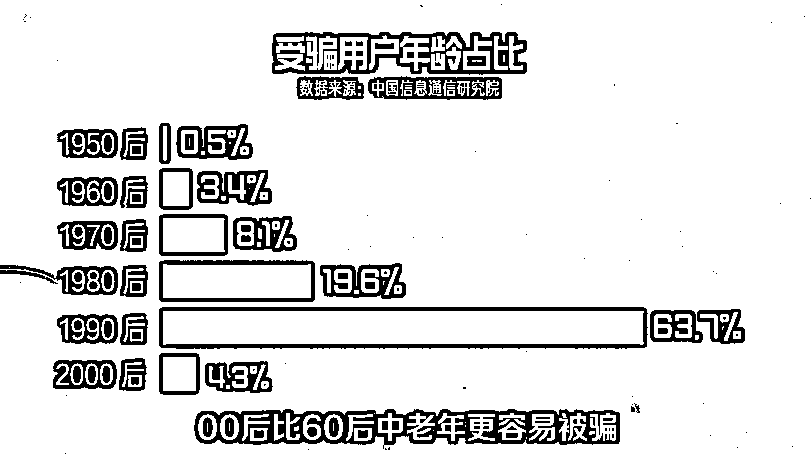
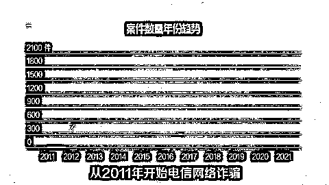
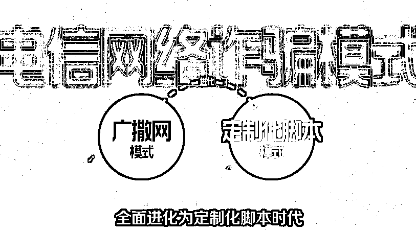
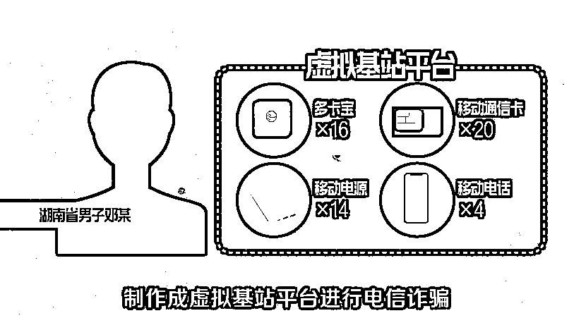
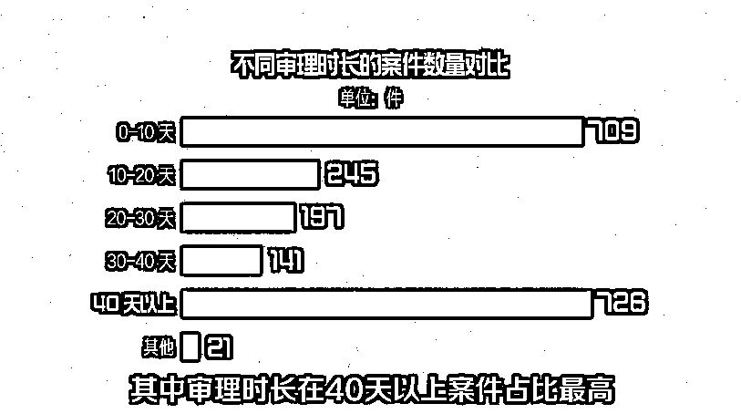
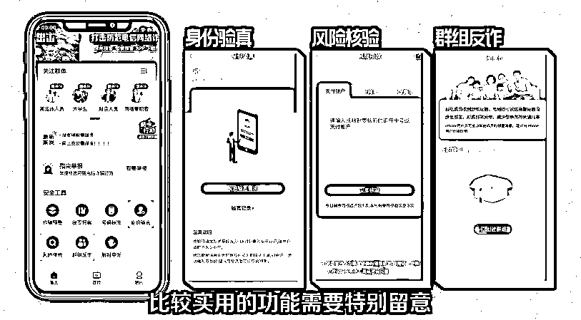

# 90 后成电信诈骗重灾区，为什么年轻人越来越容易被骗？

> 原文：[`mp.weixin.qq.com/s?__biz=MzIyMDYwMTk0Mw==&mid=2247523693&idx=1&sn=176595df1dcd1ab7f6ab1a595cd1f32b&chksm=97cb5655a0bcdf43998b5c911016cd0cb9f8e9399351abc35b976b9a2d10d48b6d2ab1b74048&scene=27#wechat_redirect`](http://mp.weixin.qq.com/s?__biz=MzIyMDYwMTk0Mw==&mid=2247523693&idx=1&sn=176595df1dcd1ab7f6ab1a595cd1f32b&chksm=97cb5655a0bcdf43998b5c911016cd0cb9f8e9399351abc35b976b9a2d10d48b6d2ab1b74048&scene=27#wechat_redirect)

防火防盗，防电信诈骗。

提起电信诈骗，你是不是还觉得只有不懂互联网里门门路路的老年人们才会上当？根据中国信息通信研究院的数据，**受骗用户年龄集中在 90 后，占比 63.7%，其次是 80 后 19.6%。而 00 后受骗用户占比甚至高于 60 后的中老年人。**中国信息通信研究院数据-受骗用户年龄层
这些数据，有颠覆你的常识吗？今年 3 月份，网曝中南财经政法大学一博士生遭遇诈骗，损失近 10 万元。**在诈骗面前，年龄、学历都不是挡箭牌，只看你能不能识破诈骗犯罪的千层套路，及时脱身。**B 站 UP 主“波桑吃遍世界”曾发布视频讲述了自己被“粉丝”骗款 25 万元的故事。在他的经历中，**网络诈骗犯罪已经与时俱进，能够有的放矢，专门针对你拿出万无一失的剧本。**波桑从电话对面的人亮明粉丝身份开始放松警惕，又因对方先转款 2 万元到他的账上而放下戒备，最后一步步走进对方早就设好的陷阱中……作为互联网原住民的**Z 时代青年，反而成了最容易被网络诈骗套路的一大群体。**电信诈骗，为什么在 2010 年后变得越来越猖獗？

**定制化诈骗时代，你的剧本在路上了**

近几年，电信诈骗数量陡增，每个年轻人都要明确一点——你目前还没被骗，并不是因为你多聪明，也不是因为你没钱。**适合你的“剧本”还在路上，并且接近的速度已经越来越快，只等一个时机。**从 2011 年开始，**电信网络诈骗犯罪的数量就在逐年上升，2019 年达到峰值，一年发生 2000 多起案件——这还只是每年结案的数量。**要知道，全中国每一天接到的境外诈骗电话就有 10 万多次，相比这结案的 1000 多个，无法追回钱款、甚至连骗子都无影无踪的才是绝大多数。这也是为何近两年电信诈骗开始受到越来越多关注的原因。电信网络诈骗案件数量的年份变化趋势
这里和大家解释两个核心问题，来揭开中国第三大黑色产业的面纱。第一，**为什么电信诈骗普法教育做了 10 多年，还是有越来越多的人被骗**，甚至高学历受害者越来越多，涉案金额越来越大？简单来说，这都是因为科技水平日益发达。近几年，**电信网络诈骗已经从传统的“广撒网模式”全面进化为“定制化脚本”时代。**电信网络诈骗模式近几年的变化
网络技术的发展带来了两个后遗症，**一是加剧了隐私的泄露。**10 年前，我们能泄露的还只有手机号，如今需要输入我们更多隐私信息的软件越来越多，仅通过一串手机号，就能将姓名、身份证、家庭关系，甚至平台注册密码连根拔起，再利用最基础的黑客手段，用一个平台的密码击溃更多平台防线，进而得到你的消费习惯、人脸信息、声纹信息等更多隐私，并且，获取的难度和成本已经越来越低。有了这些隐私信息，骗子就有办法建立信任，得到恐吓你的第一个杀手锏。**第二个后遗症则是人工智能开始被不法分子利用。**和科幻电影里进化出个人意志的 AI 不同，现实中人工智能最大的威胁并非替代人类的工作岗位，而是经过大量的数据训练和深度学习后，计算机已经可以准确地判断一个人的喜好、心理状态，甚至模拟人类做出的决策。**诈骗犯有了大量精确到我们每一根汗毛的隐私信息，再通过人工智能系统，可以在短时间内生产出千万个定制化的诈骗脚本。**今年 2 月，广州抓获的电信诈骗犯罪团伙中，技术骨干 5 人，有 3 人是研究生学历，2 人是本科学历，专业都是计算机和信息技术相关，高学历在诈骗团伙中的占比已经越来越高。现如今，电信诈骗的套路已经发展到 10 个大类、上千种手段。据中国信通院等单位的统计，**仅 2020 年 1 到 10 月就出现了 260 多种新的诈骗手法。**电信诈骗套路的 10 个大类
你支持国货鸿星尔克，骗子就能冒充官方粉丝群发福利；你没接种第二针疫苗，诈骗犯开始发放限定疫苗资格；疫情反复宅家网购，能遇到包裹感染需要配合销毁；工作岗位上负责业务往来，还有人冒充领导骗你的业务款；研究数字货币，就有人伪造交易平台；还没退个人所得税，内部操作高额退税的团伙又找上门来……几类定制化诈骗脚本
这些还只是诈骗定制化时代的冰山一角。**他们每一秒钟都在更新迭代，你永远无法预知专属于你的诈骗脚本，会在什么时间以什么方式接近你。**

**新型诈骗，为何这么难以侦破？**

为什么诈骗犯这么难抓，转出去的钱基本很难追回？这是新型诈骗案丛生的第二个核心问题。相信很多人都有过这样一个经历——近两年虽然反诈骗宣传已经越来越普及，我们都知道诈骗团伙的**成员多来自云南、广东、湖南、福建等地，但仍然可能接到这种带着浓重口音的诈骗电话，说自己是北京公安。**出戏归出戏，你更需要警惕两点。首先，**这类诈骗电话基本都是诈骗团伙在筛选受害者，如果这么蹩脚的套路你都能上当，那后面自然会有更专业的客服介入**，如果没中招，他们也不必在你身上浪费时间，自然就把你排除了出去。第二，**你接到的这通电话，对面很可能只是个外呼机器人。**人工服务每天能打 300-500 个电话，一个外呼机器人每天能打 5000 个电话，且一个人可以同时控制几十个端口，诈骗效率成倍上涨。这就是诈骗犯难抓的一大关键——**传播手段隐蔽。**机器人和人工诈骗的效率对比
**新型诈骗犯，利用随身携带的移动伪基站就能接入你的 4G 信号，窃取信息、群发诈骗短信。**2020 年，湖南省男子邓某曾使用 16 台多卡宝、14 个移动电源、20 余张移动通信卡、4 部移动电话，制作成虚拟基站平台进行电信诈骗，甚至类似的群呼群发软件，还能做到远程操控、机卡分离。仅通过一个电话号码，别说找到人了，连呼叫设备的位置都极难追踪。新型诈骗犯的虚拟基站平台既然找不到人，第一时间追回被骗的钱款总不难吧？无论取钱还是转账都要通过银行，那是不是应该有迹可循？但真实情况是，**除了手机号难以追踪，在身份信息泛滥之后，无论银行卡、QQ 号还是 IP 地址，全部都无法对应到真正的诈骗犯。**可以说，一个有组织的电信诈骗团伙，可追溯到的 5 层内的信息全部都是假的。他们手握大把的身份证、银行卡，100-500 元一套，有数字证书动态密码。只要你把钱转出去，专门负责洗钱的“水房”就会在 5 分钟之内将钱分成多笔小金额，转账 3-4 次到不同的银行卡上，再利用“车手”通过小地方的银行 ATM 或者 POS 机提现。**这套流程，前后时间最多不超过半小时。**试想一下，在被骗后的 5 分钟内你能做什么？在骗子提现前的半小时，警察又能做什么？有这样一份电信诈骗犯罪大数据分析了从 2011 到 2021 年的 6818 个案例，其中，审理时长在 40 天以上的案件占比最高——主要是因为**网络信息技术的不断发展，使犯罪分子的网络接入地、犯罪地、同伙都无法查证确认，导致审理周期不断拉长。**不同审理时长的电信诈骗案件数量对比
再强大的警力，在面对极其隐蔽的作案手段和身份信息泛滥时也会十分无助。

**无孔不入的电信诈骗，必须防患于未然**

极低的犯罪成本，外加超高的回报，**电信诈骗现在已经有超过 15 个工种、多级下线，科技手段也越来越复杂，成为继黄、赌之后的第三大黑色产业。**这也是为什么反诈警官老陈都要出来做主播，大力宣传全民反诈 APP 的原因。目前，解决诈骗最好、也是唯一有效的办法，就是防患于未然。可往往事态变得严重后，轻视危险甚至嗤之以鼻的人也随之增多。你觉得自己没钱就不会被骗？诈骗犯会帮你借钱，甚至会先给你打钱。**面对诈骗犯的利益诱惑，受害者普遍存在一种赌徒心理：相信了对方，就可能大赚。**受害者的赌徒心理
浙江公安在走访诈骗受害者多年后发现，有一句话，他们中的绝大多数人都曾说过：**“我知道这可能是假的，但我就是想试试。”**但真正被骗之后，受害者的头脑又极其清醒，只是此时，他们生活的一部分已经被彻底摧毁。所以，当面对逐渐走向智能化的新型电信诈骗时，你应当比以往更多一分警惕。全民反诈 APP 里这 3 个功能——**“身份验真、风险核验、群组反诈”非常实用，可以早做预防。**全民反诈 APP 里的 3 大实用功能
在面对诈骗犯的“恩惠”之前，至少你要记住这几点，别让已经过时的套路又套到了你。最后，**一段反诈口诀送给大家**——动动手就能刷单赚钱，不会轮到你；查查信息可以，下载一堆东西不行；无抵押还免息的贷款，不如直接送钱给你；人美声甜的小姐姐，不需要网恋；战无不胜的投资大师，没必要帮你；真正的领导，不会用自己的微信收巨额现金；警察在到你家门口之前，永远不会让提前你知道。如果这些你都懂，也请转告你身边还不那么清醒的人。**时刻保持警惕，别忘了电话的另一头是价值千亿的黑产，已经有越来越多高智商的人被骗**，别忘了每天都有 10 万个电话正在撒网，也别忘了关于你的剧本正在悄悄接近。

← 向右滑动与灰产圈互动交流 →

# 原文：[`mp.weixin.qq.com/s?__biz=MzIyMDYwMTk0Mw==&mid=2247523693&idx=2&sn=76ed3a7eff40ae93bbf7d13514889d3f&chksm=97cb5655a0bcdf43ca1425301bca549fbdfd47c2506b6caceef57561a791d6cbc7bd8c75151b&scene=27#wechat_redirect`](http://mp.weixin.qq.com/s?__biz=MzIyMDYwMTk0Mw==&mid=2247523693&idx=2&sn=76ed3a7eff40ae93bbf7d13514889d3f&chksm=97cb5655a0bcdf43ca1425301bca549fbdfd47c2506b6caceef57561a791d6cbc7bd8c75151b&scene=27#wechat_redirect)