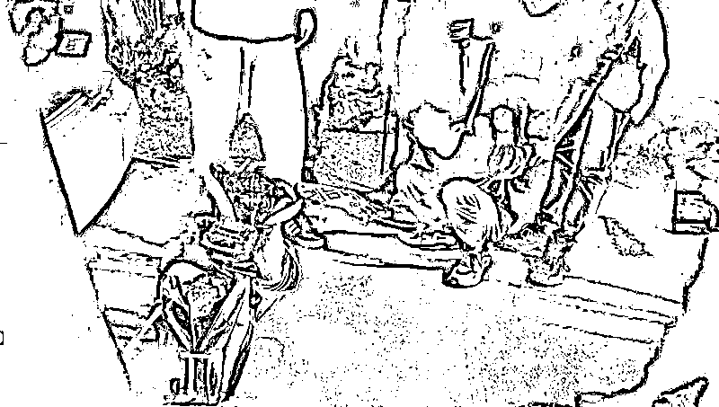
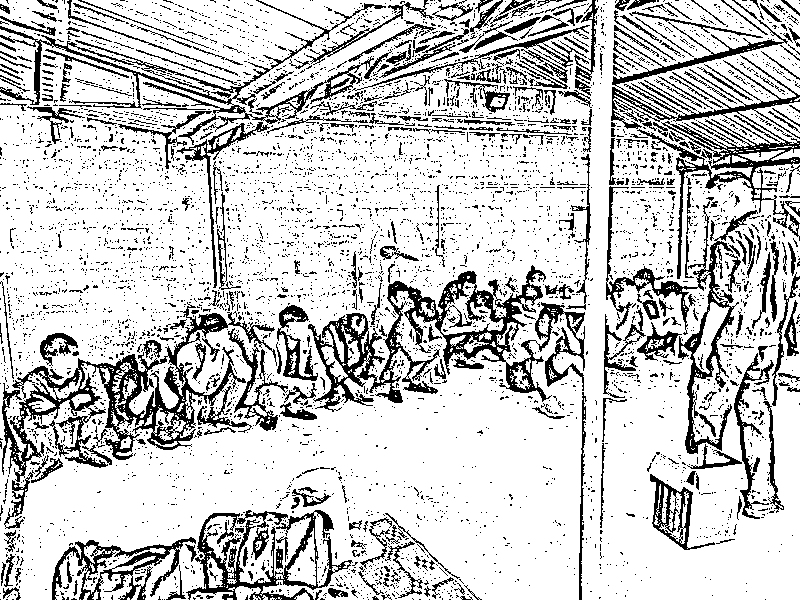

# 偷渡后能“一夜暴富”？有人被殴打、贩卖、关“狗笼”…

> 原文：[`mp.weixin.qq.com/s?__biz=MzIyMDYwMTk0Mw==&mid=2247523693&idx=3&sn=de2c7d2e98692155594e597cd809260d&chksm=97cb5655a0bcdf432d59c74498232ad76f41be2863a8d4b4694f765b8c73f38e475688a20a8d&scene=27#wechat_redirect`](http://mp.weixin.qq.com/s?__biz=MzIyMDYwMTk0Mw==&mid=2247523693&idx=3&sn=de2c7d2e98692155594e597cd809260d&chksm=97cb5655a0bcdf432d59c74498232ad76f41be2863a8d4b4694f765b8c73f38e475688a20a8d&scene=27#wechat_redirect)

[`mp.weixin.qq.com/mp/readtemplate?t=pages/video_player_tmpl&action=mpvideo&auto=0&vid=wxv_2122710070831513601`](https://mp.weixin.qq.com/mp/readtemplate?t=pages/video_player_tmpl&action=mpvideo&auto=0&vid=wxv_2122710070831513601)

警方披露“1·24”组织运送他人偷越国（边）境重特大案件细节

“在非法出入境人员从内地到达边境地区的过程中，经常被藏匿在封闭的大货车车厢内、夹藏在货物中；到达边境后，几十个人挤在一间狭小的出租屋内、树林窝棚中、野外山洞里，甚至是七八个人挤在一个恶臭的猪圈里，每天还要交 300 块钱到 500 块钱，丧失了做人的基本尊严。”在国家移民管理局 11 月 5 日召开的新闻发布会上，云南出入境边防检查总站普洱边境管理支队支队长黄伟披露“1·24”组织运送他人偷越国（边）境重特大案件相关细节时介绍。

黄伟介绍，非法出入境人员侥幸非法出境后，手机马上就会被没收，十几个人挤在一个房间里，不准出门，每天在监视下从事诈骗、为赌场服务等，每天要工作 16 个小时以上，业绩不达标或不服从管理，就会被殴打、电击；有的被关进“狗笼”和“水牢”，身体遭受严重摧残，精神抑郁崩溃；有的被迫卖淫，还有的被赌场、电诈窝点卖来卖去；有的因赌博输了，被逼向家人和亲朋好友借钱还账，甚至被迫从事人体藏毒。

“绝大多数都是在网上受诱骗，以为到境外能赚大钱、赚快钱，然而谎言的背后却是可怕的无尽深渊。”黄伟说。

专案组民警查获毒品。国家移民管理局供图

近期，国家移民管理局会同公安部有关业务局，组织指挥云南出入境边防检查总站和 25 个省（区、市）公安机关，历时 10 个月的时间，成功破获了“1·24”组织运送他人偷越国（边）境重特大案件。这起案件，偷渡、贩毒、诈骗、赌博等多种违法犯罪行为交织叠加，通过侦破此案，抓获违法犯罪人员 1200 多名，彻底打掉了一个涉及多个毗邻国家、涉及我国内 60 余个地市的重大犯罪团伙，一举斩断了多条跨境违法犯罪的通道。

国家移民管理局边防检查管理司司长刘海涛介绍，该案是国家移民管理局组织指挥侦破的一案抓获犯罪嫌疑人最多、涉案地域最广、犯罪网络最庞大、犯罪链条最复杂、多种犯罪交织叠加的一起跨国（境）重特大案件。截至目前，共依法立案 573 起（其中刑事案件 124 起、行政案件 449 起），抓获违法犯罪人员 1292 人，依法对 593 人追究刑事责任，对 699 人予以行政处罚，捣毁藏匿、中转窝点 38 个，查扣涉案交通工具 108 辆（艘），冻结用于组织偷渡犯罪的银行账户 26 个、资金 174.81 万元，缴获冰毒 62.13 公斤。

警方查获的部分偷渡人员。国家移民管理局供图

国家移民管理局提醒，千万不要轻信“跨国赚钱、一夜暴富”的谎言，这些谎言会让你“发财梦变成噩梦，致富路变成绝路”，终究害人害己，追悔莫及。

来源：人民网 ，中国青年网微信

← 向右滑动与灰产圈互动交流 →

