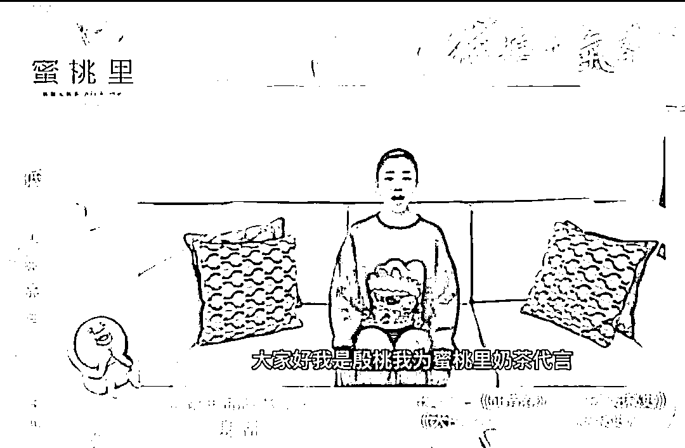
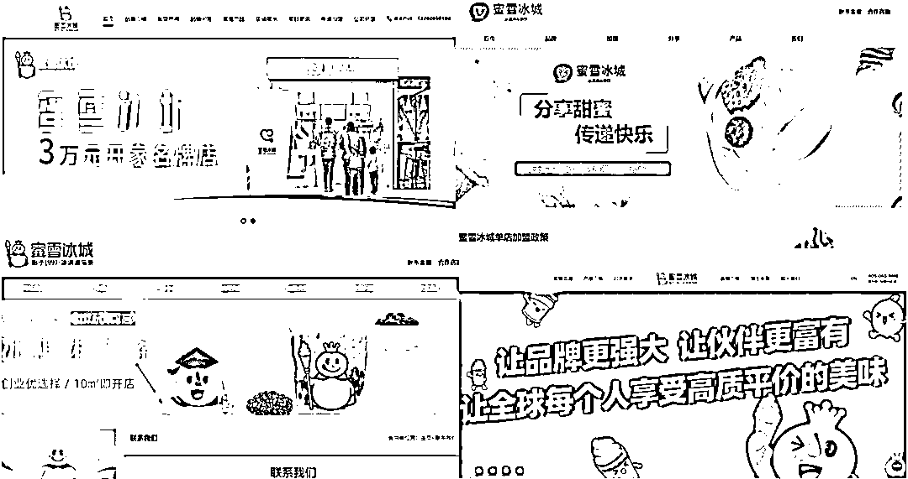
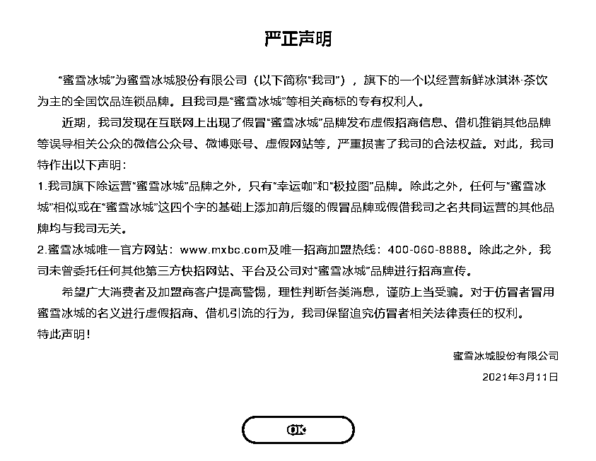
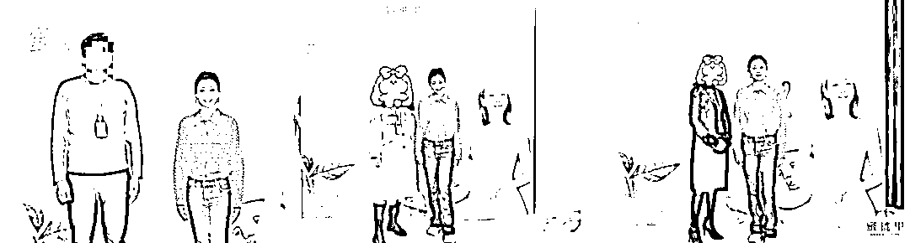
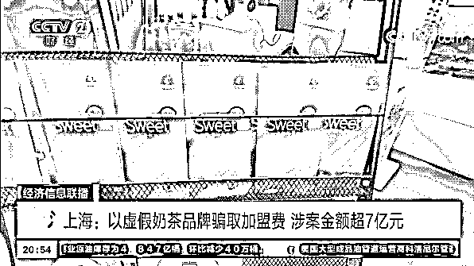
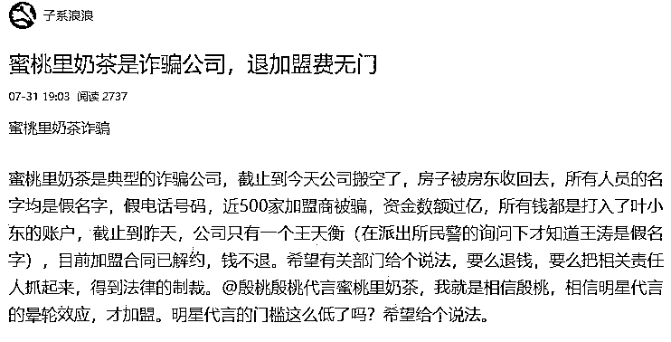
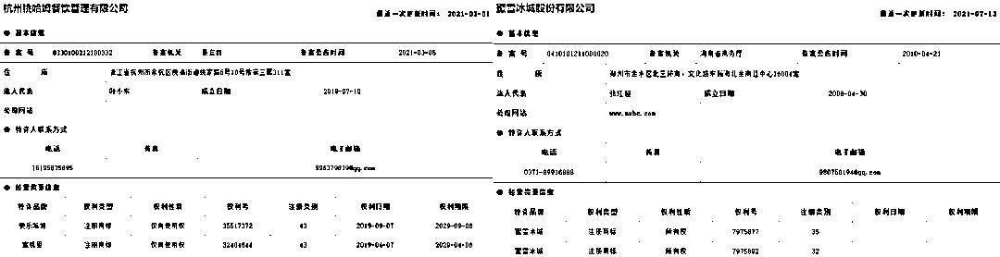

# 我在百度搜索奶茶加盟，结果被骗子收割了

> 原文：[`mp.weixin.qq.com/s?__biz=MzIyMDYwMTk0Mw==&mid=2247523693&idx=4&sn=82fa5dfda31e544e0446c3d65d63c5b4&chksm=97cb5655a0bcdf43928936b00f2cc26a3591750edbe2777ca0f9ec9ad2d8be81f628f21c16f0&scene=27#wechat_redirect`](http://mp.weixin.qq.com/s?__biz=MzIyMDYwMTk0Mw==&mid=2247523693&idx=4&sn=82fa5dfda31e544e0446c3d65d63c5b4&chksm=97cb5655a0bcdf43928936b00f2cc26a3591750edbe2777ca0f9ec9ad2d8be81f628f21c16f0&scene=27#wechat_redirect)

对于此类奶茶快招骗局，有行业人士将其规律总结为先利用明星背书、全方位配套服务等手段打造“爆品”，随即进行大规模招商，短时间内获取巨额加盟费，并借助高出市场价的物料费等进一步攫取利益，但在后期就放任加盟商“自生自灭”，甚至卷钱跑路，再启下一个骗局。马伊琍代言的茶芝兰、郑恺代言的茶主播、李维嘉代言的快乐方程式……被快招公司“割了韭菜”的受害者群体还在不断扩大。近日，有加盟商向雷达财经表示，殷桃代言的蜜桃里也“暴雷”了，而且已于九月被南京市公安局秦淮分局立案。事实上，蜜桃里暴雷早有端倪。早在 5 月时，已暴雷的茶主播加盟商向雷达财经表示，自己向公司采购物料时，将款项打到了叶小东的账户下，而据天眼查，叶小东控股的另一家奶茶加盟公司正是蜜桃里。 对于此类奶茶快招骗局，有行业人士将其规律总结为先利用明星背书、全方位配套服务等手段打造“爆品”，随即进行大规模招商，短时间内获取巨额加盟费，并借助高出市场价的物料费等进一步攫取利益，但在后期就放任加盟商“自生自灭”，甚至卷钱跑路，再启下一个骗局。品牌商赚得盆满钵满，却苦了背后数不清的加盟商。蜜桃里加盟商燕子（化名）告诉雷达财经，包括自己在内，很多加盟商的加盟费是贷款得来的，现在自己已经被压得喘不过气来，但店铺每天仍在持续亏损……雷达财经通过与多位自称受骗加盟商交流发现，受骗过程一般从百度搜索开始。**引君入瓮**
“看到许多奶茶店很赚钱，因此也想尝试下。”据加盟商介绍，通常情况下，有加盟意向的用户会去百度中搜索自己希望加盟的品牌，但这恰恰是踏入深渊的第一步。茶主播加盟商曾称，自己本想做喜茶的加盟商，结果在百度搜索出的相关网站留下联系方式，打来电话的却是茶主播。相同的情况也发生在众多蜜桃里加盟商身上。江淮（化名）看到朋友开沪上阿姨获得了不菲的收入，本想加盟沪上阿姨，却收到了蜜桃里的电话；燕子希望加盟蜜雪冰城，却被所谓的“蜜雪冰城招商经理”建议去开蜜桃里。紧接着，在与加盟商取得联系后，快招品牌就会以市场饱和等理由让加盟商转而加盟自己的品牌，并通过明星代言、“研发、运营和销售都同属一个团队”等话术，引诱加盟商快速签约。时至今日，在百度中搜索“蜜雪冰城 加盟”，依然能看到各种令人眼花缭乱的相似网站，有网站甚至以“官网”自居，网站域名与真正的官网也仅有毫厘之差。如“mxbcnc.com”、“mxbc-tea.com”、“feichadao.cn”等。只有右下角是官方网站然而官网在 2021 年 3 月 11 日贴出的公告显示，蜜雪冰城唯一的官方网站仅有 www.mxbc.com，招商加盟热线也只有 400-060-8888。“除此之外，我司未曾委托任何其他第三方快招网站、平台及公司对蜜雪冰城品牌进行招商宣传。”值得注意的是，明星信用背书并不仅仅停留在话术的层面，而这也是让加盟商们深信不疑、愿意为之付出资金的关键。很多明星都切身参与过快招品牌的线下宣传，当加盟商亲眼见到明星现身发布会，并为品牌拍视频进行宣传，也就打消了心中的最后一丝疑虑。早在茶芝兰时期，与马伊琍的合作就是品牌宣传的重点，在其实体店中，马伊琍的立牌、宣传图等随处可见。而快乐方程式的官方微博还曾@李维嘉本人，配上其出镜的宣传视频并感谢其担任品牌大使。蜜桃里也不例外。据江淮所述，加盟时首先看重的就是殷桃。“她是军艺出身，我就想她代言的话肯定也要经过审核、考察的。我是 3 月 4 号签的合同，当时 17 号蜜桃里在南京香格里拉酒店还有个发布会，邀请我们去现场，很多加盟商都有跟殷桃的合影。”除明星外，蜜桃里还采取各种手段以赢得加盟商信任。如其官网显示，其已与味全、永和豆浆、璞珞咖啡、美团达成了战略合作关系，亦是《中华人民共和国商务部》商业特许经营备案企业，并得到了屁桃君 IP 的官方授权，还是 CCTV 上榜品牌。又如，品牌会给予加盟商一系列承诺，如会在抖音、淘宝上大力做广告推广、成本只要两三元的奶茶可以卖到十几元、公司会免费培训制茶直到学会为止还报销路费、保证一年半以内回本等，并在加盟商到公司考察时营造出火爆的签约场面，为的就是尽快获得不菲的加盟费。**超 400 加盟商受骗，累计损失金额或上亿**
而当加盟商用自己的积蓄，甚至是贷款得来的资金缴纳加盟费后，又会迎来快招品牌的“霸王”条款。以物料为例，燕子表示，蜜桃里合同中有规定，店内耗材和物料必须从品牌处购买，否则就需承担违约金。“网上 4 毛 2 的杯子到采购的时候变成了 7 毛，6 毛 4 的杯子变成了 1 块，而且公司说所有东西不开箱散卖，要么买一箱要么就不买。导致我在很多奶茶都没上的情况下，就买了七八万的物料，关键有的物料基本没用，茶叶十来天才能用一包，一箱就有六十包，这生意还怎么做下去？”燕子还称，“生意不好，公司就会让你做活动，要么第二杯半价，要么买一送一，可是这不仅不能解决根本问题，反而让我们越亏越多。”更让加盟商们感到痛苦的是，随着时间的推移，蜜桃里在新品研发、物料供给等各方面服务上，都开始与加盟店脱节。江淮透露，“因为进物料的时候经常断货，我就去公司找他们。我签的是两个区域的代理，只在一个区域开了店，当时就想把另一个区域的代理给退了，但公司的人和我承诺说七月可能会有二次招商，到时如果没有再把钱退给我。结果七月公司直接搬家了，也失联了。”几重因素叠加下，江淮的净亏损超过 90 万；燕子投了 33 万后，现在手中的资产仅剩些卖不出去的物料，还有不到一个月，房租也将到期。“我现在没钱交房租了，如果关店就全赔，不关的话每天营业额也才几十元，天天都在亏。”目前，燕子的生活已经因为加盟受到了极为严重的影响。“我们家庭条件不好，有两个孩子，家中开支太大，我也是想替老公分担才贷款开了奶茶店。中间还管我妈要了 5 万，结果都搭进去了。当初总部说一二十万就可以，一年半回本，谁知道会变成现在这样。”随着时间的推移，燕子等加盟商才发现，自己之所以出现巨额亏损，是遭遇了快招骗局。5 月时，央视财经曾报道称，上海警方成功侦破一起涉案金额超 7 亿元的奶茶快招诈骗案，90 余名犯罪嫌疑人悉数落网，相关虚假招商网站也均被捣毁。据悉，犯罪嫌疑人为牟取非法利益，成立某餐饮公司，在未经权利公司授权许可的情况下，搭建多个虚假知名品牌奶茶招商加盟网站，设计发布带有“品牌加盟”字样的招商广告。随后，收购或注册 50 余个奶茶品牌，通过设计宣传话术，安排话务员对外推销加盟业务。马伊琍代言的“茶芝兰”正是该团伙 50 多个“马甲”奶茶品牌之一。而“叶小东”被抓、蜜桃里诈骗已立案的消息，则是在 9 月时传出的。 据天眼查，蜜桃里的商标归属于南京迪利西丝餐饮管理有限公司，而叶小东正是该公司的执行董事兼法定代表人。有茶芝兰的经历在前，以江淮为代表的加盟商们希望蜜桃里也能被警方绳之以法，并通过微博等平台发声。“我最后一次确定叶小东被抓是 10 月 12 日去南京秦淮分局，当时那里的领导说可以向我保证，叶小东是被拘留的状态，而他只是马仔，幕后还有主使。”江淮称。 “他还跟我们说，这在中国目前为止是第二例，第一例是上海的茶芝兰，既然蜜桃里已经被受理了，那就会给你们一个交代的。”据燕子介绍，自己曾被派出所告知，蜜桃里加盟商的总数在四五百家。而江淮则表示，其中如果是一线城市的区域代理，加盟费超 40 万，二线和三线城市分别超 30 万、20 万。“我是三线城市的代理，签了两个区，光加盟费就花了 48.6 万，武汉还有一家店投了一百多万，北京、上海、内蒙古、黑龙江、甘肃、青海都有受害的加盟商，算下来总计亏损可能上亿了。”燕子称。**如何识别快招品牌？明星是否需承担连带责任？律师解码**
雷达财经注意到，眼下新式茶饮的市场规模正在急剧扩大。据《2020 新式茶饮白皮书》统计，2020 年，新式茶饮消费者规模已达 3.4 亿人，市场规模超过 1000 亿元，预计到 2021 年会突破 1100 亿。与此同时，奈雪的茶已经登陆港交所，成为“奶茶第一股”，不久前蜜雪冰城即将冲击 A 股的消息也不胫而走，至十月，蜜雪冰城更是已经开出 2 万家门店。不过，新式茶饮也并非“一本万利”的生意，招股书显示，奈雪的茶 2018-2020 年累计亏损超 3 亿元。天眼查数据显示，国内有近六成茶饮企业活不过三年，存活时间在 1 年内的茶饮企业占比为 24.4%，存活时间在 1-3 年的茶饮企业占比 35.0%。行业人士认为，奶茶消费表面上的火爆是众多实际上对情况并不了解的加盟商纷纷涌入投资的重要原因。事实上，加盟商在得到品牌信息的第一时间就可以通过查询其在商务部商业特许经营信息管理网站上的备案，了解到该品牌是否具备加盟资格。如茶芝兰、茶主播、快乐方程式，在该网站上均查不到任何备案信息。北京市盈科（广州）律师事务所合伙人封华清律师向雷达财经表示，备案的审查是判定公司是否有能力开展加盟的条件之一。“备案有硬性要求，要有相应资质，一般来讲有备案的公司，百分之八九十都是更加具有实力的。”“其实国内的正规加盟品牌并不多，也就 4000 多家，这 4000 多家在商务部的网站上是有特许经营备案的。也就是说在中国的市场上，除了商务部备案的 4000 多家公司以外，没有备案的，就是不正规的公司。”不过，快招骗术也在不断升级。如蜜桃里，就已经被杭州桃哈姆餐饮管理有限公司注册了备案信息，与知名奶茶品牌有所不同的是，蜜桃里特许品牌的权利性质为“仅有使用权”，而一点点、蜜雪冰城等品牌，权利性质为“所有权”。对此，北京市中闻律师事务所律师刘彬解释称，使用权是指这个公司从他人那里获得了授权使用商标。“如果他获得了商标使用权，且同时获得了再许可他人使用的权利，也可以开展特许经营活动，但这个需要看他和商标权利人签署的许可协议，通过公开途径不好查。”封华清也坦言，备案的情况与品牌会不会暴雷并没有直接的关联性。“有些公司自己开店很有水平，但并没有让别人加盟我的品牌，之后也开店赚钱的水平。这种情况下冒然去开放加盟，可能就会出事。”“所以说加盟商千万不要去相信什么明星代言，好像有代言的品牌就是正规的，这可能是一个误区，因为很多人不清楚，明星代言本质上在法律上是没有什么意义的，并不是说有了明星代言，品牌后面就不会出问题。”封华清强调。那么，明星是否应该为暴雷的品牌承担连带责任呢？北京市中闻律师事务所律师闫创认为，根据《广告法》的规定，判断公众人物是否涉嫌虚假宣传，主要看其主观上是否明知或者应知，是否对产品了解使用，以及对代言的产品尽到了形式审查义务。“公众人物代言产品前，首先应对产品及其生产厂家进行详细的了解。比如产品是否符合质量认证标准，是否享有注册商标，是否有质量检测报告，广告语是否涉及虚假宣传等。”不过闫创也坦言，明星代言的产品出现问题时，消费者除了正常维权，并没有其他更好的途径。“可以去法院起诉，要求广告主和广告代言人承担相应的责任，或者通过市监局进行协商调解或者要求查处，涉及刑事犯罪的，要求办案机关公正妥善处理。”

← 向右滑动与灰产圈互动交流 →

