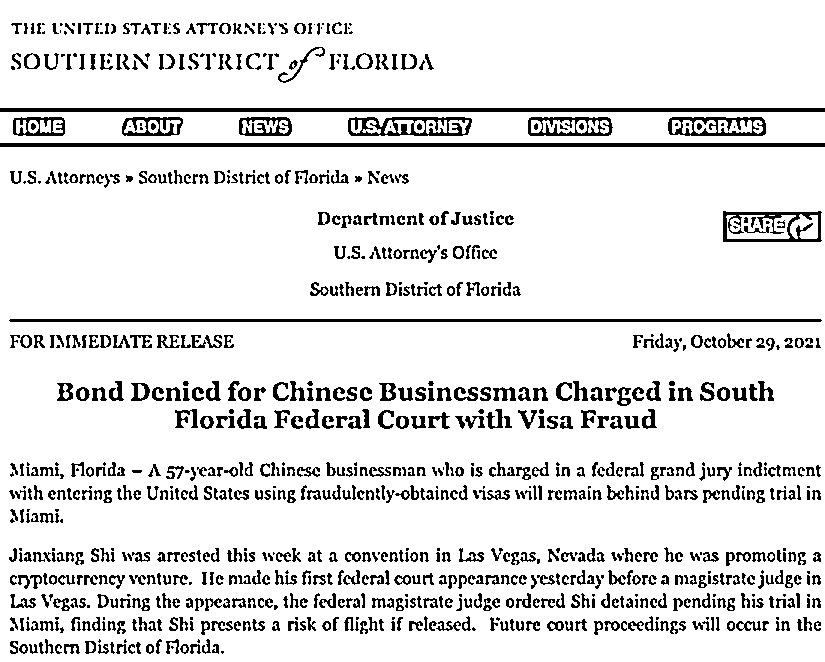
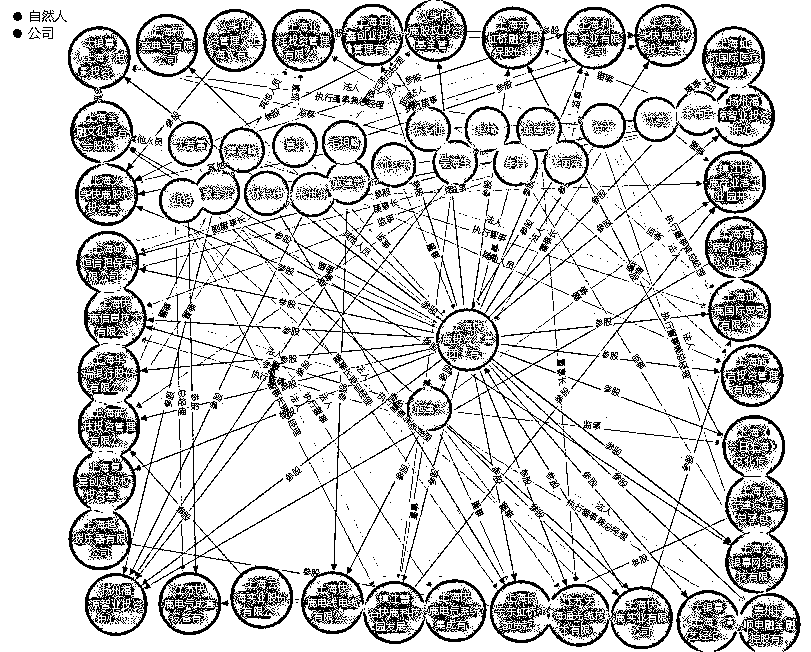
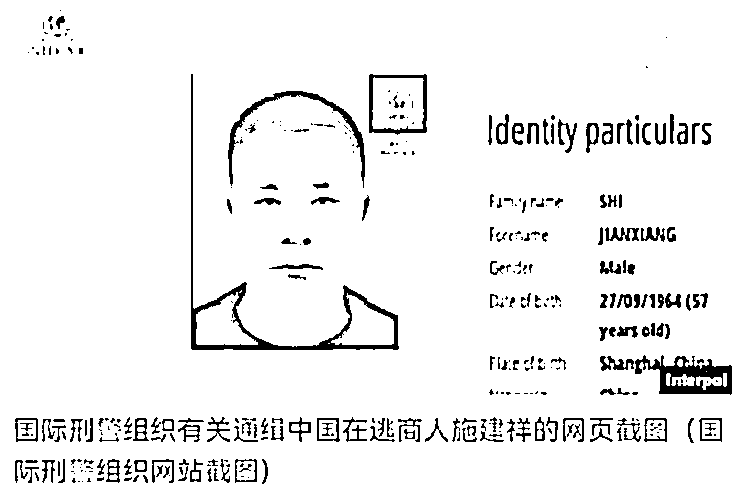

# 400 亿诈骗大案"首犯"被捕，曾致 4 万投资者踩雷！案发后逃至美国，还想"傍上"特朗普

> 原文：[`mp.weixin.qq.com/s?__biz=MzIyMDYwMTk0Mw==&mid=2247523693&idx=5&sn=f45ff38533d2a24e68eb30ee5e969a0d&chksm=97cb5655a0bcdf4311205787137c2fdb70bee2b6f72dbc6817926dc43a0f6e6c0ab088a40c26&scene=27#wechat_redirect`](http://mp.weixin.qq.com/s?__biz=MzIyMDYwMTk0Mw==&mid=2247523693&idx=5&sn=f45ff38533d2a24e68eb30ee5e969a0d&chksm=97cb5655a0bcdf4311205787137c2fdb70bee2b6f72dbc6817926dc43a0f6e6c0ab088a40c26&scene=27#wechat_redirect)

常在河边走，哪有不湿鞋。

一则报道，令沉寂多年的 400 亿诈骗大案再度浮出水面。11 月 1 日，外媒报道称，现年 57 岁的中国商人施建祥在美国拉斯维加斯被捕。据美国司法部的声明显示，施建祥被指控是因为 2 项欺诈和滥用美国非移民签证的罪名，若罪名成立，施建祥或将面临最高 10 年的联邦监禁和最高 25 万美元的罚款。

根据报道的细节可以判断，被逮捕的施建祥正是“快鹿系”集资诈骗案的“首犯”，这起诈骗案始于 2015 年，涉案金额高达 434 亿元，导致 4 万投资者“踩雷”，损失 152 亿，一度轰动中国投资圈。

**在“快鹿系”资金链断裂前夕，施建祥逃逸到了美国，被“红色通缉”接近 5 年。其在美国行事非常高调，接连投资了多家好莱坞影视公司，甚至试图寻求美国政治资源，曾向美国前总统特朗普关联的政治行动委员会捐款，并与特朗普合影。**

施建祥被美国警方逮捕

出来混，迟早是要还的。昔日 400 亿的集资诈骗大案的“主谋”之一施建祥，竟被美国警方逮捕，再一次引发关注。

11 月 1 日，华尔街日报发布消息称，现年 57 岁的中国商人施建祥在美国拉斯维加斯被捕，他被指控以欺诈手段获得的签证进入美国。

这则报道指出，被捕的施建祥是中国电影《叶问 3》的投资者之一，曾向美国前总统特朗普关联的政治行动委员会捐款 5 万美元。

由此大致可以判断，施建祥是曾经在中国轰动一时的“快鹿系”集资诈骗案的操盘人之一，涉案金额高达 434 亿元。

美国司法部官网的一份声明中披露了施建祥被捕的更多细节，上周，施建祥在拉斯维加斯举行的一次有关加密货币投资的会议活动上被捕。10 月 28 日，施建祥首次在美国联邦法院出庭，联邦治安法官认为他有逃跑的可能，下令将其逮捕拘留，将继续在迈阿密监狱等待审判。

**关于施建祥被捕的原因，美国司法部在声明中表示，施建祥在获取美国非移民签证的过程中撒谎，并用以此获取的两张签证于 2016 年在迈阿密国际机场进入美国。美国联邦大陪审团指控施建祥 2 项欺诈和滥用美国非移民签证的罪名。**

根据起诉书，施建祥在 2016 年通过欺骗从而持有 2 张非移民签证，在 2017 年 2 月使用“Long Niu”身份的旅行证件进入美国，后续以“Morgan Shi”的身份居住在加利福尼亚、内华达州。如果罪名成立，施建祥或将面临最高 10 年的联邦监禁和最高 25 万美元的罚款。

值得一提的是，因涉嫌集资诈骗而逃往美国，施建祥早在 2017 年便被国际刑警组织纳入红色通缉令名单。

逃逸美国期间，施建祥一度消失在了公众视野之内，现如今，美国司法部门的逮捕，令这位 434 亿集资诈骗案的“首犯”，再度浮出水面。

400 亿集资诈骗大案的“首犯”

在逃逸美国之前，施建祥及其背后的“快鹿系”一度在中国投资圈掀起巨浪，主导了一桩金额高达 434 亿的集资诈骗大案。

施建祥出身于 1964 年，白手起家，通过拿到美国西方石油公司的华东区代理权获得第一桶金，起势于 1999 年的国企改革大潮，通过低价收购上海 4 家濒临破产的国有企业，其中包括了上海快鹿电线电缆有限公司，这便是后来的快鹿集团“雏形”。

2010 年、2012 年，施建祥的快鹿集团分别拿到了小贷和融资担保两块牌照，正式进军金融行业。随后几年内，快鹿集团依靠当时爆火的互联网金融、影视投资快速壮大，通过“左手明星、右手资本”的模式疯狂吸纳民间资金。

施建祥曾介绍称，快鹿集团的核心主业是“互联网+金融+影视”，并不讳言其投身影视三个好处：明星效应为快鹿增信、影视投资获得票房收益权，进而并购推动上市公司股价；再包装影视项目成理财产品向公众集资。

快鹿系将票房作为资产证券化，以票房收益的预期从旗下 P2P、众筹平台等渠道从而筹集资金，其融资方为合禾影视、大银幕发行，通道方为基金公司，资金方来自 P2P 平台，约定的年化收益甚至超过 8%。

这一过程中，快鹿集团炮制了大量的关联公司，注册的关联企业数量多达 328 家，并先后入股神开股份、十方控股，并拿下控制权，再操控上市公司投资快鹿系的影视剧，然后通过虚假票房推高上市股价，快鹿系便借此获得丰厚“浮盈”。

图片来源：天眼查 APP

快鹿系崩盘的导火索自于 2016 年 2 月的《叶问 3》，其偷票房被多家媒体曝光，融资的全链条也被深挖曝光，并引发警方调查，最终“爆雷”。当年 3 月，快鹿集团下属融资平台出现大面积兑付危机。

2019 年 1 月，“快鹿系”集资诈骗案在上海公开审理宣判：涉案人施建祥组建个人控制的快鹿系集团，非法集资 434 亿元均被转入其个人及快鹿集团实际控制的银行账户，除 282 亿余元被用于兑付前期投资者本息外，其余款项被用于支付各项运营费用、股权收购和影视投资等经营活动、转移至境外和购置车辆以及个人挥霍、侵吞等，判处 15 名被告人无期徒刑至有期徒刑 9 年不等，并处罚金等。

被红色通缉近 5 年，“傍身”特朗普

尽管“快鹿系”集资诈骗案完成了审判，但投资者追缴回投资资金难度也不小，多达上 100 个空壳公司掩护施建祥与快鹿集团将资金汇到境外，共造成投资人实际经济损失超 152 亿元。

另外，这则集资诈骗大案“首犯”并未落网，在“快鹿系”资金链断裂前夕，施建祥已经逃往香港，并在香港期间谎称生病治疗，通过指派新的集团高管遥控指挥快鹿集团运营；其后以欺诈手段获得的签证进入美国。

2018 年 6 月 6 日，中纪委国家监委网站发布“百名红通”人员名单，施建祥为 31 号通缉犯，疑似藏身洛杉矶，引起外界关注。但中国与美国之间没有引渡协议，因此抓捕施建祥的难度较大。

值得一提的是，身怀巨款的施建祥来到美国后，行事非常高调，连续投资了多家好莱坞影视公司，其中包括在美股上市的 Moregan 电影公司，以及 20 多家美国商业机构。

**另外，施建祥还试图寻求美国政治庇护，其曾通过 Moregain Capital Group 投资公司为一个与美国时任总统特朗普相关的政治行动委员会捐款 5 万美元，且其曾在一场募款活动上与特朗普合影。**

但在特朗普下台后，施建祥渐渐低调。直到今年 9 月，美国证监会的一则退市公告让其进入公众视野。美国证监会宣布，取消施建祥在美国控制的影视投资公司 Moregain 的上市资格，因为 2019 年以来，这家上市公司一直没有发布财务报告。

现如今，施建祥更是因为 2 项指控，已被美国警方逮捕拘留，后续将面临法庭审判。如果获刑，中国要引渡施建祥的难度或许会更大，或许要等待其在美国刑满释放之后，再进行抓捕引渡。

据悉，“红色通缉令”的有效期一般是 5 年，期满后如果仍没抓到犯罪嫌疑人，可以再续 5 年。从 2017 年 1 月对施建祥发出红色通缉令至今，即将接近 5 年期限。

来源：券商中国，利箭在行动

← 向右滑动与灰产圈互动交流 →

