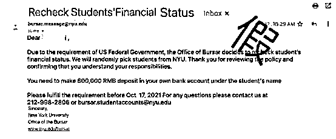
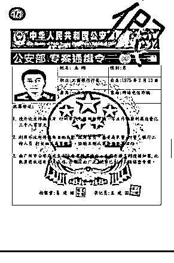
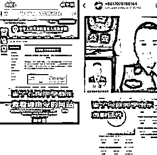
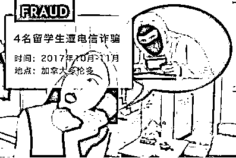
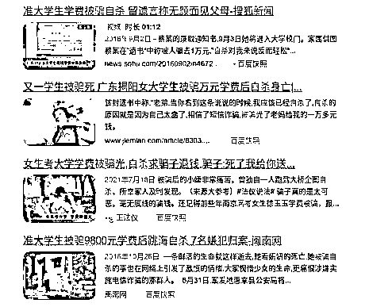
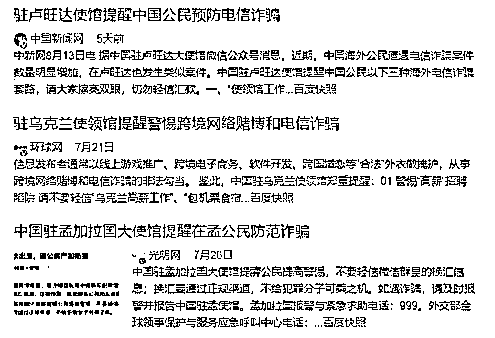

# 他们就是这样骗我们的！

> 原文：[`mp.weixin.qq.com/s?__biz=MzIyMDYwMTk0Mw==&mid=2247523754&idx=2&sn=3bf1c4dbbab4fae6e43af8ad68e8f3f2&chksm=97cb5692a0bcdf84995d6516ec2f379e1c845070bde4f3e6ddde66e3fd8223226bf8bfd1b0ce&scene=27#wechat_redirect`](http://mp.weixin.qq.com/s?__biz=MzIyMDYwMTk0Mw==&mid=2247523754&idx=2&sn=3bf1c4dbbab4fae6e43af8ad68e8f3f2&chksm=97cb5692a0bcdf84995d6516ec2f379e1c845070bde4f3e6ddde66e3fd8223226bf8bfd1b0ce&scene=27#wechat_redirect)

前几天，和国内一位留学生家长闲聊过程中，家长无意间吐槽了这么一件事： 

孩子在美国纽约读大学，学业很忙，孩子很用功。感觉留学生活一直很顺利，家长也很安心。

但孩子最近几周有点奇怪，连连找他们要钱。每次都有不同的理由，听起来还都在情理之中，一会儿说有好朋友生病住院，不愿让家人知道，所以找他借钱治病。一会儿说借朋友车练手，不小心把车剐了要修。家长每次也都毫不犹豫，立马转钱过去。

可昨前天孩子又来要钱，说接到学校邮件，要求在账户里加存一笔钱，以证明学生自身经济状况。家长这次起了疑心，因为从未听说美国学校还有这样的要求，要求孩子把学校邮件转来看看。没过多久，孩子还真把学校邮件的截图发过来了。

家长说，不要截图，你把邮件直接通过邮箱转来，以便家长向学校核实一下。

孩子推脱说太麻烦，忙不过来，反复催家长尽快打款，以免违反校规，影响自己的学业。

家长也嘀咕，平时都定期给他打生活费，孩子也很节省，每次问起来都说够用。怎么最近突然要钱如此频繁？会不会是孩子最近谈恋爱了，花费增多，所以变着法找家长要钱？或者是不是陷入传说中的“校园贷”，被高利贷套路了，遇到问题需要用钱解决？

几次试探着问孩子，孩子要么矢口否认，要么显得极不耐烦，不回音讯。

家长也不敢再多逼问，只好半信半疑地继续打款，还不停自嘲感叹，这下终于体会到网上所言，孩子一留学，就是卫星发射升空了，通讯就此断断续续，偶尔传回点微弱信号，“打点钱，打点钱”......

听完家长一番牢骚，我立马感觉不妙，马上提醒他：从孩子这些反常举动看，大概率是碰上电信诈骗了。你马上问问孩子，最近有没有接到什么奇怪电话，比如什么自称大使馆或国内公检法机关的？有没有人说孩子卷入一个什么案子，需要配合查账什么的？要提醒孩子千万别上当受骗，乱转钱款。

结果第二天一早，家长就给我打来电话，很激动，说果不其然，孩子就是被骗了。一开始孩子还不肯说实话，还哭着说此事怪他自己不小心，与家长无关，但很快就能解决，叫家长不用担心。家长又心疼又着急，反复劝导提醒，孩子才慢慢回过神来，感觉自己也许是真的被骗了，也才终于向家长说明了由来。

原来，一个多月前，孩子接到了一个自称是中国驻某国总领馆官员的电话，说有国内寄来的一个包裹待取，让他在电话里按提示音操作。几番操作后，就接到信息说国内公安机关要与他联系。随后，分别自称是国内公安局张警官、孙队长、检察院林检察官等人先后同他联系，来电显示号码还真的都是有关部门网上公布的电话号码，说他涉嫌参与一起信用卡诈骗案，需要配合调查，否则会有牢狱之灾。几位“警官”还相互配合、印证，说得有鼻子有眼，还发来了相关证明材料。一来二去的，孩子自是惶恐不已，深信不疑。

（图片来自网络）

被“带进沟”后，为了自证清白，孩子就被骗子一步步诱导，开始了前后长达近一个月的“配合调查”。先是单开一个了 skp 通讯软件，与“警官”单线联系,然后又是做笔录，写材料，又是交保释金，还一次次根据指令往指定账户打款，以证明自己有高额存款，有经济实力，不会参与犯罪。

“警官”们“语重心长”，一边说相信他的无辜，还“善意”要求他绝不能向任何人尤其是父母透露任何消息，不然会牵连到他们，一边还专门教他如何向父母要钱，帮他编理由，还特地帮他制作了所谓的学校邮件截图和一些资料照片，目的就是既要尽快从父母那搞到钱，又不要让父母疑心。

（图片来自网络）

孩子起初也觉得事不大，很快就能说清，于是就对“警官”的话言听计从。就这样，前前后后已经向骗子转款了近三十万元，接下来原本还要继续转款的。

所幸家长及时发现了，接下来怎么办？我即告家长赶紧行动，一是断联，让孩子立刻断绝和骗子所有联系；二是报警，根据已经掌握的相关信息，在国内和美国当地同时报警，并向使领馆报备；三是止损，立即冻结相关账户。

家长还有些担心，说经过一个多月的密集联系，骗子已经完全掌握孩子的详细住址信息和日常生活情况等，会不会找上门来，滋事报复？

我告诉他们，不要有任何思想压力，从目前情况看，这些诈骗分子大多都猫在我国周边地区的一个阴暗角落里，线上作案，不敢见光，也去不了什么其他国家。只要我们及时报警，正常注意防范，相信这伙人也没那个胆量跳出来作死。

（图：2019 年，中柬警方联手打击电信诈骗，境外抓捕数百名嫌犯 ）

一阵紧张忙碌后，家长告之，在国内反诈中心指导和有关银行积极配合下，及时阻断了几笔转账，将损失降至了最低。

事到此步，终于可以稍微松口气了。这位家长和孩子虽已经一半掉进了圈套，所幸及时警觉，才避免了更大损失。

但放眼海外，又有多少类似骗局每天都在上演，又有多少留学家庭屡屡中招。

我不禁想起年初一个留学生家长朋友也遇到同样版本的故事。故事的开始和上述的差不多，原本老实乖巧的女儿，突然也开始不时以各种名义向家长要钱，家长也一次次转款，甚至为此还和孩子发生争执。而后来的发展却更加让人心惊肉跳。

经过前后几笔骗款得手之后，电话那头的骗子感觉可能快被识破，就准备最后再捞一笔就撤，于是放出了最狠毒的一招：“虚拟绑架”！

骗子以调查进入最后阶段为由，哄骗女孩子找一个偏僻地方躲起来，不要让任何人找到，断绝与外界所有联系，待两三天后就可结案并返还全部钱款。女孩儿也乖乖地听话了，一人坐车去了外地，找了个酒店，关机、自己隔离起来。

与此同时，骗子立马给国内家长打电话，声称“你女儿被我绑架了，不能报警，一手交钱，一手放人，不然......”

家长赶紧联系女儿，果然关机，问女儿的同学老师，谁都不知道女儿去哪儿。“女儿失踪了！”一家人的慌乱、崩溃、种种不堪设想的可怕场景，不断冲击着他们的心理防线。随后的每分每秒，都是无比的痛苦煎熬......

如果没意识到这其实是一个骗术（为了更逼真，有的骗子甚至会以与犯罪嫌疑人作技术比对为名，哄骗孩子自拍一张被绑的照片，或录一句呼救的声音，然后转发给家长），没有几个家长能扛得住这种心理压迫。即便立刻报警，要查找起来也如大海捞针。万般痛苦和无奈之下，面对电话那头骗子的步步紧逼，按他们要求打款转钱，哀求不要伤害孩子，也许就是唯一选择了。

（图片来自网络）

......

后来在使馆和当地警方协助下，虽然终于找回女孩，安然无恙，澄清真相，虚惊一场，但汇款损失已然难以追回，而那“孩子被绑架”的几十个小时，带给家长的心理煎熬，更永远难以抹去。几个月后，孩子的妈妈和我聊起这段回忆时，还默默流泪神伤，忿忿不已，“这帮诈骗分子，真该千刀万剐！要有机会我真想当面问他们一句，你们的父母怎么会教出你们这群伤天害理的东西？！”

是的，电信诈骗的故事听说了很多。但个中滋味，未曾亲历，就难以体会那种穿骨之痛。

近年来，针对海外留学生的电信诈骗十分猖獗，已成为一类新型海外安全风险。据不完全统计，有关受骗案件已有数百起，涉及几十个国家，直接经济损失超过 2 亿元人民币。这背后，又是多少家庭的心酸血泪。

一些家庭被骗之后，日常生活陷入窘境，甚至引发了严重家庭矛盾。

一些留学生被骗之后，自责、焦虑，无法自拔，羞于见人，渐渐患上严重的心理疾病甚至忧郁症。

更不能忘记，国内已发生多起学生被骗后自杀死亡的悲剧。

表面看只是个谎言电话，但却是一把杀人不见血的尖刀！

表面看只是骗点钱财，图财不害命，但却是比诛心更恶毒的摧残！

诈骗分子所造成的，不仅是一个个家庭的巨大损失，也是一个个无辜孩子和家长的心灵创伤。他们所毁坏的，不仅仅是孩子们对世间人生的真善期待，也是维系整个社会运转的诚信之基。

严厉打击电信诈骗，刻不容缓，也绝不留情！

预防是最好的保护。电信诈骗“魔高一尺”，防范意识就要“道高一丈”。希望广大的海外留学生和国内家长们，多看领保宣传，多听反诈提醒，增强防范意识，提高警惕，识破套路。遇到可疑问题，及时向驻外使领馆和国内公安机关核实、求助、报警。

只要大家“时刻绷紧防范之弦”，一起筑牢思想防线，就一定能去除电信诈骗滋生蔓延的土壤。

期盼天下无诈，百姓平安！

来源：环球网   作者：赵岭 海外安全专家

← 向右滑动与灰产圈互动交流 →

