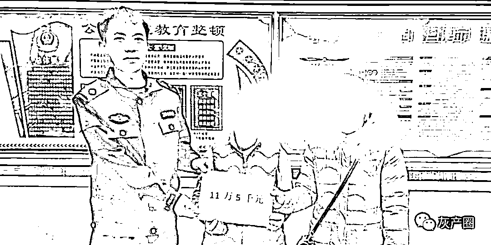

# 诡异！一男子去世几天后，还通过微信转账 10 多万元...

> 原文：[`mp.weixin.qq.com/s?__biz=MzIyMDYwMTk0Mw==&mid=2247523754&idx=5&sn=9ec444da2cbb2066422b71803de98cb8&chksm=97cb5692a0bcdf84e83cd7468864431a83546e63776853ba0e8dd33db5ec187b2117a878fb39&scene=27#wechat_redirect`](http://mp.weixin.qq.com/s?__biz=MzIyMDYwMTk0Mw==&mid=2247523754&idx=5&sn=9ec444da2cbb2066422b71803de98cb8&chksm=97cb5692a0bcdf84e83cd7468864431a83546e63776853ba0e8dd33db5ec187b2117a878fb39&scene=27#wechat_redirect)

近日，广西柳州鹿寨县

发生了一件“诡异”的事情

一名男子溺水身亡后

他的微信却“自动”活跃着

去世后

通过微信绑定的银行卡向外转账

了 10 多万元

明明人已经不在了，

为啥钱还能被转走呢？

今年 8 月 22 日，鹿寨警方在洛清江面发现了一具 50 多岁的男性浮尸。

几天后，韦女士报警说，她的哥哥失踪了，经确认，洛清江里发现死者就是她的哥哥。

可过了几天，韦女士又来报警了，**说她哥哥过世之后，银行卡里的 46000 多元被人转走了**。 

经查，韦某 8 月 22 日已死亡，而**这笔钱是 8 月 25 日经韦某手机操作的，把他银行账户里的钱转到了本人微信账户上**，随后就没有动静了。

这番操作让人百思不得其解

究竟是谁拿走了死者的手机？

民警没有放弃调查

事情有了新进展

↓↓↓

今年 9 月初，民警发现有一个微信账号从韦某的微信零钱里把这 46000 多元转到自己的微信账号内。

民警迅速对涉案微信账号进行追踪，10 月中旬挖出了嫌疑人刘某，此人 40 多岁，是鹿寨县人。

**警方从他身上查获了用于作案的一部手机，以及死者韦某的手机。**此外，民警还发现，今年 10 月 11 日，刘某还从死者韦某的支付宝理财产品内提现了 4 万多元，微信理财通提现了 2 万多元，所有钱款加在一起总计 11 万 5 千元。

经审讯，刘某交待，他和死者韦某并不认识，只是**在 8 月 22 日溺水事件发生的当天，无意间在洛清江边捡到了他的手机**。

因为手机没有锁屏密码，刘某可以随意查看，不过一开始他也不敢操作，而是连续几天到江边打探消息。

鹿寨县公安局城北派出所民警  蒙黄龙：听到一些群众说，前几天江边有人溺水死亡了，他大概猜想到 捡到的这个手机机主应该就是那名溺水死亡的人。

于是，刘某开始转钱，还通过手机短信验证的方式更改了韦某的微信和支付宝密码。**为了试探家属是否会追查手机以及银行账户，他没有直接把钱转进自己的账户。**

等待三天后，刘某发现并没有人拨打韦先生的电话，这才大胆地把钱转进了自己的账户。

10 月 22 日，民警将刘某转出的钱款全部追回，归还给死者的妹妹韦女士。 

目前，刘某因涉嫌盗窃已被刑事拘留。

来源 ：广西新闻频道、柳州电视台、潇湘晨报

← 向右滑动与灰产圈互动交流 →

