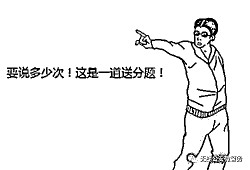
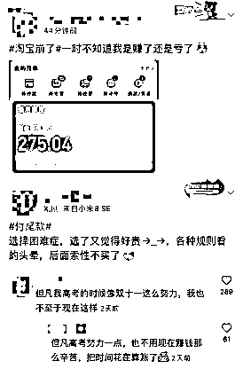
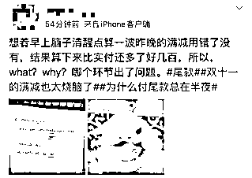
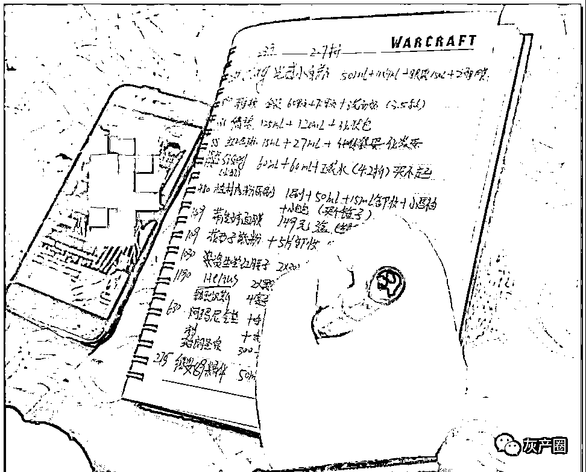
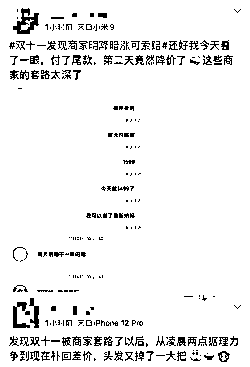
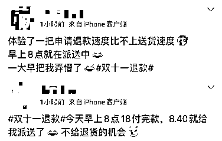
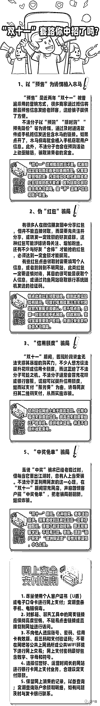

# “没点奥数功底都不配过双十一”？

> 原文：[`mp.weixin.qq.com/s?__biz=MzIyMDYwMTk0Mw==&mid=2247523754&idx=6&sn=ab16b3c0ef87671f91bf2e71a1e479d5&chksm=97cb5692a0bcdf84035bc874a0d286e94336185d3d5e11e53b639d5b430ffebe41e34bafb72c&scene=27#wechat_redirect`](http://mp.weixin.qq.com/s?__biz=MzIyMDYwMTk0Mw==&mid=2247523754&idx=6&sn=ab16b3c0ef87671f91bf2e71a1e479d5&chksm=97cb5692a0bcdf84035bc874a0d286e94336185d3d5e11e53b639d5b430ffebe41e34bafb72c&scene=27#wechat_redirect)

一年一度的**“双十一”**马上就要来了 

大家纷纷开启了**“买买买”**模式

各大购物平台**“预售”**热潮也刚刚结束 

就在网友们摩拳擦掌准备**“下手”**之时   

商家、平台设立的**优惠规则**却让人不知从何入手

**“原价 1299 元，预售价 1199 元，跨店优惠券每 300 减 40，店铺优惠券满 200 减 30，预付定金 50 元享两倍优惠，加购指定商品满 200 减 20······”**

一些商家、平台“乱花渐欲迷人眼”的套路

不禁让网友发出感慨，复杂规则难坏**“尾款人”**

**“没点奥数功底都不配过双十一了”******

**“加入会员并推荐给 3 名以上好友，获得优惠券”**

**“提前支付定金，在规定时间支付尾款，享受较低预售”**

**“跨店凑单，凑满整数享受优惠；观看网络直播带货，抢折扣券”**

折扣力度看似**“划算”“感人”**

但仍有不少网友在**“激情”**下单后直呼中了商家的套路

有网友表示，**“规则套路太多，很多都看不懂”**

**“但凡高考的时候像双十一这么努力，我也不至于现在这样······”******

还有网友震惊地表示 

想着早上脑子清醒点算一波昨晚的满减用错了没有

**结果算下来比实付还多了好几百······******

更有细心的网友发现

自己顶着大大的黑眼圈熬夜付完尾款后

商家在第二日就下调了商品价格

**甚至有的商品“双十一”价格高于平日······**

当网友**“猛然醒悟”**申请退款时

却发现退款通道已被平台关闭

一觉醒来就收到了快递员发来的派送短信

**“体验了一把申请退款速度比不上送货速度**

**早上八点就在派送中，一大早把我弄懵了”******

除了商家、平台各种套路

骗子也瞄准了这一时机

**网购诈骗手段**也是层出不穷

下面来看看最近发生的一些**案例**吧

****

**①2021 年 10 月 28 日，事主蔡某报警称，其接到自称淘宝客服的电话，称其在淘宝上购买的化妆品坏了要给其进行理赔，对方让其下载“飞书”APP 并让其按照要求操作，后收到一条扣款的短信，发现被骗，损失约 1.5 万元。**

**②2021 年 10 月 10 日，事主孟某某报警称，其接到冒充快递的电话，对方称“包裹丢失，要给其理赔”，其按要求向对方转账，后发现被骗，损失 9 万余元。**

**③2021 年 10 月 6 日，事主秦某报警称，其接到冒充淘宝客服的电话，对方称“领优惠券可以退钱”，其根据客服提示转帐，后发现被骗，损失 4 万余元。**

**④2021 年 10 月 22 日，事主鲁某报警称，其接到冒充淘宝客服的电话，对方称其买的面膜因为化学指标超标要退货处理，并让其下载“Talkline”会议软件，后称其银行卡资金被冻结了，需把钱全部转到对方账户上，其输入验证码发现卡内钱被转走，方知被骗，损失共计 2.4 万余元。**

**⑤2021 年 10 月 10 日，事主（匿名）报警称，其接到冒充淘宝客服电话，对方称“由于平台失误将其设置成代理商”，需根据对方提示进行取消操作，其按对方要求操作后发现被骗，损失共计 2 万余元。**

**看了上面的案例是不是有所触动，** 

**下面***划重点***啦！**

********

********

 ****[`v.qq.com/iframe/preview.html?width=500&height=375&auto=0&vid=wxv_2119448348549021700`](https://v.qq.com/iframe/preview.html?width=500&height=375&auto=0&vid=wxv_2119448348549021700)**** 

******你遇到过哪些“双十一”套路？****** 

******留言告诉更多人！**********

****************

****来源：无锡公安微警务，阻击诈骗****

********

****← 向右滑动与灰产圈互动交流 →****

********