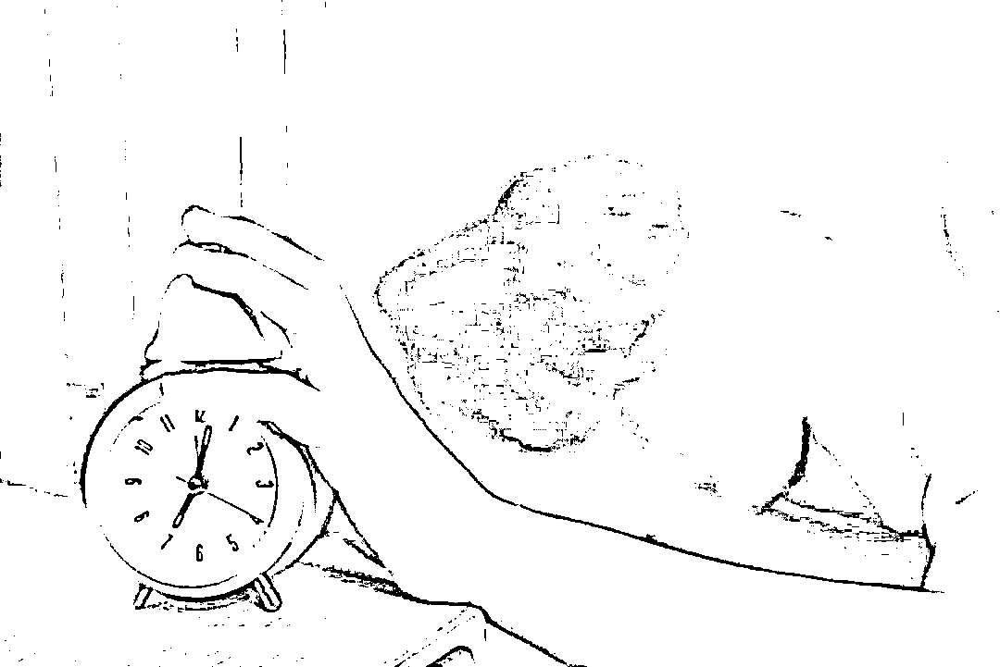

# 人在被窝躺打卡已经完成 开发虚拟定位打卡软件获刑 5 年

> 原文：[`mp.weixin.qq.com/s?__biz=MzIyMDYwMTk0Mw==&mid=2247523754&idx=7&sn=e550fb3820ee3e735e6d63604be34b47&chksm=97cb5692a0bcdf84d3e3ae46e077f3592bd61c9c8179c6da1a85cec25dd1f120fe99d4881dc5&scene=27#wechat_redirect`](http://mp.weixin.qq.com/s?__biz=MzIyMDYwMTk0Mw==&mid=2247523754&idx=7&sn=e550fb3820ee3e735e6d63604be34b47&chksm=97cb5692a0bcdf84d3e3ae46e077f3592bd61c9c8179c6da1a85cec25dd1f120fe99d4881dc5&scene=27#wechat_redirect)

说起上班打卡，你们公司都是怎样的打卡方式？冬天的床有一双无形的手，但是没办法，为了能准时打卡，也必须要起床。

如果能实现远程“打卡”岂不快哉？有不法分子就瞄准了这一“商机”甚至还成立了公司！

10 月初，北京市海淀区人民法院公开了一起破坏计算机信息系统罪的案件，被告人张某杰一审被判处有期徒刑 5 年 6 个月。

来源：北京法院审判信息网

该案涉及的软件是一款名叫“大牛助手”的 APP，其通过虚拟定位技术，将虚假的位置传送至钉钉系统，以达到“打卡”的效果，主要供上班族和学生使用。该软件为收费软件，年费为 89 元，月费 25 元。截至案发，用户 10 万余人次，该公司通过该 APP 一共赚取四五百万元。

外挂软件破坏钉钉系统 实现远程“打卡”

一审判决书显示，张某杰，男，1987 年出生，汉族，大专文化。因涉嫌犯破坏计算机信息系统罪，于 2019 年 5 月 31 日被羁押，同年 7 月 4 日被逮捕。

据张某杰供述，其在 2017 年成立了北京得牛科技有限公司并担任 CEO，公司主要开发手机应用软件并提供有偿使用服务。公司开发了软件“大牛助手”APP，在购买深圳罗盒科技有限公司虚拟程序 APP 的使用权后，对该 APP 的界面进行优化并添加充值接口，然后上线运行。

2017 年成立的公司，到了 2019 年，公司已经有 22 人，包含开发、UI、产品、测试和客服等各个岗位的工作人员，公司通过“大牛助手”APP 一共赚了四五百万元。

**“大牛助手”的新注册用户有 12 小时免费试用时间，包月会员是每月 25 元，年费会员是每年 89 元，用户可以通过多种方式充值。**

这款“外挂”软件是如何破坏钉钉系统功能，并以此牟利收费的？据张某杰的供述，“大牛助手”在不改变其他 APP 源代码的情况下，通过虚拟位置信息、Wi-Fi 信息和照片信息，对其他 APP 该类信息进行修改。**当用户使用其他 APP 不想暴露自己的位置信息时，“大牛助手”就对用户的位置进行遮蔽。**当用户想要修改自己的位置信息时，可通过“大牛助手”进行修改，修改时打开“大牛助手”，将需要改变定位信息的 APP 添加到列表中，点击模拟定位功能，然后在地图上选择需要修改的位置即可。

**该 APP 曾被用于上班族上班“打卡”和学生早操“打卡”。**

**被判有期徒刑五年六个月**

法院经审理查明，张某杰自 2017 年至 2019 年间运营得牛科技，**开发并推广“大牛助手”APP10 万余人次**，用于对阿里巴巴开发的钉钉系统处理、传输的地理位置数据进行未授权的干扰，破坏钉钉系统获取用户真实地理位置的功能。经鉴定，**“大牛助手”APP 为破坏性程序。**

阿里巴巴公司一位员工表示，经初步统计，**近一年有 46973 个买家通过支付宝购买“大牛助手”的服务，得牛科技获利多达 2627713 元。**其中，匹配钉钉软件“打卡”异常的买家用户有 7675 个，涉及这些用户购买服务的会员费 575497 元。

北京市海淀区人民法院认为，被告人张某杰故意制作、传播计算机病毒等破坏性程序，影响计算机系统正常运行，后果特别严重，其行为已构成破坏计算机信息系统罪，应予惩处。

2021 年 4 月 16 日，北京市海淀区人民法院做出判决，被告人张某杰犯破坏计算机信息系统罪，判处有期徒刑五年六个月。

**提醒广大用户：使用此类软件，其实存在风险，对方获取手机定位之后，很有可能导致个人隐私的泄露。提醒各位程序员：开发、使用、传播此类软件是千万不能做的。**

来源：山东高院、每日经济新闻、北京法院审判信息网、法治日报、广州日报

← 向右滑动与灰产圈互动交流 →

