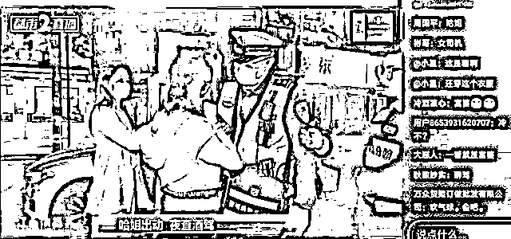
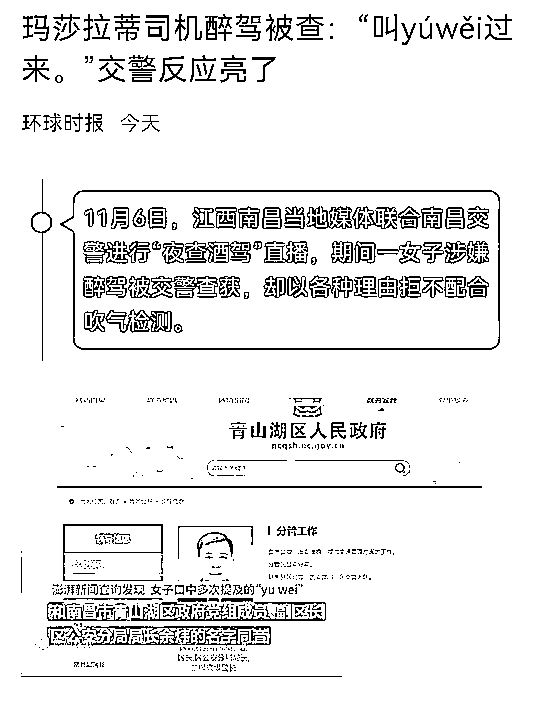

# 玛莎拉蒂女司机醉驾被查："叫 yúwěi 来"，交警反应亮了

> 原文：[`mp.weixin.qq.com/s?__biz=MzIyMDYwMTk0Mw==&mid=2247523813&idx=1&sn=ae48e5fad96829287ddb31f5466714b5&chksm=97cb56dda0bcdfcbc8b34f08012f1c794a17c15ba0da2aa139385fc564a632566d1448086e5b&scene=27#wechat_redirect`](http://mp.weixin.qq.com/s?__biz=MzIyMDYwMTk0Mw==&mid=2247523813&idx=1&sn=ae48e5fad96829287ddb31f5466714b5&chksm=97cb56dda0bcdfcbc8b34f08012f1c794a17c15ba0da2aa139385fc564a632566d1448086e5b&scene=27#wechat_redirect)

据海报新闻，11 月 6 日，江西南昌当地媒体联合南昌交警进行“夜查酒驾”直播，其间一女子涉嫌醉驾被交警查获，却以各种理由拒不配合吹气检测。**7 日下午，记者从南昌市公安局交通管理局获悉，前述女子涉嫌危险驾驶罪，已被公安机关刑事立案。**

另据澎湃新闻报道，针对南昌驾驶玛莎拉蒂女司机涉嫌醉驾一事，记者从权威渠道获悉，南昌市公安局高度重视此事，**正在核实涉嫌醉驾女子口中所说“yu wei”的身份，核查清楚了会向社会通报。另从多个渠道获悉，驾驶玛莎拉蒂涉嫌醉驾女司机系江西当地银行系统一管理人员。**

直播画面截图

[`v.qq.com/iframe/preview.html?width=500&height=375&auto=0&vid=a3307chi63z`](https://v.qq.com/iframe/preview.html?width=500&height=375&auto=0&vid=a3307chi63z)

图片来源：视频截图 

据直播画面显示，女司机最初被交警拦住时，多次对交警说“叫‘yuwei’（音）过来”，并试图拨打电话。执勤民警回应称，叫谁来都没用。民警还告诉该名女子，执法过程全程录音录像全网直播，**“全国人民都看着，你说出任何人的名字，都是在害他，现在我们公安机关本身在教育纪律整顿，你不要坑害任何人。”“如果你还当你的朋友是朋友，你就配合好完了。”** 

记者注意到，整个酒精测试过程长达 17 分钟，驾车女子一共吹气 66 次才完成，最后一次成功后酒精测试仪数据显示为“117”，随即该名女子被交警送至医院做抽血检测。 

11 月 7 日下午，南昌市公安局交通管理局通报称，2021 年 11 月 6 日 22 时许，该局东湖大队执勤民警在我市民德路依法进行酒驾临检中发现，赣 AG57**小型越野车驾驶员孙某（女）呼气检测结果为 117mg/100ml，随即带至就近医院提取血样。 

上述通报称，11 月 7 日 10 时许，经江西开元司法鉴定中心鉴定：孙某血液酒精含量为 102.68mg/100ml。孙某的违法行为涉嫌危险驾驶罪，公安机关已依法刑事立案，目前案件正在进一步办理中。

来源：每日经济新闻（nbdnews）、澎湃新闻、海客新闻、南昌交警

← 向右滑动与灰产圈互动交流 →

