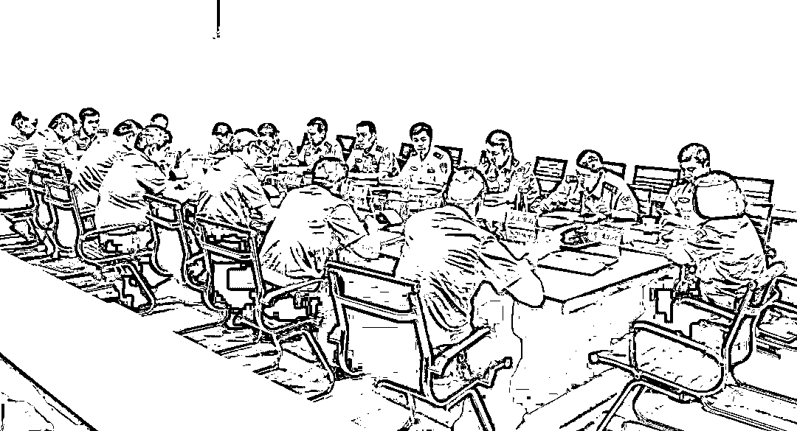
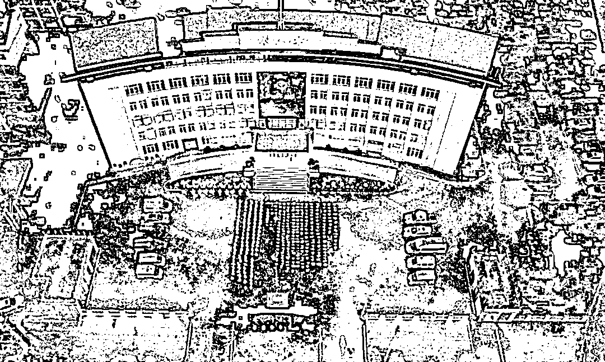
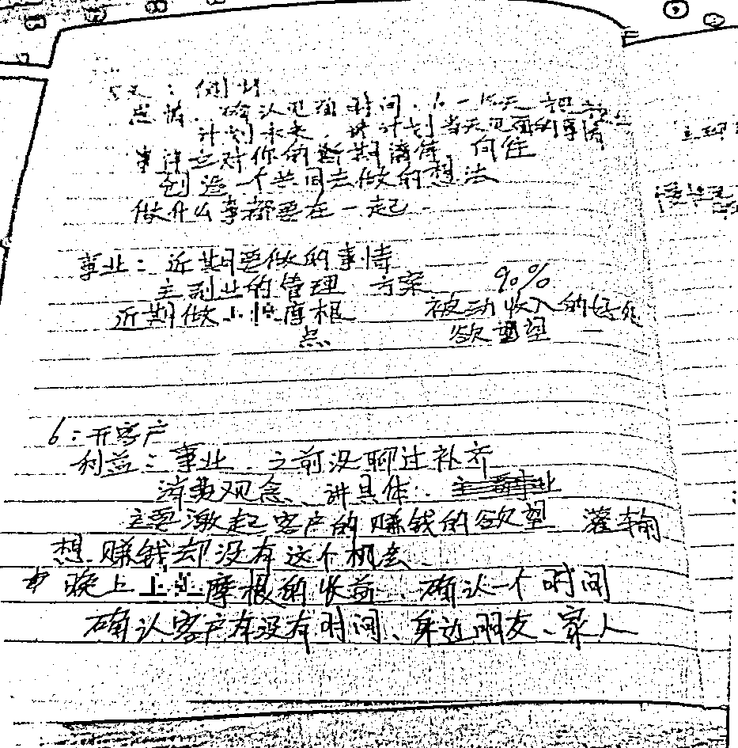
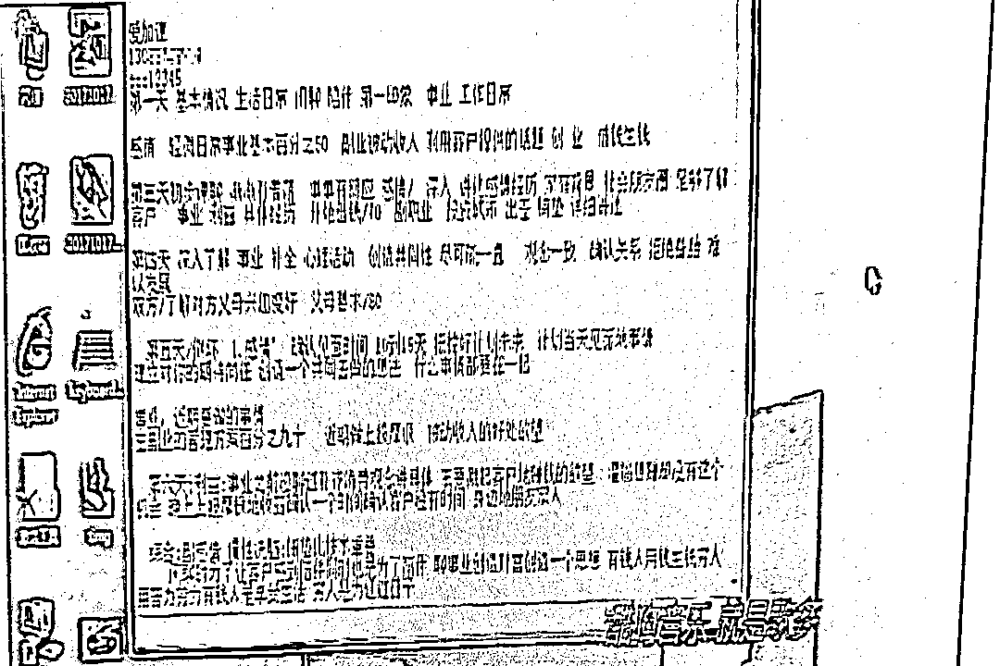
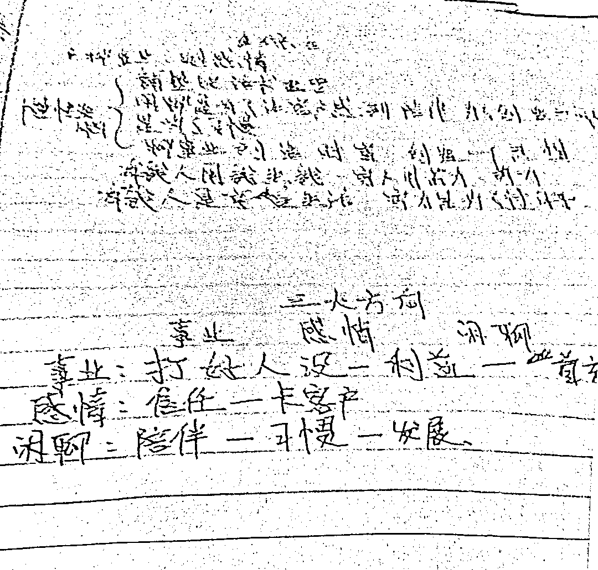
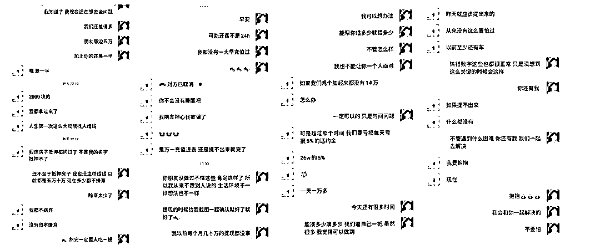
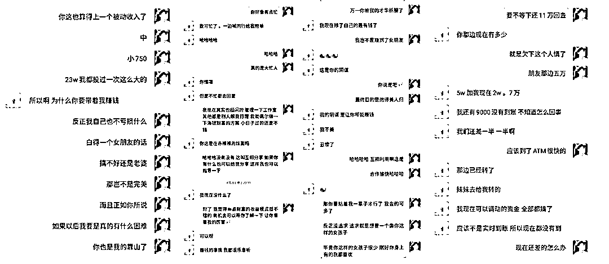
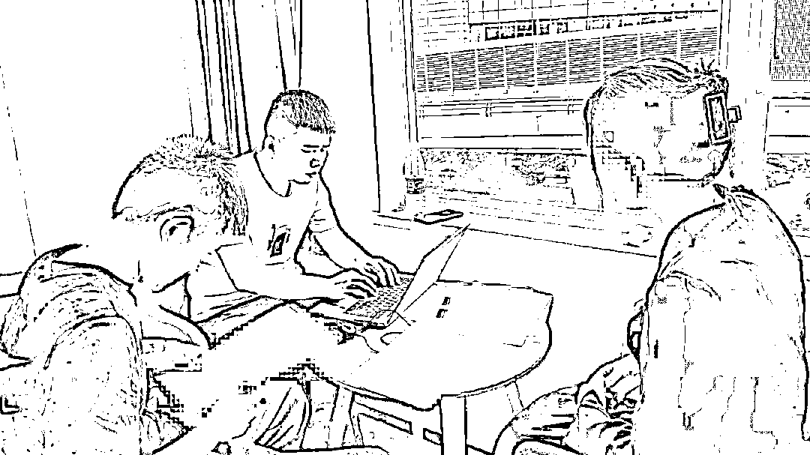
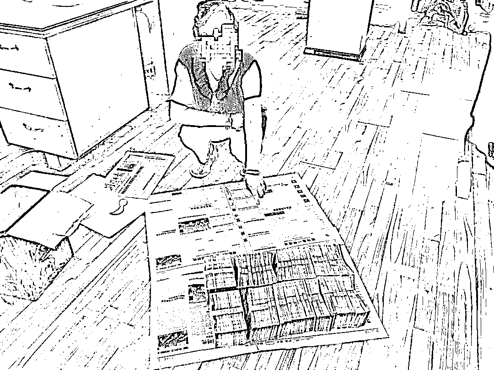

# 捣毁缅北特大“杀猪盘”，抓获 93 人！诈骗笔记曝光

> 原文：[`mp.weixin.qq.com/s?__biz=MzIyMDYwMTk0Mw==&mid=2247523813&idx=4&sn=b7571f1bf35f1a26f188a5b0ec7bdafe&chksm=97cb56dda0bcdfcb9020206976c61ee8eb2ba03fd6696137ff48f4a7e3c3fcb14fd052d321c7&scene=27#wechat_redirect`](http://mp.weixin.qq.com/s?__biz=MzIyMDYwMTk0Mw==&mid=2247523813&idx=4&sn=b7571f1bf35f1a26f188a5b0ec7bdafe&chksm=97cb56dda0bcdfcb9020206976c61ee8eb2ba03fd6696137ff48f4a7e3c3fcb14fd052d321c7&scene=27#wechat_redirect)

涉及电信网络诈骗案件

和“两卡”犯罪案件**120 余起**

****受害人遍布全国**20 多个省市******

******涉案金额**3000 多万元********

******抓获**93 人********

******荆门公安远程打击******

********侦破“6·11”电诈专案********

****** **  捣毁缅北“杀猪盘”********

 ******[`v.qq.com/iframe/preview.html?width=500&height=375&auto=0&vid=wxv_2116736269253738498`](https://v.qq.com/iframe/preview.html?width=500&height=375&auto=0&vid=wxv_2116736269253738498)****** 

********************** “缅北电诈，虽远必诛！”********** 6 月 11 日，荆门市公安局党委委员、副局长熊杰在打击缅北电信网络诈骗集团专案组组建的动员会上发出的动员令斩钉截铁。********一场异常艰辛的打击电诈战役就此打响。****

******01****** 

******偷渡缅北“打洋工”**********   **境外公司竟是电诈窝点******

****2021 年初，根据公安部关于开展缅北涉诈重点人员“断流”专项行动的统一部署，荆门市公安机关在全市范围内对本地区滞留缅北涉诈人员开展深入调查摸底。行动中，京山市公安局通过线索研判摸排，发现部分本地青年通过专门中介，有组织赴缅北从事电信网络诈骗活动。****

********

****京山市公安局组织多警种合成作战，重拳打击缅北回流涉诈犯罪人员。****

****行动势如破竹。****

****2021 年 3 月，京山市局抓获刘某等 25 名曾经在缅北充当电诈集团“键盘手”的回流人员。****

****刘某等 25 人均是京山本地人，2020 年 6 月起，他们在同乡好友的鼓吹引诱下，被偷渡组织以“出境务工”为由经云南边境偷渡至缅甸的勐波县，其实是为盘踞在当地的电诈窝点输送“键盘手”。****

********

****↑电诈键盘手的工作笔记****

****刘某等人一进入公司手机便被没收，失去人身自由，每天接受培训洗脑，稍有不从就会招来体罚与殴打，更有甚者会被送去人人闻之色变的“水牢”遭受非人折磨。在重重威逼利诱之下，这些原本被骗来的受害者一步步沦为吃人不吐骨头的电诈犯罪的帮凶。****

****京山公安通过对刘某等人的深入询问，一个位于缅北、名叫“永隆公司”的电信网络诈骗集团浮出水面。****

****为从源头遏制电信网络诈骗犯罪，斩断向境外输送涉诈人员的黑产链条，荆门市公安局启动市县一体化作战机制，**2021 年 6 月 11 日，****以荆门市公安局反诈中心和京山市公安局反诈中心、刑侦大队为主力的专案组正式成立，代号“6·11”。******

******“捣毁永隆公司”****六个大字，被写在案情研判室白板的首行。******

******02************顺瓜摸藤找线索**********   **“变频”打击挖金主 ******

******“警方不能被他们（犯罪分子）牵着鼻子走，我们的战术要反其道而行，顺瓜摸藤、逆流而上，再苦再难，我们也要给受害人一个交待！”******

****京山市公安局副局长曾忠在案情分析会上，剑出偏锋、另辟蹊径，带着专班民警们寻找破案的突破口。****

****仅有这 25 人的供述，对于粉碎一个运行缜密的电诈犯罪链条来讲，远远不够；****

****对付这群高智商、反侦查意识极强的躲在网络里为非作歹，并将窝点设在境外的电诈犯罪集团，绝非易事。**** 

****专案组深挖过往相关电诈案件，深耕关联线索，如大海捞针一般，在全国各地寻找永隆公司电诈参与者、受害人。****

****攥指成拳。刑侦、网安、情报中心、反诈专业队穷尽人力；公安云、大数据启动最强算力，在茫茫人海、无边网络查找永隆公司犯罪链条的蛛丝马迹。****

****数以万计的碎片化案件信息慢慢在专案组汇集，神秘的境外永隆公司电诈集团的拼图渐渐清晰起来。****

****永隆公司电诈集团，按“金主”（公司老板、股东，公司各类管理人员）、诈骗组的代理、诈骗组组长、键盘手等四个层级管理，并分为多个诈骗小组进行诈骗。****

********

****↑电诈集团的“工作手册”****

****他们甚至专门编有《“永隆公司”聊天话术实施流程及要点》。何时聊感情、何时聊事业，何时送温暖，“工作手册”里交待的清清楚楚。****

****永隆公司电诈集团组织严密、分工细致，从被害人筛选、键盘手包装、实施诈骗、洗钱及技术保障等均有专人负责，集团成员多达 100 余人。****

****犯罪集团的组织架构在案情分析室的白板上越来越清晰；犯罪所得资金的洗钱方式渐渐查明；寻找到的能指证永隆公司所犯罪行的一个个受害人相继找到。****

********

******↑**键盘手的工作笔记里记录了实施杀猪盘诈骗的操作流程****

****经过近 1 个月的攻坚，永隆公司电诈集团幕后的头目“金主”京山籍青年郑某等 3 人被专案组揭开了神秘面纱。****

****7 月 2 日，专案组集百名警力蓄势待发。****

******“抓捕行动现在开始，除骗务尽！”**专案组指挥长熊杰发出指令，集中收网行动正式发起。****

****各抓捕小组分赴京山市、武汉市、广州市、上海市等地共抓获犯罪嫌疑人 93 名。****

******03************“00”后金主境内操盘**********   **20 余省市百余女子受骗   ******

****令人意想不到的是，偌大的电诈集团永隆公司“创始人”竟然是京山一名千禧年出生的青年郑某。****

****处事冷静、思维敏捷，沉稳面对公安机关审讯，活脱脱一个混迹犯罪江湖的老油条，很难将之与一个年仅 21 岁的年轻人划上等号。****

********

****↑审讯诈骗团伙“00 后金主”郑某****

****2020 年，他伙同聂某、邹某前往缅北投靠亲戚，“加盟”并开办“永隆公司”，实施“杀猪盘”类电信网络诈骗犯罪。彼时，郑某和他们的“永隆公司”还受制于人，需向母公司上缴高比例的非法所得，并且，还没有自己的洗钱路子。****

****2020 年 4 月，不甘寄人篱下的郑某用足江湖手段，掌握了电诈公司运营的所有伎俩，最关键的是，终于打通了洗钱通道。从此，翅膀硬了起来的郑某正式脱离母公司，独立运营，并开始大量招兵买马，当起了老板。****

********

****↑抓获的电诈代理陈某某****

****而郑某，这位“00 后”青年，竟然在境内遥控指挥就完成了这些复杂的犯罪过程，实现了严格的“公司管理”。****

****一批批全国各地的青年怀揣创业梦，被他们诱骗到缅北，从受害人被逼迫变成了永隆公司电诈集团的帮凶。****

********

****↑抓捕的电诈集团工作人员****

****一名名有血有肉、有着真情实感的年轻女子落入永隆公司的“杀猪盘”圈套，债台高筑、痛不欲生。****

******04****** 

******他是你的“高富帅”**********   **你却是他“养的猪”   ******

****复盘永隆公司的犯罪过程，不难发现，“杀猪盘”诈骗的手法老套，诈骗的过程却不简单。****

****“键盘手”利用“探探”、“陌陌”、“SOUL”、“积目”等社交软件（猪圈）寻找被害人（猪），将被害人添加到其工作微信、QQ 上（引流）。****

********

****再利用准备好的人设和聊天套路（猪饲料），与被害人建立虚假的****

****恋爱关系，骗取被害人的信任（养猪）。****

****永隆公司的“话术本”甚至从周一至周五哪天聊什么，都有详细的指引。****

******“恭喜 XXX 成功杀猪，完成一单……”**组长站于高台，号召全体起立，彩炮声声、掌声阵阵；若有人完成诈骗金额 50 万以上的“大单”，公司还会为之燃放烟花送出祝贺；而那些“业绩”优秀的键盘手，还会在公司的培训会上分享“先进经验”……****

********

****那一刻，涉世未深的年轻键盘手，甚至忘记了自己被骗的惨痛经历，渐渐迷失了人性和初心。****

****那一刻，每升起的一朵烟花的背后都流尽了一位情感、财产遭受双重重创的女孩的血和眼泪。****

******“不怕猪有文化，只怕你不会说情话。”******

****经受这些组长、代理类似口号的反复洗脑，被骗入伙的键盘手们在犯罪的路上也越走越远。****

********

****↑向受害人取证**** 

****“键盘手”取得被害人信任后，再向被害人推送名为“XX 摩根”等虚假投资平台的二维码，诱导被害人扫码后进入网络赌博网页充值，以“买大小、单双”方式进行赌博。****

****前期小额盈利，后面让人打了鸡血般不断充值，最终情感遭受重创、钱财也被骗的血本无回，还是电诈那些再熟悉不过的套路。****

********

****↑起获的赃款**** 

****警方已查明郑某等人**电诈犯罪集团成员多达 100 余人，已抓获 93 人**，其中荆门籍人员有 90 人。团伙成员中不乏“全家齐上阵”的家族式犯罪成员。**涉及电信网络诈骗案件和“两卡”犯罪案件 120 余起，受害人遍布全国 20 多个省市，涉案金额 3000 多万元。其中主犯郑某、聂某、邹某各获利 700 余万元。****** 

****目前，案件仍在侦办中，6·11 专案组正在对电信网络诈骗及其“黑灰产业链”发起全面打击。****

****来源：湖北反诈中心，阻击诈骗****

********

****← 向右滑动与灰产圈互动交流 →****

********