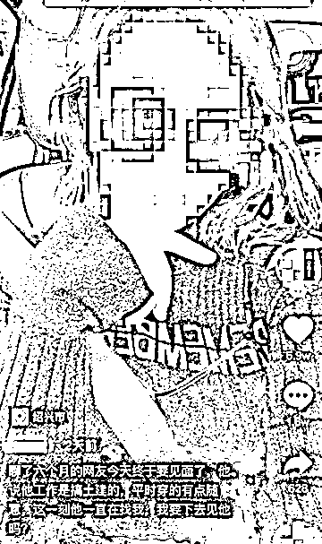

# 女子拍路人谎称是网聊 6 个月的网友，该罚！

> 原文：[`mp.weixin.qq.com/s?__biz=MzIyMDYwMTk0Mw==&mid=2247523813&idx=5&sn=fc39f46b822716d14434e73e7e3a3160&chksm=97cb56dda0bcdfcbd5fa3a4715161d0221de749d3c6d512544d829586eed8973cc11152e27ed&scene=27#wechat_redirect`](http://mp.weixin.qq.com/s?__biz=MzIyMDYwMTk0Mw==&mid=2247523813&idx=5&sn=fc39f46b822716d14434e73e7e3a3160&chksm=97cb56dda0bcdfcbd5fa3a4715161d0221de749d3c6d512544d829586eed8973cc11152e27ed&scene=27#wechat_redirect)

## 

“聊了六个月的网友今天终于要见面了，

他说他工作是搞土建的，

平时穿的有点随意，

这一刻他一直在找我，

我要下去见他吗？”

日前，浙江绍兴一女子编发了如上文字，

配的是史先生过马路的画面，

难道，他就是女子的网友？

事实上，俩人从未有过任何交集，

女子拍拍视频、编编故事，

史先生可倒了霉，

老婆、儿子看到后和他大吵一架，

“人被拍去了，下面配文把我害惨了。”

这真是：人在路上走，“祸”从天上来。

女子编造的剧情里，

涵盖了异性网友、线下奔现、身份、穿着等元素，

营造真实场景、添加刺激作料，

**这种讲故事的路数在短视频创作中并不鲜见。**

曾经引发广泛关注的“女子取快递被造谣出轨”案中，

两名被告人通过偷拍、捏造聊天记录等手段博取关注，

最终以诽谤罪被判处有期徒刑一年，缓刑二年。

此事中，女子黄某因诽谤他人的行为，

被公安机关处以罚款 500 元的行政处罚。

 

女子面对民警询问时，竟大言不惭：

“这样子拍一下有什么嘞，一个路人”。

显然小看了谎言的杀伤力：

众口铄金，积毁销骨。

换位思考一下，

如果是史先生坐在车里，

拍了一段女子过马路的视频，

并配文称：准备和聊了六个月的网友见面。

女子的朋友、丈夫、子女刷到了，

会有什么样的反应，

自己的人品，作为妻子、母亲的形象被无端指责和质疑，

还能这么淡定吗？

**一些人为了吸引眼球、增加流量，**

**主观臆测、捕风捉影、夸大其词，**

**大行瞒天过海、无中生有、偷梁换柱之计，**

**进行“镜头侵犯”“键盘伤害”“数字骚扰”。**

要警惕的是，

不止史先生，每一个路人甲，都可能成为素材，

被裹挟进他们的怪癖和造富大梦中。

**在算法逻辑里，视频平台把新闻事件的接近性要素，**

**靶向地传播到地理、心理、利益、年龄上相接近的人，**

本地的亲友刷到了，异地的孩子也刷到了，

线上的一个视频，在线下泛起涟漪和波澜，

你轻触屏幕，开启的是别人的麻烦，

在你这里是蝶舞之力，在别人那里则是狂风骤雨。

拍摄者进行创造要有操守，

尊重人家的隐私，

考虑到对别人可能造成的不良影响，

别在赚取 200 万的阅读量和 5 万多的点赞量的时候，

营造出一种真实的样态，

等到要问责了，

便说什么“别人也知道的，都是娱乐，都是不真实的。”

 

以己之心度他人之腹，

自己喜欢这么玩，想当然就认为所有人都喜欢这么玩，

碰见较真的，就说人家“玩不起”“开不起玩笑”“格局小”，

类似的开脱和说辞，

既暴露出个人边界意识的混沌、社交礼仪的缺乏，

也体现出一种娱乐至上的浅薄认知。

尼尔·波兹曼的《娱乐至死》中有这样一句名言：

“娱乐至死”的可怕之处不在于娱乐本身，

而在于人们日渐失去对社会事务

进行严肃思考和理智判断的能力，

在于被轻佻的文化环境培养成了

既无知且无畏的理性文盲而不自知。

**网络不是法外之地，**

**直播打屁股惩罚、编织出轨信息、**

**制作 “炸掉收费站”特效等出格行为，**

**莫不是在娱乐大旗下，**

**把一颗私心包藏在大众欢笑中，**

**挑战社会底线，还涉嫌违法。**

**过度娱乐之风当止，**

**放任风继续吹的话，**

**更奇葩的闹剧还将上演。**

来源：央视网

← 向右滑动与灰产圈互动交流 →

