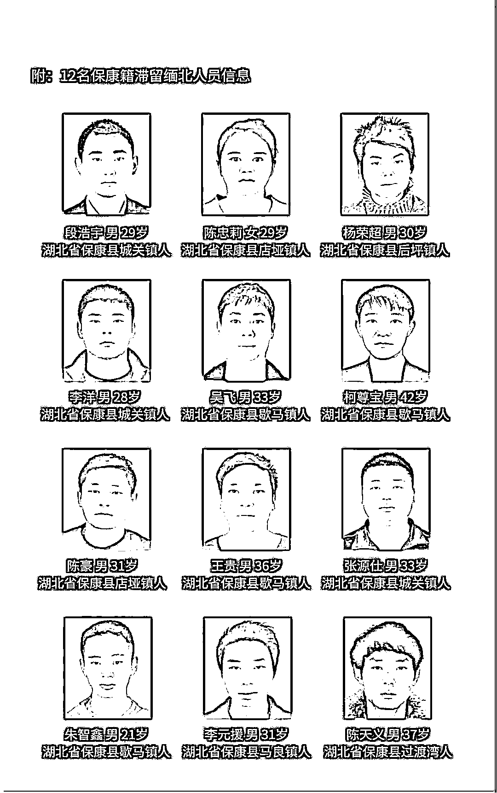
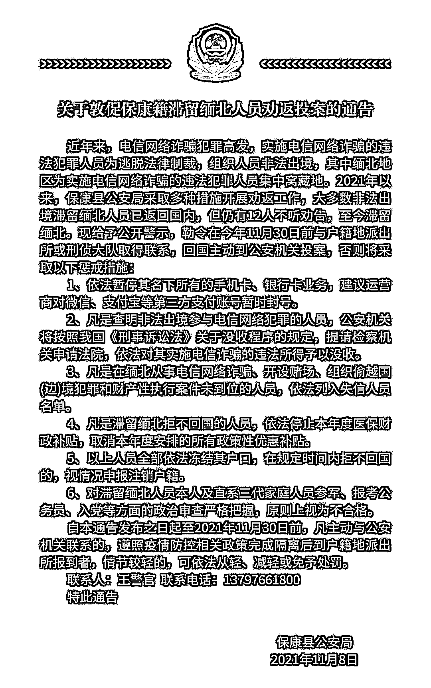

# 这 12 人被警示：拒不回国，就注销户籍

> 原文：[`mp.weixin.qq.com/s?__biz=MzIyMDYwMTk0Mw==&mid=2247523862&idx=4&sn=36addeff08dd0d3deeeddfb7b402b7fd&chksm=97cb552ea0bcdc38b3ff4d12234b86ab20527b3ee7c16e6a935ae1bbf9135528e0f15dbcbf5c&scene=27#wechat_redirect`](http://mp.weixin.qq.com/s?__biz=MzIyMDYwMTk0Mw==&mid=2247523862&idx=4&sn=36addeff08dd0d3deeeddfb7b402b7fd&chksm=97cb552ea0bcdc38b3ff4d12234b86ab20527b3ee7c16e6a935ae1bbf9135528e0f15dbcbf5c&scene=27#wechat_redirect)

本文转自环球时报

11 月 8 日，湖北省保康县公安局对外发布通告，敦促 12 名保康籍滞留缅北人员，本月底前与户籍地派出所取得联系，回国主动到公安机关投案，争取宽大处理。

凡主动与公安机关联系的，遵照疫情防控相关政策完成隔离后到户籍地派出所报到者，情节较轻的，可依法从轻、减轻或免予处罚。

据了解，实施电信网络诈骗的违法犯罪人员为逃脱法律制裁，组织人员非法出境，其中缅北地区为实施电信网络诈骗的违法犯罪人员集中窝藏地。2021 年以来，保康县公安局采取多种措施开展劝返工作，大多数非法出境滞留缅北人员已返回国内，但仍有 12 人不听劝告，至今滞留缅北。现给予公开警示，勒令在今年 11 月 30 日前与户籍地派出所或刑侦大队取得联系，回国主动到公安机关投案，否则将采取“六个一律”惩戒措施。

“六个一律”惩戒措施为：

依法暂停其名下所有的手机卡、银行卡业务，建议运营商对微信、支付宝等第三方支付账号暂时封号；

凡是查明非法出境参与电信网络犯罪的人员，公安机关将按照我国《刑事诉讼法》关于没收程序的规定，提请检察机关申请法院，依法对其实施电信诈骗的违法所得予以没收；

凡是在缅北从事电信网络诈骗、开设赌场、组织偷越国(边)境犯罪和财产性执行案件未到位的人员，依法列入失信人员名单；

凡是滞留缅北拒不回国的人员，依法停止本年度医保财政补贴，取消本年度安排的所有政策性优惠补贴；

以上人员全部依法冻结其户口，在规定时间内拒不回国的，视情况申报注销户籍；

对滞留缅北人员本人及直系三代家庭人员参军、报考公务员、入党等方面的政治审查严格把握，原则上视为不合格。

保康县公安局对外发布通告

来源：极目新闻

← 向右滑动与灰产圈互动交流 →

