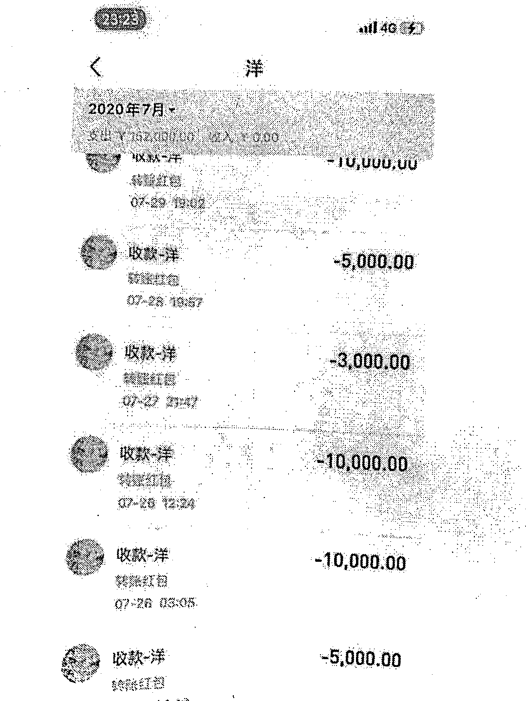

# 男子被两任“女友”骗 29 万元，结果女友均为一名同事扮演！

> 原文：[`mp.weixin.qq.com/s?__biz=MzIyMDYwMTk0Mw==&mid=2247523862&idx=5&sn=15672c55c0344c9b72e91a88a7dfd0e2&chksm=97cb552ea0bcdc38c1aff7f5fe5536eafd8e0bd00998c4aabafd4e74f4e4aef79a51718359bb&scene=27#wechat_redirect`](http://mp.weixin.qq.com/s?__biz=MzIyMDYwMTk0Mw==&mid=2247523862&idx=5&sn=15672c55c0344c9b72e91a88a7dfd0e2&chksm=97cb552ea0bcdc38c1aff7f5fe5536eafd8e0bd00998c4aabafd4e74f4e4aef79a51718359bb&scene=27#wechat_redirect)

杀猪盘是一种新兴的网络诈骗形式，但它不仅存在于网络当中！市民小黄遇上“戏精”杨某，她一人分饰三角，既是现实生活中的“知心大姐”，又通过两个微信号分别扮演两名“美女”，以婚恋为由骗取小黄 29 万余元，最终杨某的诈骗伎俩被福州福清警方识破，这个“影后级”骗子终落法网。

**两任“女友”现身单纯小伙入套**

2017 年，小黄在其叔叔店里打工时认识了店员杨某，两人相识后逐渐成为朋友。经过近一年的相处，杨某发现小黄是一个阅历单纯、思想相对简单的大男孩，便试图效仿“杀猪盘”骗局，将小黄当成待宰的猎物“圈养”起来。

2018 年初，杨某眼看小黄正值适婚年龄，便以此为切入点，想出了“假意介绍美女，进而诈骗钱财”的计划。她先是冒充一名叫“徐玉梅”的女子，通过小黄叔叔的推荐将“徐玉梅”的微信推给小黄。实际上，就是杨某以“徐玉梅”的身份与小黄聊天，之后她又以“徐玉梅”的身份向小黄推荐了自己的闺蜜“李洋”，“李洋”同样是杨某虚构出来的人物。

杨某在和小黄一起工作的过程中，欺骗小黄说“徐玉梅”和“李洋”都是她的好朋友，还以热心大姐的身份鼓励小黄与二人聊天。

刚开始时，杨某以“李洋”的身份与小黄聊天，聊了一段时间后，“李洋”就和小黄在微信上确定了男女朋友关系。两人就这样聊了近 1 年时间，期间，小黄几次想约见“李洋”，都被“李洋”以各种理由搪塞。在杨某的操作下，“李洋”慢慢与小黄断了联系。

2019 年，杨某又刻意诱导小黄称“徐玉梅”比较适合交往。随后杨某又以“徐玉梅”的身份与小黄在微信上以男女朋友关系相处起来。单纯的小黄被杨某玩弄于股掌之间。

**“女友”诉苦借钱实则赌博输钱**

2020 年 8 月份，杨某决定收拢“陷阱”。她让“李洋”再次和小黄聊天，不断向小黄“诉苦”，以朋友出车祸需要用钱、自己没钱缴纳房租等各种理由向小黄索要钱财。单纯的小黄经不起对方软磨硬泡，本着“帮助前女友”的想法，借给“李洋”近 10 万元。

在此期间，杨某又以“徐玉梅”的身份穿插出现，跟小黄聊天，向他虚构了家人得重病需要抢救等各种理由，同样只为了骗取小黄的钱财。善良的小黄再一次受骗，借给了“徐玉梅”19 万余元。

杨某将这些骗来的钱全部用于网络赌博，挥霍一空。之后小黄向“徐玉梅”“李洋”二人催促还款，杨某隐藏在两个虚拟身份背后，以各种方式推脱、逃避。催款无果的小黄只得找到双方的“共同好友”杨某，让杨某帮助找“徐玉梅”“李洋”二人，杨某一边随口答应，一边借机拖延，从未采取行动。

**自导自演骗局最终身陷囹圄**

2020 年底，走投无路的小黄向福清市公安局龙田派出所报警，接警民警传唤杨某到所询问，请她配合寻找“徐玉梅”“李洋”二人。杨某十分配合，当着民警的面打电话给“徐玉梅”和“李洋”。电话那头的“徐玉梅”接听后，称自己在贵州上班，无法前来，将于 2021 年初前来福清，而“李洋”的电话却迟迟无人接听。

原来，得知小黄报警的她早已想好了应对措施。由于杨某是小黄在现实生活中联系“徐玉梅”和“李洋”的唯一渠道，民警只好多次要求她联系两人协助调查，但杨某始终未将“徐玉梅”和“李洋”劝回福清。不过，再狡猾的狐狸也逃不过猎手的火眼金睛。细心的民警在进一步侦查时发现，“徐玉梅”和“李洋”的微信及支付宝账号绑定的手机号系杨某及其儿子林某，狡猾的杨某辩称该二人因此前到福清时没有本地电话卡且不会使用手机绑定，所以他们母子便把手机号借给她们使用。这样的说辞显然不切实际，因为即使暂时需要借用手机号，为了个人钱财的安全，一般人也会尽快将账户绑定的手机号更改成自己的号码。

以此为突破点，龙田派出所迅速组织专门力量进行缜密侦查。办案民警大胆推测这是一起“一人分饰三角”的诈骗案件。经过一番斗智斗勇，民警成功突破了杨某的心理防线，逐步掀开杨某的诈骗黑幕。最终，犯罪嫌疑人杨某交代了其多次向小黄实施诈骗的犯罪事实。

目前，诈骗犯罪嫌疑人杨某已被福清警方刑事拘留，等待她的将是法律的严惩。

来源 ：潇湘晨报综合福州公安

← 向右滑动与灰产圈互动交流 →

