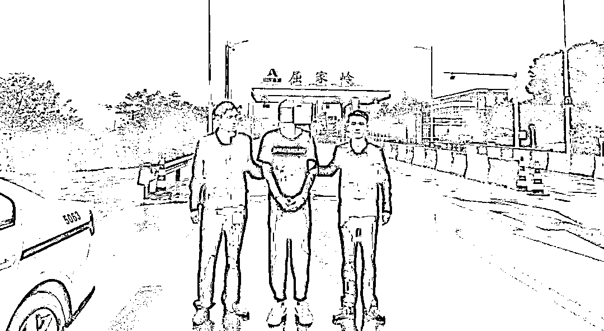
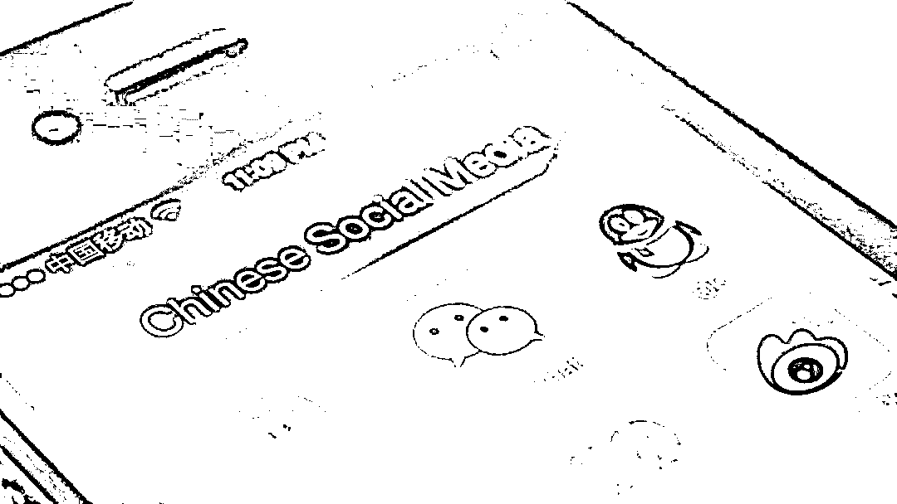

# “在缅北，我的命不如一条狗！”

> 原文：[`mp.weixin.qq.com/s?__biz=MzIyMDYwMTk0Mw==&mid=2247523920&idx=2&sn=87c48d79ae9ed62b27ebfcdf7969e70a&chksm=97cb5568a0bcdc7e43baa491a83aa3108da531fe9449fbead54e3507913bf10bd526828fd475&scene=27#wechat_redirect`](http://mp.weixin.qq.com/s?__biz=MzIyMDYwMTk0Mw==&mid=2247523920&idx=2&sn=87c48d79ae9ed62b27ebfcdf7969e70a&chksm=97cb5568a0bcdc7e43baa491a83aa3108da531fe9449fbead54e3507913bf10bd526828fd475&scene=27#wechat_redirect)

**外派劳务包吃包住，月入五万。工作轻松活动自由，畅游异国。**

****

**梦一般的话语编织成一座座甜蜜的牢笼，将大批抱着发财梦的年轻人锁在异国他乡****——****“**实**际上，我们在这里债务缠身、限制自由、生死难料。”**

缅北，那个披着美好外衣的“梦想之地”张着血盆大口，无情地吞噬着一批又一批的年轻生命，引诱他们堕入犯罪的深渊，给一个个家庭带来无尽的损失和伤痛。

11 月 2 日，在[***荆门市公安局侦破“6·11”缅北电诈集团案件******（点击蓝字查看详情）***](http://mp.weixin.qq.com/s?__biz=MzIyMDYwMTk0Mw==&mid=2247523813&idx=4&sn=b7571f1bf35f1a26f188a5b0ec7bdafe&chksm=97cb56dda0bcdfcb9020206976c61ee8eb2ba03fd6696137ff48f4a7e3c3fcb14fd052d321c7&scene=21#wechat_redirect)新闻发布会上，播放了部分缅北涉诈回流人员现身说法的录音录像。**他们含泪讲述了自己被诱骗偷渡出境，被迫参与境外电诈组织，沦为犯罪集团帮凶的不堪回首的经历。**

[`v.qq.com/iframe/preview.html?width=500&height=375&auto=0&vid=wxv_2118188094750326785`](https://v.qq.com/iframe/preview.html?width=500&height=375&auto=0&vid=wxv_2118188094750326785)

没有回头路的偷渡

夜黑的像一团浓墨，刀子般的寒气也扎不透半点窟窿。两点微弱到随时要熄灭的灯光偶然一瞥，旋即又陷入更深的黑暗，一支八九人的队伍正在云南边境苍莽的原始丛林里点点摸索。

**他们正在偷渡！**

缅北，那个传说中遍地黄金的追梦天堂，似乎近在咫尺。

**“小心！”**21 岁的周兴被一只大手猛地提起，脚下扑簌的碎石洪流般朝着悬崖倾泻而下，再听不见半点回音。只差半秒，他将葬身在边境的断崖之下。

**这电影般一幕，在中缅边境上真切地发生着。**

来不及道谢，一道耀目的白光直刺面庞，漆黑的夜里闪得他眼前发花。

**“都他妈没长眼睛！你们死在这，我可一分钱不给！”**队伍里接二连三的有人滑倒、坠崖、叫苦、抱怨，早让领头的张强磨尽了耐心。

**“强哥，我有点害怕，不想赚钱了，送我回去吧！”**夜色里飘出一句这样的话。

**“回去？要回去自己走，我们可没功夫带你。我们要缅北赚大钱、找女人呢！”**队尾的王刚狠狠地吐了一口烟，顺着手里的电筒，腾起一阵白雾。

“刚哥……”周兴还想跟这位京山老乡说点什么，旁边的人立马拍了拍他，说着：**“看不出来吗？回不了头，只能跟着去！”**

看着队尾那束随着脚步上下摇曳的白光，周兴有些失神。他怎么也想不明白，前几天那个出手阔绰，仗义和蔼，天天约他喝酒、唱歌、蹦迪的老大哥怎么一踏上边境线就变了个人——粗鲁、暴戾、凶狠，对他们这些老乡开口就骂，好几次差点动手。

就连坚持在队尾保护一行人安全的“热心”大哥，周兴都觉得更像是一种蓄意的监视，防止他们半路逃跑。

一路走来，周兴的心里早已明白：**这次的发财之路，或许成为自己亡命异国的开端。**

家境殷实的他本不该这样冒险。常年在广东经商的父母早已在广州给他买了两套房，只要不出意外，周兴一辈子不愁吃穿。“你离了我，狗屁都不是！”父亲咬牙切齿的训斥让他急于证明自己。

**“反正也回不去了，试试吧，万一混出个人样呢？”**一半像是给自己打气，一半像是与父亲赌气，望着不断蔓延的夜色，周兴在心里给自己打气。

 受尽折磨的“工作”

在无尽的原始森林穿行 10 多个小时，周兴终于又一次见到头顶的天空。

**“缅北到了。”**带头的强哥熟练的撂下一句。

不知名字的山脚下，早已等候着四五百人。这些殊途同归的年轻人黑压压的挤成一片，瞪着兴奋与恐惧交织的眼睛打量着陌生的世界。他们是梦想在缅北“淘金”的新鲜血液。

所谓的公司，不过是一所酒店的二楼。进门之前，一群大汉就不由分说地检查了他们的随身行李，对每个人进行搜身，登记分组，随后以代为保管为由**收走了他们的身份证**。对方告诫他们，只能在二楼的公司和五楼的宿舍之间活动，不得与外人交流，甚至不同组的同事也要少说闲话。

十几个人的宿舍里，铁架双层床不时吱呀作响，唯一的厕所门口堆满了等待的人和催促的急语。周兴怎么也睡不着，他不明白自己会面临什么，却清晰的感受到某种危险正步步紧逼。

公司的会议上，一条条新的规定陆续被宣布：

**公 司 规 定**

**1\. 不允许在公司使用私人手机** 

**2\. 不能对工作内容拍照录像**

**3\. 每日考核**

**4\. 每月检查业绩**

**.......**

**公司发放的电脑、手机，来缅的机票、车票、服务费都被算到了各人头上。**

来到公司第一天，承诺的路费全包立马翻脸不认账了，加上办公用品、住宿、吃饭……一笔笔算下来，周兴他们还没开始赚钱就已经倒欠了公司一两万元。

老板“善意”的提醒他们：**“公司为你们投入了大量资金，只有努力工作，你们才能早点还完账，才能赚上钱。”**

↑受害人讲述在缅北的悲惨遭遇

上午十点左右，周兴所在的 D 组开始上班，**通常一直要工作到凌晨两点**。这还取决于本月业绩完成情况。以 D 组的月目标二十万元为例，无法完成的人必须要加班，**否则会被罚款，并受到体罚**。

有人因为不服管教被剃光头发、眉毛等进行羞辱；有人因试图逃跑被罚穿情趣内衣在公司跳舞；有人因为没有完成每天添加 5 个有效好友的日目标被罚做 500 个俯卧撑；有人因为无法成单要做 1000 个深蹲。

周兴说：**“每天下班前，至少有一半以上的人在挨罚。在公司的走廊里，浩浩荡荡的人群像在开运动会，但我们不是为了锻炼身体，只是为了不挨打、不被杀。”**

**“在缅北我感觉自己的命，不如一条狗”**，周兴说，在勐波，当地人杀一个人跟撞死一条狗没什么区别。在这座边境县城里，秩序和法律早已被漫天烟尘湮没殆尽，不明身份的武装力量随处可见。在这里，打他们一顿，打成什么样，乃至关多久的水牢，不过是老板一句话的事。

除却死亡威胁，对周兴他们这些胸怀“淘金梦”的年轻人来说，更痛苦的是，公司无时无刻的盘剥。

连续 15 小时，甚至通宵的工作，是家常便饭。打一次瞌睡罚款 500，没加够好友扣 1000，月度考核不合格罚 2000……好不容易骗了 10 万，6 万归公司，4 万小组分，组里三个老板又各分 20%，落到七八个年轻人手上不足 500 元，还不够交罚款。

从缅北回来的时候，工作半年的周兴只剩下入职前的 6000 存款，找朋友借了 1 万元才得以脱身。同行的赵武入职三个月，只能靠父亲汇去的 6 万块钱才还清了欠款。

**“我们不是不想回来，实在是没钱回来。我们一直在被动的花钱，花的永远比挣得多！”**另一个组的武鸣跟专案组的民警哭诉。

 内心备受煎熬

**周兴至今仍忘不了自己的第一个“客户”。**他说搞电信诈骗，最难过的其实是心里的那一关。

刚到公司的时候，老板会坐在旁边手把手教他怎么和 25 至 40 岁的女性聊天，怎么打探她们的存款，预估可以骗到多少钱。

一位来自广州的女研究生和周兴聊了整整两个月。差不多的年纪让他们有说不完的话题。女孩家境一般，但阳光坚强，步步努力，终于考上了自己理想的大学，又成为一名在读研究生。她将学习的烦恼、生活的憧憬如倒豆子般倾吐给屏幕对面的少年。

她哪里知道，屏幕外的周兴正对着公司制作的话术本一步步将其引入陷阱。好几次，周兴都想把她拉黑删除，让这个单纯的女孩不要直面人性的丑恶。**可是，老板如鹰般死死盯着他的屏幕，一句一句地下达指令。**周兴只能在心里祈祷女孩早日发现端倪，哪怕狠狠骂他一顿。

信任最终让女孩在他推荐的赌博网站上投了 5 万元。周兴跟老板说：“差不多了吧，她只有这么多钱。”老板却丝毫不让，无情地说：**“继续聊，让她去借贷。”**

好在周兴的良知战胜了服从。趁老板上厕所的间隙，他故意漏出破绽，被女孩拉黑。这个女孩刚刚借到的 8 万元才得以保留。

**当天晚上，看着被拉黑的微信，周兴的眼泪不住地滴落在屏幕。**

**“我们不是天生的坏人，好多人骗了第一个人不是高兴，都是对着屏幕痛哭。老板说我们这是鳄鱼的眼泪，但我们也不过是二十出头的年轻人，良心上过不了这个关。”**

“还会相信所谓的境外高薪工作吗？”面对民警的提问，周兴沉默了良久。

**“这哪是工作，这是噩梦。”**

**“我希望把自己的这些经历讲出来，让每个被金钱冲昏头脑的年轻人警醒。缅北，没有遍地黄金，只有饱受压榨的罪恶与痛苦！”**

来源：荆门公安、湖北反诈中心、阻击诈骗

← 向右滑动与灰产圈互动交流 →

