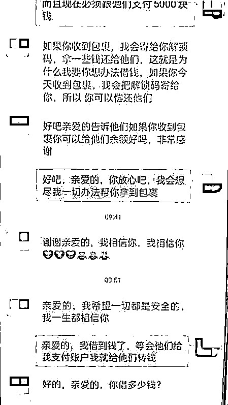
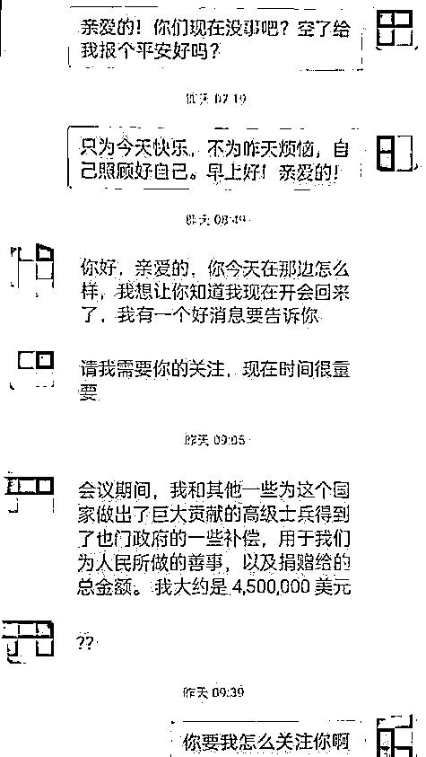
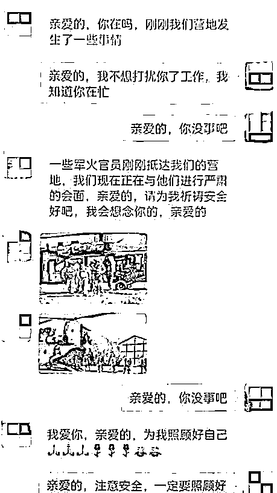
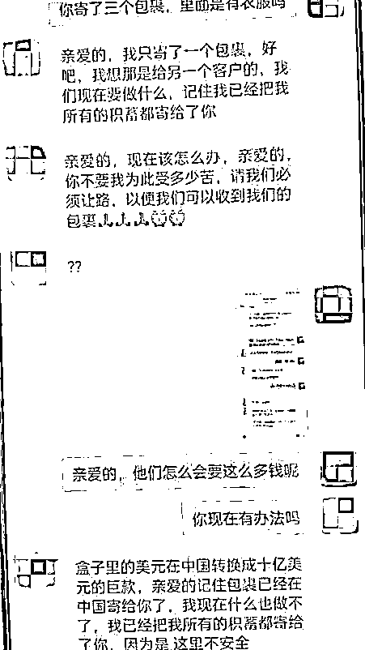

# 剧情狗血！两个杨女士被两个“David”骗了，骗子还用的同一个剧本……

> 原文：[`mp.weixin.qq.com/s?__biz=MzIyMDYwMTk0Mw==&mid=2247523920&idx=4&sn=0835d5de3dd6893b583817a8d254dfa8&chksm=97cb5568a0bcdc7e4980ac21adf2fa3ce23a8216cb39ddeca0454be7a0a0785d39a68e5f708d&scene=27#wechat_redirect`](http://mp.weixin.qq.com/s?__biz=MzIyMDYwMTk0Mw==&mid=2247523920&idx=4&sn=0835d5de3dd6893b583817a8d254dfa8&chksm=97cb5568a0bcdc7e4980ac21adf2fa3ce23a8216cb39ddeca0454be7a0a0785d39a68e5f708d&scene=27#wechat_redirect)

正执行任务的外国大兵“David”

在网络上与你**交上朋友**

要你帮忙缴纳**“保证金”**

来处理被警方扣押的**“宝藏”**

事成后将以“巨款”作为**回报**

……

这么荒诞的剧情

竟然险些让上海松江的

两位女子中招！

**支付 5000 元就能替**

**“David”保管 450 万美金**

10 月 17 日中午，市民杨女士来到松江区某银行欲汇款支付海外包裹过关费，工作人员听闻后意识到其可能遇到了诈骗，立即联系属地上海市公安局松江分局岳阳派出所。

杨女士表示其在某交友聊天平台上认识了在国外服役的大兵“David”，关系升温后，**“David”突然告诉杨女士一个“好消息”，他获得了当地政府为其分发的补偿金 450 万美金！**

但由于执行任务地区每月都对士兵进行检查，大量现金存放很危险，希望杨女士能提供收货地址和联系方式帮忙代为保管，并提供了物流快递公司的微信。几天后，**这个所谓的快递公司提出“David”的包裹被扣留，需要交纳 37000 元费用获得通关证书予以放行**，被洗脑的杨女士来到银行汇款。

**深陷“爱情”拒绝了代管 100 万美元**

**却差点在奔现机票上“折了腰”**

无独有偶，泖港派出所也遇到了类似的劝阻案例，**一位女士在银行欲转账 1.5 万元给一个“国外将军”**。民警发现这位杨女士在某唱歌 APP 结识了一位自称“David”的大兵，正在国外执行维和任务。故事也惊人的相似：**“David”得到了 100 万美元补偿金，想让杨女士帮助其保管**，杨女士深陷爱情，对“巨额财富”选择拒绝，表示和其相处不是为了钱财！

眼见“套路”行不通，9 月底，“David”表示想来中国与杨女士奔现，但是没有征得上级的同意，希望由杨女士跟上级沟通，并推荐了上级的微信。对方自称是“美国将军”，非常体恤下级，同意“David”提前退休，**但是需要杨女士代支付 1.5 万元的机票**，听到可以与“David”见面，杨女士欣然接受便有了来到银行要求汇款的一幕。

两日内

接连有两位杨女士

险遭“David”的诈骗

所幸在民警

及时、反复、针对性的

反诈宣传下

均避免了财产损失

但类似的情况需要引起警惕

网恋有风险

谈及钱财必有诈！

**警方提示**

网络交友充满风险，一定要核实对方身份，在涉及钱财相关的问题时，更要提高警惕，不要轻信对方“高额回报”等任何借口、说辞，保护好自己的“钱袋子”。

来源：警民直通车上海，拒绝跨境

赌博

← 向右滑动与灰产圈互动交流 →

