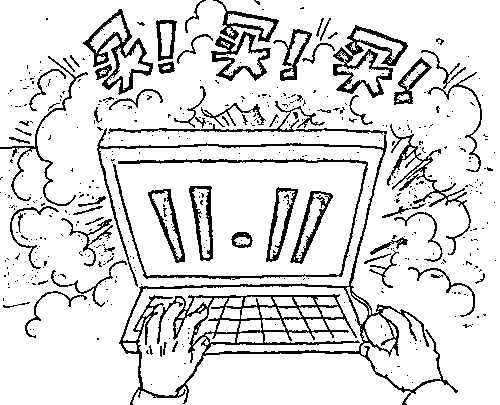

# 双十一临近，你准备好防诈骗了吗？

> 原文：[`mp.weixin.qq.com/s?__biz=MzIyMDYwMTk0Mw==&mid=2247523920&idx=5&sn=7e3b5d30643d5b7645efd494559e4e7a&chksm=97cb5568a0bcdc7ec32d59bb030492ac84b296bb17f3b106531d3eafd758b893553ac7503a61&scene=27#wechat_redirect`](http://mp.weixin.qq.com/s?__biz=MzIyMDYwMTk0Mw==&mid=2247523920&idx=5&sn=7e3b5d30643d5b7645efd494559e4e7a&chksm=97cb5568a0bcdc7ec32d59bb030492ac84b296bb17f3b106531d3eafd758b893553ac7503a61&scene=27#wechat_redirect)

双十一又来了 

你是不是已经开启“买买买”模式了呢？

面对剁手清单

你的钱包还 hold 得住吗？

“双十一”临近

** “假客服”  “中奖免单” **

** 等诈骗也开始有了上升的趋势 **

大家在购物的同时

需要提高警惕，谨防被骗！

<mpvideosnap class="js_uneditable custom_select_card channels_iframe" data-pluginname="videosnap" data-id="export/UzFfAgtgekIEAQAAAAAAiO8tkqt4vAAAAAstQy6ubaLX4KHWvLEZgBPE_IMoGQdGR6T9zNPgMIveVF1g0O70oXuYeBYDzrRg" data-url="https://findermp.video.qq.com/251/20350/stodownload?encfilekey=XGocBFxVWK5dcyOOqpEU47RpBHQIvlhnJQQQoJQYjqDk1iatluUOsOicaHoZM1kgu5lRIVT4iapTba5v2MYpUy24pMttGRicUxeZniagOKGszPvCWuk67hia3IFicHUIia0CfC5FneHFThKOlA318iazDpJib49A9ZtHyfU9SLjbpcR6KTPdAb36j7h51niag&amp;adaptivelytrans=0&amp;bizid=1023&amp;dotrans=0&amp;hy=SH&amp;idx=1&amp;m=83e84ae7f46c34999f19e60443c16d07&amp;token=x5Y29zUxcibAoMK1ZYBlicQU4HWFiaGlIuggQDvLYn9VSG6a3n7DZSIcWfHUPdd9nIC40OQcdhjH9U" data-headimgurl="http://wx.qlogo.cn/finderhead/naPHoFY2n5RbMAtGqzo9ckMfibVp0q0ibxrXTlibsWcADSLwpyqibytoNw/0" data-username="v2_060000231003b20faec8c4e28810cbd1cc04ee30b07781d4bd3e0aff07d40a3378c3c524ff8b@finder" data-nickname="国家反诈中心" data-desc="#反诈小剧场 请安装国家反诈中心 APP，为您保驾护航双十一。" data-nonceid="2534635545022980865" data-type="video"></mpvideosnap>

**01**

**刷单返利诈骗** 

**诈骗手法揭秘：兼职刷单+网络博彩**

[`mp.weixin.qq.com/mp/readtemplate?t=pages/video_player_tmpl&action=mpvideo&auto=0&vid=wxv_2015179913909043204`](https://mp.weixin.qq.com/mp/readtemplate?t=pages/video_player_tmpl&action=mpvideo&auto=0&vid=wxv_2015179913909043204)

来源：国家反诈中心

骗子往往以兼职刷单名义，先以小额返利为诱饵，诱骗你投入大量资金后，再把你拉黑。**切记：所有刷单都是诈骗，千万不要被蝇头小利迷惑，千万不要交纳任何保证金和押金!**

**02**

**“杀猪盘”诈骗** 

**诈骗手法揭秘：网上热恋+投资“盈利”**

[`mp.weixin.qq.com/mp/readtemplate?t=pages/video_player_tmpl&action=mpvideo&auto=0&vid=wxv_2009390089721675776`](https://mp.weixin.qq.com/mp/readtemplate?t=pages/video_player_tmpl&action=mpvideo&auto=0&vid=wxv_2009390089721675776)

来源：国家反诈中心素未谋面的网友、网恋对象推荐你网上投资理财、炒数字货币（虚拟币)、网购彩票、博彩赚钱的都是骗子！你当他(她）是神，他（她）当你是猪!**切记：始于网恋，终于诈骗！网友教你投资理财的都是诈骗!**

**03**

**冒充电商物流客服诈骗**

**诈骗手法揭秘：“客服主动退款”+申请平台贷款**

[`mp.weixin.qq.com/mp/readtemplate?t=pages/video_player_tmpl&action=mpvideo&auto=0&vid=wxv_2014807350427058189`](https://mp.weixin.qq.com/mp/readtemplate?t=pages/video_player_tmpl&action=mpvideo&auto=0&vid=wxv_2014807350427058189)

来源：国家反诈中心

当有网络卖家或者客服主动联系为你办理退货退款时，一定要当心！**切记：正规网络商家退货退款无需事前支付费用，请登录官方购物网站办理退货退款，切勿轻信他人提供的网址、链接!**

**04**

**虚假投资理财诈骗** 

**诈骗手法揭秘：“理财导师”+虚假平台**

[`mp.weixin.qq.com/mp/readtemplate?t=pages/video_player_tmpl&action=mpvideo&auto=0&vid=wxv_2014823517959028741`](https://mp.weixin.qq.com/mp/readtemplate?t=pages/video_player_tmpl&action=mpvideo&auto=0&vid=wxv_2014823517959028741)

来源：国家反诈中心

投资理财，请认准银行、有资质的证券公司等正规途径！切勿盲目相信所谓的“炒股专家”和“投资导师”!**切记:“有漏洞”、“高回报”、“有内幕”的炒虚拟币、炒股、打新股、炒黄金、炒期货、博彩网站等，都是诈骗!**

**05**

**虚假购物诈骗** 

**诈骗手法揭秘：网络广告+“购物送抽奖”**

[`mp.weixin.qq.com/mp/readtemplate?t=pages/video_player_tmpl&action=mpvideo&auto=0&vid=wxv_2014863564552863745`](https://mp.weixin.qq.com/mp/readtemplate?t=pages/video_player_tmpl&action=mpvideo&auto=0&vid=wxv_2014863564552863745)

来源：国家反诈中心

通过微商、微信群交易时，一定要详细了解商家真实信息，确定商品真实性，多方面综合评估。交易时最好有第三方做担保!**切记：网购时一定要选择正规的购物平台！对异常低价的商品提高警惕!**

**06**

**网络游戏虚假交易诈骗** 

**诈骗手法揭秘：“低价充值”+“充值解冻”**

[`mp.weixin.qq.com/mp/readtemplate?t=pages/video_player_tmpl&action=mpvideo&auto=0&vid=wxv_2009393114200735747`](https://mp.weixin.qq.com/mp/readtemplate?t=pages/video_player_tmpl&action=mpvideo&auto=0&vid=wxv_2009393114200735747)

来源：国家反诈中心

当在网络游戏充值、账号买卖时，一定要小心！诈骗分子会以低价充值、高价回收为由，引诱你在对方提供的虚假链接内进行交易。**切记：买卖游戏币、游戏点卡，请通过正规网站操作，一切私下交易均存在被骗风险!**

**双十一“买买买”**

**记住以下几点**

**守住你的“钱袋子”！**

01

收到自称客服的来电，请勿轻易相信，可先到正规网站核实交易信息或通过正规渠道获取官方电话核实。

02

请勿轻易将验证码、银行卡余额、银行卡密码等提供给“客服人员”，更不要按照对方指示操作；特别要注意不能提供验证码，这是最后的防线。

03

接到需要货到付款的快递时，应先仔细核对信息及物品，对于来历不明的快递一律拒收，以免上当；有关自己个人信息的快递单据，应先撕毁或者涂黑再丢弃，以免被不法分子利用。

04

网购时要选择有网上经营资质的商家，对价格明显低于市场价的商品应提高警惕，注意提防和甄别，小心低价诱惑的陷阱。

最后，再次提醒大家

网购诈骗套路多

**“买买买”一定要谨慎**

**千万别“掉坑”！**

来源：邯郸市反诈中心

← 向右滑动与灰产圈互动交流 →

