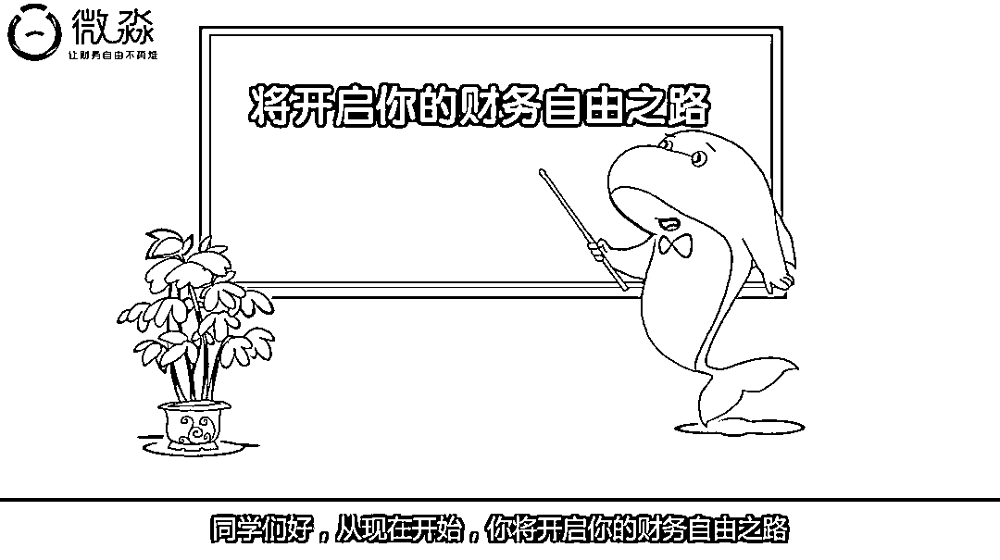

# 微淼商学院学员独家讲述：我曾上过“重新定义主动基金”的课

> 原文：[`mp.weixin.qq.com/s?__biz=MzIyMDYwMTk0Mw==&mid=2247523969&idx=2&sn=dd39dae08559f9adae32f774caff58ed&chksm=97cb55b9a0bcdcaf806c17767a478531c33ffd1425476350aeeb2202b1d4ead4b56e4ed7816b&scene=27#wechat_redirect`](http://mp.weixin.qq.com/s?__biz=MzIyMDYwMTk0Mw==&mid=2247523969&idx=2&sn=dd39dae08559f9adae32f774caff58ed&chksm=97cb55b9a0bcdcaf806c17767a478531c33ffd1425476350aeeb2202b1d4ead4b56e4ed7816b&scene=27#wechat_redirect)

“那是主动基金，是大堂经理推荐的”，“基金分为主动和被动，主动是别人推荐的，收益率低的可怜”……

11 月 9 日，一张微淼商学院理财训练营的截图在社交平台流传，其中对于“主动基金”的解释引起大众哗然。

有网友调侃：“重新定义主动基金，长见识了”；还有网友说：“按微淼商学院老师的解释，被动基金岂不是‘本来该涨可是被人动了手脚的基金’？”

被网友“群嘲”的微淼商学院，随后紧急发布声明，表示流传图片中的“木子老师”并非微淼的员工。

就在微淼商学院试图撇清与“木子老师”的关系时，一位前学员却向红星资本局爆料，**他曾在微淼小白训练营上过“主动基金”的课，任课老师的解释与“木子老师”的说法一模一样。**

截图自微淼官网宣传片

**微淼商学院学员独家讲述：** 

**“主动基金”背后是为了筛选“小白”**

“我曾经在微淼商学院上过‘重新定义’主动基金的课”，11 月 10 日，微淼商学院前学员王城（化名）向红星资本局讲述了他的经历。

2020 年 8 月，王城在一款遛狗的小游戏中，看到了微淼商学院的广告。“零基础可学的理财课，只需 12 元”、“资深规划师线上授课”、“从根源上解决财务问题”等广告词吸引了他的注意。

点进链接，缴费 12 元，王城加入了 2020 年 11 期“797 班微淼小白训练营”。

训练营一共 12 天的课程。每晚 8 点，是微淼小白训练营的晚课时间。2020 年 8 月 27 日这一天的课程主题是“投资理财——复利篇”。微淼商学院的周琳老师带头说着签到词“复利是个好东西”，几十位学员纷纷跟上。

图片由受访人提供

课上，周琳老师向学员们展示着她的理财收益：53.82%，紧接着说：“老师之前和大家一样，在没有学习掌握理财技能前，认为 5%的收益已经顶天了，但是老师在掌握理财技能后，达到 20%以上的年化收益率是很容易的。”

随后，周琳老师开始向学员传授“理财技能”，先是讲道，“第一件事，想变富有，不要买支付宝基金，那是场外基金，手续费高，而且跑不赢通胀。”

紧接着，周琳老师说，“第二件事，银行的理财产品更不要买”，此时便出现了令人啼笑皆非的“主动基金”。“因为那是主动基金，是大堂经理推荐的”，“基金分为主动和被动，主动是别人推荐的，就是为了完成任务的”，周琳解释称。

图片由受访人提供 

周琳老师的话术，与近日网络流传的微淼“木子老师”的话术一模一样。

红星资本局发现，当时并没有学员指出课程内容有误。现在，王城回忆起那一幕，对红星资本局说：**“我们这些小白当时要明白主动基金的正确概念，还能上当交费吗？”**

**“下至 11 岁，上至 88 岁都在上微淼的课”** 

**学员组团维权，怀疑群聊都是托**

在微淼小白训练营中，周琳老师不时在课上分享“11 岁小朋友”、“67 岁老人”都在报名微淼课程的信息，甚至说一位连电脑都不会用的 88 岁老人，也在微淼学理财。

图片由受访人提供 

**除了老师的教导，群内的学员们更是显得十分积极，每天都分享“学习心得”与“投资感悟”，并且表示“进阶课程很有必要”，主动询问报名渠道。**在这样的氛围下，王城又购买了微淼商学院的进阶课程。

2020 年 9 月，按照“周琳老师”提供的付费链接，王城向天津微淼财商科技有限公司转账 3 次，合计交了 6998 元的学费。不过，交费之后王城发现，**自己所在的微淼小白训练营立刻被解散了。**

图片由受访人提供 

进阶课程上到今年 2 月时，王城开始感到不对劲，**“微淼的老师整天给我们灌输财务自由，如果真的能靠这种理财方法实现财务自由，这些老师还会来讲课带学生吗？”**再回过头看小白训练营的课程内容，王城觉得自己是“被洗脑了”。

王城告诉红星资本局，有不少学员都与他有着相同的经历。如今，他们一起建立了维权群，要求微淼商学院退还学费。

维权群的学员们，都参加过不同的小白训练营，班级不同、报名时间不同、老师也不同。但学员们发现，**不同的老师讲的课程内容完全相同，甚至连群内其他学员的回复也都一模一样。**

王城向红星资本局展示了两张群聊截图，在小白训练营 797 班和 731 班，两位不同的学员都发了同样一段话：“我们赚的钱不少存款却不多，甚至还负债，都是思维出现了问题。感谢微淼，让我们在这个时候能够认清自己。”

**“我怀疑群内的其他学员都是托儿，连话术都是一样的。”王城表示。**

图片由受访人提供 

**学员报警称微淼涉嫌诈骗** 

**最强监管下微淼几度更名**

之后，王城开始走上退费维权的道路，他曾向北京市市场监管部门投诉，并拨打市长热线，举报微淼商学院。

今年 4 月 3 日，王城以微淼商学院涉嫌诈骗为由，向北京市公安局昌平分局报警，警方随后立案。

终于在 10 月初，微淼商学院退还了王城 6998 元的学费，但其他学员目前仍在艰难维权中。

王城只是维权学员中的一个缩影。红星资本局发现，**在某知名投诉平台上，关于微淼商学院的投诉量，曾在 7 个月的时间内暴涨 1800 条。**

与此同时，**财商教育正迎来史上最强监管。**今年 6 月开始，财商教育成了监管重点，“财商”“理财”等成了投放平台的敏感词。8 月 27 日，中央网信办启动为期 2 个月的清朗·商业网站平台和“自媒体”违规采编发布财经类信息专项整治，其中就包括违规的“财商课”。

在强监管的背景下，微淼商学院的相关账号随后几度更名。

红星资本局发现，今年 9 月 3 日，认证为“微淼财商教育”的微信公众号改名为“微淼理财创业教育”；9 月 6 日，该认证名称又被改为“微淼教育”。此外，微淼商学院的官方微博账号也改为“微淼教育”。

截图自微淼教育公众号

11 月 9 日，微淼商学院相关人士对红星资本局透露，微淼改名与国家目前的监管政策有关。

**创始人背景成迷，官网已撤其介绍** 

**名下公司涉嫌诈骗**

“主动基金”事件不断发酵，被网友“群嘲”的微淼商学院，在 11 月 9 日下午紧急发布声明，表示流传图片中的“木子老师”并非微淼的员工。

红星资本局在 10 日下午向微淼商学院求证此事，但相关负责人婉拒了采访。

微淼商学院试图撇清与“木子老师”的关系，却阻挡不了公众的质疑。“微淼声称自己的老师都是来自金融领域，有丰富的投资、教学经验，为何会在‘主动基金’这样的基础概念上闹笑话？”一位网友如此评论。

公开资料显示，微淼商学院成立于 2019 年 4 月，成立短短两个月就自称“中国财商教育领导者”。在 2020 年 12 月的公开报道中，更是被附上“超百亿估值”的光环，有知情人士透露此时的微淼商学院“单月收入已经超过 2 亿人民币”。

光环颇多的微淼商学院，其背后的运营主体为天津微淼财商科技有限公司（天津微淼），成立于 2020 年 6 月；在天津微淼的背后，则是北京微淼财商科技有限公司（北京微淼），两家公司有着同一个实际控制人——封贺。

一直以来，关于微淼商学院的质疑声从未间断。今年 3 月，红星新闻曾报道，**微淼学习群内存在多名“托”，疑似杀猪盘。并且“导师”不限学历和经验，只要培训 7 天就可上岗；还会以“完成作业”的形式，要求学生购买特定股票或基金。**

今年 10 月，有媒体爆料称，微淼商学院被指诈骗，多地警方立案，总部“人去楼空”。当时，微淼商学院对媒体回应称，是由于业务调整，搬了办公区。

而**微淼商学院创始人封贺，也面临着颇多质疑。**封贺的资料显示，其是复旦大学经济学学士，有着 10 年投资实战经验，擅长 A 股、港股、美股等投资工具，还著有《财务自由工具操作技能课》等书籍。

但有媒体指出，封贺的学历实为“夜大”，而他名下的北京金桐商品经营有限公司（现已注销），也被曝出涉嫌诈骗。

11 月 11 日，红星资本局发现，微淼官网已经撤下了关于封贺的介绍。

← 向右滑动与灰产圈互动交流 →

