# 在直播间花了七八万后，结果令人窒息

> 原文：[`mp.weixin.qq.com/s?__biz=MzIyMDYwMTk0Mw==&mid=2247523969&idx=3&sn=37e3847234ee6803821f63f025fa7c5c&chksm=97cb55b9a0bcdcaf67baf732a46aed0a9d3778a9925a5ab370acd15df756de6cd0021027a65f&scene=27#wechat_redirect`](http://mp.weixin.qq.com/s?__biz=MzIyMDYwMTk0Mw==&mid=2247523969&idx=3&sn=37e3847234ee6803821f63f025fa7c5c&chksm=97cb55b9a0bcdcaf67baf732a46aed0a9d3778a9925a5ab370acd15df756de6cd0021027a65f&scene=27#wechat_redirect)

又是一年双十一

你的购物车都清空了吗？

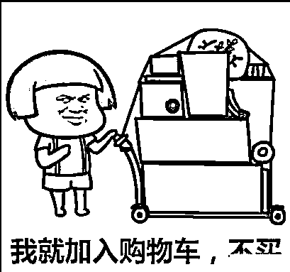

每到购物季 

除了买买买的火热气氛

买到假货的消费者投诉 

也不在少数

**老人两年间网购三十余件玉石产品**

北京的王女士是玉石直播间的超级粉丝，

两年购入三十余件玉石产品，

总共花了七八万元。

[`mp.weixin.qq.com/mp/readtemplate?t=pages/video_player_tmpl&action=mpvideo&auto=0&vid=wxv_2130976538719240196`](https://mp.weixin.qq.com/mp/readtemplate?t=pages/video_player_tmpl&action=mpvideo&auto=0&vid=wxv_2130976538719240196)

其中，一件五千元购入的

祖母绿翡翠手镯”让王女士非常得意

觉得自己捡了大漏

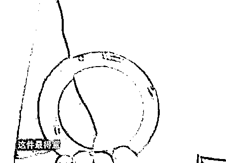

但经过专家鉴定

这些翡翠”全是酸洗注胶过的

不是天然翡翠

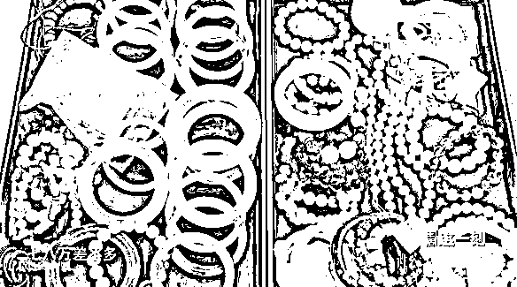

说白了就是染色石英岩

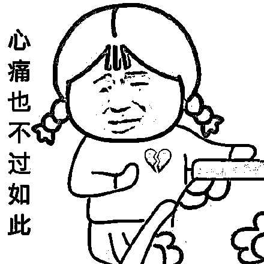

珠宝专家指出，

天然祖母绿的翡翠的确存在，

但全中国可能只有屈指可数的几只，

价格几千万甚至上亿都有可能。

目前，王女士购买的店铺

都已注销，平台表示将跟进

**网友看不下去了** 

原来那些一看就特假的直播间

真的有人信有人买

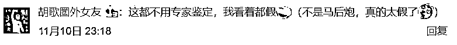

**吐槽老妈的** 

“妈妈在直播间二十块买的金耳坠三块买的钻戒 

还要我拿去鉴定，信誓旦旦说是真的”

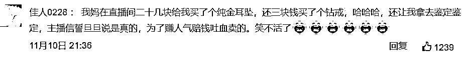

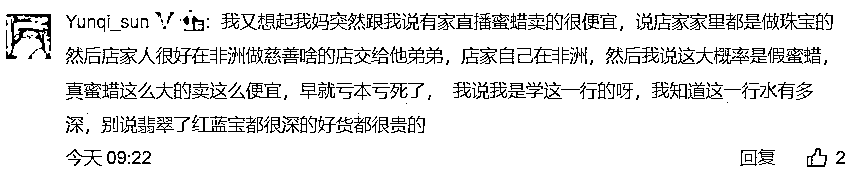

“我姨直播间花几百块买的香奈儿包

还信以为真了” 

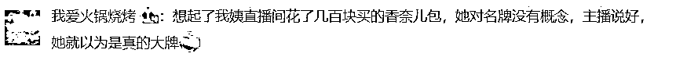

翡翠行业水太深，虽然都可叫翡翠

只不过是 bc 货，还注过胶上过色

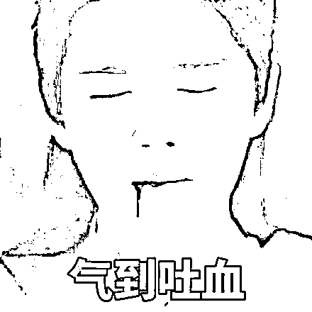

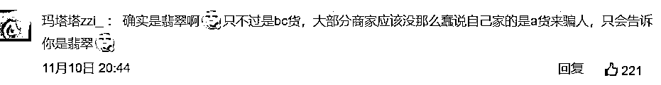

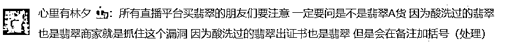

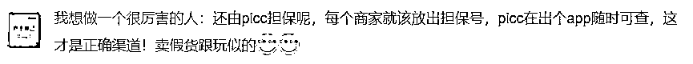

事实上，在直播平台

卖玉石的生意非常火爆

公开资料显示，仅在云南瑞丽，就有近 4 万人从事珠宝玉石直播销售工作，2020 年 1 至 5 月，瑞丽全市直播销售额高达 36.6 亿元。此外广东、河南等地也有大量主播在直播卖玉。

** “价值上千”的翡翠进价仅 30 元**

有媒体记者曾以供货商的名义，参加过一场直播带货。

主播秋风在直播间售卖的翡翠山水吊牌，包装盒上印有“CCTV 展播品牌周九福珠宝”的字样。记者发现，“周九福珠宝”虽然与周六福珠宝品牌相像，但两者并无关系。周六福珠宝曾发起商标维权，分别对“周五福”、“周八福”、“周九福”商标提起诉讼，请求宣告傍名牌商标无效。

这款翡翠也并非秋风宣称的“价值上千元”。记者从供货商处了解到，这款玉石的出货价仅 20 多元，配上一个成本三块二的缎面包装盒后，看起来会高档不少。

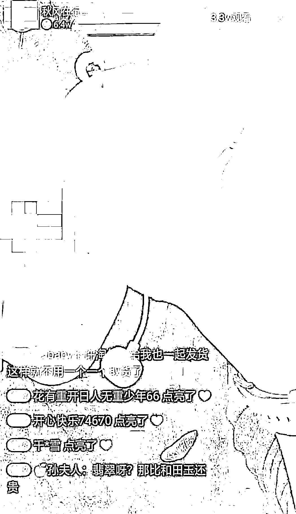

▲秋风在直播间叫卖劣质玉石和洗手液，并在展示商品时进行“砍价表演”。视频截图

一位业内人士看了这款玉石的图片后，当即判断该吊牌价值低廉。“纹路、工艺都比较粗糙，肯定是机器刻的，雕刻一个工费就几块钱。从成色看，也是比较低等的材料。”

这款“亏本销售”、价格打了一折的翡翠，算上快递费，也能给秋风带来每件 63 元的利润。

当晚，秋风还卖了一款“新疆金丝玉平安扣”，售价 19.9 元。一名从事珠宝鉴定的行业人士告诉记者，金丝玉通俗的叫法就是鹅卵石，价值低廉。但在各种套路助力下，这款产品卖出了 110 件。

不容忽视的是

这股热潮背后

虚假宣传、质量差

甚至遇骗的投诉也居高不下

据媒体报道称，2018 年 7 月，福建宁德破获一起利用翡翠直播进行电信诈骗的骗局，主播高价兜售废石，不仅“演戏”，连视频中的市场都是在租赁房内搭起来的。2020 年 5 月 12 日，瑞丽市公安局摧毁一个诈骗团伙案，他们在直播间诱导消费者买玉石原料，购买金额较大时，则以原石被切垮为由将资金吞没。

一位业内人士透露，玉石直播的套路难辨真假，直播中的美玉常常与实物的落差很大。直播间会以强光灯照射展台，透过镜头，玉质的白度被提升了几个档次，但同时玉质的瑕疵很难展现出来。

**直播带货成消费维权主要阵地** 

今年上半年，薇娅直播间出售山寨 Supreme 联名商品翻车道歉，而这并不是头部主播首次卷入假货风波，更早之前，相似事件也曾在辛巴、罗永浩等人的直播间发生。

在选品已较为严格的头部直播间之外，假货问题更为泛滥。2020 年中国消费者协会发布的“618”消费维权舆情分析报告显示，直播带货是消费维权的主要阵地之一。

**假货“重灾区”在哪里**

在直播间买什么东西更可能遇上假货？

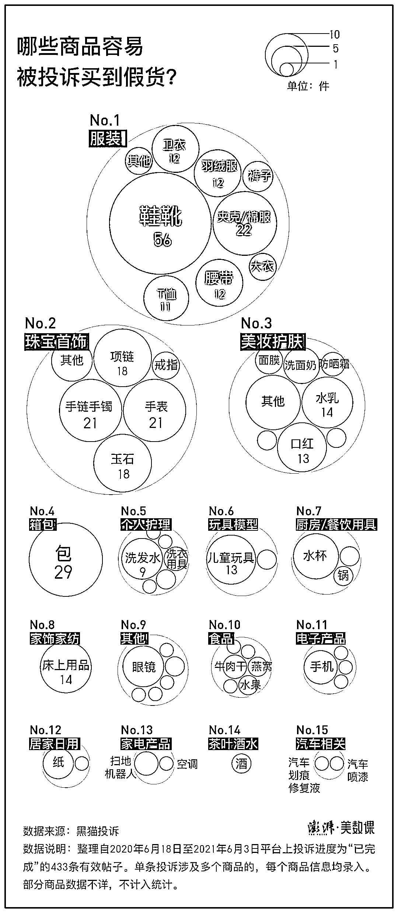

经过统计发现，**服装、珠宝首饰、美妆护肤是被投诉最多的三大品类，它们也是直播带货中的热门类别。**

**消费者不易，又打假又维权**

中国消费者协会公布的《直播电商购物消费者满意度在线调查报告》显示，有 37.3%的受访消费者在直播购物中遇到过产品质量问题，仅有 13.6%的消费者遇到问题后进行维权投诉。维权率过低会反过来滋长假货蔓延。 

但由于行业规范不足，消费者即便主动维权，也不能保证成功。其中的一大难题是，究竟如何判断或证明自己买到的是假货。根据维权成功的案例，有媒体总结出了消费者“打假” 的 8 种主要方式。

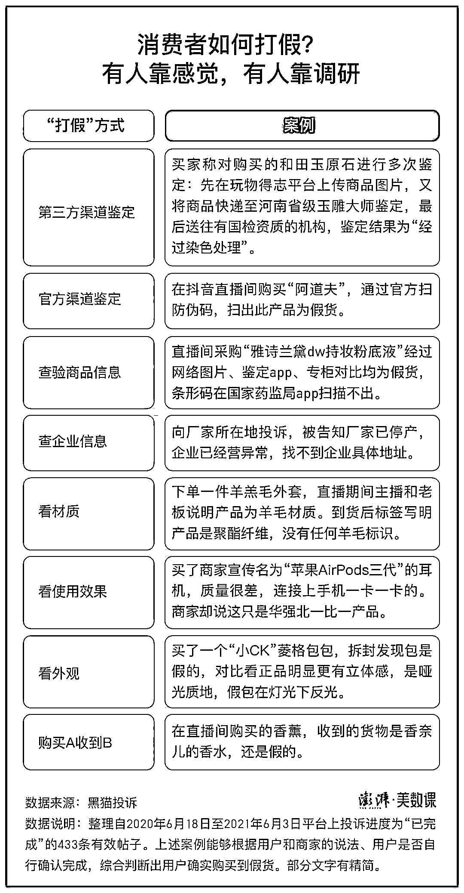

**留给今年双十一**

**付尾款时间已不多** 

**大家还是擦亮双眼吧** 

**毕竟买那么还是为了省钱啊**

来源 | 澎湃新闻、新闻晨报

← 向右滑动与灰产圈互动交流 →

