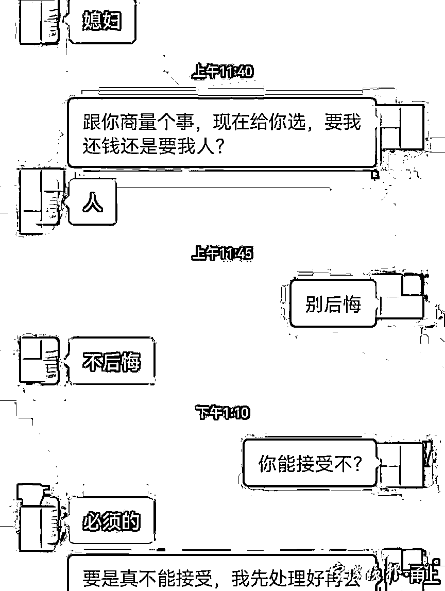
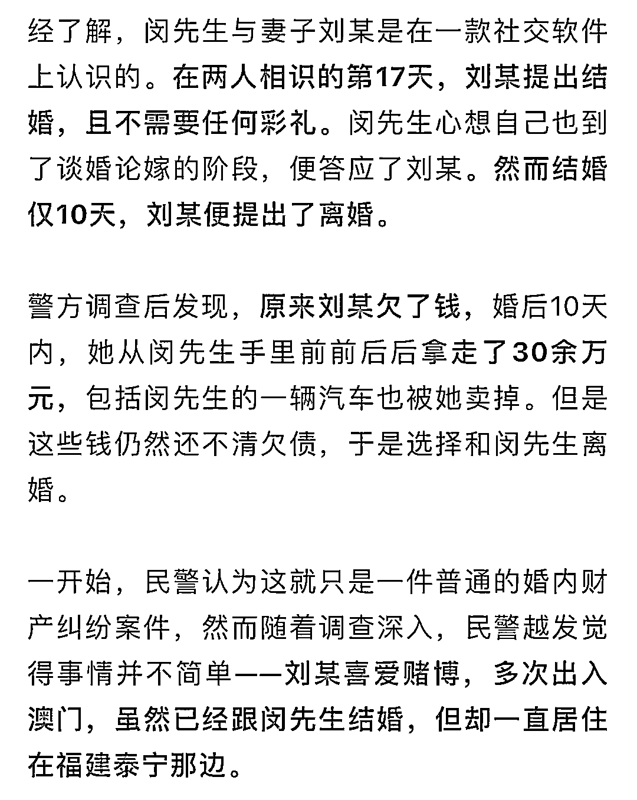
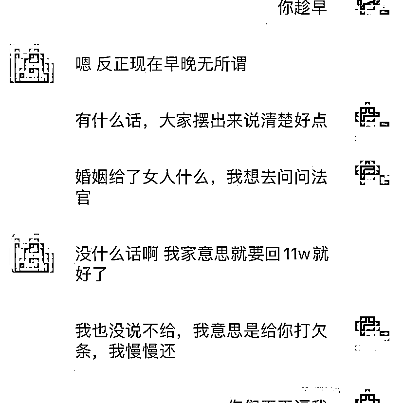
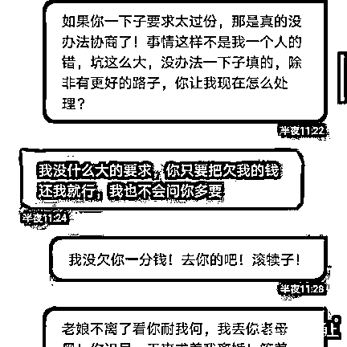

# 男子与妻子相识 17 天闪婚，10 天后“被”离婚？警方：她还有 5 任丈夫…

> 原文：[`mp.weixin.qq.com/s?__biz=MzIyMDYwMTk0Mw==&mid=2247523969&idx=4&sn=9506cd7802ef0afa6dd0bd8447a16877&chksm=97cb55b9a0bcdcaf0a4076d91fee264edc409eeda9c3fa846361553fdc5753767e0fb06a0baa&scene=27#wechat_redirect`](http://mp.weixin.qq.com/s?__biz=MzIyMDYwMTk0Mw==&mid=2247523969&idx=4&sn=9506cd7802ef0afa6dd0bd8447a16877&chksm=97cb55b9a0bcdcaf0a4076d91fee264edc409eeda9c3fa846361553fdc5753767e0fb06a0baa&scene=27#wechat_redirect)

7 年内前后有过 5 任丈夫，现在这一任丈夫**仅相识 17 天就闪婚，结婚 10 天后又提出离婚。**

近日，浙江宁波市北仑警方将这名涉嫌**利用婚姻骗取男方钱财**的嫌疑人刘某**抓捕归案**。

[`mp.weixin.qq.com/mp/readtemplate?t=pages/video_player_tmpl&action=mpvideo&auto=0&vid=wxv_2122662544334028803`](https://mp.weixin.qq.com/mp/readtemplate?t=pages/video_player_tmpl&action=mpvideo&auto=0&vid=wxv_2122662544334028803)

前不久，北仑公安分局霞浦派出所接到市民闵先生报警称，自己被妻子骗婚，损失 30 余万元，希望警方可以帮助他将钱财追回来。

随后，民警联系刘某，刘某依旧拒绝现身。此时，闵先生联系警方，称刘某要与自己前往福建办理离婚手续，民警即刻前往火车站对刘某进行抓捕。 

“我们经过进一步调查，发现**刘某从 2014 年至今已经结过 5 次婚，每次的婚姻时间都不长，最短的只有两三个月，而且都存在着婚内卷钱的情况，刘某有骗婚的嫌疑。**”胡际伟介绍说。

目前，刘某已被警方依法刑事拘留，案件还在进一步侦办中。

来源 ：宁波晚报

← 向右滑动与灰产圈互动交流 →

