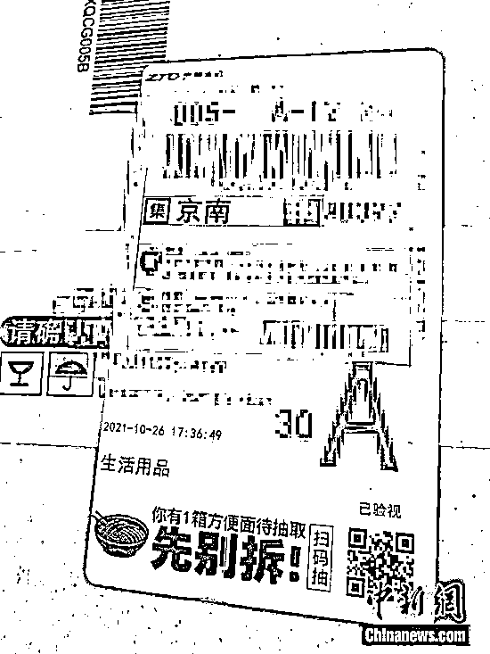
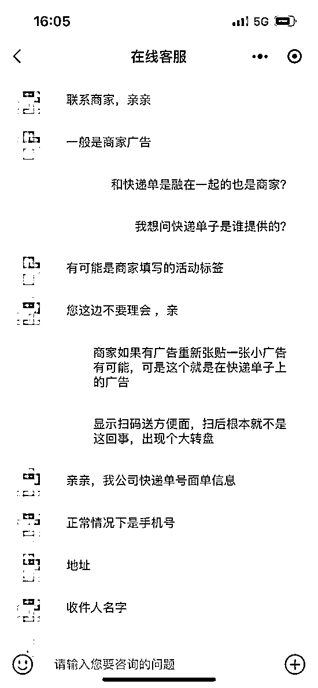
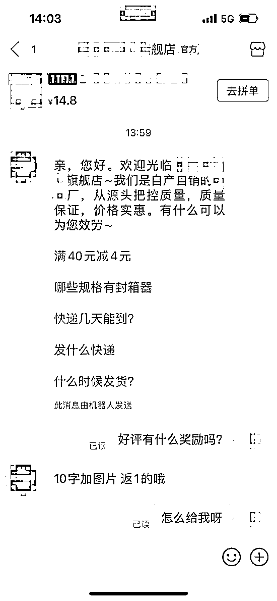

# 注意！“双 11”快递单的“抽 iPhone”，是忽悠你借钱

> 原文：[`mp.weixin.qq.com/s?__biz=MzIyMDYwMTk0Mw==&mid=2247523969&idx=5&sn=0d7cd667cd0820719027921ea89c5f01&chksm=97cb55b9a0bcdcaf3193470e20908fff118183f70546acc6ac0d4cd8531bfdb06be6fda572ea&scene=27#wechat_redirect`](http://mp.weixin.qq.com/s?__biz=MzIyMDYwMTk0Mw==&mid=2247523969&idx=5&sn=0d7cd667cd0820719027921ea89c5f01&chksm=97cb55b9a0bcdcaf3193470e20908fff118183f70546acc6ac0d4cd8531bfdb06be6fda572ea&scene=27#wechat_redirect)

你的“双 11”快递收到了吗？上面有没有“小广告”，如果有标注扫码抽 iPhone、抽方便面等，千万别信。

快递单上印的广告，小心！

近日，有消费者对中新网记者反映，自己的快递单上出现广告，标注“你有 1 箱方便面待抽取”，扫二维码进行抽取，但实际上根本就抽不到。

快递单上出现广告。受访用户供图。

记者了解到，有的广告直接是印在快递单上，融为一体，还有的是张贴在快递包装箱上面，类似电线杆上的“小广告”。

这些广告很多标注“赢 iPhone”“扫码抽方便面”等字眼，吸引用户扫码，但点击进来后，往往是“抽奖大转盘”“砸金蛋”“抽红包”等，记者试验多次，最后奖品全是借贷、理财等“奖品”。

快递公司回应：不用理会

针对快递单上印广告一事，中新网记者联系了某快递企业的客服，有客服人员表示，一般是商家广告，有可能是商家的活动标签。

快递公司客服回应“不用理会”。部分回应截图

如果说在包装箱上张贴的“小广告”，有可能是商家行为。那“广告是和快递单融为一体”是怎么回事？这样的快递单是谁提供的？

某快递企业客服回应称，“我们公司快递面单信息正常情况下是手机号、地址、收件人和单号，其余信息不用理会。”

北京云嘉律师事务所副主任、中国政法大学知识产权研究中心特约研究员赵占领接受中新网记者采访时称，在快递单上印广告没有问题，法律上没有禁止性规定，只要广告内容不违法就可以。

包裹里塞“好评返现卡”现象依然泛滥

除了包装箱外面印广告，商家还经常在快递包裹里加塞“好评返现卡”。

不过，广东省消委会近日抽样调查发现，85 款样本附有“好评返现卡”，通过返现、红包、卡券等方式诱导消费者对产品作出非客观评价。

近日，扬州 3 家餐饮店因在外卖内放置“好评返现卡”已被市场监管部门处罚。

有律师表示，商家快递或外卖内夹带“好评返现卡”不仅侵犯了消费者的知情权，同时也构成虚假宣传，属于不正当竞争。

一些商家好评返现仍暗中存在，联系客服即可。截图

记者调查发现，目前多家电商平台上已屏蔽“好评返现”等关键词搜索，但联系一些商家客服后，就会得到“10 字加图片返 1”“返 3”等回答，好评返现暗中存在。

另外，“好评返现卡”本身也成为一种商品，目前，电商平台上就有大量店铺售卖“好评返现卡”，有的取名“新规评价卡”等规避风险。实际上，在卡片上，依然明显标注“全五星晒图+优质评价，奖励 1 元”等内容。

**对于快递中夹带的广告，你怎么看？**

来源：中国新闻网，红网

← 向右滑动与灰产圈互动交流 →

