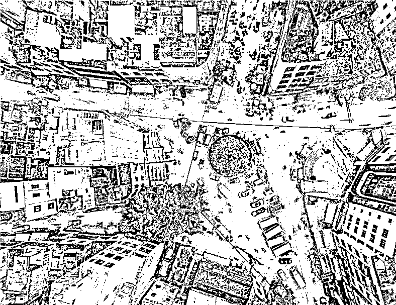
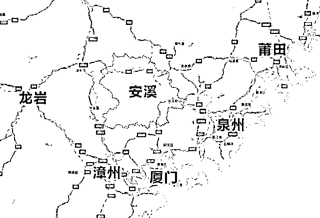
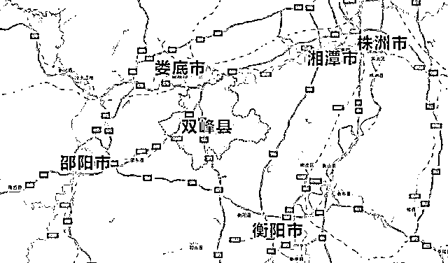
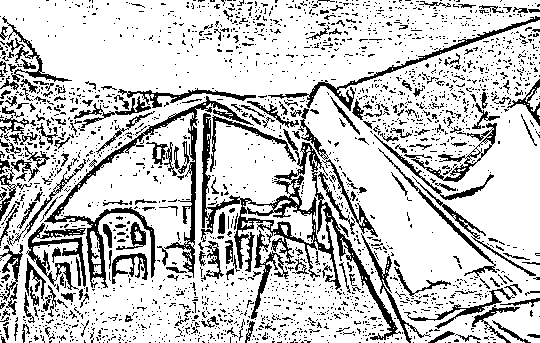
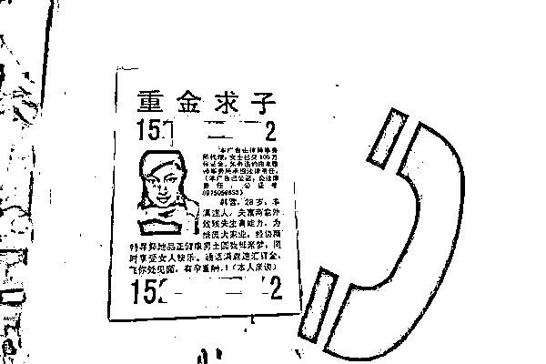
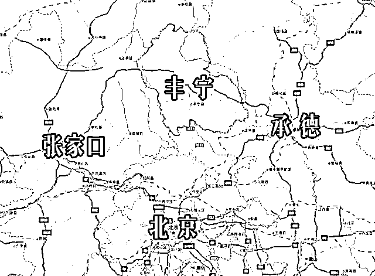

# 诈 骗 行 业 简 史

> 原文：[`mp.weixin.qq.com/s?__biz=MzIyMDYwMTk0Mw==&mid=2247524021&idx=1&sn=226778ff5870fc1d76c48bd34c5d757f&chksm=97cb558da0bcdc9b76cbffdddd5b7137281e68363b3a0d1ec453e16af3b944d58fb2a7190064&scene=27#wechat_redirect`](http://mp.weixin.qq.com/s?__biz=MzIyMDYwMTk0Mw==&mid=2247524021&idx=1&sn=226778ff5870fc1d76c48bd34c5d757f&chksm=97cb558da0bcdc9b76cbffdddd5b7137281e68363b3a0d1ec453e16af3b944d58fb2a7190064&scene=27#wechat_redirect)

**导读：**

现在骗子的行骗方式花样百出，不仅老年人容易上当，年轻人也经常中招，今天推荐这篇文章对中国诈骗产业链做了全面剖析，无论你之前有没有被骗中招过，都值得看一看。

每逢年底，诈骗犯罪的人，都在开足马力冲 KPI。

此前，小偷界每年春节前都会召开一次年终总结表彰大会，对过去一年的工作进行总结。对新一年的工作进行部署。直接有一年，各省盗窃冠军 13 人在武汉开小偷年会被一锅端了。然后发现，他们有长期做笔记总结与改进自己的盗窃技能。

不过，**随着电子支付的普及，传统的盗窃方式逐步被淘汰，各种诈骗则正在遍地开花。**“猜猜我是谁，我是你领导”、美艳少妇重金求子、淘宝退换货转账、机票退改签转账、裸照威胁......这些新型诈骗方式推陈出新。

屏幕背后，这些人到底是谁？首先他们是以宗族乡里联结而成的团伙。由于以血缘与宗族势力为核心的关系，可以最快速构建信任。因此，每一类诈骗类型，都分布在不同的地区。而由于每个地区民情差异极大，不同的地区，也有不同的诈骗文化差异。

此前，国务院打击治理电信网络新型违法犯罪工作部际联席会议上，将**河北省丰宁县（冒充黑社会老大）、福建省龙岩市新罗区（冒充淘宝客服）、江西省余干县（冒充富婆重金求子）、湖南省双峰县（PS 领导人裸照 ）、广东省茂名市电白区（猜猜我是谁、我是你领导）、广西壮族自治区宾阳县（盗取 QQ 冒充亲人）和海南省儋州市（假扮客服机票退改签）**等 7 地列为重点整治地区。

**这是第一次将全国诈骗的版图公开于众，揭示了年“产值”数以百亿计的电信网络诈骗地域化、家族化、产业化的冰山一角。**

诈骗地图的形成不是偶然，这些诈骗地区，通常是一些经济落后，人口众多，社会治安复杂，民情特殊的地方。

现在我们把诈骗重灾区细扒一遍，不是为了开地图炮。把这些有统计数据和警方内部办案经验作为依据的事实写出来，是为了更多的人不被骗。

**01******诈骗祖师爷****

****诈骗祖师爷，来自台湾。****

**2003 年，不仅有非典，还是大陆电信诈骗的元年。“刮刮乐”（类似体育彩票）中奖诈骗从台湾南部高雄、彰化发迹后，席卷台湾。2300 万台湾人基本都被诈骗分子用地毯式电话轰诈过，全台湾人民接受了一遍防范诈骗的深刻教育与洗礼，**已经无人可骗。于是，这批电信诈骗“祖师爷”北上来到福建安溪。**因为台湾 2300 多万人口中，有近 200 万祖上来自安溪，血脉同宗、文化同根、语言同源，湾骗回安溪，就如同回家。**

****

**全国七个诈骗重灾区都把盛产铁观音著名的福建省安溪县当做神一样的存在。说福建安溪县是电信网络诈骗江湖的总教练、祖师爷，绝对不是浪得虚名。安溪电信诈骗“事业”起步要比国内整整早了一轮。**作为湾骗的关门弟子，安溪骗子最初也是从中奖诈骗起步。****

**央视的“非常六加一”、湖南卫视的“快男快女”等节目，不仅仅是最受观众欢迎的综艺，也是这一时期电信诈骗犯们最喜欢的诈骗由头。他们用自制的“土炮”（短信群发器），几近疯狂地向全国各地发送中奖短信。高峰期，安溪作为一个县，发送的短信竟占福建省的三分之一，**亚洲最繁忙的基站就坐落于安溪魁斗镇。****

**青出于蓝而胜于蓝。**

**安溪骗子师从湾骗但也很快超越湾骗，当中奖诈骗这一招被拆穿而过时之后，他们迅速**转型到冒充公检法诈骗、贷款诈骗、购房购车退税诈骗、助学金诈骗等，全力打造诈骗界的“全能神”。最后，这批人转型从前台走向幕后，专门给诈骗分子洗钱抽成，占据诈骗食物链的最高端。**甚至走出国门，走向世界，去东南亚做“狗推”、做“客服”，带领全国的诈骗行业开拓新业务。**

**02******辐射到福建、湖南****

**2004 年官方对福建安溪的台湾籍诈骗团伙进行打击后，台湾籍诈骗团伙转移到周边省份，电信诈骗又被娄底市双峰县嫌疑人接手。**湖南娄底就成为电信诈骗、合成裸照诈骗及假金龟假金砖诈骗高危地区。**目前已由双峰蔓延到临近县域，高危人群规模近一步扩大。**

**技术进步带来产业的迭代升级。在湖南娄底，电信网络诈骗发展出更灵活的单兵作战模式，业务也更加多元化，PS 合成落照、假证件市场基本都被他们垄断。这伙人还懂得钻刑侦制度发案地公安机关管辖的空子，在外省流动作案，得手后立即携带设备转移。2010 年公安部组织 3000 余名警力，协同台湾警方联手摧毁特大电信诈骗犯罪网络群，捣毁诈骗窝点及地下洗钱场所 124 处，仅长沙就出动警力 2000 人，抓获台湾籍嫌疑人近 200 名，捣毁窝点 22 个。**

****

**湖南娄底双峰县的骗子算是诈骗界的艺术家。**著名的“东南亚证件集团”就是由湖南双峰籍的人在操控**，他们能够帮你拿到北大清华的博士证、南翔技校的技工证。只有你有钱，没有它办不到的证。后来，随着各种毕业证、资格证联网联查，假证市场也开始逐步萎缩。**

**假证办不了，他们开始 PS 领导裸照诈骗。从各个政府公开网站获取领导人的照片、职务等信息，然后将领导人的照片下载，头像嫁接到裸男身上，再将裸男与某个裸女合体，照片一般背景昏暗，似是而非。将照片和一封以某报记者或知情人的名义寄给官员本人，要求官员打一笔 20-30 万的款项到指定账号息事宁人，否则举报到纪委。**中招的官员一般还不敢报警。****

**这种套路成功率虽然不高，但哪怕一千个里面一个成功就行，获利颇丰。PS 领导人裸照诈骗最猖狂的时候，某些地方的政府网站上领导人的照片都要打马赛克。**

****03**********全国的诈骗地图******

****从台湾传入，在福建安溪落地生根后，诈骗分子好像蒲公英一样飘散到全国各地落地生根。****

******诈骗分子普遍有强烈的地域性特征和特别“擅长”、雷同的诈骗手法。甚至，诈骗发生后，公安都能根据诈骗类型判断嫌疑人来自何方。******

******海南省儋州市——机票退改签诈骗******

****儋州，地处海南西北部，濒临北部湾，人口众多且构成复杂，客家人和黎族苗族混居，社会治安较差，黄赌毒泛滥，经济不发达，是多种类型的犯罪高危人群聚集地。**儋州做电信诈骗的外号叫“作吃”仔，全国发生的机票退改签诈骗，60%以上是儋州的“作吃”仔所为。**目前，儋州的“作吃”仔已远远不满足于机票退改签的单一品类诈骗，开始向贷款诈骗、杀猪盘等多元化方向发展。****

****机票退改签诈骗基本套路是：1.通过各种非法手段获取顾客机票的订票信息；2.冒充航空公司的客服，以顾客预订的航班取消，需要退票、改签等理由，获取顾客银行卡号码、密码，并摸清顾客银行卡内的余额；3.以收款需要提供验证码为由，让顾客提供验证码（实为支付的验证码）。走完这三步流程，顾客卡上有多少钱都会被转到骗子的账上。****

****后来，“作吃”仔又对诈骗手法进行了迭代升级，只需要获取某些人的个人信息，然后假冒他的朋友，以情况紧急，原来预定的航班出现问题，需要朋友协助收取退款并重新预定航班为由，一步步设套，让这些人躺着中招。****

******当地甚至形成了一条完整的产业链**，有人负责盗窃身份证，有人负责用他人身份证开设诈骗用银行账户，有人负责具体实施诈骗，有人负责提款分赃。儋州下属的那大镇甚至出现了一个二手身份证交易市场，可以在此成批购买他们丢失或被盗的身份证。自 2006 年至今，受骗者遍布全国。儋州还是“金砂诈骗”案件的高危地区。源源不断的犯罪收入又带动了当地娱乐业的发达，导致社会治安进一步混乱。****

******福建省龙岩市——“淘宝哥”退换货诈骗******

****福建龙岩市下辖新罗区，新罗区下辖适中镇，该镇有 3 万多人，做“淘宝哥”的不下数千人。龙岩是山区，**“淘宝哥”为了逃避警方打击，纷纷走进深山老林，搭帐篷，架网线，骗不到钱誓不下山。**在警方的强力围巢下，目前山上的账篷几乎绝迹，“淘宝哥”又开始向周边市县和省份扩散，走出大山，走出全国。****

********

****淘宝哥在山上搭帐篷逃避打击 ****

****淘宝哥诈骗基本套路：1\. 通过各种非法手段获取网购顾客购物、快递信息；2.冒充淘宝、京东等购物网站的客服，以顾客购买的货物质量有问题、快递过程中质量受损等理由，向顾客承诺双倍甚至三倍赔偿；3.诱导顾客提供支付宝、银行卡等收款账号；4.诱导顾客刷二维码收款（实际上是支付码）；5.诱导顾客提供收款验证码（实为付款验证码）。走完这五步流程，顾客卡上、支付宝里有多少钱都会被转到骗子的账上。****

******茂名市电白区——“猜猜我是谁，我是你领导。”******

****那个著名的诈骗手法“猜猜我是谁，我是你领导”，就来自茂名电白。茂名市电白区位于粤西，是广东经济相对落后的地方之一。搞电信诈骗的主要集中在麻岗、树仔两镇。在电白搞电信诈骗的，花名叫“做生佬”。大约在 2006 年前后，全国各地的许多人开始接到玩游戏似的“猜猜我是谁”电话。随后，在 2014 年前后，“猜猜我是谁”有了升级版——“我是你领导，明天请到我办公室”。**在对方入套之后，诈骗者会以领导身份，以送礼给上级领导急需用钱等各种借口让对方汇款。******

****以上两种诈骗形式均是“以量取胜”，做这些业务特别费手机。当地警方透露，最高峰时，麻岗、树仔两镇同时有上千部手机在不停往外拨打诈骗电话，一部手机一天少则 50 通，多则 300 通。而诈骗分子用的都是一两百元的山塞机，一旦骗一单大的，为了不留下线索，直接就把手机扔到臭水沟里。因此，**麻岗、树仔两镇的水沟里，随便一捞这种烂手机能捞出一箩筐。******

****基本套路：1.非法获取公民的个人信息，电话号码；2.以熟人的口吻打电话直呼对方名字，让对方猜猜我是谁；3.对方根据声音判断误把骗子当作某个旧识，骗子借机上位，把自己当成对方的那个旧识，让对方保存新的电话；4.时隔一两天后以车祸、急病、找小姐被抓等各种由头让对方转钱。****

******广西宾阳县——QQ 盗号冒充家人领导要求转账******

******广西宾阳的电信诈骗则以 QQ 植入木马盗取账户而出名，属于诈骗界的技术派。**这些人在当地被称为“Q 仔”。宾阳的“Q 仔”曾经撑起了宾阳的电脑市场、豪车市场、夜店、酒楼消费的半边天。宾阳虽是小县城，但是全国各地的警察都来宾阳“打过卡”。《南方周末》报道称：“你在酒店里听，只要是外地口音的，基本都是来这里办案的便衣警察。”****

****QQ 诈骗案有着典型的作案流程和手段。宾阳诈骗团伙通常分为头目、盗号人、聊天人和取款人。头目负责指挥实施诈骗；盗号人负责散播盗号木马，盗取 QQ 账号并远程录下被盗人视频；聊天人冒充被盗人向其亲属、好友行骗；取款人则负责取回诈骗来的钱。****

****2015 年以后，宾阳的“Q 仔”对原有骗术进行了升级——组建公司的微信群或 QQ 群，以公司老板的名义下达指令，要求财务人员以付货款、合同款等各种名义转出大笔款项。用这种手法，宾阳的“Q 仔”们一次性骗了 3500 万，创下电信诈骗的阶段性记录。几天后，这个记录很快就被打破了，贵阳一公司被同样的手法骗走 1.027 亿元。****

******江西余干县——美女重金求子******

****重金求子诈骗主要来自余干县江埠乡石溪村和洪家嘴乡团林李家村，受害者遍布全国 20 多个省市，这两个村也因此成为当地有名的“富婆”村。**这类型诈骗一般都是夫妻档，女的扮美女富婆，男的扮律师、公证员。依靠一款魔音手机作案，老妇秒变少女。**瞄准的是那些有精子没金子的地盘工、流水线工人、五线以下城乡结合部的有志青年。****

********

******富婆们重金求子的广告也许是复制粘贴的**，内容大致为：本人，女，30 岁，身高 1.65 米，肤白靓丽，楚楚动人，嫁香港富商，夫无生育能力，眼看雄厚资产无后继承，为避免纷争，借探亲之机寻找体贴、健康、品正的男子共孕，通话满意，将汇定金 30 万元，安排住宿见面后，体检签约，有孕重酬 150 万-500 万元。不影响家庭，本人亲谈，短信不回。****

****诈骗手法主要分为五步：1.诈骗分子冒充香港富婆，以丈夫残废无生育能力为由，高价找人借种生孩子。2.网上选一张靓照，通过专人登报或者群发短信的方式把基本信息快速发布出去。3.跟自投罗网者聊，塑造起“富婆”形象。4.对方进入圈套后，诈骗分子假装到对方的所在地去，但不会真见面，而是用模拟定位到对方所在的城市，让受害人以为自己来了。5.以重金求子的见面礼、机票费、健康检查费、律师费、公证费等名义要求对方打钱。****

******河北丰宁县——冒充政府官员或者黑社会诈骗******

****马云发明的黄页，被这个地方的诈骗分子变成了诈骗工具。河北丰宁县骗子们冒充工商、税务、消防等权力部门的领导或工作人员，从买来的电话黄页中挨个查找企业电话，并以企业涉嫌偷税、年审过期或消防有可能存在隐患等理由吓唬企业，然后表示买了他们数千元一本的法律法规合订本可以避免检查，一些企业为了息事宁人就花几千块钱买了这些地摊货。****

********

****后来，黄页退出历史舞台。丰宁县的诈骗分子又另辟蹊径，**凭藉他们比东北人还纯正的东北话，开始冒充东北黑社会骗人**，假装受人之托要挑老板的脚筋、绑架老板正在上幼儿园的小孩等等。为了让这些目标老板确信无疑，他们还把老板小孩上哪个幼儿园，几点钟接送，开什么车等细节说了一清二楚。最后希望老板出一笔钱了事。有些老板难免会得罪一些人，再加上骗子透露的详细信息，抱着破财消灾的想法，真的会给骗子打一笔钱过去。****

****04**********新的重点诈骗地区******

****随着技术和经济的发展以及对原来诈骗分子的打击，骗子们的诈骗方式、聚集地、业务不断变化，**推陈出新。******

****后来新增了一些重点的诈骗地区：****

******福建安溪县和南靖县（赴境外诈骗窝点作案）******

******湖北孝昌县（代办信用卡、虚假办卡诈骗）******

******广东饶平县（买卖游戏装备、游戏币诈骗）******

******广西陆川县（福利彩票中奖诈骗）******

******海南东方市（买卖游戏装备、游戏币诈骗）******

******辽宁鞍山市（生产销售“黑广播”）******

******河南上蔡县（冒充军警采购诈骗）******

******湖北仙桃市（冒充公检法诈骗）******

******四川德阳市（利用网上点卡平台洗钱诈骗）******

******云南盐津（伪造矿难索赔诈骗）******

******云南丽江（“酒托”诈骗）******

******安徽五河（冒充港台青年诈骗）******

******湖北天门（招聘男公关诈骗）******

********

****诈骗地区的形成带来的一个后患无穷的问题，在这些诈骗地区内部，价值观被扭曲。****

****在贵州黄平，年轻姑娘青睐的是靠外出撬保险柜发财的男性，遵纪守法的往往被人瞧不起；在虚假办卡诈骗集中的湖北孝昌，“做信息”的青年们是笑贫不笑骗。他们不以为耻，反以为荣，公开吹嘘，攀比业绩，炫耀成就。一边不断拉拢同乡好友，一边拿着骗来的不义之财肆意挥霍。**他们从事这些诈骗偷盗行为的时候，通常没有道德负担，反而是乡民艳羡的对象。******

****所以，骗子在骗你的时候，大部分不会思考是否道德的问题，最能唤起他们的，是中国传统的宗族观念。****

****记住上述这些地方，如果你下次遇到这类型的诈骗，可以假装是他们的老乡套近乎，说不定他们能对你手下留情。****

****来源：法律圈，阻击诈骗****

********

****← 向右滑动与灰产圈互动交流 →****

********