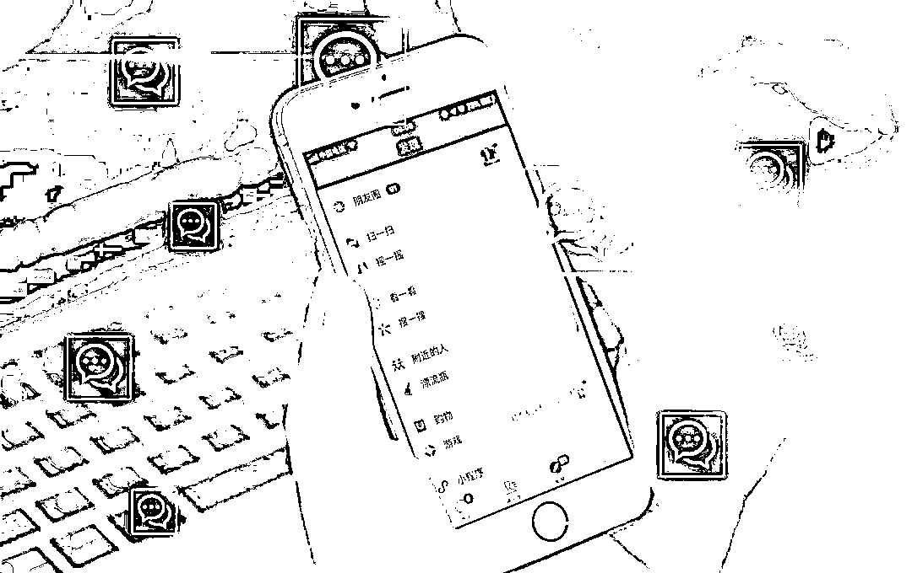

# 美女好友只要求陪玩游戏组 CP，这是爱情到来了吗？

> 原文：[`mp.weixin.qq.com/s?__biz=MzIyMDYwMTk0Mw==&mid=2247524021&idx=2&sn=92aad8850a2441eada0a58ae463e72e7&chksm=97cb558da0bcdc9bdd3be9270dd26a6963e1e0f09084904221af7437dba37d3c7366449fdc49&scene=27#wechat_redirect`](http://mp.weixin.qq.com/s?__biz=MzIyMDYwMTk0Mw==&mid=2247524021&idx=2&sn=92aad8850a2441eada0a58ae463e72e7&chksm=97cb558da0bcdc9bdd3be9270dd26a6963e1e0f09084904221af7437dba37d3c7366449fdc49&scene=27#wechat_redirect)

**主动添加好友的美女甜言蜜语、暧昧不断** 

**提出的唯一请求就是陪她打游戏组 CP**

**面对天降桃花**

**小伙不惜花重金在游戏中求婚设宴**

**意图展现“男友力”实现线下发展**

**谁想**

**还没来得及在现实中见面**

**对方已将自己拉黑**

**……**

近日，江苏省淮安市洪泽区检察院以涉嫌诈骗罪对 6 名以网恋之名诱导被害人在游戏中充值消费进行诈骗的犯罪嫌疑人提起公诉。 

***1***

**“网恋”女友只要陪玩游戏**

图片来源于网络，与正文无关

“夫君记得买鸳鸯镯和三生石作为订婚信物呦，结完婚人家就是你的人啦。”在一通肉麻语言的撩拨下，95 后小伙蒋俊心神荡漾，再次点开了游戏中的充值通道。

在洪泽区检察院办理的这起新型电信网络诈骗案中，犯罪嫌疑人正是以情感诈骗为主要手段，充当游戏“掮客”，设置话术陷阱，不断实施诈骗。

该案承办检察官云凤飞介绍，**以谈恋爱的名义获取对方信任，是实施网络诈骗的第一步**。如被害人蒋俊，2020 年 5 月，单身的他在交友软件上遇到了一个叫“慕慕”的女生，二人有着玩游戏的共同爱好，因此聊得很投机，并添加了好友。蒋俊看到“慕慕”朋友圈的照片非常漂亮，正是自己的理想型，对方言语中也透露出主动，这让蒋俊觉得自己的爱情到来了。

承办检察官发现，**犯罪嫌疑人正是抓住“恋爱”中的玩家往往失去理智，****不经意间就被一步步套路。**当“慕慕”向蒋俊推荐一款名为“青玄剑”的网络游戏时，蒋俊为博取她的开心，按照对方要求不断充值买礼物、冲战力、争榜首，尽管他发现了这款游戏可玩性极差，而且没有在网上上架，只能通过“慕慕”发来的链接下载。

蒋俊提出想在现实中见面，“慕慕”却要求他先在游戏中结婚表示真心。他只好与“慕慕”在游戏里“洞房花烛”，还“结婚生子”，前前后后一共花费近万元。

然而，在虚拟世界里表爱意、示真情，并没能为蒋俊换来现实中的爱情。**当蒋俊表示不愿花钱充值时，“慕慕”直接在游戏里解除“婚姻”关系，还将他拉黑。**

意识到自己被骗，2020 年 6 月，蒋俊向警方报案。同年 8 月，公安机关根据报案线索在南通市一公寓内将犯罪嫌疑人荆昭等人抓获。

***2***

**游戏推广的层层“套路”**

图片来源于网络，与正文无关

**当蒋俊还沉浸在失恋的悲伤中，找上门的警察却告诉他，网络中甜美可人的“慕慕”竟然是“抠脚大汉”。**像“慕慕”这样男扮女装的“白富美”还有 6 个人，都来自荆昭的游戏推广工作室，是工作室精心包装出来的“游戏托”。被抓时，这些“托”还在网络上与玩家热情聊天。

因该案是洪泽区办理的首例以“游戏情侣”身份实施的新类型电信网络诈骗案，洪泽区检察院第一时间提前介入引导侦查取证。

“游戏玩家充值的目的是什么？既然游戏可玩性这么差，为什么玩家还要充值？”针对案件定性，**云凤飞建议公安机关及时、全面提取涉案犯罪嫌疑人作案所用手机、电脑内的网上聊天记录等电子数据，并围绕“游戏托”诱骗获取非法利益等方面加强讯问，夯实案件证据基础。**

“先让对方首充 6 元，首充后玩家达到 80 级可以在游戏中订婚，充 98 元订婚，然后到 200 级可以结婚，结婚要再充 131.4 元或者 520 元……”

**“游戏托”诱导充值的套路层层递进，第一步寻找目标玩家，第二步引导进入游戏平台，第三步进行言语“洗脑”，刺激玩家充值。**其中最关键的环节是“游戏托”要以“谈恋爱”的名义骗取对方信任，通过话术给对方制造“游戏里结婚，慢慢走到现实”的假象，怂恿他们不断充值消费。

遇到手头紧或犹豫要不要充值的玩家，“游戏托”便主动为对方购买装备、送礼物，令玩家感动不已，进而产生“礼尚往来”的消费冲动。殊不知这又落入了套路，游戏后台早已被设置，“游戏托”购买道具只需要填上数值，根本不需要实际充值。

荆昭还为员工每人准备了一份诈骗手册，里面详细收录“如何把自己伪装成一名白富美”“在哪些平台可以接触到玩家”“利用怎样的话术获得玩家的信任”等详细内容。

**侦查发现，荆昭等人在 5 个月内共骗取 15 名被害人 10 万余元，被害人均为单身男性。**

***3***

**涉案行为如何定性**

检察官邀请律师（左一）全程参与犯罪嫌疑人（右一）认罪认罚工作。

案件被移送到检察院后，云凤飞办案组针对荆昭等人的行为是否构成诈骗罪产生分歧。构成诈骗罪从主观上要看行为人是否具有非法占有目的，客观上要看行为人是否实施了欺骗行为给被害人造成经济损失。

本案中，玩家对游戏及充值是否陷入错误认识，是否遭受财产损失，检察官对此产生不同意见。为此，云凤飞赴外地学习同类案件办理经验，并查阅同类案件刑事判决书、裁定书，厘清认定思路，确定案件定性。

云凤飞在讯问中发现，荆昭和他的同伙并不是第一次做游戏推广，荆昭等人原本供职于一家游戏推广公司，公司老板因诈骗被抓后，他们便决定出来单干。

起初，荆昭没有给推广员设置统一的话术，而是让“她们”自己寻找目标，聊熟之后推荐游戏，是否充值全凭自愿。试了半个月，荆昭发现，由于推广的游戏质量很差，单纯从推荐游戏入手，玩家极少主动充值。**正常推广渠道碰了壁，荆昭决定在话术中加入婚恋的诱饵，要求推广员以处对象的名义逼玩家充值买东西。**

办案检察官认为，荆昭等犯罪嫌疑人利用男性追求女性、发展男女关系的心理，虚构自己为特定女性的身份，采用固定话术套路，诱使被害人进入游戏，以发展暧昧、网恋关系为诱饵，诱使被害人在游戏中充值讨好自己，非法占有故意明显，社会危害后果严重，属于典型的“游戏杀猪盘”，行为应认定为诈骗罪。

目前，案件正在进一步审理中。

**检察官提醒广大网友，**网络虚拟世界有着层层伪装，甜言蜜语的温柔乡可能是不法分子设下的圈套。网上交友务必要核实对方的真实身份，处置钱财要慎之又慎，以免落入陷阱。

来源：最高人民检察院，腾讯安全战略研究

← 向右滑动与灰产圈互动交流 →

