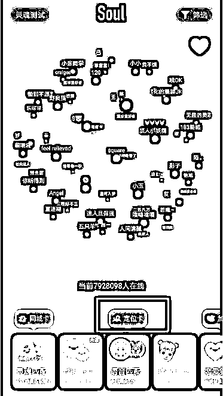
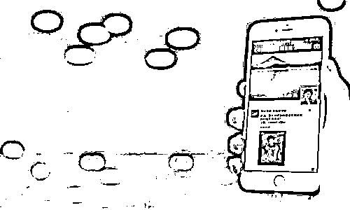
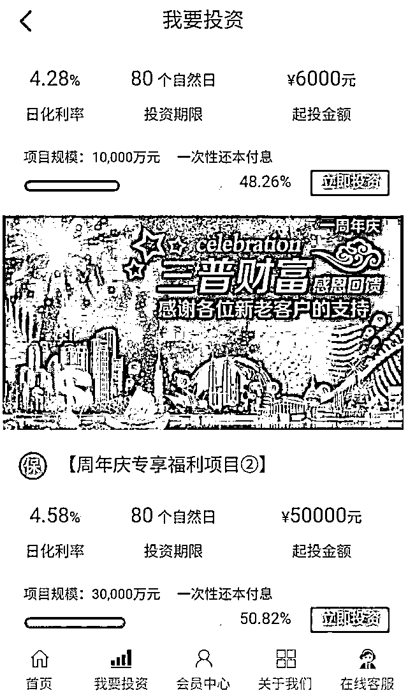
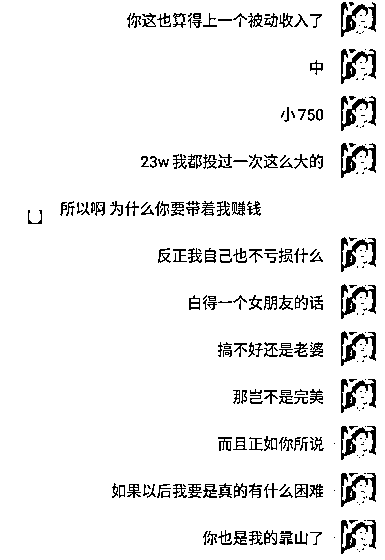
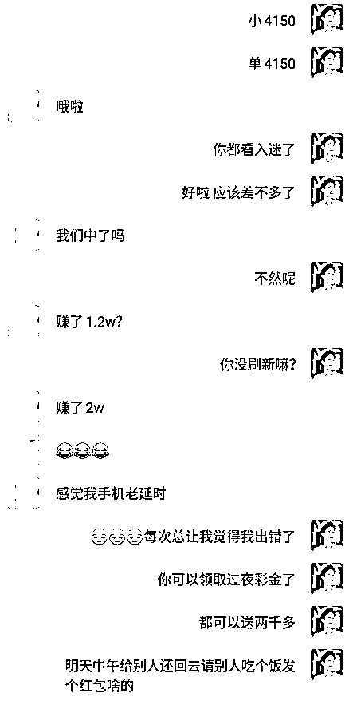
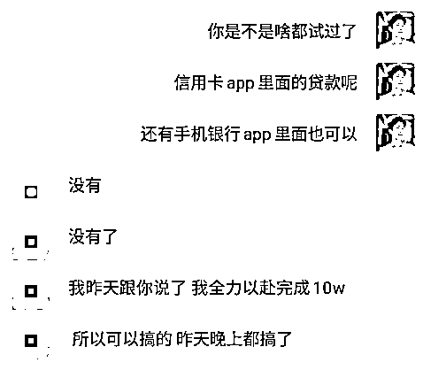
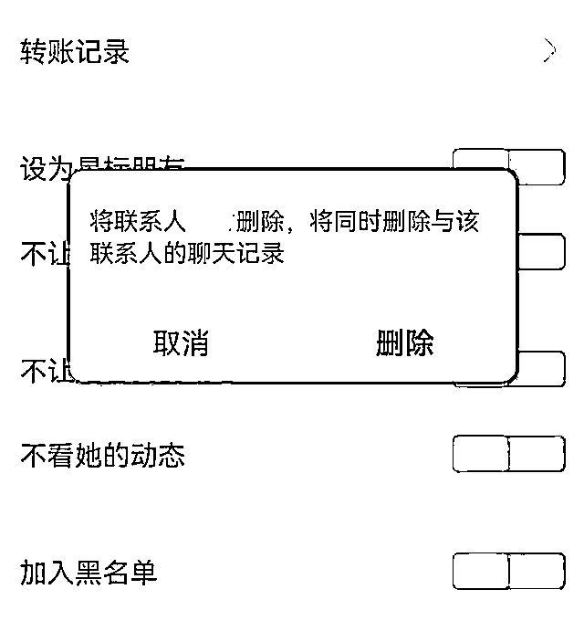
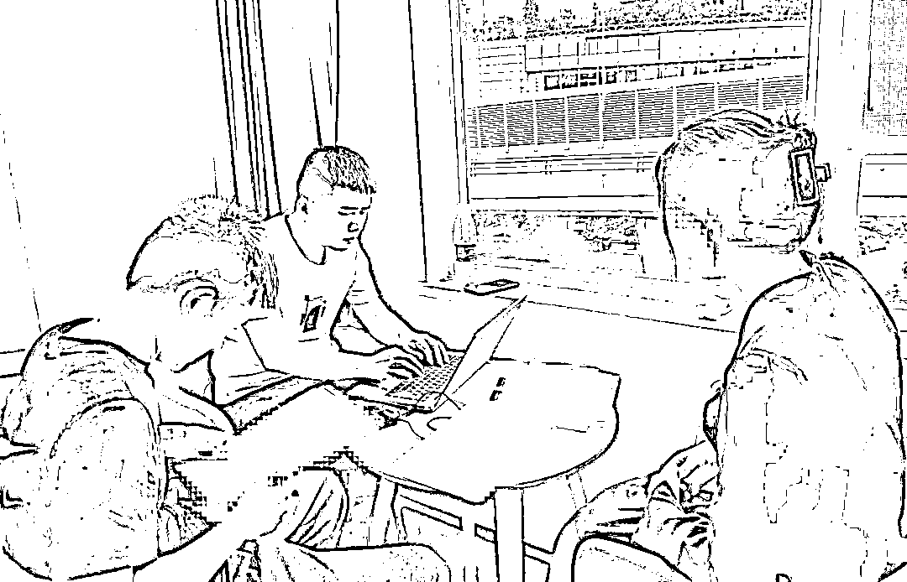
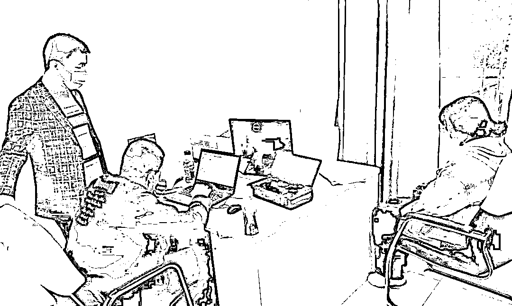
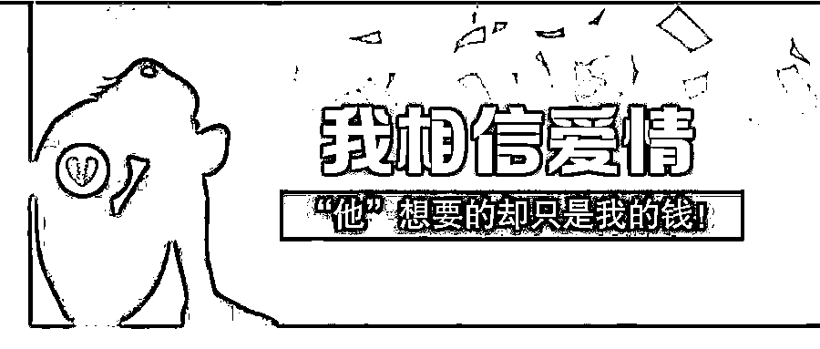

# “网上情缘让我负债累累、遍体鳞伤……”

> 原文：[`mp.weixin.qq.com/s?__biz=MzIyMDYwMTk0Mw==&mid=2247524021&idx=3&sn=8b7f0d86f690cd5ddde20044ae3b547a&chksm=97cb558da0bcdc9b13ca3f23b015926941d2fa01d3f2469255e3e5d08167af4ff0b1c8443aa1&scene=27#wechat_redirect`](http://mp.weixin.qq.com/s?__biz=MzIyMDYwMTk0Mw==&mid=2247524021&idx=3&sn=8b7f0d86f690cd5ddde20044ae3b547a&chksm=97cb558da0bcdc9b13ca3f23b015926941d2fa01d3f2469255e3e5d08167af4ff0b1c8443aa1&scene=27#wechat_redirect)

**千万别信网上情缘……** 

网络中的“浪漫邂逅”很可能是电诈份子精心布局的****“******玫瑰陷阱”**他们口中**日进斗金的投资平台**就是吃人不吐骨头的**赌博网站！**

[`v.qq.com/iframe/preview.html?width=500&height=375&auto=0&vid=wxv_2118185138588090370`](https://v.qq.com/iframe/preview.html?width=500&height=375&auto=0&vid=wxv_2118185138588090370)

年轻女子小雯涉世不深，遭遇了“杀猪盘”电信诈骗。负债累累，身心遭受巨大创痛，回忆过往，她泣不成声，**“希望我的切身教训能给人们带来警示”****。**

**“单身宅女”邂逅“阳光型男”**

小雯家住安徽合肥，今年 24 岁，长相普通、性格文静。大学毕业后，她没有找到理想的工作，索性在家做一些网络兼职。闲暇时间，小雯喜欢上网，浏览社交平台，在上面分享日常生活，与网友互动交流，生活也变得多姿多彩起来。

去年 6 月，小雯通过“soul”交友网站结识了一位名叫“陈彦明”的男子。

第一次刷到他的主页，小雯就觉得有种莫名的好感。陈彦明身形高大、相貌俊朗、气宇不凡，是很多女生的“理想型”男友。

他的主页展示了很多健身、自驾游、朋友聚会之类的动态，还经常分享自己照顾宠物、陪伴家人、制作美食的视频，俨然一个阳光开朗、温暖友善的“高质量”男性。

小雯很关注陈彦明的动态。一天，对方主动添加她好友，在线打起了招呼。在平台上聊了不久，陈彦明很礼貌的提出跟小雯互加微信，小雯求之不得。

陈彦明说他今年 30 岁，从事金融中介服务工作，有车有房、收入颇丰。得知小雯单身居住，陈彦明每天对她嘘寒问暖。恰到好处的关心提醒和体贴叮咛，让小雯感受到了前所未有的脉脉温情。

**“为爱打拼”计划“双向奔赴”**

通过一个多月的热线联系，小雯与陈彦明的感情日渐升温。不过，在高兴之余，小雯总感到惴惴不安。

不久，陈彦明提出“奔现”见面请求。自己相貌平平，又没有稳定工作，哪里配得上对方？小雯担心脱离了美颜滤镜，真实的自己会让对方大失所望。

陈彦明仿佛看穿了她的心思，温柔的安慰她，说自己喜欢小雯这样善良朴实、文静内秀的女孩。**经济不能自立也没关系，他是专业理财师，可以带小雯做赚钱最快的“网络理财”项目，用专业技术规避风险保赚不赔。**

在“男友”的大力推介下，小雯扫码下载了“**摩根”网络投资 APP。刘彦明手把手地教小雯充值、看盘、下单……

**其实，这就是个赌博网站**，充值后通过“押大小”方式进行赌博投注。在“男友”的指导下，小雯连连获利，第一次充值试水的 520 元本金很快翻倍。刘彦明让小雯立即提现，并告诉她平台 100%保证兑付资金绝对安全。

他在语音里温柔的说：**“小傻瓜，你看你也会赚钱了，等你赚到房子的首付，我们就在你的家乡买套房，好好生活在一起！”**

**“人财两空”又遇“祸不单行”**

体贴的恋人，财富的诱惑，美好的愿景，小雯被突如其来的幸福冲击得不知所措。在“男友”的授意下，积蓄不多的她陆续找父母朋友借了数万元投入网络投资平台，从最初 520 元，到 1314 元、5200 元……

刘彦明没有食言，果然用专业技术带她获利颇丰。这些颇具爱情寓意的数字投资，让小雯同时感受到了“爱情”的甜蜜。

过了几天，小雯想见好就收，准备撤出本金让利润在里面滚，谁知点击“提现”，系统却通知其银行卡号有误，需交纳相同数额的保证金更正卡号后再“返回全款”。

看到小雯急得快哭了，刘彦明安慰她说：**“我的钱都用来投资了，手头没有现金，不过可以帮你快速借钱救急。”**

在“男友”的推荐指导下，**从未接触过网络带宽的小雯，竟然下载了 10 余个网贷 APP，随后将申请的高息贷款全部投入了所谓的网络投资平台。**

**“一次保证金就是 68000 元，下一次就要翻倍的保证金。”**小雯说，自己不是没有丝毫怀疑，但是看着越投越多的钱和越欠越多的债，她害怕一旦停止投入，就会血本无归。

可是，这些钱象泥牛入海一样有去无回，平台以“手续费”、“结帐周期”等种种理由拖延兑付。此时的小雯已经在平台陆续投入 60 余万元，而且几乎全是亲朋好友的借款和高息网贷。

**这个过程，不到两个月。**

接下来的故事就象每个“杀猪盘”的尾声一样。小雯发疯般地频繁登录网络投资平台，眼巴巴地等着系统放款，直到有一天发觉自己再也无法登陆。

她赶紧联系“男友”，**每天陪着自己安慰自己的那个声音却成了永久的盲音，所有的联系方式都被对方拉黑**，仿佛这个人从未出现过。可是，**她被杀得片甲不留。**

网贷公司每天狂轰乱炸的催款电话，让小雯绝望又清醒地意识到，**自己并不是什么被爱情女神眷顾的幸运者，只是电信诈骗“杀猪盘”里那头被榨干了最后一滴骨血的“猪”！**

由于借款时填写了个人信息和通讯录，小雯原本平静的生活被无孔不入的网贷公司彻底搅乱。所有的亲朋好友都接到催款电话，铺天盖地的指责和流言压得她喘不过气。她每天窝在家里以泪洗面。

一天，小雯出门时，总感觉后面有人对她指指点点，神情恍惚之下被车撞倒，导致颅脑损伤，在医院躺了十多天。

看着年迈的父母因此背负巨额债务，还要衣不解带的照顾自己，小雯羞愧难当，万念俱灰，一度产生轻生的念头。好在家人每天寸步不离守着她，鼓励小雯振作起来，重新面对生活。

前不久，荆门“6.11”电信诈骗专案组千里迢迢找到了受害人小雯。面对民警的询问，她忍不住失声痛哭。那段不堪回首的经历一旦触及便痛彻心扉。

办案民警告诉小雯，她遇到了典型的“杀猪盘”骗局。“陈彦明”只是团伙成员精心打造的人设。每天跟小雯聊天的可能是不同的“键盘手”，他们的诈骗流程和话术都经过精心设计，针对不同人群“对症施策”，众多受害人不知不觉中被“糖衣炮弹”击中，一头栽进“玫瑰陷阱”。正如犯罪团伙内部所言：**“不怕猪有文化，就怕你不会说情话。**”****

今年年初，荆门警方通过开展缅北涉诈回流人员摸排工作，发现重大电诈犯罪线索。经过近半年的秘密侦查，[***2021 年 6 月 11 日，警方启动集中收网行动，打掉一个盘踞在缅北勐波县的电信诈骗集团。*****（点击蓝字回顾详细案情）**](http://mp.weixin.qq.com/s?__biz=MzIyMDYwMTk0Mw==&mid=2247523813&idx=4&sn=b7571f1bf35f1a26f188a5b0ec7bdafe&chksm=97cb56dda0bcdfcb9020206976c61ee8eb2ba03fd6696137ff48f4a7e3c3fcb14fd052d321c7&scene=21#wechat_redirect)

办案民警发现，小雯只是 100 余名受害人中的其中一位。这些受害人遍布全国 20 多个省市，涉案金额高达 3000 多万元。

办案民警说，**每个“杀猪盘”骗局的受害者都有一段不为人知的伤痛故事。他们为“网上情缘”付出了全部真情和巨大代价，最后落得人财两空、名誉扫地。**

这种身心的创痛可能一辈子都很难痊愈。这些活生生的案例与教训，希望能给世人以警示与思索。

来源：荆门公安、湖北反诈中心、阻击诈骗

← 向右滑动与灰产圈互动交流 →

