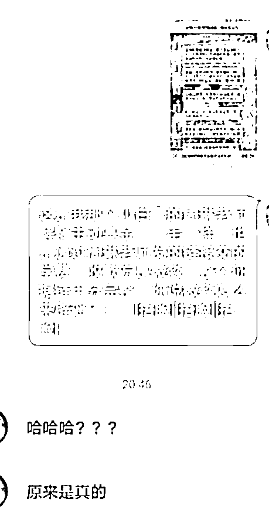

# 防止被抛弃就多生孩子？奇葩理财课背后百亿微淼被指“割韭菜”

> 原文：[`mp.weixin.qq.com/s?__biz=MzIyMDYwMTk0Mw==&mid=2247524021&idx=4&sn=c3e2db6a0ade8616c7e87e4292e90cb4&chksm=97cb558da0bcdc9b60a1aa30cbcf37a7de4d5955005afc3bbf0765d4714279ebe6e3b9b05e3f&scene=27#wechat_redirect`](http://mp.weixin.qq.com/s?__biz=MzIyMDYwMTk0Mw==&mid=2247524021&idx=4&sn=c3e2db6a0ade8616c7e87e4292e90cb4&chksm=97cb558da0bcdc9b60a1aa30cbcf37a7de4d5955005afc3bbf0765d4714279ebe6e3b9b05e3f&scene=27#wechat_redirect)

**核心看点：**

1、微淼的理财老师水平究竟如何？有离职员工透露，微淼招聘进阶课老师只要求专科毕业，没有平台宣称的投资经验，“培训几天就可以上岗，大部分人都没接触过投资，也没有任何国家认受的投资顾问资格证书。”

2、“微淼商学院”成立不到三年估值已经超过百亿人民币，碾压罗振宇的“思维造物”（估值 40 亿）。但微淼创始人微淼创始人封贺却被怀疑履历造假，而且其关联公司曾涉嫌诈骗。

3、凤凰网《风暴眼》发现，为了诱导学员报价格昂贵的进阶课，微淼商学院的课程微信群里有几十个“托”来配合“表演”。其课程中除了有常识性错误外，竟然还出现了“婚姻中想要降低被抛弃的概率就多生几个孩子”的奇葩言论。

4、有自媒体卧底后发现，从营销引流到制造焦虑到推荐股票再到退款机制，微淼实际上是利用人们的焦虑和对财富的渴求，设计了一个精妙的骗局。

————————————

就像你不会想到，用着美女头像和你撒娇发嗲的“心仪网友”，其实是一个抠脚大汉。

你也不会想到，在微信群里貌似学富五车，用 12 块钱就要带你实现财富自由的理财老师，可能只是一个才培训了几天就上岗的“金融小白”。

近日，“主动基金”一词突然在基民中间火了起来，和它一起火的，还有微淼商学院的“木子老师”。

网友晒出的截图显示，在一个 276 人的微淼理财训练营群里，有位“木子老师”正在给大家上关于基金的理财课。

这位木子老师教育大家，银行的理财产品不要买， 因为那是主动基金，“基金分主动和被动，主动是别人推荐的，是为了完成任务的。收益率低的可怜，4%左右，通胀可是 10%呢”。

木子老师一本正经地胡说八道的样子，直接把网友们整乐了。有财经博主用“刷羊肉蘸芥末”来形容看到这条基金科普时五味杂陈的心情。

还有网友调侃到，“第一次知道主动基金和被动基金是这么个内涵”“按照木子老师的说法，被动基金就是拿刀架脖子上逼客户买的基金”“木子老师大概是根据字面意思理解的吧”……

身为理财老师，却连基本的理财常识都不知道，不得不让人对这个理财课的水平产生怀疑。如此理财老师，如何教人理财？

实际上，“木子老师”们背后的微淼商学院，此前已经多次被媒体曝出“割韭菜”“收智商税”“学费难退”等负面新闻，在黑猫投诉平台上投诉量高达 2000 多条。

但就是这样一家企业，单月收入竟然超过了 2 亿，估值更是高达百亿。在微淼商学院铺天盖地的营销中，越来越多的网友也开始质疑：所谓的财商课，到底是真理财，还是割韭菜？

**理财老师只需大专学历，培训几天就能上岗**

木子老师另类科普“主动基金”一事被媒体报道后，牵涉其中的天津微淼财商科技有限公司火速发声明撇清关系。

天津微淼在声明中称：流传图片中的“木子”教师并非微淼员工，微淼的唯一的授课渠道为企业微信，禁止教师个人开设微信群进行代班上课……

但这份声明很快就遭到网友现身“打脸”，有不少网友表示自己就在微信群里上过微淼的课，而且企业微信和微信用户是可以在一个群里的。

另外还有网友曝出，自己参加的微淼小白训练营课程里的周琳老师，在解释“主动基金”时话术和木子老师几乎一模一样。

这位网友还表示，自己是通过周琳老师发的链接交的学费，收款方是微淼，整个证据链十分完整。

实际上，木子老师、周琳老师在微淼内部可能并非个例。凤凰网《风暴眼》发现，微淼财商团队的“名师”一直以来也饱受质疑。

据报道，曾有已离职的微淼进阶课老师在接受媒体采访时透露，微淼招聘进阶课老师只要求专科毕业，没有平台宣称的投资经验，“培训几天就可以上岗，大部分人都没接触过投资，也没有任何国家认受的投资顾问资格证书。”

另外，此前 BOSS 直聘网站上的招聘信息显示，“财商教育老师”仅需“大专”学历，微淼商学院官网的招聘要求中，对全职在线指导老师也几乎没有除本科学历外的要求。

**成立不到三年估值百亿，创始人关联公司涉嫌诈骗**

虽然微淼的理财老师看起来不太靠谱，但这家公司的营收能力却不容小觑。

据媒体报道，“微淼商学院”估值已经超过百亿人民币，单月收入经超过 2 亿人民币，秒杀诸多中小上市公司。

根据微淼官网的简介，“微淼商学院”全称天津微淼财商科技有限公司。天眼查数据显示，天津微淼财商科技有限公司为北京微淼财商科技有限公司的全资子公司，成立于 2020 年 6 月，至今仅一年有余。

北京微淼财商科技有限公司则成立于 2019 年 4 月，两位主要股东均为个人，商学院创始人封贺持股 75%，执行董事兼总经理王楼楼持股 25%。

按微淼官方说法，创办微淼的初衷是为了弥合投资者理财知识与新兴金融产品的"错位"，降低理财的准入门槛，提高投资者的抗风险能力。不售卖、代理任何理财、保险产品，是纯粹的理财教育商学院。

但从众多学员的爆料和投诉来看，微淼似乎并不像宣传的这般“纯粹”。微淼在课程中不仅诱导学员购买所谓的高阶课程，而且在进入高阶会员之后，微淼的老师存在向学员荐股、荐基金的情况。

值得注意的是，微淼创始人封贺也被怀疑履历造假，而且其关联公司曾涉嫌诈骗。

在对外的公开宣传中，封贺是复旦大学经济学学士、国家理财规划师。但据红星新闻报道称，封贺复旦大学经济学学士的学习形式为“夜大”，入学难度及含金量均无法与高考、考研相比。

而“国家理财规划师”这一职业证书，也早在 2018 年就从职业资格认证目录单上被取消。

另外，天眼查信息显示，除了微淼外，封贺与创办于 2015 年的北京金桐商品经营有限公司和创办于 2016 年上海兰坤实业有限公司关系紧密，分别持股为 45%，这两家公司法人均为刘雯。

但公开资料显示，封贺持股的金桐公司和上海兰坤公司，一家卷入过原油期货诈骗，一家卷入现货交易诈骗。封贺曾任职的宁翼公司，则曾卷入白银交易诈骗。

**疯狂营销引流，制造财富焦虑**

去年 10 月，罗振宇的“思维造物”拟在创业板挂牌上市，估值约为 40 亿元。招股书显示，思维造物三年共营收 19.22 亿，平均每个月营收 5000 万。

而成立不到三年的微淼，目前估值却已经高达百亿。有知情人士透露，微淼一个月的收入超过 2 亿元，是思维造物的 4 倍。

同样是知识付费，成立更晚、名气更小的微淼为何反而“后来居上”？凤凰网《风暴眼》发现，这或许与其强大的营销手法有关。

从成立之日起，微淼就不惜砸下重金在各个渠道做广告。除了抖音、快手、微博、小红书、微信公众号等平台外，微淼还曾在浙江卫视的黄金时段打广告。甚至连地铁站、公交站、电梯以及户外的广告牌上，也充斥着微淼财商课的广告。

“理财收入比工资还高，只需 12 元就能带来睡后收入”“普通人只会想着把钱存进银行，而富人却想着让口袋里的钱工作”“学习理财就是你逆风翻盘的机会，9.9 元报名”……

一时之间，这样的广告铺天盖地。再加上宣传中的那些所谓“真实”的案例，让你觉得似乎别人都靠理财轻松赚钱了，只有自己还在拼命工作辛苦挣钱。

在疫情和生活的压力下，对于财富的渴望和对理财能力的焦虑感也就这样产生了。不知不觉中，你会去关注微淼的抖音号、公众号等，抱着试一试的心态购买 12 元的体验课，然后是 7000 元的高阶课……

凤凰网《风暴眼》发现，抖音上认证为“微淼财商教育官方账号”的微淼学堂，目前有 200 多万粉丝，其发布的视频获赞数 740 多万。微淼官网信息显示，其短视频平台粉丝总量超过 420 万，视频累计播放量 5.5 亿次。

为了包装自己，微淼还拉来了中央财经大学、中国成人教育协会、人民阅读等作为自己的合作伙伴，并在其官网的显著位置加以宣传。

但据南方都市报报道，一位微淼学员家属通过拨打中央财大党委办公室电话得知，中央财大与微淼合作协议已经到期。但目前，微淼仍然对外宣传与中央财大的合作。

录音内容显示，中央财大党委办公室有关人士称，“我们跟他签的协议已经到期了，再一个，我们跟他合作只是办学，至于其他的跟我们没有关系，我们只是跟他们签项目课程的合作。

理财课程“套路”多，微信群里全是“托”

那么，这些看起来很专业的理财课，实际含金量到底如何？学完以后真的能够赚钱吗？

一位参加过微淼小白训练营的学员对凤凰网《风暴眼》表示：“小白营里基本上都是在讲一些没用的概念性的废话，而且理财老师会不断推销价格更高的课程。”

这位学员表示，自己觉得没啥用，不久就退群了。凤凰网《风暴眼》也发现，在社交平台上不少网友爆料称，微淼这种所谓的高大上理财训练营，总结起来就是收智商税。

B 站 UP 主“大闲人贾白”曾假装学员卧底微淼的理财课，据其描述，微淼先用 12 块钱的小白训练营课程引流，然后再不断制造焦虑一步步诱导你购买 6988 元的进阶课。

而当你终于买了进阶课之后，才发现这些课的内容和几块钱引流课没啥区别。在你感觉上当受骗想要退课时，又被微淼告知退款需要毕业证，先通过考试交论文毕业了再说。但能不能毕业，决定权却是在微淼手里。

另外，在微淼的理财课上，理财老师还会忽悠小白，股票、REITs 是低风险的投资工具，发链接让你开户，他们从中抽佣获利。

“大闲人贾白”认为，从营销引流到制造焦虑到推荐股票再到退款机制，微淼实际上是利用人们的焦虑和对财富的渴求，设计了一个精妙的骗局。

凤凰网《风暴眼》了解到，为了让学员能够买价格昂贵的进阶课，微淼的老师还会诱导学员网贷分期买课，劝说学员用花呗、借呗、信用卡、京东白条等分期付款。并对学员表示，“只要认真跟着老师学，几个月就可以赚回学费。”

据北京晚报报道，一位微淼的离职员工透露：“报名的学员大多是全职宝妈、年轻人还有小部分老人，都属于弱势群体，这样搞，我确实良心有点过意不去。”

另外，为了让能够让理财老师“演的更逼真”，微淼的课程群里还会潜伏不少“托”。这些“托”会配合老师的话术，说自己学到了很多东西，自己用这些知识挣了多少钱，并不停的在群里发交钱截图。

据了解，一个 200 人的群里大概能够四五十个“托”，这些“托”大部分都是微淼的员工假扮。有学员曾发现一个群里的“托”，到了另外一个群就摇身一变成为“某某老师”。

那么，微淼的理财课讲些什么内容呢？有学员表示，基本上是《财务自由操作系统》《财务报表分析》这些提前录好的内容，另外的时间不是在说微淼创始人多么牛，就是在催你买课、开户、拉人头。

更让人无语的是，微淼理财老师所讲授的课程中，竟然有许多常识性的错误，除了这次“主动基金”的笑话外，还有诸如“股票是低风险投资工具”“给 A 股用户推荐外国的 REITs”等让人贻笑大方的操作。

此外，有网友爆料，微淼商学院的课程中，竟然还出现了“婚姻中想要降低被抛弃的概率就多生几个孩子”的奇葩言论。

凤凰网《风暴眼》发现，在黑猫投诉平台上对微淼的 2000 多条投诉中，大部分是要求退款。而退款的原因，基本上都是控诉微淼商学院“虚假宣传”“诱骗学员”“教学质量粗糙”等。

工商网信息显示，9 月 14 日，北京微淼被北京市昌平区市场监督管理局列入异常经营名录，原因是通过登记的住所或者经营场所无法联系。

**学习“财商”的同时，不能丢掉“智商”**

2020 年，在疫情和通胀的压力下，大众重燃了对财富的狂热。“财商教育”也在这一年野蛮生长，快速狂奔。

而所谓财商，本意是“金融智商”，英文缩写为 FQ（Financial Quotient），指个人、集体认识、创造和管理财富的能力，包括观念、知识、行为三个方面。

说白了，财商就是让你多学习金融知识，增强你的金融素养，提高你的金融智商。至于财商提高了以后能不能挣到钱，谁也不敢保证。

除了微淼商学院外，小帮规划、长投学院、快财商学院、简七理财等财商教育机构也在 2020 年获得大发展。“快财商学院”去年年底还完成了一笔数千万美金的 E 轮融资，累计融资额超过 1 亿美元。

但和在线教育相似，财商教育在快速发展的过程中也出现了许多问题。而且因为和金融更接近，也更容易滋生乱象。

除了虚假宣传，诱导学员网贷购买高价课外，这些机构还可能诱导学员投资股票、保险甚至境外的非法资金盘。

招联金融首席研究员董希淼在接受媒体采访时曾表示：“财商教育领域目前的问题主要体现为‘三无’，即无门槛、无资质、无监管。特别是财商教育公司既不受教育行政部门监管，也不受金融监管部门约束，在很大程度上处于‘野生’状态。

不过，监管层已经开始出手整治。2020 年 11 月，《新晚报》在微信公众号发布的“微淼商学院 12 天小白理财训练营”广告成为了黑龙江省市场监管局公布的 2020 年虚假违法广告十大典型案例。

2021 年 3 月 4 日，北京昌平区市场监督管理局就发出消费警示，15 家教育培训主体被点名，其中北京微淼因被投诉次数达 12 次，位列投诉榜首，而在此前发布的同类名单中（1 月 31 日~2 月 6 日），北京微淼也同样被诉 4 次。

8 月 27 日，国家网信办启动财经类信息专项整治，“财商课”即在此次重点违规问题之列。9 月 14 日，北京微淼被北京市昌平区市场监督管理局列入异常经营名录。

监管的重压之下，许多财商教育机构的推广视频从各社交媒体平台大量下架，微淼的微信公众号也多次改名。

对于普通人来说，更重要的是自己要增强分辨能力，不能学了财商就没了智商。试想如果真的听了这些理财课就能轻松赚钱，那讲课的这些老师们岂不是早就财富自由了，怎么还会在群里绞尽脑汁的让你交学费？

最后，再科普一下被木子老师带出圈的“主动基金”。所谓主动基金，就是基金经理发挥主观能动性，按照自己的投资理念做资产配置的产品，目标是寻找超额收益，普遍以跑赢沪深 300 指数多少作为优秀的标准。

相应的，被动基金也不是“别人逼着你买的基金”，而是以指数为锚点，跟踪指数波动的产品，目标是紧跟指数涨跌，不能出现较大偏离。

参考资料：

《曝光！12 元理财引流的背后：一场围猎年轻人的精妙骗局》

《“三无理财课”背后的乱象：诱导消费无序发展 野蛮经营无人监管》

《被投诉“割韭菜” 百亿微淼商学院冤不冤？》

← 向右滑动与灰产圈互动交流 →

