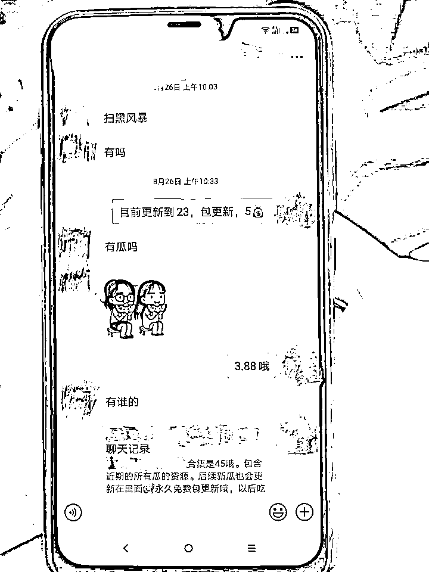

# 花 3.88 元吃瓜、花 4.88 元看热播剧全集？抓了！

> 原文：[`mp.weixin.qq.com/s?__biz=MzIyMDYwMTk0Mw==&mid=2247524021&idx=5&sn=e2b0241bf9179358f4fa148ca9be4682&chksm=97cb558da0bcdc9bc4a10bad7cf0da09a76cfd393378c026828269b07e3e943cc2151d530339&scene=27#wechat_redirect`](http://mp.weixin.qq.com/s?__biz=MzIyMDYwMTk0Mw==&mid=2247524021&idx=5&sn=e2b0241bf9179358f4fa148ca9be4682&chksm=97cb558da0bcdc9bc4a10bad7cf0da09a76cfd393378c026828269b07e3e943cc2151d530339&scene=27#wechat_redirect)

花 3.88 元可以刷各类吃瓜事件、花 4.88 元就可以看热播剧全集……近日，温州市公安局破获一起热播剧侵权盗版案，一对夫妇涉嫌侵犯著作权罪、贩卖、传播淫秽物品牟利罪被依法逮捕。

“热播剧《扫黑风暴》一手资源，需要的私信我”、“《扫黑 FB》送审版全集在线看”……今年 8 月，国产电视剧《扫黑风暴》热播，剧迷们每天翘首等待剧集更新，这时候，有人看到了其中的“商机”，做起了倒卖盗版电视剧资源的“生意”。90 后的徐某就是其中一员。

闲来无事，徐某和妻子罗某喜欢在网上购买盗版电视剧、电影资源来看。今年初年，徐某决定将自己买来的资源有偿“分享”给同道中人，于是在网络发放各类“广告”吸引客人。

期间，徐某在网上找到“扫黑风暴”相关网盘资源后，以网盘链接的形式在诸多微信群里大肆销售，一段时间后资源被屏蔽，其妻子罗某又找到上家微信用户，以 12.88 元的价格购买了全集网盘链接后，**夫妻俩决定以 4.88 元至 5.88 元不等的价格在相关网络群里销售，短短一个月内销售额就高达 7 万余元。**

除了销售《扫黑风暴》等盗版影视作品外，**两人还在网上卖起了各类“吃瓜事件”、“网红黑料”等淫秽视频资源**，多达 200 余部。

就在徐某夫妇生意做的风生水起的时候，温州市龙湾公安分局民警在工作中发现有人在聊天软件中销售盗版《扫黑风暴》并以此大肆牟利的线索。接报后，市公安局高度重视，立即成立市、区两级联合专案组介入调查。

调查中，民警发现《扫黑风暴》是上海腾讯企鹅影视文化传播有限公司出品，在 CCTV8、北京卫视等频道热播。侦查人员通过多种手段研判分析发现，该盗版送审样片传播范围极广且速度极快，且传播源遍布全国各地，涉及众多网络资源平台和虚拟社交平台。8 月下旬，腾讯视频公众号还曾为此发布反盗版声明，但此后不法分子仍在互联网上大肆传播牟利。

随即，温州市警方兵分多路，辗转广东、四川、山东、北京等地，并对多名涉案人员采取刑事强制措施，扣押手机、笔记本电脑等作案物品若干。

徐某家。

温州市公安局食药环犯罪侦查支队警官詹开诚介绍，在办案过程中发现，从事该类违法活动的群体多数为文化程度相对较低的无业青年，自认为这是一个“商机”；也有大学生、上班群体等存在投机想法而进行短期“兼职”。部分自媒体平台等也存在通过销售影视资源、传播网盘链接、解析影片剧情等方式，来博眼球、聚流量从而牟利。更有甚者通过各类社交媒体，并以固定金额的入群费为门槛，在群内公然发布影视作品单，招代理、扩下线，造成盗版影视资源呈指数型分裂式传播。而普通群众对非法传播盗版影视牟利的犯罪行为存在“慢反应”，由此也助长了该类灰黑产业的气焰。

徐某夫妇等人。

目前，**罗某和徐某因涉嫌侵犯著作权、传播淫秽物品罪被温州公安依法采取刑事强制措施**，并报检察机关批准逮捕。

来源：温州商报，红网

← 向右滑动与灰产圈互动交流 →

