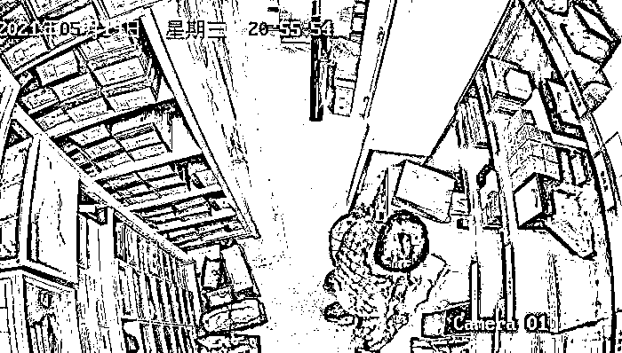
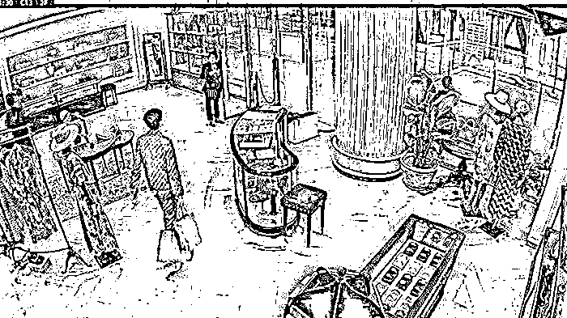
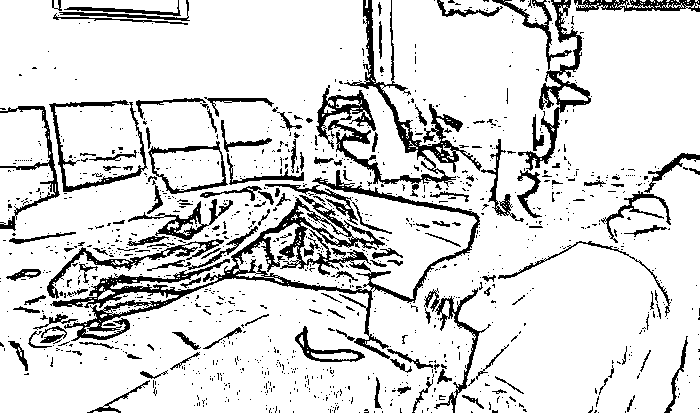
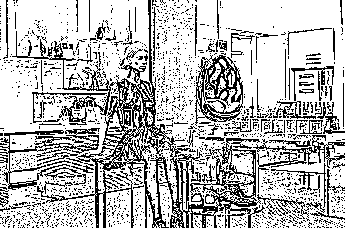

# 古驰店现内鬼，库存真包被换至二手平台打折转售

> 原文：[`mp.weixin.qq.com/s?__biz=MzIyMDYwMTk0Mw==&mid=2247524021&idx=6&sn=f28530aaeebf803bef0f50d9dd403b53&chksm=97cb558da0bcdc9b4f296f645ac8e3f78f9eaf2dbd3c84ddd9f05e7897cff52bb5d3f799a379&scene=27#wechat_redirect`](http://mp.weixin.qq.com/s?__biz=MzIyMDYwMTk0Mw==&mid=2247524021&idx=6&sn=f28530aaeebf803bef0f50d9dd403b53&chksm=97cb558da0bcdc9b4f296f645ac8e3f78f9eaf2dbd3c84ddd9f05e7897cff52bb5d3f799a379&scene=27#wechat_redirect)

图片来源：微博@我要投诉-周到上海

制假售假的花样越来越多，如今就连去奢侈品牌的精品店都要多留个心眼。

根据《新闻晨报》旗下《我要投诉》栏目的报道，近日上海静安区一家古驰门店向警方报案称，在对库存进行集中抽查的过程中，发现多款手袋经过鉴定后为假货，遂怀疑店内货物曾遭不法分子调包。

警方在调取监控录像进行侦查后，将已经离职的员工金某锁定为嫌疑人。监控显示，金某曾多次在该古驰门店的仓库内拆开包装，用在网上购买的同款假包进行调换。

图片来源：微博@我要投诉-周到上海

金某从今年 5 月起便陆续在店内仓库中对手袋进行调包，随后在二手交易平台上以员工价的名义售卖非法获得的古驰手袋，标价比市面零售价低 3000 元至 5000 元，累计获利 57000 余元。而在得知公司即将对库存进行抽查后，金某则主动提出离职，以避免因调包一事受到怀疑。

目前金某已因涉嫌犯罪被警方刑拘。界面时尚就此事向古驰上海静安第一分公司进行询问，客服在电话中回应称，社交媒体上的消息跟实际情况有所出入，在事件发生后，古驰第一时间采取自查，已知尚未有假包流入市场。

图片来源：微博@我要投诉-周到上海

近年中国奢侈品市场快速发展，消费者对各类经典款和爆款产品的需求也水涨船高。咨询公司贝恩和天猫奢品联合发布的报告显示，2020 年中国奢侈品市场增幅达到 48%，中国内地在全球市场的占比跃升至 2020 年的 20%。

市场的需求为奢侈品牌的发展创造了空间，而不法分子也在其中看到了机会，尤其是在奢侈品牌进行多轮提价之后。除了古驰，路易威登此前也曾陷入过这类“瞒天过海”的骗局之中。

根据央视财经的报道，上海警方在 2020 年 9 月破获了一起涉案金额超过 1 亿元的路易威登售假案件。公布的案情显示，路易威登门店内的销售人员将未公开发售的新款提供给造假团伙进行选材和打样。

该犯罪团伙甚至在假包中内置 NFC 芯片，购买者在手机上扫码后即可跳转至路易威登官网，以“验证”所购手袋为真货。在抓捕现场，警方缴获假冒手袋超过 2000 只，制假皮料、五金配件、防伪扣、虚假芯片等各类原材料超过 10 万余件。

图片来源：路易威登

尽管路易威登在 2019 年宣布将采用区块链技术来追踪包袋的生产和销售轨迹，以帮助消费者确认所购包袋为真货，但这项技术目前仍然没有得到大范围推广。而界面时尚此前曾从相关人士处得知，古驰等部分品牌会通过隐藏在包袋内的二维码确认产品真假，但相关二维码只有专柜扫码机可以扫出有效信息。

事实上，即使到了数字时代，奢侈品防伪依然是个行业难题。而且由于数字技术的快速推进，消费者有时反而会更容易在消费过程中上当受骗。

此前界面时尚曾报道，有不法分子模仿“得物 App”的鉴定页面，在境外私人服务器上注册 17 个相似域名，向网友提供虚假的球鞋鉴定服务。

该犯罪团伙向售假者销售“得物 App”进行鉴定的“防伪四件套”，即鉴定证书、认证鞋扣、认证胶带和纸箱，并在其中标注了鉴定二维码，消费者购买后同样是可以通过微信扫码跳转到官网进行验证，只不过所谓的“官网”是提前注册好的假冒网页。

虽然近年奢侈品牌加大了打假力度，但市面上制假售假的行为依然屡禁不止。也许就像黛娜.托马斯在《奢侈的》一书中曾写过的：唯一阻止制假售假的方法，就是人们不再为了品牌的标志而去购买商品。

来源：界面新闻

← 向右滑动与灰产圈互动交流 →

