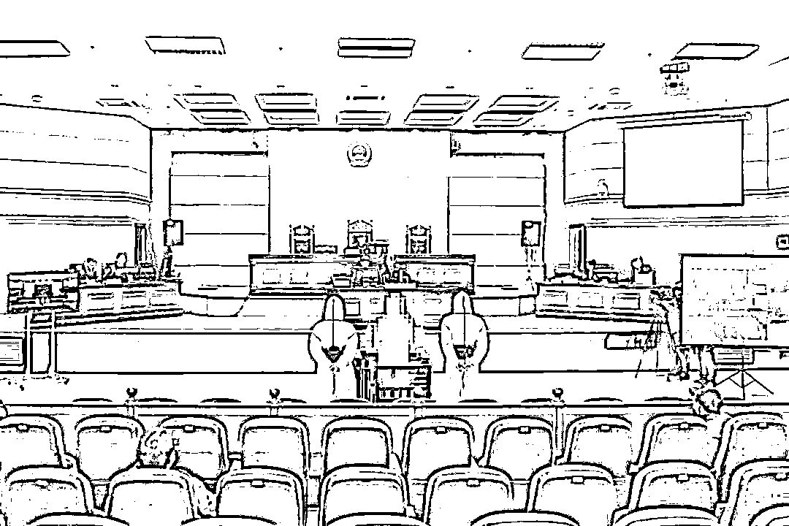
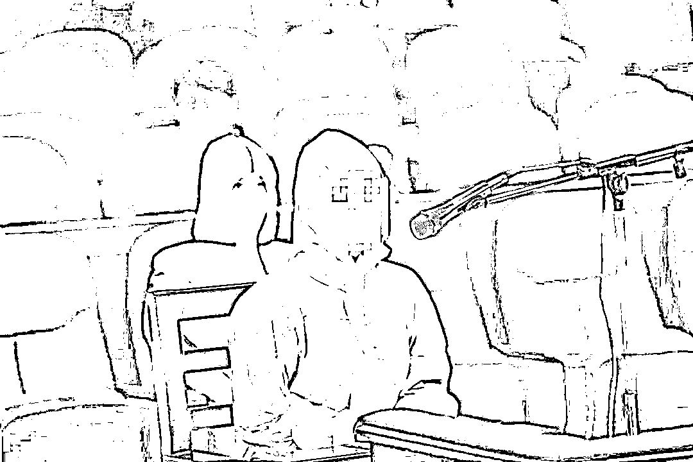

# 豪车醉驾喊“yu wei”当事人一审宣判：拘役两个月并处罚金

> 原文：[`mp.weixin.qq.com/s?__biz=MzIyMDYwMTk0Mw==&mid=2247524063&idx=1&sn=153633443d7dae46342b7753cfa97b58&chksm=97cb55e7a0bcdcf1cd5a721ef5c4612dd39b9acd1e0f875d9e6ad9d2076a59071747fa117d01&scene=27#wechat_redirect`](http://mp.weixin.qq.com/s?__biz=MzIyMDYwMTk0Mw==&mid=2247524063&idx=1&sn=153633443d7dae46342b7753cfa97b58&chksm=97cb55e7a0bcdcf1cd5a721ef5c4612dd39b9acd1e0f875d9e6ad9d2076a59071747fa117d01&scene=27#wechat_redirect)

2021 年 11 月 13 日，江西省南昌市东湖区人民法院公开开庭审理被告人孙某犯危险驾驶罪一案，并当庭宣判，**以危险驾驶罪判处被告人孙某拘役两个月，并处罚金人民币一万元。**

法院经审理查明，2021 年 11 月 6 日 18 时至 20 时许，孙某与同事在南昌市东湖区后墙路聚餐，席间孙某饮用约半瓶红酒，聚餐结束后，孙某与同事步行至某 KTV 唱歌。22 时许，孙某驾驶私家车从酒店驶出，行驶至胜利路与民德路交叉口被执勤交警查获。执勤交警对孙某进行呼气式酒精测试期间，经过 60 余次呼气、历时近 18 分钟才完成呼气式酒精测试，结果为 117mg/100ml。随后交警将孙某带至医院提取血样。经鉴定，孙某血样中酒精含量为 102.68mg/100ml。2021 年 11 月 7 日，孙某归案并如实供述了自己的犯罪事实。2021 年 11 月 8 日，孙某被公安机关采取刑事拘留强制措施。

[`v.qq.com/iframe/preview.html?width=500&height=375&auto=0&vid=f33080nnsvp`](https://v.qq.com/iframe/preview.html?width=500&height=375&auto=0&vid=f33080nnsvp)

法院经审理认为，被告人孙某在公共道路上醉酒驾驶机动车，血液中酒精含量达 102.68mg/100ml，其行为已构成危险驾驶罪。被告人孙某有坦白情节，认罪认罚，依法可从轻处罚。被告人孙某逃避公安机关依法检查，并企图阻碍公安机关执法，酌情从重处罚。公诉机关的量刑建议适当，本院予以采纳。根据被告人孙某的犯罪事实、性质、情节和对社会的危害程度，遂依法做出上述判决。

一审宣判后，被告人孙某当庭表示服从判决，不上诉。部分人大代表、政协委员、媒体记者等旁听了庭审。

**此前报道：**  

**[玛莎拉蒂女司机醉驾被查："叫 yúwěi 来"，交警反应亮了](http://mp.weixin.qq.com/s?__biz=MzIyMDYwMTk0Mw==&mid=2247523813&idx=1&sn=ae48e5fad96829287ddb31f5466714b5&chksm=97cb56dda0bcdfcbc8b34f08012f1c794a17c15ba0da2aa139385fc564a632566d1448086e5b&scene=21#wechat_redirect)**

**[“yuwei”是谁？警方深夜通报！查清楚了！](http://mp.weixin.qq.com/s?__biz=MzIyMDYwMTk0Mw==&mid=2247523920&idx=3&sn=0532452a7bd1d17e5ca926bf48844765&chksm=97cb5568a0bcdc7e9903616bc25deb71d5c74c0c69b512516fdcaf58ea791ceb8f5c0d1dcdfe&scene=21#wechat_redirect)**

**[玛莎拉蒂女子身份被挖：空姐翻身干到行长助理，已从领导栏撤下](http://mp.weixin.qq.com/s?__biz=MzIyMDYwMTk0Mw==&mid=2247523969&idx=1&sn=2c11c62125e999a2961423364327e625&chksm=97cb55b9a0bcdcaf1f1a7737d83c77d16d0fb28adf02cf0e1ed380e1f8d394b82b036fd078ad&scene=21#wechat_redirect)**

来源 ：江西法院、南昌市东湖区人民法院、潇湘晨报

← 向右滑动与灰产圈互动交流 →

# 原文：[`mp.weixin.qq.com/s?__biz=MzIyMDYwMTk0Mw==&mid=2247524063&idx=2&sn=092610aa03560ddd1b4ec726959ea1d2&chksm=97cb55e7a0bcdcf192596c9f94dbdba08e502d17c4d66d02039c0c7d46ab86581437aa0aa555&scene=27#wechat_redirect`](http://mp.weixin.qq.com/s?__biz=MzIyMDYwMTk0Mw==&mid=2247524063&idx=2&sn=092610aa03560ddd1b4ec726959ea1d2&chksm=97cb55e7a0bcdcf192596c9f94dbdba08e502d17c4d66d02039c0c7d46ab86581437aa0aa555&scene=27#wechat_redirect)